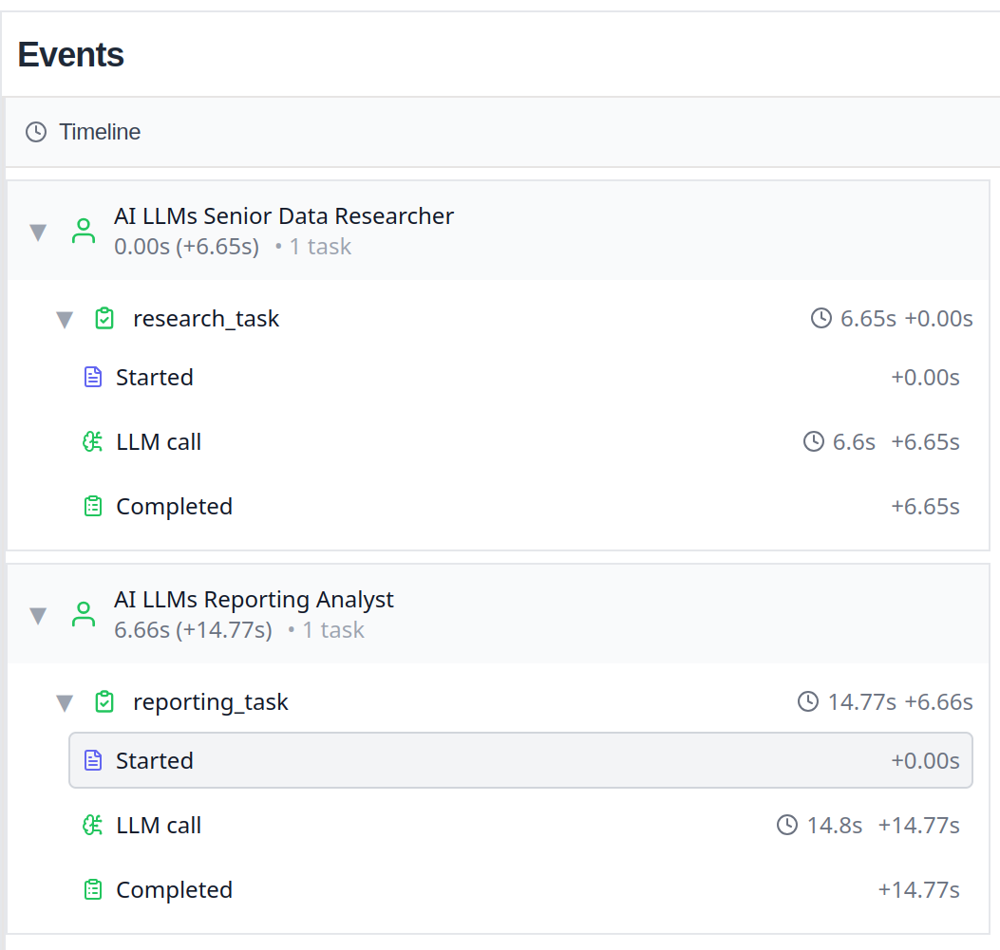

https://docs.crewai.com/en/installation

----

## 准备工作

### 安装 uv

```bash
curl -LsSf https://astral.sh/uv/install.sh | sh
```

## 安装 CrewAI

```bash
uv tool install crewai
```

安装完成后验证：

```bash
uv tool list
```

可以看到输出:

```bash
crewai v1.6.1
- crewai
```

## 更新

如果需要更新版本，可以：

```bash
uv tool install crewai --upgrade
```

## 创建测试项目

```bash
mkdir -p ~/work/code/agents/crewai
cd ~/work/code/agents/crewai
crewai create crew testproject
```

按照提示选择：

```bash

Creating folder testproject...
Cache expired or not found. Fetching provider data from the web...
Downloading  [####################################]  961688/50589
Select a provider to set up:
1. openai
2. anthropic
3. gemini
4. nvidia_nim
5. groq
6. huggingface
7. ollama
8. watson
9. bedrock
10. azure
11. cerebras
12. sambanova
13. other
q. Quit
Enter the number of your choice or 'q' to quit: 1
Select a model to use for Openai:
1. gpt-4
2. gpt-4.1
3. gpt-4.1-mini-2025-04-14
4. gpt-4.1-nano-2025-04-14
5. gpt-4o
6. gpt-4o-mini
7. o1-mini
8. o1-preview
q. Quit
Enter the number of your choice or 'q' to quit: 2
Enter your OPENAI API key (press Enter to skip): 
API keys and model saved to .env file
Selected model: gpt-4.1
  - Created testproject/.gitignore
  - Created testproject/pyproject.toml
  - Created testproject/README.md
  - Created testproject/knowledge/user_preference.txt
  - Created testproject/src/testproject/__init__.py
  - Created testproject/src/testproject/main.py
  - Created testproject/src/testproject/crew.py
  - Created testproject/src/testproject/tools/custom_tool.py
  - Created testproject/src/testproject/tools/__init__.py
  - Created testproject/src/testproject/config/agents.yaml
  - Created testproject/src/testproject/config/tasks.yaml
Crew testproject created successfully!
```

实际项目结构：

```bash
.
└── testproject
    ├── knowledge
    │   └── user_preference.txt
    ├── pyproject.toml
    ├── README.md
    ├── src
    │   └── testproject
    │       ├── config
    │       │   ├── agents.yaml
    │       │   └── tasks.yaml
    │       ├── crew.py
    │       ├── __init__.py
    │       ├── main.py
    │       └── tools
    │           ├── custom_tool.py
    │           └── __init__.py
    └── tests

8 directories, 10 files
```

执行 install 命令来安装各种依赖：

```bash
crewai install
```

创建 `.env` 文件，内容为：

```bash
MODEL=openai/gpt-4.1
OPENAI_API_KEY=sk-or-v1-3d32348b8f97ab78a2510f0b60xxxxxxxxxxxxxxxxxxxxxxxxxdd2
OPENAI_API_BASE=https://openrouter.ai/api/v1
```

这里我用 openrouter 来替代 openai。

```bash
cd ~/work/code/agents/crewai/testproject
crewai run
```

输出非常的长：

```bash
Running the Crew
╭─────────────────────────────────────────────── Crew Execution Started ───────────────────────────────────────────────╮
│                                                                                                                      │
│  Crew Execution Started                                                                                              │
│  Name: crew                                                                                                          │
│  ID: 92af3cd2-638e-4e6a-b014-54b7aafc216c                                                                            │
│  Tool Args:                                                                                                          │
│                                                                                                                      │
│                                                                                                                      │
╰──────────────────────────────────────────────────────────────────────────────────────────────────────────────────────╯

🚀 Crew: crew
└── 📋 Task: research_task (ID: d0325f3f-b890-4bf5-b973-f216ff60e939)
    Status: Executing Task...
    └── 🧠 Thinking...
╭────────────────────────────────────────────────── 🤖 Agent Started ──────────────────────────────────────────────────╮
│                                                                                                                      │
│  Agent: AI LLMs Senior Data Researcher                                                                               │
│                                                                                                                      │
│  Task: Conduct a thorough research about AI LLMs Make sure you find any interesting and relevant information given   │
│  the current year is 2025.                                                                                           │
│                                                                                                                      │
│                                                                                                                      │
╰──────────────────────────────────────────────────────────────────────────────────────────────────────────────────────╯


🚀 Crew: crew
└── 📋 Task: research_task (ID: d0325f3f-b890-4bf5-b973-f216ff60e939)
    Assigned to: AI LLMs Senior Data Researcher
    
    Status: ✅ Completed
╭─────────────────────────────────────────────── ✅ Agent Final Answer ────────────────────────────────────────────────╮
│                                                                                                                      │
│  Agent: AI LLMs Senior Data Researcher                                                                               │
│                                                                                                                      │
│  Final Answer:                                                                                                       │
│  - 1. **Multimodal LLMs Go Mainstream**: Large language models in 2025 now routinely integrate text, images, video,  │
│  audio, and even code, leading to “unified” models (like GPT-5, Gemini Ultra, and OpenAI's multimodal offerings)     │
│  capable of comprehending and generating across modalities without special prompts.                                  │
│                                                                                                                      │
│  - 2. **Agentic LLMs & Autonomous Reasoning**: Leading LLMs incorporate agentic capabilities for complex planning,   │
│  tool use, self-correction, and contextual adaptation, enabling them to accomplish multi-step tasks, act on web      │
│  data, and interact with external APIs safely and reliably.                                                          │
│                                                                                                                      │
│  - 3. **Open-Source Advancements**: Projects like Meta’s Llama 3 and Mistral’s Mixtral families have reached         │
│  competitive or superior performance compared to proprietary counterparts, democratizing access to cutting-edge      │
│  LLMs with permissive licensing—spurring grassroots innovation and wide deployment.                                  │
│                                                                                                                      │
│  - 4. **Fine-Tuning and Customization at Scale**: New approaches such as Differential Instruction Tuning, Reward     │
│  Modeling, and efficient Domain Adaptation allow organizations to rapidly specialize LLMs for legal, medical,        │
│  scientific, and enterprise applications with unprecedented accuracy and safety.                                     │
│                                                                                                                      │
│  - 5. **Ethics, Safety, and Alignment Breakthroughs**: As LLMs grow in complexity, novel alignment techniques        │
│  (Constitutional AI v2, multi-agent oversight, universal red-teaming) and robust watermarking/testing protocols      │
│  have substantially reduced toxic, biased, or hallucinated outputs, and improved explainability.                     │
│                                                                                                                      │
│  - 6. **Real-Time Reasoning & Edge Deployment**: Thanks to algorithmic and hardware advances (Transformers with      │
│  sparse attention, quantization, memory-efficient inference), powerful LLMs are now able to run on edge              │
│  devices—from smartphones to industrial IoT—enabling private, low-latency AI.                                        │
│                                                                                                                      │
│  - 7. **Ultra-Long Context Windows**: Models such as GPT-5 and Claude 3 Opus support context windows upwards of 1    │
│  million tokens, facilitating analysis and synthesis across entire books, massive codebases, and complex,            │
│  continuous conversations.                                                                                           │
│                                                                                                                      │
│  - 8. **AI-Powered Research & Discovery**: LLMs are now core assistants in science and engineering, accelerating     │
│  hypothesis generation, literature review, code synthesis, simulation, and experiment design in pharmaceuticals,     │
│  climate modeling, mathematics, and beyond.                                                                          │
│                                                                                                                      │
│  - 9. **Multilingual Capabilities and Global Expansion**: State-of-the-art LLMs boast fluent comprehension and       │
│  generation in 200+ languages, with dialect and context awareness, breaking down language barriers for education,    │
│  commerce, and international collaboration.                                                                          │
│                                                                                                                      │
│  - 10. **Personalization and Privacy**: Advances in federated learning, on-device fine-tuning, and                   │
│  privacy-preserving inference allow users to privately adapt LLMs to their personal style, preferences, and          │
│  knowledge—without ever sending sensitive data to the cloud.                                                         │
│                                                                                                                      │
╰──────────────────────────────────────────────────────────────────────────────────────────────────────────────────────╯

╭────────────────────────────────────────────────── Task Completion ───────────────────────────────────────────────────╮
│                                                                                                                      │
│  Task Completed                                                                                                      │
│  Name: research_task                                                                                                 │
│  Agent: AI LLMs Senior Data Researcher                                                                               │
│                                                                                                                      │
│  Tool Args:                                                                                                          │
│                                                                                                                      │
│                                                                                                                      │
╰──────────────────────────────────────────────────────────────────────────────────────────────────────────────────────╯

🚀 Crew: crew
├── 📋 Task: research_task (ID: d0325f3f-b890-4bf5-b973-f216ff60e939)
│   Assigned to: AI LLMs Senior Data Researcher
│   
│   Status: ✅ Completed
│   └── 🧠 Thinking...
└── 📋 Task: reporting_task (ID: aa65f26c-55ae-4d73-9cd6-4541403295c0)
    Status: Executing Task...
╭────────────────────────────────────────────────── 🤖 Agent Started ──────────────────────────────────────────────────╮
│                                                                                                                      │
│  Agent: AI LLMs Reporting Analyst                                                                                    │
│                                                                                                                      │
│  Task: Review the context you got and expand each topic into a full section for a report. Make sure the report is    │
│  detailed and contains any and all relevant information.                                                             │
│                                                                                                                      │
│                                                                                                                      │
╰──────────────────────────────────────────────────────────────────────────────────────────────────────────────────────╯


🚀 Crew: crew
├── 📋 Task: research_task (ID: d0325f3f-b890-4bf5-b973-f216ff60e939)
│   Assigned to: AI LLMs Senior Data Researcher
│   
│   Status: ✅ Completed
└── 📋 Task: reporting_task (ID: aa65f26c-55ae-4d73-9cd6-4541403295c0)
    Status: Executing Task...
╭────────────────────────────────────────────────────── ✅ Agent Final Answer ──────────────────────────────────────────────────────╮
│                                                                                                                                   │
│  Agent: AI LLMs Reporting Analyst                                                                                                 │
│                                                                                                                                   │
│  Final Answer:                                                                                                                    │
│  # 2025 AI LLM Landscape: In-Depth Report                                                                                         │
│                                                                                                                                   │
│  ## 1. Multimodal LLMs Go Mainstream                                                                                              │
│                                                                                                                                   │
│  The year 2025 marks the full mainstream adoption of multimodal Large Language Models (LLMs), which now natively integrate text,  │
│  images, video, audio, and code within a unified architecture. Pioneering models such as GPT-5, Gemini Ultra, and the latest      │
│  offerings from OpenAI and Anthropic represent a transformative leap from text-only systems to truly universal models. These      │
│  models can seamlessly interpret, combine, and generate across diverse data types without requiring users to issue special        │
│  prompts or indicate the mode of information. For example, a physician can upload a radiology image, an audio dictation, and a    │
│  written case file, allowing the LLM to synthesize findings into a unified diagnostic report. In creative work, a user might ask  │
│  for a narrated storyboard with corresponding visuals and audio cues, all within a single conversational thread. This             │
│  convergence has made LLMs indispensable for multimedia content creation, data analysis, accessibility solutions, and real-world  │
│  task execution across industries.                                                                                                │
│                                                                                                                                   │
│  ## 2. Agentic LLMs & Autonomous Reasoning                                                                                        │
│                                                                                                                                   │
│  Modern LLMs are increasingly “agentic”—capable of autonomous reasoning, long-range planning, and dynamic interaction with        │
│  digital environments. Agentic LLMs can now devise multi-step plans, self-assess their actions, and execute complex workflows by  │
│  leveraging external APIs, web search, databases, and software tools. Key advances include toolformer models with integrated      │
│  plug-ins, self-correction and fallback mechanisms, as well as risk-based monitoring for operational safety. For instance, these  │
│  agentic models can automatically draft and send personalized email campaigns, analyze incoming responses, adapt messaging        │
│  strategies, and escalate exceptions—all with minimal human intervention. Safety protocols ensure that agentic LLMs reliably      │
│  handle web data, respect privacy boundaries, and maintain audit trails, making them suitable for high-stakes applications in     │
│  research, enterprise, and customer engagement.                                                                                   │
│                                                                                                                                   │
│  ## 3. Open-Source Advancements                                                                                                   │
│                                                                                                                                   │
│  Open-source LLMs have evolved rapidly, with Meta’s Llama 3 and Mistral’s Mixtral families delivering performance that matches    │
│  or exceeds major proprietary models on benchmarks of accuracy, efficiency, and adaptability. These models are released under     │
│  permissive licenses, fueling an explosion of grassroots contributions, community-driven research, and corporate adoption.        │
│  Open-source LLMs enable broader experimentation with model architectures, transparency, and custom deployment, lowering          │
│  barriers to innovation. This democratization of technology supports local language support, domain-specific tuning, and reduced  │
│  cost for startups and non-profit organizations. In 2025, government agencies, healthcare providers, and independent developers   │
│  increasingly rely upon open LLMs to craft solutions tailored to regional, ethical, and regulatory requirements.                  │
│                                                                                                                                   │
│  ## 4. Fine-Tuning and Customization at Scale                                                                                     │
│                                                                                                                                   │
│  The latest techniques in LLM specialization enable rapid, scalable, and secure adaptation for highly specific workflows or       │
│  domains. Differential Instruction Tuning allows LLMs to adjust to nuanced user instructions or evolving best practices without   │
│  full retraining. Reward Modeling integrates reinforcement learning from human or expert feedback to align LLM responses with     │
│  organizational values or compliance needs. Domain Adaptation leverages small, curated corpora or expert-in-the-loop corrections  │
│  for precision in fields such as finance, law, and medicine. These fine-tuning methods unlock state-of-the-art performance on     │
│  tailored tasks—legal contract drafting, scientific literature review, or technical troubleshooting—while preserving safety and   │
│  general language capabilities. Combined with improved data privacy protocols, this enables widespread enterprise and             │
│  vertical-market deployment.                                                                                                      │
│                                                                                                                                   │
│  ## 5. Ethics, Safety, and Alignment Breakthroughs                                                                                │
│                                                                                                                                   │
│  As LLMs increase in sophistication and reach, significant breakthroughs have occurred in ensuring ethical operation,             │
│  robustness, and user trust. Enhanced alignment strategies—such as Constitutional AI v2, which encodes explicit ethical           │
│  frameworks, and multi-agent oversight systems—provide continual safety checks and adversarial testing. Universal red-teaming     │
│  networks constantly probe for undesirable outputs. Built-in watermarking and robust traceability mechanisms attest to the        │
│  provenance and integrity of generated content. Improved explainability methods offer transparency into model decision-making,    │
│  facilitating responsible integration into regulated environments. As a result, rates of toxic, biased, or hallucinated outputs   │
│  have dropped precipitously, while accountability and compliance have risen, paving the way for safe, large-scale deployment.     │
│                                                                                                                                   │
│  ## 6. Real-Time Reasoning & Edge Deployment                                                                                      │
│                                                                                                                                   │
│  Advancements in both algorithms (e.g., sparse Transformers, quantization, retrieval-augmented generation) and hardware           │
│  (optimized AI accelerators) have enabled powerful LLMs to operate efficiently on edge devices. Smartphones, medical              │
│  instruments, autonomous machinery, and industrial IoT systems now run real-time LLM inference, preserving privacy, lowering      │
│  latency, and ensuring continuous operation even without cloud connectivity. For example, edge-deployed LLMs power intelligent    │
│  voice assistants, in-car navigation and diagnostics, and privacy-preserving wearable health monitors. These solutions are        │
│  resilient, highly available, and adapt to bandwidth or regulatory constraints, decentralizing AI and supporting new markets and  │
│  use cases.                                                                                                                       │
│                                                                                                                                   │
│  ## 7. Ultra-Long Context Windows                                                                                                 │
│                                                                                                                                   │
│  The expansion of LLM context windows to one million tokens (as in GPT-5 and Claude 3 Opus) has revolutionized how machines       │
│  process and connect information. These ultra-long context capabilities allow for the seamless ingestion and synthesis of entire  │
│  books, massive technical documentation, code repositories, full legal contracts, or multi-hour transcripts within a single       │
│  session. This fundamentally enhances long-form reasoning, document understanding, and persistent conversational memory. Use      │
│  cases include end-to-end review of clinical trials, comprehensive due diligence in finance, and lifelike, multi-session          │
│  personal assistants. The technical advances rely on memory-efficient inference and context-aware retrieval techniques,           │
│  maintaining high relevance, accuracy, and response times despite the scale.                                                      │
│                                                                                                                                   │
│  ## 8. AI-Powered Research & Discovery                                                                                            │
│                                                                                                                                   │
│  Modern LLMs have become essential assistants in scientific and engineering research, accelerating nearly every phase of the      │
│  discovery process. They autonomously generate hypotheses, aggregate and synthesize literature, design and simulate experiments,  │
│  analyze datasets, and draft publications. In pharmaceuticals, LLMs help identify new molecular structures, predict outcomes of   │
│  drug trials, and suggest modifications for increased efficacy. In climate science, they aid in modeling, scenario analysis, and  │
│  policy simulation. In mathematics and engineering, LLMs generate proofs, suggest optimization strategies, and support complex    │
│  design thinking. This synergy has shortened the cycle from research question to actionable insight, fueling rapid progress       │
│  across disciplines.                                                                                                              │
│                                                                                                                                   │
│  ## 9. Multilingual Capabilities and Global Expansion                                                                             │
│                                                                                                                                   │
│  State-of-the-art LLMs now deliver real-time, nuanced comprehension and generation in over 200 languages—covering regional        │
│  dialects, technical jargon, and cultural context. This profound multilingual ability breaks down language barriers for global    │
│  collaboration in education, commerce, healthcare, and government. Automated translation and summarization platforms,             │
│  globally-aware customer service agents, and context-sensitive educational tools empower individuals and businesses to            │
│  communicate fluidly across borders. For international partnerships and remote working environments, the LLM’s ability to adapt   │
│  to local context and etiquette ensures effective, respectful, and precise interactions.                                          │
│                                                                                                                                   │
│  ## 10. Personalization and Privacy                                                                                               │
│                                                                                                                                   │
│  The interplay of federated learning, on-device training, and privacy-preserving inference empowers users to maintain control     │
│  and confidentiality over their data while harnessing LLM personalization. Individuals and organizations can now tailor LLMs to   │
│  recognize specific terminologies, communication styles, interests, and proprietary knowledge, with all updates occurring         │
│  locally. Sensitive data—such as medical histories, financial information, and personal communications—does not leave the user’s  │
│  device, ensuring compliance with strict privacy regulations (e.g., GDPR, HIPAA). This private adaptation unlocks deeply          │
│  personalized AI-driven experiences: custom writing assistants, domain-specific advisors, and user-aware automation across        │
│  personal and professional domains.                                                                                               │
│                                                                                                                                   │
│  ---                                                                                                                              │
│                                                                                                                                   │
│  ## Conclusion                                                                                                                    │
│                                                                                                                                   │
│  The convergence of these ten trends has catapulted LLMs from experimental systems to omnipresent, transformative technologies    │
│  in 2025. Multimodality, agentic autonomy, open innovation, and sustained progress in safety and explainability underpin a new    │
│  era of AI impact. Widespread deployment across devices and languages, paired with scalable personalization and privacy,          │
│  broadens access and potential while mitigating risks. Organizations that integrate these advances will unlock unprecedented      │
│  productivity, insight, and global reach. The ongoing evolution of the AI LLM ecosystem promises to reshape industries, empower   │
│  individuals, and redefine how knowledge and intelligence are applied in the digital age.                                         │
│                                                                                                                                   │
╰───────────────────────────────────────────────────────────────────────────────────────────────────────────────────────────────────╯
🚀 Crew: crew
├── 📋 Task: research_task (ID: d0325f3f-b890-4bf5-b973-f216ff60e939)
│   Assigned to: AI LLMs Senior Data Researcher
│   
│   Status: ✅ Completed
└── 📋 Task: reporting_task (ID: aa65f26c-55ae-4d73-9cd6-4541403295c0)
    Assigned to: AI LLMs Reporting Analyst
    
    Status: ✅ Completed
╭───────────────────────────────────────────────────────── Task Completion ─────────────────────────────────────────────────────────╮
│                                                                                                                                   │
│  Task Completed                                                                                                                   │
│  Name: reporting_task                                                                                                             │
│  Agent: AI LLMs Reporting Analyst                                                                                                 │
│                                                                                                                                   │
│  Tool Args:                                                                                                                       │
│                                                                                                                                   │
│                                                                                                                                   │
╰───────────────────────────────────────────────────────────────────────────────────────────────────────────────────────────────────╯

╭───────────────────────────────────────────────────────── Crew Completion ─────────────────────────────────────────────────────────╮
│                                                                                                                                   │
│  Crew Execution Completed                                                                                                         │
│  Name: crew                                                                                                                       │
│  ID: 92af3cd2-638e-4e6a-b014-54b7aafc216c                                                                                         │
│  Tool Args:                                                                                                                       │
│  Final Output: # 2025 AI LLM Landscape: In-Depth Report                                                                           │
│                                                                                                                                   │
│  ## 1. Multimodal LLMs Go Mainstream                                                                                              │
│                                                                                                                                   │
│  The year 2025 marks the full mainstream adoption of multimodal Large Language Models (LLMs), which now natively integrate text,  │
│  images, video, audio, and code within a unified architecture. Pioneering models such as GPT-5, Gemini Ultra, and the latest      │
│  offerings from OpenAI and Anthropic represent a transformative leap from text-only systems to truly universal models. These      │
│  models can seamlessly interpret, combine, and generate across diverse data types without requiring users to issue special        │
│  prompts or indicate the mode of information. For example, a physician can upload a radiology image, an audio dictation, and a    │
│  written case file, allowing the LLM to synthesize findings into a unified diagnostic report. In creative work, a user might ask  │
│  for a narrated storyboard with corresponding visuals and audio cues, all within a single conversational thread. This             │
│  convergence has made LLMs indispensable for multimedia content creation, data analysis, accessibility solutions, and real-world  │
│  task execution across industries.                                                                                                │
│                                                                                                                                   │
│  ## 2. Agentic LLMs & Autonomous Reasoning                                                                                        │
│                                                                                                                                   │
│  Modern LLMs are increasingly “agentic”—capable of autonomous reasoning, long-range planning, and dynamic interaction with        │
│  digital environments. Agentic LLMs can now devise multi-step plans, self-assess their actions, and execute complex workflows by  │
│  leveraging external APIs, web search, databases, and software tools. Key advances include toolformer models with integrated      │
│  plug-ins, self-correction and fallback mechanisms, as well as risk-based monitoring for operational safety. For instance, these  │
│  agentic models can automatically draft and send personalized email campaigns, analyze incoming responses, adapt messaging        │
│  strategies, and escalate exceptions—all with minimal human intervention. Safety protocols ensure that agentic LLMs reliably      │
│  handle web data, respect privacy boundaries, and maintain audit trails, making them suitable for high-stakes applications in     │
│  research, enterprise, and customer engagement.                                                                                   │
│                                                                                                                                   │
│  ## 3. Open-Source Advancements                                                                                                   │
│                                                                                                                                   │
│  Open-source LLMs have evolved rapidly, with Meta’s Llama 3 and Mistral’s Mixtral families delivering performance that matches    │
│  or exceeds major proprietary models on benchmarks of accuracy, efficiency, and adaptability. These models are released under     │
│  permissive licenses, fueling an explosion of grassroots contributions, community-driven research, and corporate adoption.        │
│  Open-source LLMs enable broader experimentation with model architectures, transparency, and custom deployment, lowering          │
│  barriers to innovation. This democratization of technology supports local language support, domain-specific tuning, and reduced  │
│  cost for startups and non-profit organizations. In 2025, government agencies, healthcare providers, and independent developers   │
│  increasingly rely upon open LLMs to craft solutions tailored to regional, ethical, and regulatory requirements.                  │
│                                                                                                                                   │
│  ## 4. Fine-Tuning and Customization at Scale                                                                                     │
│                                                                                                                                   │
│  The latest techniques in LLM specialization enable rapid, scalable, and secure adaptation for highly specific workflows or       │
│  domains. Differential Instruction Tuning allows LLMs to adjust to nuanced user instructions or evolving best practices without   │
│  full retraining. Reward Modeling integrates reinforcement learning from human or expert feedback to align LLM responses with     │
│  organizational values or compliance needs. Domain Adaptation leverages small, curated corpora or expert-in-the-loop corrections  │
│  for precision in fields such as finance, law, and medicine. These fine-tuning methods unlock state-of-the-art performance on     │
│  tailored tasks—legal contract drafting, scientific literature review, or technical troubleshooting—while preserving safety and   │
│  general language capabilities. Combined with improved data privacy protocols, this enables widespread enterprise and             │
│  vertical-market deployment.                                                                                                      │
│                                                                                                                                   │
│  ## 5. Ethics, Safety, and Alignment Breakthroughs                                                                                │
│                                                                                                                                   │
│  As LLMs increase in sophistication and reach, significant breakthroughs have occurred in ensuring ethical operation,             │
│  robustness, and user trust. Enhanced alignment strategies—such as Constitutional AI v2, which encodes explicit ethical           │
│  frameworks, and multi-agent oversight systems—provide continual safety checks and adversarial testing. Universal red-teaming     │
│  networks constantly probe for undesirable outputs. Built-in watermarking and robust traceability mechanisms attest to the        │
│  provenance and integrity of generated content. Improved explainability methods offer transparency into model decision-making,    │
│  facilitating responsible integration into regulated environments. As a result, rates of toxic, biased, or hallucinated outputs   │
│  have dropped precipitously, while accountability and compliance have risen, paving the way for safe, large-scale deployment.     │
│                                                                                                                                   │
│  ## 6. Real-Time Reasoning & Edge Deployment                                                                                      │
│                                                                                                                                   │
│  Advancements in both algorithms (e.g., sparse Transformers, quantization, retrieval-augmented generation) and hardware           │
│  (optimized AI accelerators) have enabled powerful LLMs to operate efficiently on edge devices. Smartphones, medical              │
│  instruments, autonomous machinery, and industrial IoT systems now run real-time LLM inference, preserving privacy, lowering      │
│  latency, and ensuring continuous operation even without cloud connectivity. For example, edge-deployed LLMs power intelligent    │
│  voice assistants, in-car navigation and diagnostics, and privacy-preserving wearable health monitors. These solutions are        │
│  resilient, highly available, and adapt to bandwidth or regulatory constraints, decentralizing AI and supporting new markets and  │
│  use cases.                                                                                                                       │
│                                                                                                                                   │
│  ## 7. Ultra-Long Context Windows                                                                                                 │
│                                                                                                                                   │
│  The expansion of LLM context windows to one million tokens (as in GPT-5 and Claude 3 Opus) has revolutionized how machines       │
│  process and connect information. These ultra-long context capabilities allow for the seamless ingestion and synthesis of entire  │
│  books, massive technical documentation, code repositories, full legal contracts, or multi-hour transcripts within a single       │
│  session. This fundamentally enhances long-form reasoning, document understanding, and persistent conversational memory. Use      │
│  cases include end-to-end review of clinical trials, comprehensive due diligence in finance, and lifelike, multi-session          │
│  personal assistants. The technical advances rely on memory-efficient inference and context-aware retrieval techniques,           │
│  maintaining high relevance, accuracy, and response times despite the scale.                                                      │
│                                                                                                                                   │
│  ## 8. AI-Powered Research & Discovery                                                                                            │
│                                                                                                                                   │
│  Modern LLMs have become essential assistants in scientific and engineering research, accelerating nearly every phase of the      │
│  discovery process. They autonomously generate hypotheses, aggregate and synthesize literature, design and simulate experiments,  │
│  analyze datasets, and draft publications. In pharmaceuticals, LLMs help identify new molecular structures, predict outcomes of   │
│  drug trials, and suggest modifications for increased efficacy. In climate science, they aid in modeling, scenario analysis, and  │
│  policy simulation. In mathematics and engineering, LLMs generate proofs, suggest optimization strategies, and support complex    │
│  design thinking. This synergy has shortened the cycle from research question to actionable insight, fueling rapid progress       │
│  across disciplines.                                                                                                              │
│                                                                                                                                   │
│  ## 9. Multilingual Capabilities and Global Expansion                                                                             │
│                                                                                                                                   │
│  State-of-the-art LLMs now deliver real-time, nuanced comprehension and generation in over 200 languages—covering regional        │
│  dialects, technical jargon, and cultural context. This profound multilingual ability breaks down language barriers for global    │
│  collaboration in education, commerce, healthcare, and government. Automated translation and summarization platforms,             │
│  globally-aware customer service agents, and context-sensitive educational tools empower individuals and businesses to            │
│  communicate fluidly across borders. For international partnerships and remote working environments, the LLM’s ability to adapt   │
│  to local context and etiquette ensures effective, respectful, and precise interactions.                                          │
│                                                                                                                                   │
│  ## 10. Personalization and Privacy                                                                                               │
│                                                                                                                                   │
│  The interplay of federated learning, on-device training, and privacy-preserving inference empowers users to maintain control     │
│  and confidentiality over their data while harnessing LLM personalization. Individuals and organizations can now tailor LLMs to   │
│  recognize specific terminologies, communication styles, interests, and proprietary knowledge, with all updates occurring         │
│  locally. Sensitive data—such as medical histories, financial information, and personal communications—does not leave the user’s  │
│  device, ensuring compliance with strict privacy regulations (e.g., GDPR, HIPAA). This private adaptation unlocks deeply          │
│  personalized AI-driven experiences: custom writing assistants, domain-specific advisors, and user-aware automation across        │
│  personal and professional domains.                                                                                               │
│                                                                                                                                   │
│  ---                                                                                                                              │
│                                                                                                                                   │
│  ## Conclusion                                                                                                                    │
│                                                                                                                                   │
│  The convergence of these ten trends has catapulted LLMs from experimental systems to omnipresent, transformative technologies    │
│  in 2025. Multimodality, agentic autonomy, open innovation, and sustained progress in safety and explainability underpin a new    │
│  era of AI impact. Widespread deployment across devices and languages, paired with scalable personalization and privacy,          │
│  broadens access and potential while mitigating risks. Organizations that integrate these advances will unlock unprecedented      │
│  productivity, insight, and global reach. The ongoing evolution of the AI LLM ecosystem promises to reshape industries, empower   │
│  individuals, and redefine how knowledge and intelligence are applied in the digital age.                                         │
│                                                                                                                                   │
│                                                                                                                                   │
╰───────────────────────────────────────────────────────────────────────────────────────────────────────────────────────────────────╯

╭───────────────────────────────────────────────────────── Tracing Status ──────────────────────────────────────────────────────────╮
│                                                                                                                                   │
│  Info: Tracing is disabled.                                                                                                       │
│                                                                                                                                   │
│  To enable tracing, do any one of these:                                                                                          │
│  • Set tracing=True in your Crew/Flow code                                                                                        │
│  • Set CREWAI_TRACING_ENABLED=true in your project's .env file                                                                    │
│  • Run: crewai traces enable                                                                                                      │
│                                                                                                                                   │
╰───────────────────────────────────────────────────────────────────────────────────────────────────────────────────────────────────╯
➜ 
```

最后提示没有开启 tracing，参照提示，修改 .env 文件，加入一行:

```properties
CREWAI_TRACING_ENABLED=true
```

重新执行，这次会有 tracing 信息：


```bash
│ ✅ Trace batch finalized with session ID: 5122e089-0d27-4d3d-839e-bd39da8e44a5                                                    │
│                                                                                                                                   │
│ 🔗 View here:                                                                                                                     │
│ https://app.crewai.com/crewai_plus/ephemeral_trace_batches/5122e089-0d27-4d3d-839e-bd39da8e44a5?access_code=TRACE-1e03614a69      │
│ 🔑 Access Code: TRACE-1e03614a69  
```

打开查看 tracing 信息，就两次 task，两次 LLM 调用：


