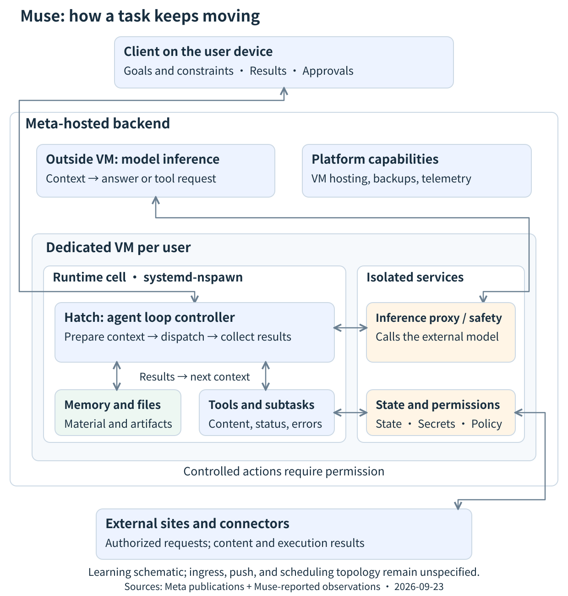

来源：[Muse Architecture Explained: Agent Loops, Dedicated VMs, Memory, and Background Work](https://codepick.dev/en/guides/muse-architecture/)  
作者：CodePick（页面未署名个人作者）  
日期：2026 年 9 月 24 日

----

沿着一项任务看 Meta Muse：Hatch 在专用 VM 内推进智能体循环，推理在 VM 之外运行，上下文、记忆、子智能体与权限使工作继续。文中有一张架构图，并写明了证据限度。

## 理解 Muse 的一个模型

Muse 把任务材料交给模型，取得一项决策，通过 Hatch 执行下一步，再把实际结果交回模型。记忆、持久状态与后台工作使这一过程可以跨对话继续。

这篇文章讨论的是 muse.ai 上 Meta 的个人智能体 Muse。Muse Spark 是模型；个人产品还包括 harness、专用计算环境、工具、状态与权限。公开的 Model API 示例说明了有用的模式，但并不是个人产品内部协议的文档。

记住三个问题：

1. 谁在推进任务？模型产生决策；Hatch 协调执行与下一次输入。

2. 什么会留下来？文件、记忆与运行状态可以存续到单次推理请求结束之后。当前上下文只包含这些材料中的一份选择。

3. 一个动作究竟在何时发生？工具请求仍然需要执行；在适用时，还需要权限。

> 范围：研究观察的日期是 2026 年 9 月 23 日。文章写于 9 月 24 日，并再次核对了主要的官方页面。部署方面的主张遵循 Meta 对发布架构的描述。内部文档、工具 schema 与运行元数据，是在主聊天中提出经授权的问题之后，由 Muse 报告的。这项研究没有直接登录 VM，也没有取得完整的执行日志。

## 架构：专用 VM 是 Meta 后端的一部分

打开图可以放大。组件按职责分组；箭头是学习辅助，并不是精确的 RPC 顺序，也不是完整的基础设施地图。

Meta 把 Hatch 放在专用 VM 内的 systemd-nspawn runtime cell 中，推理则通过 VM 外的代理到达。Meta 还提供一条外部遥测路径，以及持续的 VM 备份。已发表的说明没有写清入口、用户路由、推送交付或 VM 调度拓扑。[官方架构](https://research.meta.ai/blog/security-and-safety-for-ai-agents-our-approach-with-muse)

这里有两层嵌套的边界：VM，以及 runtime cell。容器内的进程列表只显示它可见的环境。在那里看不到某项服务，并不能证明该服务运行在另一台机器上。

为了学习，按这些职责来看：

| 组件 | 要看什么 |
| --- | --- |
| 客户端 | 目标、修正、结果，以及批准响应 |
| 模型 | 基于可见材料给出的回答，或提议的工具调用 |
| Hatch / harness | 准备好的输入、已分派的调用、收集到的结果，以及下一次迭代 |
| 工具与工作文件 | 参数变成执行结果、产物，以及可复用的材料 |
| 状态与权限服务 | 已记录的进度，以及受控动作是否可以继续的决定 |

这一划分与 Meta 的 [Agent frameworks 文档](https://dev.meta.ai/docs/agent-frameworks)一致。它是教学上的抽象，并不是对每一个内部 Hatch 模块的主张。

## 跟着一项任务走完智能体循环

假设用户提出：「比较三种开发者工具的部署方式，并写一份报告。」下面是说明性的走查，并不是一份捕获到的生产轨迹。

### 1. 准备当前输入

运行时需要为这次推理请求准备上下文：用户的目标、相关历史、可用证据、约束，以及工具定义。

模型能够考虑什么，取决于这份输入。工作目录里存在一份文档，并不意味着模型已经读过它。

### 2. 取得一项决策

模型可能会再请求一个来源，也可能断定已有足够信息来回答。

一次工具调用描述的是意图中的操作及其参数。调用本身并不能确立某一页已经被取回，或某一份报告已经被写好。

### 3. 执行并观察

运行时把请求分派给一个工具或受控的执行服务。返回值可能包含页面内容、产物路径或状态。它也可能报告拒绝、超时或错误。

下一次决策必须计入这个实际返回值：尝试另一个来源、改变做法、询问缺失的信息，或完成报告。

### 4. 把结果送入下一次迭代

目标与约束进入 VM 内的 Hatch，由它准备上下文。模型推理在 VM 外进行。若得到回答，则交付或等待。若得到工具请求，则执行，并取得结果或错误，再进入下一次上下文。

Meta 的[工具调用文档](https://dev.meta.ai/docs/tool-calling)说明了请求、执行与结果返回这一模式。这次走查借用的是该逻辑关系，并不假定个人产品使用同一套 SDK 或内部字段。

一项任务可能需要多次迭代，或并行的子任务。这一循环描述的是反馈，并不是要求把每项任务都串进同一个队列。

## 记忆、历史与上下文各有职责

把三种表示分开：

- 历史：以往的交互与执行记录。

- 持久记忆：被选出来、用来帮助未来任务的信息。

- 当前上下文：这一次模型请求实际包含的内容。

Meta 的[产品设计记述](https://introducing.muse.ai/)描述了用户可以查看并编辑的记忆文件。这项研究中由 Muse 报告的文档与工具说明，呈现出几种不同的变换：

| 操作 | 变换 | 目的与信息损失 |
| --- | --- | --- |
| 历史压缩 | 长历史被收缩为摘要，并保留最近的条目 | 用于继续当前任务；部分细节被略去 |
| 记忆巩固 | 对话与经验被整理为更长期的事实与笔记 | 用于支持未来任务；笔记并不是逐字的聊天档案 |
| 按需读取技能 | 短描述被展开为详细指令 | 在需要时补充方法与约束；读取一项技能并不授予权限 |
| 延迟加载工具 | 命名空间概览被展开为完整 schema | 说明如何调用工具；schema 并不是可执行的工具代码 |

例如，用户可能希望报告采用官方来源。原话可以留在历史中，而被选出的偏好成为记忆。到下一份报告时，相关材料仍须进入当前上下文，才能影响那一次请求。

已存储、可搜索、已加载，是三种不同的状态。「记忆里有这个事实」与「模型在这一轮看到了它」，需要不同的证据。

### 这些观察确立了什么

Muse 报告了七条 `compaction_checkpoint` 记录，其中含有触发信息以及压缩前后的 token 计数。这些记录确立的是：样本中存在压缩检查点。它们没有模型字段，因此不能据此识别出一个专用的压缩模型，或一种固定的阈值算法。

报告中的接口还区分了 `memory_search` 与 `chat.read_messages`。前者搜索记忆，后者读取指定的聊天。客户端有一个聊天搜索界面。某一个智能体工具的限度，不能推广成「整个产品没有聊天搜索」的主张。

这些是 9 月 23 日的环境观察，并不是一份公开的稳定接口契约。它们没有指出某一种向量数据库、远程索引或检索算法。

## 后台工作有不止一个完成点

应用关闭后继续工作，需要服务端执行、已记录的进度，以及把有用结果送回的途径。Meta 的[设计记述](https://introducing.muse.ai/)描述了定时工作与事件驱动的工作，随后再判断结果是否值得通知用户。

调查一项后台任务时，分开问四个问题：

| 阶段 | 问题 |
| --- | --- |
| 触发 | 预定时间或相关事件是否发生了？ |
| 执行 | 是否创建了一次运行，它报告了什么状态？ |
| 交接 | 主智能体是否收到了一份它可以据以行动的结果？ |
| 用户收到 | 是否选择了通知，交付是否发生了？ |

这是一个调查框架，并不是主张每项任务都经过四个相同的物理服务。

这项研究收到三条标记为 `succeeded` 的 cron 记录、一次成功的记忆巩固运行，以及五次与工作进程标识相关联的子任务完成交接。它们表明的是执行与交接的样本。它们并不是从预定触发一直连到用户交付的同一条轨迹。

在一张交接去重表里查不到匹配行，也不能证明没有别的消息路径留有记录。没有连接键，这个缺口就仍然开着。

### 子智能体从哪里开始

报告中的 `subagent.spawn` schema 称，一般子任务以父任务的记录稿为起点。父与子随后分别推进，结果由运行时返回。确切的快照边界与裁剪规则仍不清楚；这并不是「二者持续共享一份可改写上下文」的证据。

有用的区分是：背景可以被继承；此后的进展必须被传达。知道父任务的初始材料，并不意味着父任务会自动知道子任务后来做的每一件事。

## 权限是执行中单独的一部分

Meta 把 PostgreSQL、`hatch-authd`、Sentinel、受控的连接器工作进程，以及浏览器中介放在 runtime cell 之外。Sentinel 决定权限，并在需要时直接与客户端交换批准请求。[官方安全架构](https://research.meta.ai/blog/security-and-safety-for-ai-agents-our-approach-with-muse)

回到报告的例子：准备一份报告，与把它发给某人，是两个动作。即使发送请求已经生成，执行仍可能在等待批准、被拒绝，或失败。后来的记录需要保住这些区别。

从工程上看，三种表示带有不同的权威：

- 模型输出表达的是提议的动作。

- 权限状态决定一项受控动作是否获得授权。

- 执行结果描述实际发生了什么。

把这三者收进对话散文，就容易把意图、授权与完成混在一起。这是从该架构得出的一条设计教训。

## 自我改进如何影响以后的任务

报告中的材料支持下面这条路径：

任务经验进入记忆或技能修订，再进入以后的上下文，从而改变后续动作。

写进技能的一次成功步骤，可以成为以后类似任务的有用指令。可观察到的变化，起初出现在智能体能够阅读的材料里。

一次成功的巩固运行，确立的是它所报告的运行状态；要核验文件是否改变，仍需要对应的产物。这项调查没有取得证据，表明用户 VM 内的自我改进任务会在线更新基础模型的权重。

## 哪些仍未确认

| 观察或主张 | 能够支持的解释 |
| --- | --- |
| 某项服务不在容器的进程列表中 | 容器的可见范围有限；据此得不出该服务位于 VM 之外 |
| 存在压缩记录或相关的二进制字符串 | 有实现线索；正在使用的模型、阈值与路由仍未知 |
| 记忆检索返回了相关内容 | 检索存在；索引位置与算法没有被确立 |
| 清理记录的平均间隔约为 90 分钟 | 这度量的是记录间距；若没有跨启动的对应证据，它不是 VM 重启间隔 |
| 一次后台运行成功了 | 该运行报告成功；记忆变化或用户交付并不因此自动成立 |
| 存在 VM 备份 | 这不能确立任意进行中工作的无损恢复，也不能确立恰好一次执行 |

入口、推送交付与 VM 调度拓扑，完整的重试、去重与恢复语义，以及记忆索引和压缩策略，都在这里取得的证据之外。

## 做智能体的人可以带走什么

用四个问题检查自己的系统：

1. 能否追溯一次迭代？找出它的模型输入、提议的调用、实际返回，以及继续的理由。

2. 各种表示是否分开？原始记录、摘要、记忆与当前输入各有用途。

3. 异步结果是否分开？执行成功、结果被使用、用户收到交付，应当可以分别观察。

4. 授权是否有独立状态？模型的一句话不应同时充当请求、批准与完成的证明。

带着这些问题，可以把 Muse 理解为一个持续工作的系统：模型作出当前决策，运行时把动作与反馈接上，信息管理跨过时间，权限约束执行。

## 来源与范围

- [How We Built Safety Into Muse](https://research.meta.ai/blog/security-and-safety-for-ai-agents-our-approach-with-muse)：发布时的部署与权限边界。

- [How We Designed Muse](https://introducing.muse.ai/)：对话、后台工作、通知决策，以及可编辑的记忆。

- [Meta Model API — Agent frameworks](https://dev.meta.ai/docs/agent-frameworks)：模型与框架的职责。

- [Meta Model API — Tool calling](https://dev.meta.ai/docs/tool-calling)：工具请求与结果返回的一般模式。

- 2026 年 9 月 23 日的研究材料：一份用户提供的 Muse 实现摘要，以及在 Muse 主聊天中提出的经授权问题，随后是报告出来的文档、工具 schema 与只读元数据。这篇文章概括机制与证据限度，不发表私人聊天、账户信息或原始运行标识。这些环境观察无法仅凭公开链接独立复现。

继续阅读：[Agent Runtime Responsibilities and Selection](https://codepick.dev/en/guides/agent-runtime-ax-agyn-dapr/) 与 [AI Coding Agent Security](https://codepick.dev/en/guides/ai-coding-agent-security-2026/)。

## 常见问题

**Muse 的智能体循环是否在 VM 内运行？**

循环控制器 Hatch 运行在专用 VM 的 systemd-nspawn runtime cell 中。每一次模型推理请求都经过代理，到达 VM 外的基础设施。因此，完整的任务循环会越过这条边界。

**模型是否在每一轮都看到全部已保存的记忆？**

只有被放进当前上下文的材料，对那一次推理请求可见。已存储、可搜索、已加载进上下文，是不同的状态。我们不能假定每一次轮次都会把全部记忆文件完整注入。

**一次成功的后台运行，能否证明用户收到了它的结果？**

不能。执行完成、交接、通知生成与交付，需要分别的证据。这里描述的观察没有确立一份普遍的交付或恢复契约。
