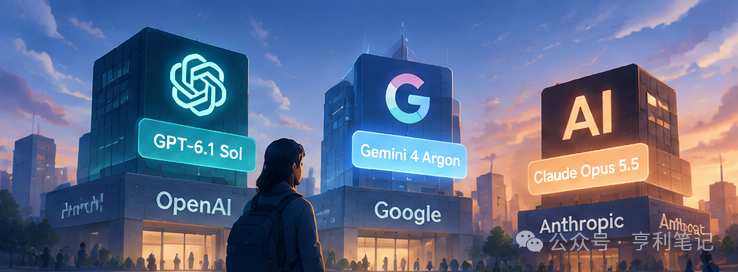
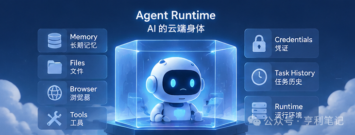
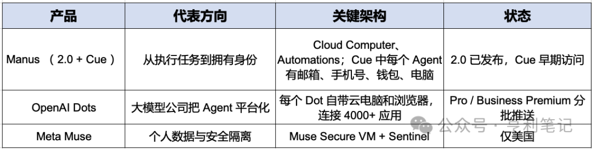
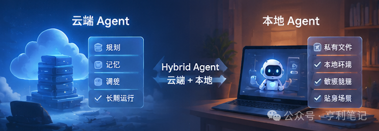
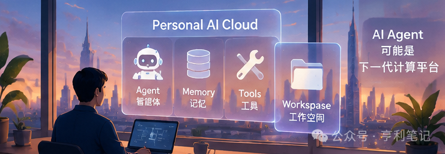

来源：[从 ChatGPT 到 Muse：AI 正在长出"云端身体"](https://mp.weixin.qq.com/s?__biz=MzAwNzUyNzI5Mw==&mid=2730797463&idx=1&sn=411e7f74a887748ebcbeb1ae4064d1a3)  
作者：亨利笔记  
日期：2026 年 10 月 8 日

----

从模型竞赛到个人智能体，下一代 AI 正在争夺任务入口

九月份，AI 行业出现了两种类型的产品发布。

一种是模型：Anthropic 的 Claude Opus 5.5，OpenAI 的 GPT-6.1 Sol，谷歌的 Gemini 4 Argon。超强的参数、推理能力、Benchmark，关注的仍然是 AI 的"大脑能力"。



另一种是智能体：Meta 的 Muse，Manus 的 Cue，以及 OpenAI 的 Dots。它们比拼的已经不是"回答得多好"，而是"能不能替你把事办完"。

还有消息称，国内大厂也在快马加鞭地研发 Muse 对标的个人智能体差评。

这些产品的发布都挤到同一个月之内，绝对不是巧合。可以说，巨头们在同一时间集体转向个人智能体，这是为什么呢？

答案的线索在模型之外。AI 要真正干活，不能只有大脑，还需要一副身体。过去 AI 的入口是"回答"，未来 AI 的入口，可能是"任务"。

## 从聊天机器人到智能体：AI 从工具变成执行者

聊天机器人是"你问它答"，一次交互就结束，没有长期目标：

用户→问题→模型→回答

Agent（智能体）是"你给目标，它交结果"：

用户目标→任务规划→工具调用→执行任务→反馈调整

你只需要说："帮我准备一份新能源行业分析。"它会自己搜索资料、阅读研报、整理数据，遇到卡点回头调整，最后交给你一份成果。

最大的变化不是模型更聪明，而是 AI 开始有了行动能力。只能说话的大脑，价值有天花板；一旦能动手，价值就从"提供信息"变成了"交付结果"。

这也是"数字员工"这个说法流行的原因，只不过个人智能体更进一步：它服务的不是企业流程，而是你个人的目标和日常。

但要让 Agent 真正去执行，光有大脑不够，它还需要一副身体。

## AI 不仅需要大脑，还需要身体

如果模型是 AI 的"大脑"，这副"身体"就是：能长期运行的环境、长期记忆（Memory）、可使用的工具，以及一块属于自己的工作空间。

这层新的基础设施，称为 Agent Runtime（智能体运行时），也可以理解为 AI 时代的"执行环境"。



### 1. 为什么是现在

过去不是没人想做智能体，而是做不起来：模型不够可靠，工具调用容易中断，成本太高，安全也没法控。现在三件事同时在变：

- 模型在复杂任务规划、工具调用和多步骤执行上取得了明显进展。

- 成本在下降。OpenAI 宣称 GPT-6.1 Sol 在部分 Agent 基准上达到接近 Astra 的表现，成本却只有约五分之一。

- 隔离环境的工程方案开始成熟。

模型决定它能不能规划，成本决定它能不能一直开着，隔离环境决定它敢不敢被授权。三者缺一，Agent 就只能停留在演示阶段。

### 2. Agent 是长期运行的软件实体

聊天机器人是一次请求、一次回答。Agent 可能要跑几个小时，也可能每天定时执行：早上总结邮件、持续追踪行业新闻和盯着项目进度，有异常就提醒你。

这样的任务放在个人电脑上很别扭：合盖休眠、网络切换和权限弹窗，任何一个都能让任务中断。

所以 Agent 天然需要一个一直在线的云端环境。OpenAI 的 Dots 把这件事说得很直白：用户关掉网页后，它仍在后台默默地工作。

### 3. Agent 需要属于自己的工作空间

过去是人拥有一台电脑，未来每个人可能拥有一个 AI 工作空间。这不只是比喻，它真的需要这些东西：

```text
AI Workspace
├ Memory 长期记忆
├ Files 文件
├ Browser 浏览器
├ Tools 工具
├ Credentials 凭证
├ Task History 任务历史
└ Runtime 运行环境
```

这像是给 AI 配了一间办公室：有自己的文件柜、浏览器和工作日志。下次你再交代任务，它不必从零开始认识你。

### 4. 为什么必须是虚拟机和沙箱

Agent 要浏览网页、操作应用、运行代码和访问数据。让它直接在你的电脑上做这些事，一次误操作或一次提示词注入，后果都可能很严重。

Agent 越有能力，风险也越大：它能操作你的账户，也可能被诱导去操作你的账户。所以主流做法是给它一个隔离的环境：

用户→ Agent → Secure VM →工具 / 应用

好处是安全、权限可控、出错可恢复，以及过程可审计。

Meta 的 Muse 是目前发展得相对完整的一个。官方说得很明确：个人智能体需要新的安全计算机，所以每个 Muse 都跑在专属的 Muse Secure VM 里，自带浏览器，智能体和用户数据都装在其中。

同一台机器上另有一个独立的 Sentinel 智能体，Muse 的网络请求和连接器操作要经它批准才能放行；密码和支付信息放在凭证库里，Muse 本身看不到真实值。

安全已经不只是模型对齐的问题，而成了整个运行环境的架构问题。未来 Agent 的竞争，不仅是"谁更聪明"，也是"谁敢被用户授权更多"。

## 三种产品，三种切面

这三款产品在用不同方式回答同一个问题：身体该怎么长。

以下信息基于它们发布时的公开信息：



Manus：执行层加身份层。这条线要分两层看。

Manus 2.0 是执行层：早期产品形态已经体现了"提交目标、后台执行、交付结果"的思路，Manus 2.0 又新增云端电脑和事件触发的 Automations（自动化），底层换成自研的 Cascade 框架。

同一天推出的 Cue 是建在 Manus 基础设施上的独立应用，是身份层：每个 Agent 有自己的邮箱、手机号、钱包和电脑，预算由用户设定，多个 Agent 还能在群聊里分工协作。

这已经是给 AI 一套可以在社会里行事的身份和资源。

Dots：大模型公司把 Agent 平台化。

Dots 在 OpenAi 的 DevDay 上发布，能在 ChatGPT、Slack、Teams 里联系，并会从反馈中学习用户偏好。

据 OpenAI 和多家媒体报道，它由 GPT-6 Astra 驱动。它的卖点是"给模型配了一个不下班的身体"。ChatGPT 正从聊天产品，转变成 Agent 平台。

Muse：个人数据与安全隔离。

连接个人账户是 Agent 最高风险的一步，Muse 的回答是用架构而不是承诺来兜底。它还可以直接在 WhatsApp 里使用，背后是 Meta 的社交入口。

三个产品共同指向的，是一种新的软件形态：AI 自己拥有运行环境、记忆、工具和执行权限。

## 开源阵营：Agent Runtime 不只是大厂路线

这种形态并不只属于大厂，开源阵营也在用另一种方式验证同一件事。

开源的 OpenClaw 曾是最火的个人智能体项目之一，创始人加入 OpenAI 后，项目转入基金会继续开源。

Nous Research 的 Hermes Agent 则主打持久记忆和内置定时任务，官方宣传"一台 5 美元的 VPS 就能跑"。

大厂是替你准备好服务器，开源用户是自己租一台，本质是同一个需求：Agent 要长期在线，就绕不开一台永远开着的机器。

这说明跑在云端是 Agent 的软件需要长期在线自然推导出的结果。

这也引出一个判断：未来也许不是"云端 vs 本地"，而是混合 Agent：



云端 Agent：规划、记忆、调度

本地 Agent：私有文件、本地环境、敏感数据

苗头已经出现。Dots 在用户授权下可以直接在笔记本上工作，Manus 2.0 也支持通过自然语言远程操控被授权的电脑。混合模式实质上是把身体分成两半：需要长期在线的留在云端，需要贴身、敏感的留在本地。

## 巨头争的其实是任务入口

但无论云端还是本地，Agent 最终要争夺的，是同一个位置：用户任务的入口。

回看计算史，每一代平台的赢家，都是控制了关键入口的那一方：Windows 控制了 PC，iOS 控制了移动端，搜索控制了信息获取。

Agent 想控制的，是任务入口。用户不再打开一个个 App，而是直接告诉 Agent："帮我订下周去上海的行程，预算五千元以内。" 谁成了这个"告诉"的对象，谁就握住了下一代的入口。

从这个角度看，个人 Agent 也就是面向个人的"数字助手"。所以这个入口也成了兵家必争之地，各家都在用自己的底牌全力卡位。

OpenAI 有模型和庞大的 ChatGPT 用户基础，Meta 有社交关系和 WhatsApp。谷歌的优势在于搜索、Workspace 和 Android，但 Gemini 4 Argon 目前更像一次模型层面的回归，是否具有个人 Agent 的完整形态仍需观察。

国内厂商的底牌或许各不相同。字节有内容生态和手机入口，阿里有电商、办公和云，腾讯有微信和社交关系。但他们的目标大概率一致：在入口形成之前先站住。

## 结尾：个人 AI 云，可能是下一代计算平台

PC 时代，软件装在本地；互联网时代，服务搬到云端；移动互联网时代，App 成为主角。下一步，可能是 AI Agent 成为新的平台。

每个人也许会拥有个人 AI 云，里面有 Agent、Memory、Tools 和 Workspace。说白了，它就是每个人自己的"云端身体"。操作系统管理的是文件和进程，Agent Runtime 管理的是记忆、权限和任务，它很可能是下一代的"操作系统"。



但操作系统的前提，是用户愿意把东西交给它。这正是个人 Agent 和过去所有软件最不一样的地方。

当然，真正的难题是：你愿意把多少账户、多少权限、多少钱，交给一个替你行动的 AI？这个问题不是靠"模型更对齐"就能解决的，它需要架构：隔离、权限、凭证和审计。

Manus 的钱包预算、Meta 的 Sentinel，都是在用产品回答同一个问题：信任不是承诺，是设计。

如果说数据是互联网时代的核心资产，用户规模是移动互联网时代的核心资产，那么 AI 时代真正的资产，可能是用户和 Agent 之间长期形成的关系，也就是"个人智能关系"：AI 对你的长期目标、习惯和上下文的理解，以及你对它的长期信任。

下一阶段的竞争，也许是谁能成为你最信任的那个智能伙伴。

> 本文涉及的产品与模型信息，基于公开报道与官方发布整理；部分产品状态变化较快，请以官方最新信息为准。
