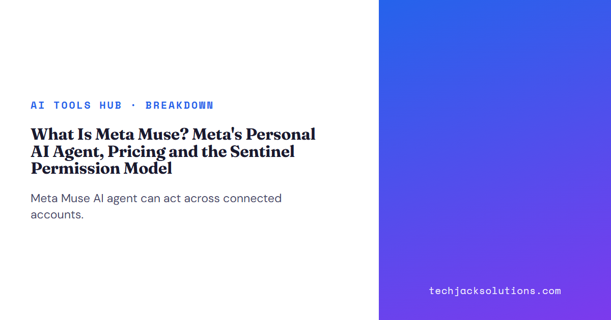

来源：[What Is Meta Muse? Meta's Personal AI Agent, Pricing and the Sentinel Permission Model](https://techjacksolutions.com/ai-tools/muse-spark/what-is-meta-muse-personal-ai-agent/)  
审阅：Tech Jacks Solutions  
日期：2026 年 10 月（结构化数据：发布于 2026-10-04，更新于 2026-10-05）  
类型：Breakdown

----

页面唯一的图片是分享用标题卡。正文中没有插图。

审阅：Tech Jacks Solutions · 2026 年 10 月 · Breakdown

Meta Muse AI 智能体可以在已连接的账户上执行任务。它可以打开浏览器、填写表单、预订行程，并代表用户发送邮件。[Meta 在 Muse 发布公告中描述了这些动作](https://about.fb.com/news/2026/09/introducing-muse-personal-ai-agent/)。实际要回答的问题是：所有者允许哪些动作，以及何时必须由所有者批准。

这篇指南涵盖消费级 Muse 产品、已见报道的订阅价格，以及执行任务的智能体与 Sentinel 之间的边界。Sentinel 是一个独立的权限权威。[Muse Spark 模型族](https://techjacksolutions.com/ai-tools/muse-spark/what-is-meta-muse-spark/)与 [Muse Code 编程智能体](https://techjacksolutions.com/ai-tools/muse-spark/what-is-muse-code/)另有专文。

## 什么是 Meta Muse AI 智能体？

Muse 是 Meta 的消费级个人智能体。Meta 称，它可以追求一个目标、规划步骤，并在应用关闭后继续工作。例子包括发送邮件、预订行程、打开浏览器、填写表单，以及协商。这些是外部服务中的动作，因此需要比一条聊天回答更严格的审视。Meta 的产品公告列出了这些任务与后台工作。

> 核心区别在于：建议性控制要求任务智能体自行约束行为；强制控制把批准放在任务智能体无法改写的边界上。Meta 称，Sentinel 在系统层面与 Muse 分离，并控制其流量能否离开 VM。这是 Meta 的架构主张，并不是一项独立的安全结论。

用户可以连接服务，并选择 Muse 获得的访问权限。Meta 具体描述了这一选择：Muse 可以只读邮件，也可以同时发送邮件；之后可以更改访问权限，或断开该服务。这些选择属于 Meta 已发布的控制说明。

## Muse 在哪里可用？

Meta 于 2026 年 9 月 8 日发布 Muse，并称正在美国的 iOS、Android 与 muse.ai 上推出。发布文还描述了 WhatsApp 中的对话。它把 AI 眼镜支持表述为即将推出，因此该公告不能当作每一项眼镜功能此刻均已可用的证据。

> 2026 年 9 月发生了变化：Meta 的公告把 Muse 从模型叙事推进为可以通过已连接服务采取动作的消费级智能体。

## Meta Muse 如何收费？

Meta 称，Muse 对多数需求免费，并为希望做更多事的人提供订阅。该发布声明没有给出数值额度，也没有写出付费方案的名称。[CNBC 报道，Meta 高管 Alexandr Wang 描述了免费档，以及每月 20 美元或 100 美元的选项，具体取决于用量](https://www.cnbc.com/2026/09/08/meta-personal-ai-agents-public-reckoning-privacy-safety.html)。

已审阅来源实际确立的内容

| 选项 | 价格依据 | 用量依据 |
| --- | --- | --- |
| 免费 | Meta 称多数需求可以免费使用 | 发布声明中没有数值额度 |
| 付费档 | CNBC 报道为每月 20 美元 | 在 CNBC 的报道中，Wang 将定价描述为随用量变化 |
| 更高付费档 | CNBC 报道为每月 100 美元 | 此处没有确立任务量或计算量的数值上限 |

不要把报道中的价格当成已经承诺的配额。订阅之前，应查看应用内当前方案的计费周期、用量计量、续订条款，以及达到限额时会发生什么。如果任务在应用关闭后仍能继续工作，这一点尤其相关。Meta 在发布文中描述了这种后台行为。

## Muse Secure VM 与 Sentinel 如何强制执行权限？

Meta 称，Muse 运行在一台名为 Muse Secure VM 的专用云虚拟机中。独立的 Sentinel 智能体运行在同一台机器上，并在系统层面与 Muse 分开。Meta 陈述的边界很直接：「Muse 所做的任何事，未经 Sentinel 批准，都不会到达互联网。」这是关于系统路径的强制执行主张，而不是写进提示词的建议。

**任务**

Muse 准备一项账户动作或浏览器动作。

**边界**

Sentinel 决定流量能否离开 VM。

**人**

在发送邮件或购买等敏感动作之前，Muse 会询问用户。

Meta 称，密码与支付细节存放在 Muse 无法查看的位置，并提供已完成工作与计划中工作的动作轨迹。它还称，用户可以授予应用访问权限、收窄邮件权限、更改这些权限，以及断开服务。这些是 Meta 已发布的防护措施；仅凭公告，并不能确立每一个边界情况在真实账户中如何表现。

对于购买，Meta 称 Muse 可以使用由 Stripe 构建的 Link，以及一张隐藏用户卡详情的一次性卡。它称，购买之前 Muse 会询问用户。两项陈述都来自 Meta 的发布公告。这个批准点之所以重要，是因为能够填满购物车的智能体，在付款之前仍应有一次单独的核对。

## 独立分析如何描述 Secure VM 的内部？

Meta 的发布公告停在边界上：Muse 位于它自己的云 VM 中，Sentinel 位于其旁，凭证进入 Muse 可以使用但看不见的存储。两篇独立文章进一步讨论这一边界可能如何构建。应将它们读作外部分析。Meta 的公告没有逐项确认下面的实现细节。

### runtime cell 与主机域

[Forkast 的架构分析](https://forkast.news/metas-muse-agent-lives-behind-a-kernel-level-sentinel-the-architecture-reveals-where-agent-security-is-heading/)把这台 VM 描述为两个域。runtime cell 运行 agent harness 及其工具；Forkast 称 runtime cell 是一个 systemd-nspawn 容器。在它之外，主机域存放安全敏感的服务。Forkast 称，网络拦截与进程归属使用 eBPF cgroup 程序，Linux Security Module 钩子负责传播污点：进程一旦读取用户数据即变为污点状态；污点进程失去狭窄的自动允许路径，转入更严格的审批流程。

### 凭证与替身令牌

在凭证方面，Forkast 指出一项名为 hatch-authd 的主机服务。按该文的记述，智能体收到的是不含访问权限的替身令牌；真实秘密只在动作获批之后，于网络边界插入。[一篇 DEV Community 分析](https://dev.to/ifynx_studio/meta-muse-and-the-secure-vm-bet-personal-agents-that-act-without-owning-your-secrets-1ik4)把同一设计表述为权限分离，目的是防止遭受提示注入的智能体泄露 OAuth 令牌。

各方对 Muse Secure VM 分别说了什么

| 细节 | Meta 公告 | 独立分析 |
| --- | --- | --- |
| 每人一台专用云虚拟机 | 公告中有陈述 | Forkast 与 DEV Community 有描述 |
| 独立的 Sentinel 批准出站动作 | 公告中有陈述 | 被描述为主机侧的权限权威 |
| 凭证可供使用，但 Muse 看不见 | 公告中有陈述 | 被描述为替身令牌加上 hatch-authd |
| systemd-nspawn runtime cell，以及 eBPF 污点跟踪 | 公告中没有陈述 | 仅见于 Forkast |

## Muse 在日常中如何工作？

### 后台工作、记忆与批准

Muse 为超出一次聊天窗口的任务而构建。用 Meta 的话说，对于较长的任务，Muse「在人们关闭应用之后继续工作，并在情况发生变化或需要批准时回来，例如在发送邮件或完成购买之前」。Meta 还称，Muse 会记住对用户重要的事；用户可以让它「忘记」已经学到的特定内容；用户也可以选择不把自己的交互用于训练 Meta 的 AI 模型。

### 连接器、邮件与 AI 眼镜

连接器是 Muse 触及其他服务的方式。在 Connect 上，Meta 称正在加入 Walmart、Best Buy、American Eagle Outfitters、DICK'S Sporting Goods、Fanatics、Gap、Michael Kors、Sephora、Ulta 与 Wayfair，并以 Shop Pay 和 PayPal 处理支付；Muse 还将获得自己的电子邮件地址。[Meta 的 Connect 回顾](https://about.fb.com/news/2026/09/the-biggest-news-from-connect-2026/)还称，Muse 将「在未来数月内」进入其 AI 眼镜，并能够根据佩戴者正在看的内容采取动作。

### Mac 上的计算机工作、头像与商业模式

[TechCrunch 对 Connect 的报道](https://techcrunch.com/2026/09/23/everything-new-coming-to-metas-ai-agent-muse/)补充了三项。Meta 称正在把 Muse 的计算机工作带到 Mac，使用户离开之后，智能体仍继续处理队列中的作业。一个新模型 Muse Realtime Avatar 用于为每个人的智能体提供视频聊天头像；TechCrunch 称用户很快就能获得这一功能。在收入方面，TechCrunch 引用 Mark Zuckerberg 的话：Meta「让 Muse 对大量 token 免费，并预期随着时间推移，我们将通过从交易中抽取小额费用来获利」。

### Muse Confidential VM 会改变什么

一项隐私变化仍在后面。Meta 称，今年晚些时候将推出 Muse Confidential VM（机密虚拟机）。整台 VM，包括用户的数据与对话，都用一把仅由该用户持有的密钥加密，「因此即便 Meta 也无法访问」。在此之前，访问限制依赖 Meta 所陈述的设计，而不是用户持有的密钥。

## 连接账户之前应核对什么？

从仍能完成预定任务的最窄访问权限开始。只读收件箱，与从收件箱发送，两者的差别在于一次错误会影响到谁。Meta 称，用户可以对邮件作出这一选择，并在之后撤销访问。

### 连接核对

- 我知道正在连接的是哪个应用，以及这项任务为什么需要它。

- 在不需要发送或编辑的地方，我选择了只读访问。

- 我知道哪些动作需要我批准，尤其是邮件与购买。

- 我能找到动作轨迹，以及断开该应用的途径。

- 在分享个人信息之前，我查看了当前的数据使用设置。

Meta 称，用户可以选择不把交互用于训练其 AI 模型，并称 Muse 的对话与 VM 数据不与 Meta 的广告系统共享。这些是厂商陈述。在假定某项设置具有你所期望的效果之前，应查看自己账户中可见的控制项。Meta 描述了这两种数据使用选择。

> 决策示例：如果任务是汇总收件箱，授予读取权限，并在允许任何发送动作之前查看汇总结果。如果任务以购买结束，应在批准之前核对批准提示所显示的细节。这一建议遵循 Meta 所称 Muse 提供的权限分离；它是用户的决定，并不是「系统能够阻止每一次错误」的主张。

## Muse 与 Muse Spark、Muse Code 是什么关系？

Muse 是消费级智能体的界面与服务。Meta 称，它由 Muse Spark 驱动，该模型族提供底层 AI 能力。Muse 发布公告写出了这一关系，并且 [Meta 将 Muse Spark 作为模型族发布](https://ai.meta.com/blog/introducing-muse-spark-msl/)。模型公告本身并不能确立消费级产品获得了哪些账户权限。

关于模型架构，见我们的 [Muse Spark 说明](https://techjacksolutions.com/ai-tools/muse-spark/what-is-meta-muse-spark/)。关于开发者工具，见 [Muse Code 的报道](https://techjacksolutions.com/ai-tools/muse-spark/what-is-muse-code/)。本文聚焦个人智能体的已连接服务、已见报道的价格，以及所主张的 Sentinel 批准边界。

## Meta 是否为 Muse 发布了系统卡？

就智能体产品而言，截至 2026 年 10 月 5 日，我们没有找到。Meta 已发布的评估文档覆盖驱动 Muse 的 Muse Spark 模型，并不覆盖带有连接器、VM 与 Sentinel 的消费级智能体。对智能体本身，发布公告是其防护措施的主要描述。

### Meta 为 Muse Spark 模型发布了什么

就模型而言，Meta 的 Muse Spark 1.1 文章称，部署前已在其 Advanced AI Scaling Framework 下运行安全评估，覆盖 Chemical & Biological、Cybersecurity 与 Loss of Control 风险类别，并称「我们针对 1.1 的完整安全态势记录在 Muse Spark 1.1 Evaluation Report 中」。[Meta 的 Muse Spark 1.1 公告](https://ai.meta.com/blog/introducing-muse-spark-meta-model-api/)链接了该报告。更早的 Muse Spark 发布文指向一份 Safety & Preparedness Report，其中包含首个版本的完整结果。

### 为什么模型报告不是产品系统卡

这一缺口为什么重要：模型评估衡量模型在测试上的行为，包括提示注入测试与误用测试。它不衡量某一具体产品如何限制该模型能够触及的对象。对 Muse 而言，第二个问题由上文所述的 VM、Sentinel 与连接器权限来回答；目前这些依据是 Meta 的产品陈述加上外部分析，而不是一份已发布的产品级评估。

## Muse 的采用有多快？

### App Store 排名与下载量

按目前已报道的度量，速度很快。[OfficeChai 报道](https://officechai.com/ai/metas-ai-agent-muse-announces-tie-ups-with-shopify-paypal-instacart-and-expedia/)，Muse 曾短暂超过 ChatGPT，成为 Apple 美国 App Store 免费应用榜首，前五天下载量约为 730,000。已审阅的来源中，没有 Meta 发布的下载量或活跃用户数字，因此应将下载量视为外部对安装量的估计，而不是使用量。

### 商业伙伴

商业伙伴随后出现。OfficeChai 报道了与 Shopify、Instacart、Expedia 和 PayPal 的集成合作。按 OfficeChai 的表述，Shopify 首席执行官 Tobi Lütke 宣布，该公司正在与 Muse 深度合作，以便在全部 Shopify 商店上通过 Shop Pay 实现智能体结账。PayPal 在 X 上表示，它正与 Meta 合作，使其客户可以在全球 PayPal 商户中通过 Muse 购物并结账。Instacart 的集成把「Taco Tuesday」这类提示变成一个可以结账的杂货车；Expedia 的集成让 Muse 在应用内规划行程并预订酒店。

### Amazon 的拦截

Amazon 走了另一条路。[Gizmodo 报道](https://gizmodo.com/amazon-brings-down-the-hammer-on-metas-muse-ai-agent-2000814878)，截至 9 月 20 日星期日夜间，试图通过 Muse 在 Amazon 上购买的人看到一条弹窗：「未经授权的 AI 智能体继续访问，违反了 Amazon 的使用条件，而我们的客户已经同意这些条件。」Amazon 确认已要求 Meta 停止 Muse 在 Amazon.com 上购物，并对 Muse 如何处理客户凭证与账户数据提出关切。[The Next Web 指出](https://thenextweb.com/news/amazon-blocks-muse-perplexity-amended-complaint)，Amazon 还在针对 Perplexity 的另一起案件中提交了修正起诉，指控该公司误导联邦上诉法院。

已报道的 Muse 采用与伙伴信号

| 信号 | 报道内容 | 来源 |
| --- | --- | --- |
| App Store 排名 | 曾短暂成为 Apple 美国 App Store 免费应用榜首 | OfficeChai |
| 早期下载量 | 前五天约 730,000（估计值） | OfficeChai |
| 商业伙伴 | Shopify、PayPal、Instacart、Expedia | OfficeChai |
| 已宣布的零售连接器 | Walmart、Best Buy、Sephora、Wayfair 等 | Meta Connect 回顾 |
| Amazon | 截至 9 月 20 日拦截了 Muse 购物 | Gizmodo |

## 要点

- Muse 可以跨已连接服务采取动作，因此应把任务与账户访问放在一起评估。

- Meta 将 Sentinel 描述为 Muse Secure VM 出站动作的独立权威；应将其视为厂商的架构主张。

- Meta 确认有免费提供与付费订阅，CNBC 则报道了每月 20 美元与 100 美元的选项；付款前应核对应用内的当前条款。

- 任务不需要写入动作时授予只读访问，并查看动作轨迹。

- 比较产品时，把消费级智能体、Muse Spark 模型族与 Muse Code 分开。

- Meta 已发布的安全评估覆盖 Muse Spark 模型；截至 2026 年 10 月 5 日，没有找到 Muse 智能体的产品级系统卡。

- 按外部估计，采用速度很快，商业图景则是分开的：Shopify、PayPal、Instacart 与 Expedia 宣布了集成，Amazon 则拦截了 Muse 购物。

**什么是 Meta Muse AI 智能体？**

Muse 是 Meta 的消费级智能体，可以在已连接服务中执行任务，包括邮件、行程预订与网页表单。

**Meta Muse 如何收费？**

Meta 称，Muse 对多数需求免费，并提供付费订阅。CNBC 报道每月有 20 美元与 100 美元的选项，具体取决于用量。

**Sentinel 如何控制 Muse？**

Meta 称，独立的 Sentinel 智能体批准离开 Muse Secure VM 的出站流量；发送邮件与购买等敏感动作则会提示用户。

## 来源与延伸阅读

- [Meta：Introducing Muse](https://about.fb.com/news/2026/09/introducing-muse-personal-ai-agent/)（产品动作、可用性、安全主张、账户控制、Confidential VM）。

- [Meta：The biggest news from Connect 2026](https://about.fb.com/news/2026/09/the-biggest-news-from-connect-2026/)（连接器、电子邮件地址、AI 眼镜）。

- [CNBC：Meta pushes into personal AI agents](https://www.cnbc.com/2026/09/08/meta-personal-ai-agents-public-reckoning-privacy-safety.html)（已报道的订阅价格）。

- [Meta AI：Introducing Muse Spark](https://ai.meta.com/blog/introducing-muse-spark-msl/)（模型族背景、Safety & Preparedness Report）。

- [Meta AI：Introducing Muse Spark 1.1](https://ai.meta.com/blog/introducing-muse-spark-meta-model-api/)（部署前安全评估、Muse Spark 1.1 Evaluation Report）。

- [TechCrunch：Everything new coming to Meta's AI agent Muse](https://techcrunch.com/2026/09/23/everything-new-coming-to-metas-ai-agent-muse/)（Mac 上的计算机工作、头像、商业模式）。

- [Forkast：Muse agent architecture analysis](https://forkast.news/metas-muse-agent-lives-behind-a-kernel-level-sentinel-the-architecture-reveals-where-agent-security-is-heading/)（对 Secure VM 的独立分析）。

- [DEV Community：Meta Muse and the Secure VM bet](https://dev.to/ifynx_studio/meta-muse-and-the-secure-vm-bet-personal-agents-that-act-without-owning-your-secrets-1ik4)（对凭证隔离的独立分析）。

- [OfficeChai：Muse tie-ups with Shopify, PayPal, Instacart and Expedia](https://officechai.com/ai/metas-ai-agent-muse-announces-tie-ups-with-shopify-paypal-instacart-and-expedia/)（伙伴、App Store 排名、下载量估计）。

- [Gizmodo：Amazon blocks Muse](https://gizmodo.com/amazon-brings-down-the-hammer-on-metas-muse-ai-agent-2000814878)（Amazon 的拦截及其陈述的关切）。

- [The Next Web：Amazon blocks Muse, amends Perplexity complaint](https://thenextweb.com/news/amazon-blocks-muse-perplexity-amended-complaint)（相关诉讼）。

### 视频

原文给出的是检索入口，不是单条视频。这里不转写画面。

- [Meta Muse launch videos](https://www.youtube.com/results?search_query=Meta+Muse+personal+AI+agent+launch)（YouTube 检索）

- [Muse Secure VM and Sentinel videos](https://www.youtube.com/results?search_query=Meta+Muse+Secure+VM+Sentinel)（YouTube 检索）

### 相关阅读

- [What Is Muse Spark?](https://techjacksolutions.com/ai-tools/muse-spark/what-is-meta-muse-spark/)：消费级智能体背后的模型族。

- [What Is Muse Code?](https://techjacksolutions.com/ai-tools/muse-spark/what-is-muse-code/)：Meta 另行提供的编程智能体。

- [Meta Muse Spark Hub](https://techjacksolutions.com/ai-tools/muse-spark/)：同一站点上更广的 Meta Muse 报道。

### 继续阅读

- [AI Glossary](https://techjacksolutions.com/ai-glossary/)：智能体与权限概念的定义。

- [AI Governance Hub](https://techjacksolutions.com/ai-governance-hub/)：评估已连接 AI 系统时的政策问题。

- [Agentic AI Hub](https://techjacksolutions.com/agentic-ai-hub/)：关于执行任务的 AI 系统的更多内容。

对照厂商文档与官方来源完成事实核对，时间为 2026 年 10 月。订阅前应在 Muse 应用中核对当前价格。

Meta、Muse、Muse Spark 与 Muse Code 是 Meta Platforms, Inc. 的商标。这是独立编辑报道，并非由 Meta 赞助。
