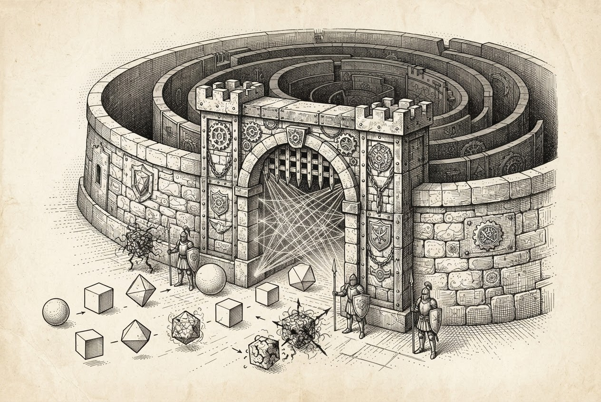

来源：[Yahoo Tech 转载](https://tech.yahoo.com/ai/meta-ai/articles/meta-muse-agent-lives-behind-094818903.html)，原文：[Forkast](https://forkast.news/metas-muse-agent-lives-behind-a-kernel-level-sentinel-the-architecture-reveals-where-agent-security-is-heading/)  
作者：Blair Hayes（Forkast）  
日期：2026 年 9 月 24 日 9:48 UTC  
类型：Analysis

----

> Yahoo 转载页没有附这张图。它是 Forkast 原文标题下的题图。

一座位于内核层的安全屏障构成加固的关口。智能体进程走向关口：有的处于干净状态并被放行，有的处于污点状态并被 Sentinel 的强制执行挡回。这幅图把 eBPF 污点跟踪画成遏制优先的安全。

Meta 的 Muse Secure VM 使用 eBPF 污点跟踪、凭证替身，以及一项主机侧的权限权威，在操作系统层遏制智能体的失败。这是一种遏制优先的模型，并与企业侧横向的治理栈形成对照。

----

2026 年 9 月 8 日，Meta 发布其个人 AI 智能体 Muse 的安全架构。最重要的细节不是模型的能力，而是围绕它的内核级强制执行。把安全强制执行直接放入操作系统层，Meta 以此表明：行业必须转向遏制优先的安全姿态。这一做法承认，AI 模型本身会出错；支撑它们的基础设施可以被做得足够稳固，从而防止灾难性失败。

这一系统的核心是 [Muse Secure VM](https://research.meta.ai/blog/security-and-safety-for-ai-agents-our-approach-with-muse)，一个按用户划分的 Linux 环境，分成两个不同的安全域。runtime cell 实现为一个 `systemd-nspawn` 容器，作为 agent harness 及其各种工具的执行环境。该 runtime cell 之外是主机域，存放安全敏感的服务。这里的关键组件是 Sentinel，一个主机侧进程，对全部连接器动作和网络出站拥有唯一权威。智能体本身被置于提议动作的位置；Sentinel 保留最终的批准或拒绝权，实际上作为一项独立于智能体内部逻辑的[运行时权威](https://forkast.news/glossary/runtime-authority/)运行。

这一架构中真正的创新点，是 eBPF 污点跟踪的实现。网络拦截与进程归属使用 eBPF cgroup 程序，污点传播则使用挂接到 Linux Security Module（LSM）钩子上的程序。Meta 由此建立的系统不依赖模型自身的判断。工具执行进程开始时处于干净状态。该进程一旦读取用户数据，即变为污点状态。符合范围狭窄的自动允许策略的干净网络请求可以继续；污点进程失去这一特权，被转入更严格的审批流程。这种内核级强制执行保证：无论模型是否按预期行事，数据流都会受到监视。

Meta 还用名为 hatch-authd 的系统处理凭证管理。该守护进程负责凭证存储与凭证替身，使智能体从不接触原始凭证。智能体收到的是不含实际访问权限的替身令牌。Sentinel 在网络边界对真实秘密做即时插入。这在 VM 内部形成一道零信任边界：即便模型本身遭到攻陷，它也无法取回底层的认证令牌。

尽管有这些技术防护，Meta 仍公开说明这一做法的限度。该公司明确承认，[提示注入](https://forkast.news/glossary/prompt-injection/)仍是业界未解决的问题，Muse 也必然会出错。公司的[漏洞赏金计划](https://bugbounty.meta.com/)对有效报告最高提供 300,000 美元。它是一种为这些利用标价的市场机制，而不是「这些利用已经被消除」的主张。账户接管档为 130,000 美元，并且覆盖影响单个用户的成功提示注入尝试。这强调的事实是：这些脆弱性在预期之中，而不只是有可能发生。

这一架构显示出业界处理[智能体治理](https://forkast.news/glossary/agent-governance/)的分野。Meta 采取垂直整合：把身份、运行时与治理放进一台完整的 VM。企业部门则呈现横向专业化。Okta、IBM、Broadcom 与 Dataiku 等公司提供的是一套[模块化治理栈](https://forkast.news/the-agent-governance-stack-is-forming-four-products-two-weeks-one-pattern/)。Meta 的做法优先考虑统一的、可供消费者使用的环境；企业模式则优先考虑专门厂商之间的互操作。

这一主机侧安全模型的限度，最近受到一个 [macOS 零日漏洞](https://forkast.news/muses-undocumented-endpoint-turns-macos-agent-into-a-local-backdoor/)的检验。安全研究者 Patrick Wardle 披露了一个问题：一个未写入文档的偏好键允许本地进程劫持智能体的听写流，并捕获认证令牌。Meta 在 12 小时内做了热修复。该事件表明，当主机操作系统本身遭到攻陷时，即便架构很精细，仍然存在真实缺口。与此相似，一次 [WordPress 补丁空窗](https://forkast.news/wordpress-core-patched-in-hours-attackers-were-already-inside/)被迅速利用：一个 CVSS 9.2 的漏洞在补丁发布后不到六小时就遭到探测。这显示出攻击者在当前环境中的行动速度。

Muse 的架构反映出遏制优先的安全之所以必要。Meta 假定智能体会遭到攻陷，或者会出错，并据此构建系统，以限制这些失败的波及范围。这是一种务实的认识：在自主智能体的时代，基础设施必须是最后一道防线，提供模型无法绕过的、刚性且可核验的边界，不论模型的内部状态如何，也不论它收到的提示有多么精细。
