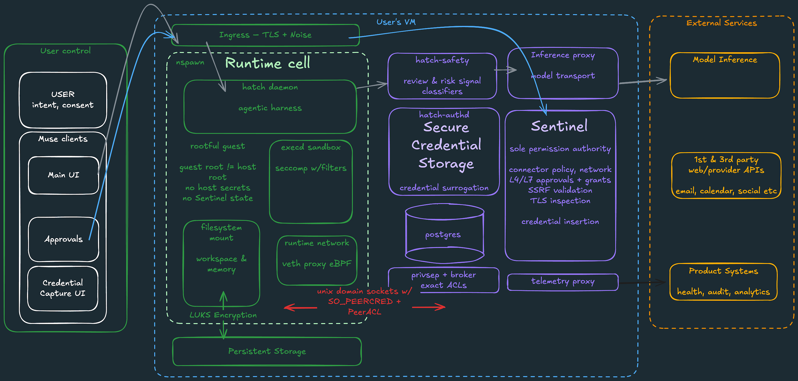

来源：[How We Built Safety Into Muse](https://research.meta.ai/blog/security-and-safety-for-ai-agents-our-approach-with-muse)  
日期：2026 年 9 月 8 日  
作者：Tarek Sheasha，Meta Superintelligence Labs 软件工程师与副总裁

----

> 文章以一段视频开篇：Tarek Sheasha 介绍 Muse Secure VM，以及其中的安全、隐私与防护。

今天，我们发布了个人智能体 Muse。自 2026 年初以来，我们一直在开发 Muse，并亲自使用它。一开始使用，我们就看到了真正的个人超级智能的初步迹象：它了解用户，实际执行事务，在后台工作，启动成群的子智能体，自行构建工具，并修改自身。

这也是我们第一次把收件箱、日历和 shell 交给一套软件，并让它在无人值守的情况下运行；结果并不总是符合预期。要让这项技术适用于所有人，必须通过审慎的设计与工程，使其以更安全的方式运行。这个项目的大部分工作都投入在这里。本文详细说明我们的做法。

训练模型时，我们把重点放在此类智能体的关键能力上：基于 CLI 与技能的零样本工具调用、长上下文、在长轨迹指令遵循中内建对提示注入的觉察，以及多智能体协同。

无论核心模型多么强，这类智能体仍然会出错，有时也会经由它所读取的数据遭到攻击。因此，系统设计假定智能体可能处于被攻击之中，并据此限制潜在损害： harness 运行在自己的 runtime cell 中，看不到真实凭证；与外部世界的每一次交互都经过 Sentinel，而智能体不能改写 Sentinel。Muse 仍然会出错。凭借已经内建的安全系统，我们预期出错的频率会低得多，造成的损害也会小得多。

我们根据大量内部使用、智能体红队测试，以及私有漏洞赏金计划中安全研究人员在真实对抗场景里发现的问题，对 Muse 进行了加固。自今日起，Muse 漏洞赏金计划向所有能够负责任披露问题的人开放。对有效报告的奖励最高为 300,000 美元，其中影响单个用户的成功提示注入最高为 130,000 美元。

下文展开 Muse 的内部工作方式，以便判断在实践中可以如何信任它，以及可以信任到什么程度。以下描述的是发布时的系统。我们会继续关注不断变化的威胁态势，并在需要时作出调整。

### 你自己的云端计算机中的智能体

你与你的 Muse 在云端共用一台专属计算机。Muse 驻留于此；你所连接的任何服务的全部数据与凭证，也安全地存储于此。每台虚拟机（VM）都是一台隔离的 Linux 主机，配备浏览器，以及足以完成实际工作的存储、CPU 与内存，例如编译智能体所编写的代码、开发自定义技能，以及处理并发的子智能体与 cron 定时任务。

### 你的计算机，你的数据

专属 VM 是你放入 Muse 的全部内容的权威记录系统。仅在下文所述的推理与遥测确有必要时，Muse 才会把有限的数据送出 VM。

### 客户端

Muse 客户端（iOS 应用、Android 应用与 Web 界面）通过安全传输层直接连接到你的 VM。

### 连接器

当 Muse 连接到电子邮件，以及汽车、住宅等其他系统时，它最为有用。我们为首批第三方系统，以及 Instagram、Facebook 等其他 Meta 应用，建立了连接器。对每一个连接器，我们都与服务提供方密切协作以集成其 API，并编写、迭代了 SKILL，也就是提供给 Muse 的详细指令，说明如何充分发挥该连接器的作用。如果所关心的其他服务提供自己的 API 或 CLI，Muse 也可以自行编写自定义连接器。

## Muse 安全虚拟机

VM 的结构经过审慎安排，利用 Linux 隔离原语，把你与 Muse 所做的事情，与我们为保障安全而内建的机制分开。恰当的心智模型是：同一台主机上划分出两个隔离的安全域。由 LLM 驱动的智能体并不持有主机 root。

Hatch 守护进程（核心 agentic harness；Hatch 是代码库中 Muse 的内部名称）。该守护进程、包含工作区与文件的文件系统，以及 Muse 代表用户执行的全部二进制文件与工具，都运行在 `systemd-nspawn` 运行时容器中。runtime cell 内部的 root 被映射到主机上的一个非特权用户，因此 runtime cell 内的 root 并不是主机的 root。该 runtime cell 拥有自己的根文件系统，其中包括完整的 Debian 镜像，并与存放其他更敏感数据的主机文件系统分离。它还拥有虚拟网络接口、经过过滤的系统调用（例如不允许 `io_uring`），以及受限的内核权能（例如不具备 `CAP_SYS_PTRACE`，也不具备 `CAP_NET_ADMIN`）。

安全敏感的服务位于 runtime cell 之外。这一分离很重要，因为 runtime cell 预期会处理不可信数据。这些服务作为独立的 systemd 单元运行：

- `hatch-safety` 运行一套独立的模型与分类器，检查发往核心模型推理的请求，以及从核心模型推理返回的响应。它们用于控制前沿风险，并识别提示注入尝试等其他威胁。将这些组件置于 runtime cell 之外，意味着攻击者无法禁用这些防护。

- `privsep` 工作进程以严格限定的权限执行内置连接器代码，使已连接服务的凭证处于智能体的作用域之外。

- `hatch-authd` 负责凭证存储，包括你选择连接的第三方服务的 OAuth 令牌。这些令牌存储在你的 VM 中，而不是集中式的 Meta 基础设施中。它还负责凭证替身，使主智能体永远看不到敏感凭证。

- Sentinel 是连接器动作与网络出站的唯一权限裁决方。

- 全部持久化的应用状态存储在 PostgreSQL 数据库中。该数据库与 runtime cell 及凭证库分离。

- 用于推理与遥测的代理只向外部基础设施暴露受约束的路径。

runtime cell 与 VM 内其他服务之间的全部通信，都通过带有 SO_PEERCRED 与对端访问控制列表的 Unix 域套接字进行。这提供了由内核认证的、最小权限的进程间通信，其中不存在可供窃取的秘密。

## 内建的 Sentinel

Sentinel 是位于主机侧的独立智能体，与你的 Muse 分开。它是唯一的权限裁决方，负责批准经由连接器对第三方服务执行的动作，以及全部网络出站。Muse 提出动作；只有 Sentinel 能够授予执行许可。

### 连接器

当 Muse 要通过连接器采取动作时，相应的连接器工具在 runtime cell 内被调用。该调用向 Sentinel 提交一项请求，说明连接器、将要调用的方法、动作类别、作用域，以及用户所提要求的上下文。Sentinel 据此生成用户可见的请求目的。Sentinel 评估用户已经设定的连接器策略，并决定允许、拒绝，或向用户询问。

### 网络出站

每一项具体的网络请求都在出站点由 Sentinel 管辖。运行时流量经由正向代理到达 Sentinel。该代理配置了 Linux 网络控制，包括用户命名空间、veth 边界与 eBPF 过滤。Sentinel 可以在第 4 层和第 7 层评估目的地：主机名、解析得到的以及最终的目的 IP 地址、端口、协议、HTTP 方法、路径，以及实际解码后的请求。SSRF（服务端请求伪造）限制防止一个表面上的公网主机名在 DNS 查询之后解析到私有基础设施。

对于任何需要秘密或认证令牌的请求，Sentinel 还执行即时的凭证插入。对所有此类请求， runtime cell 或工作进程中的代码始终只能看到由 authd 签发的「替身」令牌。具体的网络请求获得授权之后，Sentinel 在网络边界用从 authd 取得的真实凭证替换替身令牌。智能体永远看不到真实令牌。因此，通过提示注入或其他手段胁迫智能体泄露真实秘密，不会成功。

为了平衡用户审批的信噪比，Muse 使用内核级的数据流跟踪，我们称之为「污点出站」（tainted egress）。每个工具执行进程以干净状态启动；一旦读取用户数据，即变为污点状态。已经符合范围狭窄的自动允许策略、并且通过对出站 URL 的其他检查的干净网络请求，可以放行，无需打断用户。污点信息用于决定请求应当采用哪一种用户审批。处于污点状态或无法核验的进程失去自动允许，退回到常规审批流程。实现上，使用 eBPF 的 `cgroup` 程序进行网络拦截与进程归属，并使用挂接到我们所增加的 Linux 安全模块钩子上的 eBPF 程序进行污点传播。

## 人在环路

当 Sentinel 的决定是询问用户时，Sentinel 创建一项待处理的审批，执行随即停止。Sentinel 把该请求直接发送到 Muse 客户端，说明需要批准的具体动作。对话框直接呈现在客户端界面中，并不经过用户与 Muse 的对话；用户的回答直接路由回 Sentinel，由 Sentinel 执行用户的决定。随后 Sentinel 更新其权威审批状态，并相应地允许该操作继续，或拒绝该操作。

通过人在环路系统授予的批准是严格的能力，而不是对话里的建议。它们绑定到特定的连接器或目的地，以及特定的用例。Muse 支持取得一次性、会话范围、任务范围、有时间界限或永久的许可。Sentinel 决定向用户呈现哪些授权类型以供选择，并确保后续调用与所授予的范围精确一致。

这一机制的目的，是把询问用在确有必要之处。只读、此前已经允许，或可表明为低风险的动作，可以不中断地继续。目标是在同意具有实质意义的地方设置摩擦，同时让常规操作保持顺畅。随着我们对真实用户的经验增加，预期会持续调整这一平衡。

## 最小权限

从不向模型展示 API 密钥，是我们应用最小权限原则的一个例子。模型不需要看到 API 密钥，因此系统不向它展示；它也就不能经由其他途径意外泄露这些密钥。Muse 在一切可行之处应用这一原则。例如：

许多服务同时支持读操作与写操作。用户通常更愿意向智能体授予对其数据的读访问，例如「读取我的日历，并向我标出冲突」；在授予写访问之前，例如「为我安排新的会议」，则倾向于先用一段时间了解系统在实践中的表现。在底层服务支持的情况下，Muse 把读访问与写访问分开。在通常以 OAuth 作用域形式暴露的粗粒度分组之外，Muse 还对智能体可代表用户执行的具体动作提供细粒度控制。例如，若你在 Gmail 一侧向 Muse 授予 Gmail 读访问 OAuth 作用域，你可以去掉通常随该作用域附带的访问 Gmail 设置的能力。系统在连接器、进程、凭证与请求各层增加了更细的控制。

对 Muse 这类智能体，常见做法是为第三方服务提供基于 CLI 的连接器，并与 harness 运行在同一环境中。风险在于，智能体可能经由提示注入被胁迫修改工具代码，进而利用这些 CLI 所能访问的服务凭证实施恶意操作。Muse 将内置连接器的逻辑放在 runtime cell 之外运行，并通过 `privsep` 施加范围严格限定的凭证访问，从而获得更高程度的防护。

内置连接器带有运行在 runtime cell 内的 CLI。这些 CLI 只解析参数，打开调用方已被允许访问的文件，并通过 Unix 套接字传递类型化参数与文件描述符。随后，一个经 systemd 沙箱隔离的工作进程执行该工具的业务逻辑。

每个工作进程由其 `cgroup` 标识，并拥有显式的凭证允许列表。日历工作进程不能仅靠修改一个请求参数，就向 authd 索取电子邮件凭证。

- Privsep 决定具备凭证使用能力的代码在何处执行。

- `Authd` 决定已认证的调用方可以接收哪些凭证材料。

- Sentinel 决定所请求的动作是否可以执行。

浏览器遵循类似的模式。Chrome DevTools Protocol（CDP）的访问位于 runtime cell 之外的中介进程中，浏览器智能体只获得通向它的狭窄且受控的接口。

对内置连接器，我们也审慎考虑了如何在这些服务深度嵌入日常生活的前提下，向 Muse 提供更安全的访问。以主电子邮件收件箱为例：其中通常会收到大量一次性通行码。该电子邮件账户往往还可以用来重置你在网上使用的大多数其他账户的密码，方式是点击「忘记密码」链接。把电子邮件连接到 Muse，不应使智能体，或胁迫该智能体的其他人，得以在其他站点上代表你行事。因此，Muse 的电子邮件连接器通过确定性过滤器与分类器模型，滤除一次性令牌、密码重置链接以及登录魔法链接。

## 纵深防御

与任何 AI 系统一样，Muse 有时会出错。它也需要在对抗环境中行动。我们应用纵深防御，以限制栈中任意单一层次出现问题时的影响。我们为降低提示注入所造成损害的风险而采取的做法，就是一个清楚的例子。

Simon Willison 于 2025 年 6 月提出「致命三角」（the lethal trifecta）一词，用来描述提示注入的前置条件。这一问题一直是我们持续投入的重点。

> 能力上的致命三角是：
>
> - 能够访问你的私有数据。这本来就是工具最常见的用途之一。
>
> - 暴露于不可信内容。任何使恶意攻击者所控制的文本或图像能够进入 LLM 的机制，都属于此类。
>
> - 能够以可用于窃取数据的方式对外通信。我常称之为「渗出」（exfiltration）。
>
> 若智能体同时具备这三项能力，攻击者就可以轻易诱使它访问你的私有数据，并把数据发送给攻击者。

我们以纵深防御来防止提示注入造成损害：

- 模型层训练。我们的模型经过训练，能够识别并抵抗提示注入。我们建立了一套严格的评测，用以持续跟踪模型层在该指标上的表现。Muse Spark 1.3 在这项能力上接近当前最优水平（SOTA）。

- harness 层防护。当数据从任何外部来源进入模型上下文时，它被标记为不可信输入。与此同时，模型更强地遵循开发者指令。两者结合之后，模型判断哪些指令应当遵循、哪些应当忽略的核心能力，在可能有害的数据出现时得到加强。

- 由多个提示注入检测分类器组成的集成。这些分类器经过训练，用以检测真实数据集中出现的提示注入尝试，以及我们自身大规模智能体红队测试中的尝试；检测施加于经由文件与工具调用进入模型上下文的全部外部数据。这些分类器彼此并行运行，一旦发现操纵智能体动作的尝试，即可采取明确处置。该系统独立于模型进行训练，因而系统整体可以达到显著更高的准确率。

- 对将数据移出 VM 的动作，采用上文所述的人在环路审批。

在智能体层之下同样有纵深防御：即便 Muse 被说服作出不当行为，确定性边界仍然生效。runtime cell 限制系统访问，privsep 限制哪些代码可以看到哪些凭证，authd 实施访问控制列表，Sentinel 评估每一个动作以及全部网络出站。

## 浏览器

Muse 拥有一个基于 Chromium、保持更新的真实浏览器，运行在虚拟化层之后。用户可以看见 Muse 在浏览器中的操作，并随时接管。模型经由它在网页上观察到的数据受到提示注入或诱导，无论这些数据是文本还是图像，都是另一条重要的攻击路径。我们在上文所述防护之外，又施加了额外防护。

- 用户最常见的需求之一，是在浏览器中登录网站。处理方式与 Muse 处理 API 令牌相似，但采用另一套能更好地与密码管理器集成的自定义界面。我们在客户端呈现该界面，用以采集用户名与密码，将其直接路由到 `authd`，并存储在 Muse VM 中、 runtime cell 之外的安全凭证库里。输入的内容直接进入安全存储，主智能体不可见；只在需要使用时注入浏览器窗口。

- 驱动 Web 浏览器以实现用户目标，是 Muse Spark 1.3 模型特别擅长的事情。Muse 使用专门的浏览器子智能体完成每一项任务，包括阅读页面、遍历站点、填写表单等。该子智能体带有针对 Web 的同类指令，标明内容中哪些部分可能具有对抗性。

- 浏览器由一个独立的中介进程管理，该进程掌管 Chrome DevTools Protocol 连接。驱动浏览器的子智能体看到的是页面的无障碍树快照，而不是原始 DOM。因此，它不能把从凭证库填入的凭证，或由人手动填入的凭证，从 DOM 中回读出来。它不能在页面上下文中运行 JavaScript，没有脚本类动作，不能在浏览器进程中执行命令，Chrome 开发者工具亦被禁用。当用户接管浏览器，或安全凭证存储正在填写表单时，智能体被暂停，不能采取任何动作。

- 此外，我们实现了一组分类器。Muse 使用浏览器时，它们提供另一层独立防护。依据所检测到的威胁，这些分类器或者阻止该动作，或者提示用户审阅即将发生的操作。它们关注以下情形：

  经由浏览器外传与当前任务无关的个人数据。

  网页 DOM 中出现提示注入尝试。

  网页上的图像或媒体中出现提示注入尝试。

  经由浏览器下载的文件中出现提示注入尝试。

  试图提交高风险表单。

- 最后，Meta 已有系统，用于检测并阻断用户可能经由旗下应用中的帖子或广告被导向的恶意网站。我们可以在用户的 VM 内对照该名单进行匹配，并阻止浏览器导航到已知有害站点。

### 购买

使用 Muse 购物，是最常见的浏览器用例之一。此处的错误会给用户造成实际的金钱损失，因此我们予以特别审慎的处理。若购物网站已经存有支付凭证，我们在浏览器中内建了结账页检测，并在每一次购买时，以该次购买的具体细节请求人在环路审批。对尚未购物过的站点，Muse 包含一个可以合规存放支付凭证的钱包。发布时，我们与 Stripe Link 合作；Shop Pay 即将推出。支付时签发一次性卡号，传递给商户网站的是该卡号，常规信用卡号并不传递。每一次此类事件都呈现人在环路审批。该凭证绑定到特定商户与特定金额，并且只在有限时间内有效。这样，即便它经由提示注入或其他攻击被窃取，对攻击者的利用价值也有限。

## 漏洞赏金

我们通过持续的智能体红队测试建立对系统的信心。这也帮助我们汇集了一套难度很高的评测，用于离线评估各项防护。此外，全年我们都通过漏洞赏金计划与外部安全研究人员合作。自今日起，该计划向任何负责任披露问题的人开放。计划依据已证明的影响，对有效报告给予最高 300,000 美元的奖励，其中包括成功的提示注入尝试。

## 即将推出：Muse 机密虚拟机

我们构建 Muse 的目标，是使它在默认情况下成为个人信息的审慎保管者，并把透明与控制纳入日常体验。今天的 Muse 架构将各用户的数据相互隔离，并保持其安全。它通过运营策略限制 Meta 人员对数据的访问。在为支持、保障安全或运营该服务而有必要访问数据时，该架构并不阻止 Meta 进行访问。

我们认为，人们还应当能够为个人智能体选择一种完全私密的模式。在该模式下，Meta 或任何其他服务提供方都不能查看这些信息，也不能授予对它们的访问。

因此，我们正在对 Muse 机密虚拟机做大量投入，并计划在今年晚些时候交付该能力。Muse 机密虚拟机旨在以密码学手段，并且以可验证的方式，阻止 Meta 访问 VM 中的数据。我们已经与一小群受信任的测试者使用该系统，并已开始向外部审计方提供该系统的设计与源代码。我们正在吸收审计意见。一旦发布，该系统将接受持续审计，审计对任何人可见、可检查。专家将能够确认，Meta 不具备访问机密虚拟机环境内数据的能力。我们也欢迎安全与隐私方面的专家就该版本的早期访问与我们联系。他们的合作与审视将使这一设计更为可靠。（联系邮箱：muse-security@meta.com。）

## 我们的数据政策

我们知道，把最敏感的数据连接到 Muse，本身就是一种信任。我们以此为前提设计 Muse。你放入 VM 的全部文件，以及 Muse 代表你生成或使用的一切，都存储在该 VM 中。你可以自由地检查、编辑并下载这些文件，其中包括 Muse 关于你的记忆。这一点同样适用于你所连接的任何第三方服务的凭证与认证令牌：它们存储在 VM 内一个单独的隔离容器中，并不进入其他 Meta 服务。VM 中的数据持续备份，以便在出现故障时恢复。

Muse 不会把你的对话，或虚拟机中的数据，提供给 Meta 的广告系统。尽管如此，在一些合理的场景中，使用 Muse 的方式仍可能影响所看到的广告。Muse 浏览互联网时，将呈现为你本人的活动。因此，若你让 Muse 在某服装设计师的网站上购买一件衬衫，该设计师可能依据这次访问，在 Instagram 上向你展示广告。类似地，若 Muse 为你预订餐厅，或帮助你在 Facebook Marketplace 上找到一件合适的商品，这也可能间接影响你所看到的广告。

推理数据，即你与 Muse 之间的往返对话，以及由此产生的工具调用与子智能体交接，文中称为「轨迹」（trajectories）。这些数据可用于训练处于核心的 LLM 的新检查点。为保护用户隐私，轨迹在用于训练之前经过脱敏，去除关键的个人可识别信息。我们认为这是合适的默认：随着使用者共同使用该产品，并帮助模型理解人类生活中的具体细节，每位 Muse 用户都会得到更好的个人智能体。若完全不希望自己的数据用于模型训练，可以在 Muse 的设置中通过一个开关退出。

## 结论

Muse 并不能免于攻击。提示注入在业界仍是尚未解决的问题，Muse 有时也会出错。我们把系统设计为：在出现问题时约束影响范围，并帮助用户保持控制，同时避免被审批请求淹没。

有两件事对我们的帮助最大。如果你是安全研究人员，或者有意尝试攻破系统，漏洞赏金计划今日已经开放。我们会为成功的提示注入攻击支付赏金。这并不是因为我们认为这些攻击不可能被发现，而是因为这项安全实践能以最快速度改进 Muse 在真实环境中的行为。如果你是隐私方面的专家，并愿意帮助我们把 Muse 机密虚拟机做好，请与我们联系。我们希望与少数专家密切合作，在将其推向市场的过程中为我们的工作提供咨询，并参与评审。
