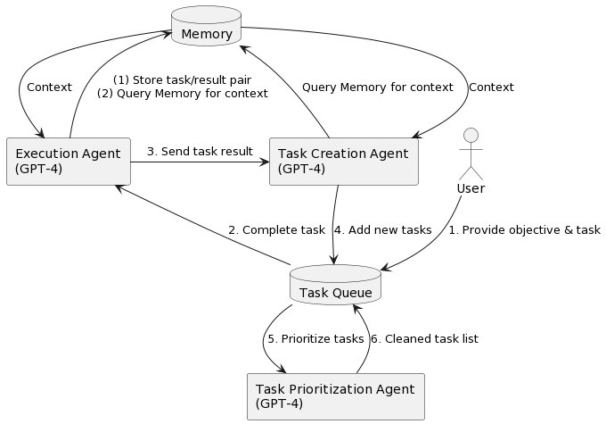

原文:

- https://developer.aliyun.com/article/1480814
- https://developer.aliyun.com/article/1480811
- https://developer.aliyun.com/article/1480809

## 背景

代理（Agent）指能自主感知环境并采取行动实现目标的智能体，即AI作为一个人或一个组织的代表，进行某种特定行为和交易，降低一个人或组织的工作复杂程度，减少工作量和沟通成本。

目前，我们在探索Agent的应用方向，借此机会调研学习了一下现在主流的Agent框架，这篇文章也是我们调研过程的记录。

## 网络热门Agents

截止至今日，开源的Agent应用可以说是百花齐放，文章也是挑选了热度和讨论度较高的19类Agent，基本能覆盖主流的Agent框架，每个类型都做了一个简单的summary、作为一个参考供大家学习。


## Agent基础

Agent的核心决策逻辑是让LLM根据动态变化的环境信息选择执行具体的行动或者对结果作出判断，并影响环境，通过多轮迭代重复执行上述步骤，直到完成目标。

精简的决策流程：P（感知）→ P（规划）→ A（行动）

1. 感知（Perception）是指Agent从环境中收集信息并从中提取相关知识的能力。
2. 规划（Planning）是指Agent为了某一目标而作出的决策过程。
3. 行动（Action）是指基于环境和规划做出的动作。

其中，Policy是 Agent 做出 Action 的核心决策，而行动又通过观察（Observation）成为进一步 Perception 的前提和基础，形成自主地闭环学习过程。


工程实现上可以拆分出四大块核心模块：**推理、记忆、工具、行动**


## 决策模型

目前 Agent 主流的决策模型是 ReAct 框架，也有一些 ReAct 的变种框架，以下是两种框架的对比。

- 传统 ReAct 框架：Reason and Act

  ReAct=少样本prompt + Thought + Action + Observation 。是调用工具、推理和规划时常用的prompt结构，先推理再执行，根据环境来执行具体的action，并给出思考过程Thought。

  

- Plan-and-Execute ReAct

  类BabyAgi的执行流程：一部分Agent通过优化规划和任务执行的流程来完成复杂任务的拆解，将复杂的任务拆解成多个子任务，再依次/批量执行。

  优点是对于解决复杂任务、需要调用多个工具时，也只需要调用三次大模型，而不是每次工具调用都要调大模型。

  

  LLmCompiler：并行执行任务，规划时生成一个DAG图来执行action，可以理解成将多个工具聚合成一个工具执行图，用图的方式执行某一个action

  paper：[https://arxiv.org/abs/2312.04511?ref=blog.langchain.dev](https://arxiv.org/abs/2312.04511?spm=a2c6h.13046898.publish-article.9.2a5e6ffa1kbY5U&ref=blog.langchain.dev)

  

  


## Agent框架

根据框架和实现方式的差异，这里简单将Agent框架分为两大类：Single-Agent和Multi-Agent，分别对应单智能体和多智能体架构，Multi-Agent使用多个智能体来解决更复杂的问题。

### Single-Agent

#### BabyAGI

git：[https://github.com/yoheinakajima/babyagi/blob/main/babyagi.py](https://github.com/yoheinakajima/babyagi/blob/main/babyagi.py?spm=a2c6h.13046898.publish-article.10.2a5e6ffa1kbY5U&file=babyagi.py)

doc：[https://yoheinakajima.com/birth-of-babyagi/](https://yoheinakajima.com/birth-of-babyagi/?spm=a2c6h.13046898.publish-article.11.2a5e6ffa1kbY5U)

babyAGI决策流程：1）根据需求分解任务；2）对任务排列优先级；3）执行任务并整合结果；



亮点：作为早期agent的实践，babyagi框架简单实用，里面的任务优先级排序模块是一个比较独特的feature，后续的agent里大多看不到这个feature。


```
task_creation_agent
你是一个任务创建人工智能，使用执行代理的结果来创建新任务，
其目标如下：{目标}。最近完成的任务的结果是：{结果}。
该结果是基于以下任务描述的：{任务描述}。这些是未完成的任务：
{', '.join(task_list)}。根据结果，创建新的任务以供AI系统完成，
不要与未完成的任务重叠。将任务作为数组返回。

prioritization_agent
你是一个任务优先级人工智能，负责清理和重新优先处理以下任务：
{task_names}。请考虑你的团队的最终目标：{OBJECTIVE}。
不要删除任何任务。将结果作为编号列表返回，例如：
#. 第一个任务
#. 第二个任务
以编号 {next_task_id} 开始任务列表。

execution_agent
您是一款基于以下目标执行任务的人工智能：{objective}。
考虑到这些先前已完成的任务：{context}。
您的任务：{task}
响应：
```

#### AutoGPT

git：[https://github.com/Significant-Gravitas/AutoGPT](https://github.com/Significant-Gravitas/AutoGPT?spm=a2c6h.13046898.publish-article.12.2a5e6ffa1kbY5U)

AutoGPT 定位类似个人助理，帮助用户完成指定的任务，如调研某个课题。AutoGPT比较强调对外部工具的使用，如搜索引擎、页面浏览等。

同样，作为早期agent，autoGPT**麻雀虽小五脏俱全**，虽然也有很多缺点，比如无法控制迭代次数、工具有限。但是后续的模仿者非常多，基于此演变出了非常多的框架。


```
You are {{ai-name}}, {{user-provided AI bot description}}.
Your decisions must always be made independently without seeking user assistance. Play to your strengths as an LLM and pursue simple strategies with no legal complications.

GOALS:

1. {{user-provided goal 1}}
2. {{user-provided goal 2}}
3. ...
4. ...
5. ...

Constraints:
1. ~4000 word limit for short term memory. Your short term memory is short, so immediately save important information to files.
2. If you are unsure how you previously did something or want to recall past events, thinking about similar events will help you remember.
3. No user assistance
4. Exclusively use the commands listed in double quotes e.g. "command name"
5. Use subprocesses for commands that will not terminate within a few minutes

Commands:
1. Google Search: "google", args: "input": "<search>"
2. Browse Website: "browse_website", args: "url": "<url>", "question": "<what_you_want_to_find_on_website>"
3. Start GPT Agent: "start_agent", args: "name": "<name>", "task": "<short_task_desc>", "prompt": "<prompt>"
4. Message GPT Agent: "message_agent", args: "key": "<key>", "message": "<message>"
5. List GPT Agents: "list_agents", args:
6. Delete GPT Agent: "delete_agent", args: "key": "<key>"
7. Clone Repository: "clone_repository", args: "repository_url": "<url>", "clone_path": "<directory>"
8. Write to file: "write_to_file", args: "file": "<file>", "text": "<text>"
9. Read file: "read_file", args: "file": "<file>"
10. Append to file: "append_to_file", args: "file": "<file>", "text": "<text>"
11. Delete file: "delete_file", args: "file": "<file>"
12. Search Files: "search_files", args: "directory": "<directory>"
13. Analyze Code: "analyze_code", args: "code": "<full_code_string>"
14. Get Improved Code: "improve_code", args: "suggestions": "<list_of_suggestions>", "code": "<full_code_string>"
15. Write Tests: "write_tests", args: "code": "<full_code_string>", "focus": "<list_of_focus_areas>"
16. Execute Python File: "execute_python_file", args: "file": "<file>"
17. Generate Image: "generate_image", args: "prompt": "<prompt>"
18. Send Tweet: "send_tweet", args: "text": "<text>"
19. Do Nothing: "do_nothing", args:
20. Task Complete (Shutdown): "task_complete", args: "reason": "<reason>"

Resources:
1. Internet access for searches and information gathering.
2. Long Term memory management.
3. GPT-3.5 powered Agents for delegation of simple tasks.
4. File output.

Performance Evaluation:
1. Continuously review and analyze your actions to ensure you are performing to the best of your abilities.
2. Constructively self-criticize your big-picture behavior constantly.
3. Reflect on past decisions and strategies to refine your approach.
4. Every command has a cost, so be smart and efficient. Aim to complete tasks in the least number of steps.

You should only respond in JSON format as described below
Response Format:
{
    "thoughts": {
        "text": "thought",
        "reasoning": "reasoning",
        "plan": "- short bulleted\n- list that conveys\n- long-term plan",
        "criticism": "constructive self-criticism",
        "speak": "thoughts summary to say to user"
    },
    "command": {
        "name": "command name",
        "args": {
            "arg name": "value"
        }
    }
}
Ensure the response can be parsed by Python json.loads
```

#### HuggingGPT

git: [https://github.com/microsoft/JARVIS](https://github.com/microsoft/JARVIS?spm=a2c6h.13046898.publish-article.13.2a5e6ffa1kbY5U)

paper: [https://arxiv.org/abs/2303.17580](https://arxiv.org/abs/2303.17580?spm=a2c6h.13046898.publish-article.14.2a5e6ffa1kbY5U&file=2303.17580)

HuggingGPT的任务分为四个部分：

1. 任务规划：将任务规划成不同的步骤，这一步比较容易理解。
2. 模型选择：在一个任务中，可能需要调用不同的模型来完成。例如，在写作任务中，首先写一句话，然后希望模型能够帮助补充文本，接着希望生成一个图片。这涉及到调用到不同的模型。
3. 执行任务：根据任务的不同选择不同的模型进行执行。
4. 响应汇总和反馈：将执行的结果反馈给用户。


**HuggingGPT的亮点**：HuggingGPT与AutoGPT的不同之处在于，它可以调用HuggingFace上不同的模型来完成更复杂的任务，从而提高了每个任务的精确度和准确率。然而，总体成本并没有降低太多。

#### GPT-Engineer

git: https://github.com/AntonOsika/gpt-engineer

基于langchain开发，单一的工程师agent，解决编码场景的问题。目的是创建一个完整的代码仓库，在需要时要求用户额外输入补充信息。

**亮点：code-copilot的自动化升级版**


```
You almost always put different classes in different files.
For Python, you always create an appropriate requirements.txt file.
For NodeJS, you always create an appropriate package.json file.
You always add a comment briefly describing the purpose of the function definition.
You try to add comments explaining very complex bits of logic.
You always follow the best practices for the requested languages in terms of describing the code written as a defined
package/project.


Python toolbelt preferences:
- pytest
- dataclasses
```

```
[
  {"role": "system",
    "content": "You will read instructions and not carry them out, only seek to clarify them.\nSpecifically you will first summarise a list of super short bullets of areas that need clarification.\nThen you will pick one clarifying question, and wait for an answer from the user.\n"
  },
  {"role": "user",
    "content": "We are writing {{a Super Mario game in python. MVC components split in separate files. Keyboard control.}}\n"
  },
  {"role": "assistant",
    "content": "Summary of areas that need clarification:\n1. Specifics of the Super Mario game (e.g. level design, characters, gameplay mechanics)\n2. Details about the MVC components (e.g. which components are in each file)\n3. Keyboard control implementation (e.g. which keys to use, how to handle input)\n\nClarifying question:\nCan you provide more details about the Super Mario game, such as level design, characters, and gameplay mechanics?"
  },
  {"role": "user",
    "content": "{{There are 10 levels in total. The main character is a plumber named Mario, who can walk and jump. It is a classical platform game just like Super Mario. The main character moves from left to right, trying to get to the destination, where there are many obstacles and attacks from enemies in the process.}}\n\nIs anything else unclear? If yes, only answer in the form:\n{remaining unclear areas} remaining questions.\n{Next question}\nIf everything is sufficiently clear, only answer \"Nothing more to clarify.\"."
  },
  {"role": "assistant",
    "content": "Remaining unclear areas: 2 remaining questions.\nCan you provide more information about how the MVC components are split into separate files?"
  },
  {"role": "user",
    "content": "{{Make your own assumptions and state them explicitly before starting}}"
  }
]
```

运行效果：


#### Samantha


git: https://github.com/BRlkl/AGI-Samanthatw: https://twitter.com/Schindler___/status/1745986132737769573灵感来源于电影her，核心推理逻辑是反思+观察，基于GPT4-V不断从环境中获取图像和语音信息，会自主发起提问。

AGI-Samantha特点：1、动态语音交流：Samantha能够根据上下文和自身思考自主决定何时进行交流。2、实时视觉能力：它能够理解并反应视觉信息，比如图像或视频中的内容。它能够根据这些视觉信息做出反应。例如，如果看到某个物体或场景，它可以根据这些信息进行交流或采取行动。尽管Samantha并不总是直接使用视觉信息，这些信息仍然持续影响它的思考和行为。这意味着即使在不直接谈论或处理视觉信息的情况下，这些信息也会在背后影响它的决策和行动方式。3、外部分类记忆：Samantha拥有一种特殊的记忆系统，能够根据情境动态写入和读取最相关的信息。4、持续进化：它存储的经验会影响其自身的行为，如个性、语言频率和风格。
AGI-Samantha由多个特定目的的大语言模型（LLM）组成，每个模型称为一个“模块”。主要模块包括：思考、意识、潜意识、回答、记忆读取、记忆写入、记忆选择和视觉。这些模块通过内部循环和协调模仿人类大脑的工作流程。让Samantha能够接收并处理视觉和听觉信息，然后做出相应的反应。简而言之，AGI-Samantha是一种努力模仿人类思维和行为的高级人工智能系统。**亮点：**结合视觉信息来辅助决策，优化了记忆模块，感兴趣可以fork代码本地跑着玩一玩。

- AppAgent


doc：https://appagent-official.github.io/git：https://github.com/X-PLUG/MobileAgent基于ground-dino以及gpt view模型做多模态处理的Agent。**亮点**：基于视觉/多模态appagent，os级别的agent，可以完成系统级别的操作，直接操控多个app。由于需要系统级权限、只支持了安卓。


- OS-Copilot


git：https://github.com/OS-Copilot/FRIDAY

doc：https://os-copilot.github.io/

OS级别的Agent，FRIDAY能够从图片、视频或者文本中学习，并且能够执行一系列的计算机任务，比如在Excel中绘图，或者创建一个网站。最重要的是，FRIDAY能够通过做任务来学习新的技能，就像人类一样，通过不断的尝试和练习变得更擅长。

**亮点:**自我学习改进，学习如何更有效地使用软件应用、执行特定任务的最佳实践等。


