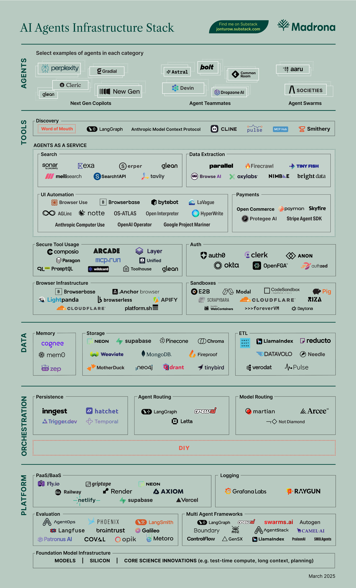
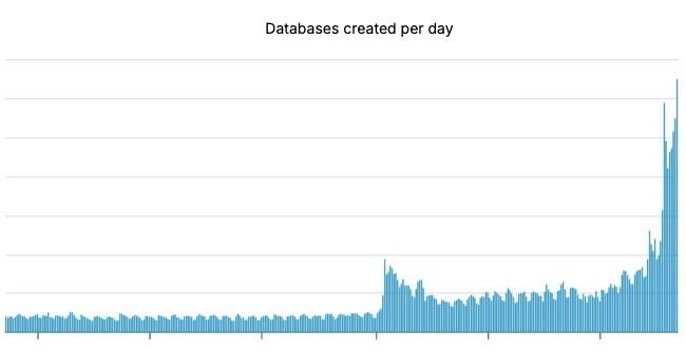
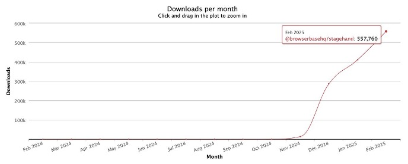

原文地址： https://www.madrona.com/ai-agent-infrastructure-three-layers-tools-data-orchestration/

--------------

想象一下，一家初创公司的 20 人团队可以在不到两年内产生 1 亿美元的年度经常性收入。这不是一个未来主义的幻想-这是人工智能驱动的增长正在展开的现实。Cursor、Bolt、Lovable 和 Mercor 等公司正在打破传统的规模规则，证明配备智能代理的精益团队可以颠覆整个行业。

这揭示了创业动态的转变。创始人不再受员工人数或传统开发周期的限制。随着人工智能代理从早期的成功转变为现代软件的基础部分，它们正在推动基础设施需求的转变。

这种转变遵循一种熟悉的模式：随着新应用程序的出现，它们会突破现有基础设施的极限，从而产生对新功能的需求。反过来，基础设施的进步释放了更强大的应用程序，推动了下一波创新。人工智能代理也不例外--它们的快速采用正在重塑软件的构建方式和支持软件的基础设施。对于创始人来说，这提供了一个巨大的机会：构建人工智能原生基础设施--涵盖工具、数据和编排--这将为下一波智能应用提供动力。

在这个新时代，每位创始人都面临着一个关键的选择：适应人工智能的变革力量，否则就有落后的风险。代理采用率的激增不仅仅是一种趋势，而且是对软件构建、部署和扩展方式的根本性重新构想。

## 从效率到基础设施：更深层次的信号

这不仅仅是高效增长的问题--这一转变标志着更深层次的东西。随着成功的代理应用程序的清晰模式出现在人们的视野中，创始人们正急于接受和扩展有效的模式。代理采用的激增对支持这些应用程序的基础架构层提出了新的要求。

自 2024 年 6 月我们撰写[《 人工智能代理基础设施的兴起 》](https://www.madrona.com/the-rise-of-ai-agent-infrastructure/)以来，我们一直在跟踪这一演变。当时，景观是稀疏的，由 DIY 解决方案主导，因为开发人员优先考虑灵活性，以尝试不同的方法。有一大批新公司正在为未来的代理商状态构建基础设施，但这些公司面临着一个不断变化的目标。今天，这一情况发生了巨大变化。

证据无处不在：无服务器 Postgres 提供商 Neon 报告称，人工智能代理现在正在其平台上创建数据库，其速度是人类开发人员的 4 倍以上，从而加速了 Neon 的整体指标：

像 Browserbase 这样的专业 AI 代理基础设施组件也在加速。例如，Browserbase 的 Stagehand UI 自动化库最近每月的 npm 安装量超过了 50 万。

这些不仅仅是增长指标--它们是软件构建和部署方式发生根本性转变的信号。

这种转变为代理应用程序和支持它们的基础设施提供了机会。与“当市场地图出现时，为时已晚”的古老格言相反，我们看到2025年成立的公司已经在这个领域获得了巨大的吸引力。基础能力和模式的发展如此之快，以至于新进入者能够迅速确定和满足新出现的需求。

## 从实验到清晰的模式

一年前，代理开发的特点是广泛的实验。开发人员基本上从头开始构建，在寻找获胜方法时优先考虑灵活性以实现重点转移。今天，情况发生了巨大变化。已经出现了多种可重复的模式，聪明的创始人正急于接受和扩展有效的模式。

这些模式建立在我们在 1 月份对代理格局的分析中所确定的基础上，展示了一组常见的代理模式是如何进入视野的： 下一代副驾驶是上下文感知的助手，可以主动帮助完成复杂的任务，例如 Bolt.new，AirOps 和 Colimit。拉文纳、Sailplane 和 Basepilot 等队友代理通过自动驾驶多步工作流程向前迈进了一步。 代理组织引入了多个专门代理一起工作的协作系统，如 Aaru 的概率模拟所示。下一个类别， 代理即服务 ，提供专门的代理功能作为面向开发人员的服务，而不是面向用户的产品。

所有这些都对上图所示的基础设施堆栈有影响。

## 基础架构堆栈出现：三个定义层

随着代理模式的固化，AI 代理基础设施堆栈的三个层已经成为特别定义：工具，数据和演示。每一层都面临着激烈的竞争，因为提供商竞相解决与传统 SaaS 基础设施根本不同的代理特定挑战。

### 工具层：使代理具有能力

工具层的扩展最为显著，反映了代理交互的日益复杂。主要战场包括：

#### 浏览器基础设施和 UI 自动化

代理越来越需要与可视化 Web 交互-而不仅仅是 API。像 Browserbase、Lightpanda 和 Browserless 这样的公司正在构建基础设施来实现这一点，而像 Stagehand 这样的专业服务则为常见模式提供更高级别的抽象。

#### 身份验证和安全

当代理代表用户进行操作时，身份验证和安全性就有了新的意义。像 Clerk、Anon 和 Statics.ai 这样的公司正在开创“auth for agents”--以代理本地的方式管理权限、凭证和安全性。

#### 工具发现和集成

正如 Akash Bajwa 最近评论的那样 ，Anthropic 的模型上下文协议（MCP）正在成为一种潜在的“人工智能代理的 TCP/IP”，为代理提供标准化的方法来发现和与工具交互，同时维护上下文。Stripe、Neo 4j 和 Cloudflare 等主要参与者已经提供 MCP 服务器，这表明这可能成为工具集成的关键标准。

Composio 和 Arcade.dev 等公司正在这些协议之上构建抽象层。Composio 提供对流行应用程序（如 Gmail 和 Linear）的 MCP 兼容访问，通过 TypeScript 和 Python SDK 为开发人员提供标准化接口。同时，Arcade.dev 通过与 OpenAI 规范兼容的统一 API 层简化了身份验证和工具管理。

这种多层方法至关重要，因为它可以满足不同的开发人员需求。基础设施团队可以直接针对 MCP 等协议进行构建，而应用程序开发人员可以利用 Composio 或 Arcade.dev 等托管解决方案。这些方法并不相互排斥;相反，它们可以共存并相互补充，最终加速代理驱动应用程序的采用。

今天，发现代理就绪工具仍然经常依赖于口碑，感觉就像发现 Discord 服务器的早期一样。但是标准化协议和托管集成层的结合表明我们正在向更结构化的发现机制发展。

### 数据层：大规模内存

数据层说明了传统基础设施必须如何为代理工作负载而发展。Neon 的经历很有启发性。如上所述，人工智能代理现在以人类开发人员的 4 倍速度创建 Neon 数据库，推动了对即时配置、自动扩展和隔离环境的新需求。当 Create.xyz 在 Neon 上推出其开发人员代理时，Create 最终在短短 36 小时内创建了 20，000 个新数据库。最终用户只需描述他们想要构建的内容-“构建一个使用 AI 对应用程序进行排名的工作板”或“创建一个自动生成 SEO 元数据的内容管理系统”-代理自动处理所有数据库操作。

数据层专门分为不同的组件，每个组件都有一个独特的功能。 记忆系统 ，如 Mem0 和 Zep，提供特定于代理的上下文，确保代理可以保留和回忆相关信息。 存储解决方案（包括传统数据库（如 Neon）和矢量数据库（如 Pinecone））正在不断发展，以适应代理工作负载的需求。与此同时，ETL 服务正在出现，以处理非结构化数据的处理，从而在代理驱动的系统中实现更高效的数据转换和集成。

### 编排：管理代理复杂性

随着应用程序包含多个一起工作的代理，编排变得至关重要。LangGraph、CrewAI 和 Letta 等托管编排解决方案使开发人员能够组合和管理多个协同工作的代理，简化复杂的工作流程并增强协调。作为这些编排工具的补充，Inngest、Hatchet 和 Temporal 等持久化引擎解决了跨长期运行的代理进程维护状态的挑战，确保了连续性和可靠性。

## 展望未来：桥梁形成

一年前，我们将开发人员描述为“ 快速通过半成品桥梁”， 在支持它们的基础设施仍在建设中的情况下构建代理应用程序。今天，这座桥更完整了，但交通量呈指数级增长，我们仍在增加新的车道。

人工智能代理基础设施的快速发展反映了软件构建方式的根本转变。我们看到的不仅仅是令人瞠目的增长指标。我们正在关注一种新的软件开发范式的出现。

基础设施堆栈正在成熟，以满足这一时刻。从 MCP 这样的标准化协议到用于认证、内存和编排的专门服务，我们看到了将定义下一代应用程序的模式的出现。然而，创新的步伐意味着我们仍处于这一转型的早期阶段。

## 让我们一起建设

我们很高兴分享2025年2月人工智能代理基础设施堆栈的视图。我们的行业继续共同学习-所以请让我们知道我们错过了什么，以及我们如何更准确地反映开发人员的选择。

Madrona 正在积极投资 AI 代理，支持它们的基础设施以及依赖它们的应用程序。我们已经支持了这一领域的多家公司，并将继续这样做。您可以直接访问：jonturow@madrona.com

