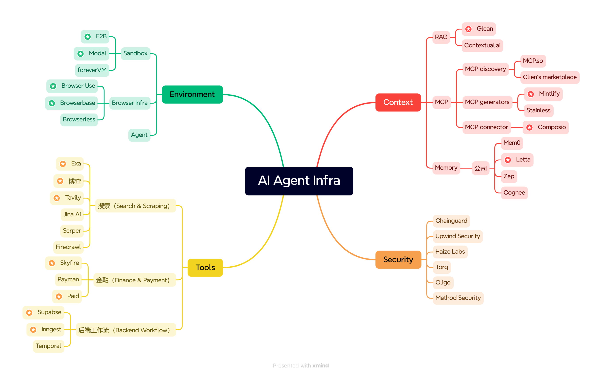

> 原文地址： https://www.bestblogs.dev/article/234f9a

## 摘要

本文从投资视角出发，对新兴的 Agent Infra（Agent 基础设施）领域进行了全面的图谱分析，将其划分为 Environment、Context、Tools 和 Agent Security 四大核心赛道。

详细阐述了每个赛道的价值、关键技术（如 Sandbox、Browser Infra、RAG、MCP、Memory、Search、Payment、Backend Workflow）以及值得关注的初创公司。文章探讨了创业公司在 Agent Infra 领域的两大机会：在现有 Infra 中寻找 AI-native 需求，以及抓住 Agent 开发的新痛点。同时，附录总结了主要云厂商（AWS， Azure， GCP）在这些领域的布局，指出当前云厂商的产品多源自传统 Infra，Agent-native 产品相对缺乏。整体为技术从业者和投资者提供了 Agent Infra 领域的全景视图和潜在方向。

主要内容:

1. Agent Infra 是 Agent 落地的关键，涵盖开发到部署全生命周期。 

   Agent Infra 是 Agent 从概念走向实际应用不可或缺的支撑体系，提供 Agent 执行任务所需的计算环境、信息、工具和安全保障。

2. Environment 和 Context 是 Agent Infra 的核心赛道。 

   Environment 为 Agent 提供运行容器（Agent-native computer），Context 为 Agent 提供记忆和知识，是 Agent 有效规划和行动的基础。

3. Tools 层正快速扩展，搜索和金融工具尤为值得关注。 

   Agent 需调用各类工具完成任务，特别是搜索和支付，Agent 经济出现新商业模式，需要专属支付工具和交易网络。

4. Agent Security 机会需待 Agent 生态成熟后涌现。 

   Agent 安全需从静态权限转为动态意图分析，但 AI-native 安全 Infra 是需求驱动，尚处早期，老牌安全厂商主导。

5. 创业公司机会在于寻找 AI-native 需求和抓住新痛点。 

   创业公司可在现有 Infra 中寻找 Agent 特有的高性能需求，或开发易用性高、降低开发门槛的新 Infra 产品。

----

作者：Lai、bryan、haozhen

编辑：penny

2025 年以来，Agent 开发量和使用量都有明显提高。Agent 的爆发带来了 Agent Infra 需求的爆发。在过去 1-2 年，Agent 开发大多依赖开发者手动使用传统 Infra 搭建，开发工程量大、流程复杂，但随着越来越多 Agent-native Infra 涌现，Agent 开发的难度和周期都在缩小，开发的范式正在重构和收敛。

我们之前已经研究了 Browserbase 、E2B 等公司，本文是我们对于 Agent Infra 领域图景更全面的 Mapping。我们划分出了 Environment、Context、Tools、Agent Security 这四大赛道，逐步分析每个环节的价值和值得关注的初创公司：

• Environment 的作用是给 Agent 执行任务提供容器，是一个 Agent-native computer；

• Context 层是在 Agent 工作中赋予记忆 Memory 和领域知识的重要中间层；

• Tools 由于 MCP 协议的统一而百花齐放，同时目前 Tools 的核心用户还是开发者，普通用户的使用门槛太高；

• Agent Security 是在 Agent 产品范式固定之后会涌现的大机会，需要同时确保避免 Agent 受攻击和发起攻击。

目前 Agent Infra 是模型公司、云厂商、初创公司都在积极拓展的领域，我们认为创业公司的机会在于：1）在已有 Infra 中寻找真正 Agent-native 的需求，使 Agent 开发者开发出效果更好的产品，比如 Browserbase 对传统 headless browser 做了这样的迭代；2）抓住 Agent 开发中的新痛点，例如 MCP 领域现在缺乏一个好的 marketplace 和 selector，帮助 Agent 去选择对的工具。

## 概述

Agent Infra 是 Agent 落地的关键，涵盖了 Agent 从开发到部署的完整生命周期。我们对这个领域进行了初步扫描后，按重要性划分出了四大赛道，分别是 Environment、Context、Tools 和 Security，并进一步拆解了我们看好的细分领域的 thesis 和初创公司。

Environment 指的是 Agent 可操作的容器，相当于给了 Agent 一台可自行操作的计算机，Agent 可以在其中端到端地完成任务，这个赛道包括 Sandbox、Browser Infra、Agent 操作系统等不同的细分领域，我们看好其中的 Sandbox 和 Browser Infra。

Context 为 Agent 有效运行提供所需的信息，这个信息既包括任务相关的背景知识，也包含各类工具的使用方法。有了这些信息，Agent 才能在特定任务场景中，合理判断应以哪种顺序调用哪些工具，才能更有效地完成任务。我们将主要分析这个赛道中的 RAG、MCP 和 Memory。

Tools 相关的 Infra 使 Agent 能够便捷调用各类工具，实现搜索、UI 设计、数据访问、支付等多样化的任务。随着 Agent 交互复杂度的持续上升，工具层正迅速扩展。搜索（Search & Scraping）、金融（Finance & Payment）、后端工作流（Backend Workflow）这三类工具，尤为值得重点关注。

Security Infra 以 Agent-native 的方式保障 Agent 的行为与数据在执行过程中的安全与合规。随着 Agent 能力边界的不断拓展，市场对 Agent 安全性的要求也在同步提高。然而，这一环节的 AI-native Infra 机会需要在 Agent 生态更为完善后才能出现更清晰的格局。

除了上述赛道和公司之外，Agent Infra 领域还在不断涌现更为成熟的解决方案。**Infra 是模型公司、云厂商、初创公司都在积极拓展的领域，我们认为创业公司的机会主要有两类：**

**1****. 在已有 Infra 中寻找有 AI-native 需求的环节。**这种需求可以是 Agent 开发对该环节的某些性能提出了更高的要求，例如 Sandbox 需要更快冷启动速度、更强的隔离性；这种需求也可以是需要和 AI workflow 结合的更好，有更多 AI-native 的功能点，例如增加 RAG 功能，或者和某些 AI 开发者常用的语言或 SDK 有更好的结合。

**2. 抓住 Agent 开发中的新痛点**。Agent 开发要追求 R&D 和时间投入的 ROI，对降低开发门槛和工程量的 Infra 产品有较大需求，因此一套易用性高且价格合理的 Infra 就有机会被广泛采用。而且 Agent 生态是一个强调共建的生态系统，而 Infra 的持续创新，正在大力推动这种生态的构建。

## 投资主题 1：Environment

Environment 提供 Agent 开发和行动的容器，相当于给了 Agent 一台可自行操作的计算机，Agent 可以在虚拟环境中端到端地完成任务，训练并探索新能力。我们将主要分析这个赛道中的沙盒（Sandbox）和 Browser Infra。

### Sandbox：为 Agent 创造理想的虚拟机环境

Sandbox 是一种安全机制，为执行中的程序提供隔离环境，即为 Agent 提供了一个可以隔离运行的虚拟机环境，开发者可以在这个环境中实现 Agent 的开发、部署、运行。但随着 Agent 的不断发展，传统的虚拟机并不能很好地满足 Agent 需求，原因在于：

1. Agent 对虚拟机的性能提出了**更高的要求，比如需要更高的隔离性、更快的启动速度、更强的稳定性；**

2. Agent 的虚拟机**还要求具备一定的 AI 性能**，例如需要具备代码解释器（code interpretor）的功能，或需要整合开发者常用的 AI 架构，如 Vercel AI SDK。

因此我们判断 Sandbox 存在初创公司的机会，比如 E2B 提供了更 AI-native、更快启动的 microVM ，获得了 Perplexity、Hugging Face 等头部 AI 企业的认可；Modal 则提供了更 Cloud-native、更可规模化的虚拟机，可以更好地满足 Agent 开发需求。

注：🌟 代表值得重点关注的公司

### Browser Infra: 使 Agent 更好地适应浏览器环境

在如今的人类社会中，大部分的信息都存在于互联网浏览器中，大部分的生产力工作也都能在浏览器环境中完成。因此，我们判断浏览器环境将是 Agent 最重要的工作环境之一，浏览并操纵网页的能力也将成为 Agent 的核心能力之一，而 Browser Infra 正赋予了 Agent 这种能力。

具体来看，Browser Infra 大致可以分为两类：

1. 第一类 Infra 让 Agent 可以大规模浏览网页，比如 Agent 能在云端同时浏览不同网页来获取所需信息；
2. 第二类 Infra 使得 Agent 可以操纵网页，比如 Agent 能灵活地进行加载、选择、点击等网页端的操作。

对于第一类 Infra 而言，传统的解决方案是利用 Puppeteer、Playwright 等 browser 库进行开发，优势是能获得更高的定制化程度，对产品的控制力更强，价格也更便宜，但是劣势在于需要强大的工程团队和大量开发时间，且构建出的产品比较臃肿。

因此当下的 Agent 开发正在逐步采用更 AI-native 的 Browser Infra，希望能用易用性更高的产品来实现 Agent 的快速搭建和发布，这一领域的代表公司是 Browserbase。在访谈中，我们发现开发者看重 Browser Infra 的因素包括带宽、价格、速度等，而 Browserbase 正是在这几个维度达到了一个高性能的平衡，因此获得了开发者青睐。

第二类 Infra 能够赋予 Agent 更强的理解浏览器内容的能力，相比直接简单调用 API，Agent 能够像人一样更深入的进行网页操作。我们认为这是一块更新兴、更 Agent-native 的 Infra 机会，Browser Use 这家公司尤其值得关注，这也是 Manus 在使用的 Browser Infra，在 Manus 问世之后进一步走红。

注：🌟 代表值得重点关注的公司

## 投资主题 2：Context

丰富的上下文信息是 Agent 有效规划和行动的基础。基于文本 Context，Agent 可以更好地理解任务的背景，实现更具体的特定任务；基于工具 Context，Agent 也能够更好地理解工具的用法和用途，从而决定使用哪些工具，以哪种顺序调用工具，如何将工具整合在一起来完成任务。我们将主要分析这个赛道中的 RAG、MCP 和 Memory。

### RAG: 为 Agent 提供具体的 Context

RAG（Retrieval-Augmented Generation），即检索增强生成，这是一种结合了信息检索与生成式 AI 的技术架构，广泛用于提升 LLM 在问答、文档摘要等任务中的准确性与时效性。如今 Agentic RAG 系统能够持续分析 Context 和用户意图，自主从多种来源（包括实时数据流和外部 API）检索并整合相关信息，使得 Agent 可以更好完成任务。

RAG 的提出时间较早，目前基本已成为一种共识性的技术，并在各类应用场景广泛使用，相关的头部创业公司也发展得较成熟，比如专注企业内部数据 RAG 搜索的 Glean 已经获得了包括 Reddit、Duolingo、Bookings 在内的一众企业的认可，最新估值已接近 70 亿美元。

注：🌟 代表值得重点关注的公司

### MCP: 提供标准化的工具和数据接口

MCP 是 Anthropic 在去年 11 月发布的一个开放式协议，重新定义了 Agent 调用外部工具、获取数据以及与各类服务交互的方式。如今 MCP 已成为 Context 的一大标准化解决方案，相关生态也在不断发展。

目前 MCP 相关的 Infra 创业机会还处在相对早期的阶段，在一些业务逻辑互通的细分赛道，已有公司在原先业务基础上拓展至 MCP 相关的产品。例如：

- Mintlify 可以用客户已有的 Documentation 或 OpenAPI spec 直接做出 MCP Server，不需要额外的代码；

- Stainless 可以在 SDK 生成的基础上增加了 MCP Server generator，同样简化了 MCP server 的构建过程；

- Composio 也在集成主流 Agent 工具的基础上新增了 MCP connector 产品，托管了 100 多个的 MCP Server，内置身份验证，让 Agent 可以简化繁琐的逐一设置并连接 MCP 的过程。

此外，还有一类做 MCP marketplace 的公司，集合各细分领域的 MCP Server 供 Agent 开发者进行选择和使用。自从 MCP 发布以来，MCP Server 数量在快速增长，MCP.so 里的 MCP Server 数量已经高达 1.3w+。

**但是我们认为单纯做 marketplace 的价值较薄，最重要的价值是为 Agent 评估和编排 MCP server 的使用，这类工作和价值量可能会集成在 Agent 开发端。**

注：🌟 代表值得重点关注的公司

### Memory: 赋予 Agent 特定的记忆力

Memory 是构建复杂 Agent 的关键基础。如果仅依赖 LLM 自带的有限上下文窗口作为短期记忆，Agent 将在跨会话中处于 stateless 的状态，难以维持连贯性。同时，缺乏长期记忆机制也限制了 Agent 自主管理和执行持续性任务的能力。引入额外的 Memory 可以让 Agent 做到存储、检索，并利用历史交互与经验，从而实现更智能和持续的行为。

Agent 的 Memory 包括短期记忆（STM，存储单次交互信息）、长期记忆（LTM，可以横跨多次交互信息以实现个性化）和程序记忆（指导 Agent 行为的规则）等。Memory 给 Agent 赋予了特定的记忆力，本质一种提升 Agent 智能性的方式，Agent 能凭此有更高的个性化程度和一致性表现，也能在多步骤或长周期的复杂任务中提升准确性。

一些创业公司通过提供外部数据库的方案为 Agent 构建 Memory，例如 Mem0 采用混合数据库系统从交互中提取并存储关键信息，Zep 则运用时序知识图谱追踪动态变化的用户数据、提升个性化能力。

与此同时，模型公司也在不断优化模型本身的 Memory layer，比如一些开源模型通过引入额外的、可训练的"记忆槽"，使模型具备一定的记忆存储能力。相比其他领域，创业公司在 Memory 的机会边界相对没有那么清晰。

注：🌟 代表值得重点关注的公司

### Case study - Letta

Letta 成立于 2024 年，专注于构建具备长期记忆能力的 stateful AI Agent 平台，由伯克利实验室孵化而来，团队研究背景非常强。Letta 整合了可视化开发环境（ADE）、生产级 API 及服务器运行时系统，ADE 可实时查看 Agent 记忆生成、管理的轨迹，Letta 还可以通过 context 管理，来实现 Agent 状态持久化，使 Agent 具备持续学习进化的能力。

近期，Letta 团队发布了一个关于 "Sleep time compute"的有趣研究，进一步说明了 Memory 在提升 Agent 性能上具有重要作用。该研究的主要想法是**让 AI 充分利用不与用户交互的时间（即 sleep-time），来预先处理 Context 信息，并提前完成推理**，将 raw context 处理为 learned context，这样可以在实际应答时，减少即时推理的计算负担，最终达到提高推理质量的效果。

Agent 有大量的 Sleep-time

AI 可以在 Sleep-time 完成对 Context 预处理

## 投资主题 3：Tools

在完成搜索、数据提取、支付等各种任务的时候，Agent 需要调用各种工具，这个领域的玩家价值在于给开发者提供了可直接调用、无需自建的 Infra。随着 Agent 交互复杂度的不断提升，工具层正在快速扩张，OpenAI 判断 Agent 可调用的工具数量将会在几个月内从目前的 10 个量级 Scale 到 100 个量级。我们将主要介绍搜索（Search & Scraping）、金融（Finance & Payment）、后端工作流（Backend Workflow）这三个方面的工具。

### Search & Scraping: 赋予 Agent 搜索能力

搜索是 Agent 获取外部信息的重要途径，我们认为 Agent 搜索领域的机会非常大，原因在于：

1. 相比人类，Agent 会进行更频繁、更复杂的搜索，Agent 在完成单一任务的时候往往就需进行数十次搜索，随着多步骤任务的推进以及 multi Agent 的发展，未来 Agent 的搜索量将远超人类。

2. 传统搜索引擎无法满足 Agent 的搜索需求，Agent 需要更 AI-native 的搜索工具。传统的搜索引擎基于关键词进行检索，常返回"SEO 垃圾"，而 Agent 搜索更侧重理解而非匹配，因此 Agent 搜索在 context 的理解、搜索的全面性和准确性上都提出了更高的要求。

由于 Google 等搜索巨头不愿完全开放 API，再加上当今的搜索引擎构建成本已从数亿美元降至数千万美元，我们判断 Agent 搜索领域存在以下三个创业公司的机会：

1. 为海量 Agent 搜索提供足够快速且廉价的解决方案，如 Serper 和博查提供了价格远低于 Bing 的搜索 API，获得了希望自行处理海量原始信息的 Agent 开发者的青睐；

2. 给 Agent 提供更智能的搜索， 如 Exa 实现了更复杂的语义搜索，能提供更优质的检索结果；

3. 为 Agent 提供智能的爬虫架构， 如 Firecrawl 提供了开源的数据抓取框架，增强了 Agent 获取网页信息的能力。

目前看来，第一类创业机会的价值点最清晰，许多开发者非常看重搜索信息的全面性和 API 价格，希望自己能够在 Agent 产品中完成信息筛选，从这个角度来看 Search API 有 commoditize 的趋势。

注：🌟 代表值得重点关注的公司

### Finance & Payment: 让 Agent 能交易和货币化

Agent 在金融领域的应用也值得关注，我们判断随着 Agent 能力的发展，Agent 会成为金融领域重要的主体，虽然当前 timing 还相对偏早，但这一领域可能会有 Visa 或 Stripe 级别的大机会。

我们认为 Agent 需要专属支付工具与交易网络。在当下，完成一个复杂任务通常会涉及到调用付费内容或工具，因此 Agent 需要具备支付能力。而当 Agent 被调用并完成任务时，也应当能像人一样"赚取"报酬。比如 Skyfire 就在利用区块链技术为 Agent 提供身份认证、交易和变现服务，使得 Agent 能够真正成为经济社会的生产主体。

Skyfire 让 Agent 具备支付和收款能力

例子：AI Agent 使用 Skyfire 进行自动化支付

Agent 经济也会出现新的商业模式与变现方式。当前大多数 Agent 是按 seat 或是任务次数收费，未充分将 Agent 工作的价值变现。我们判断 Agent 的计费方式会逐步变为按照任务过程和结果付费。复杂的 Agent 网络也可能共同完成任务，未来可能需要构建一套适用于 Agent 的智能合约，为 Agent 自动化分配经济利益。

例如，Sequoia 近期投资的 Paid 这家公司就是根据每个 Agent 的实际产出来定价、最大化 Agent 收益，并能够管理 Agent 的毛利、为客户量化 Agent 的 ROI 等，希望重构一套 Agent 时代的货币化机制。

注：🌟 代表值得重点关注的公司

### Backend Workflow: 简化 Agent 后端开发

除了上述工具之外，还有一类工具的作用在于简化 Agent 后端开发，目的是在数据库搭建、任务自动化、工作流编排等方面降低 Agent 开发难度。这类解决方案往往是在服务大企业开发场景的基础上，凭借易用性或 LLM-native 的特性吸引到新一代的 AI 开发者。例如：

Supabase 提供了 Backend-as-a-service ，被视作“开源版的 Google Firebase 替代方案”。Supabase 将后端工作打包为一站式服务，提供自动 API、用户认证、对象存储、实时订阅、向量数据库等多个功能模块，让开发者可以像用乐高积木一样即插即用地快速搭建后端。随着 vibe coding 爆火，Supabase 已经被 Lovable 、Bolt.new 等 AI coding 产品设置为默认后端，吸引了 200 多万开发者。

Firebase Studio 是 Google 发表的一个基于云端的全栈 AI 开发平台，目的是帮助开发者快速构建、测试和部署生产级应用，整合了 Gemini 大模型、Project IDX 和 Firebase 全家桶服务，提供从原型设计到上线的一站式开发体验。

Inngest 则提供了工作流编排平台，提供 "Zero-Infra" 和 AgentKit，将原先时间长、步骤复杂的 Agent 开发与编排进行了简化。

注：🌟 代表值得重点关注的公司

### 投资主题 4：Agent Security

Security 也是我们认为较关键的 Infra。随着 Agent 能力边界拓展，Agent 安全性上的要求也在同步提升。

当 Agent 代表用户进行各类行动时，我们不仅需要对 Agent 进行身份验证，还需保证 Agent 的每个意图、每个行动都是安全的。随着 Agent 智能性增强，Agent 的安全框架需要从静态的权限控制转变为动态的意图分析。此外，Agent 每次数据交互都需要动态校验，这也对数据安全提出了更高的要求。

目前，Agent 使用的 Security 相关的 Infra 产品以相对老牌的玩家为主。相对老牌的玩家本身在服务大企业的数据和运行安全时就已经积累了完善的 Infra 能力，能够较好地将功能外溢并服务好当前的 Agent。例如 Chainguard 为 Agent 在开发阶段提供安全的基础镜像，Haize Labs 对 AI system 进行压力测试、增强稳健性，Oligo 则为 Agent 提供运行实时监控与异常检测。

**我们认为 Security 这一领域遵循“需求驱动”的逻辑，即先有成熟的下游产品设计，再有对应的安全问题与解决方案。**因此，这一环节的 AI-native Infra 机会需要在 Agent 生态更为完善后才能出现更清晰的格局，当前阶段还是偏早。

## 附录：云厂商在 Agent Infra 的布局

Agent Infra 领域还有一类不容忽视的玩家就是云厂商，云厂商可以提供 Agent 所需的算力资源、部署环境等。为了更好看清 Agent Infra 领域的玩家格局，我们汇总了 AWS、Azure、GCP 这三大云厂商在该领域的布局。

- Environment

​	三大云厂商都陆续推出了自己在 Enviroment 上的产品，但我们认为，目前没有出现 Agent-native 的产品。

- Sandbox

  1. AWS 在 2014 年推出 Amazon S3 Buckets，提供了存储桶和访问控制列表等机制；2020 年又推出了 Amazon EC2 Nitro Enclaves，可以运行敏感代码，确保数据与主系统完全隔离，适用于高安全需求场景。

  2. Azure 发布过一个开源项目 Azure Sandbox，2022 年推出了 Azure Container Apps Sandbox Mode，可以在 Hyper-V 隔离的沙盒中运行不受信任的代码（如 LLM 生成的代码），支持动态会话和代码解释器。

  3. GCP 早在 2008 年就发布了 Google Compute Engine，提供高性能的虚拟机实例，支持多种操作系统和配置；2017 年推出无服务器计算平台 Google Cloud Functions，用户可编写和部署函数代码，无需管理服务器基础设施。

- Browser Infra

  1. AWS 在 2014 年发布了开源框架 Lambda Serverless Chrome，开发者可以部署无头浏览器，实现网页截图、PDF 生成、自动化测试等功能。

  2. Azure 在 2019 年推出了一个无头浏览器控制库 Azure Playwright ，支持的浏览器涵盖 Chrome、Firefox、Safari、Edge 等。

  3. GCP 在 2018 年发布 Google Puppeteer 库，也是一个无头浏览器控制库，可直接控制无头 Chrome，支持网页自动化测试、爬虫等任务。

- Context

​	2023-2024 年，公有云厂商纷纷推出 RAG 相关解决方案，推动了一波尚未上云的企业加速上云。2025 年，公有云厂商开始积极拥抱 MCP，他们不仅有数量庞大的 API 体系，还配备了对应的 CLI 工具，简化了与 MCP 的集成流程。

- RAG

  1. AWS 先后在 2020 年和 2023 年推出了企业级智能搜索 Amazon Kendra 和端到端的 RAG 解决方案 Amazon Bedrock Knowledge Bases。前者为 RAG 应用提供文档检索能力，能够处理大量不同格式的文档，快速找到与用户问题相关的准确答案；后者支持自定义连接器、流式数据摄取，增加了结构化数据检索和知识图谱的功能。

  2. Azure 早在 2014 年就发布了开源数据管道和转换套件 GraphRAG，目的是利用 LLM，从非结构化文本中提取结构化数据；2018 年又推出了 Azure Cognitive Search，可以智能搜索，并与 Azure AI 集成。

  3. GCP 分别于 2023 年和 2025 年推出了 Vertex AI Search 和 Vertex AI RAG Engine。前者是一款完全托管的搜索  API，简化了企业数据源的连接，支持跨数据源搜索，适用于对开箱即用的质量、可扩展性以及细粒度访问控制要求较高的企业场景；后者则是一项托管的编排服务，简化了信息检索、LLM 集成的流程。

- MCP 

  1. AWS 推出了 AWS MCP Server，通过一系列模块化服务器套件，给开发人员提供 AWS 文档、知识库等资源直接访问的能力。

  2. Azure 发布了 Azure MCP Server 和 Playwright-MCP，前者支持访问多种 Azure 服务，包括 Azure Cosmos DB、Azure Storage 和 Azure Monitor 等，功能包括数据库查询、存储管理和日志分析等；后者是一个开源框架，允许 LLMs 通过结构化数据，来与网页交互，实现自动化测试等功能。

  3. GCP 推出了开源 Agent 交互标准 Agent-to-Agent Protocol 和开发套件 Agent Development Kit，前者支持不同框架的 Agent 直接协作，考虑到 MCP 的使用场景是 Agent 与工具交互，A2A 的使用场景是 Agent 之间的通信，A2A 会与 MCP 形成互补格局；后者支持 MCP 工具集成。

- Tools

​	在 Tools 领域，除了 Azure 和 GCP 各自推出了 Search API 之外，三大云厂商也在 Backend Workflow 赛道早早推出了各自的产品，但我们认为，Tools 领域和 Enviroment 领域类似，目前并没有看见 Agent-native 的产品。

- Backend Workflow

1. AWS 在 2016 年就推出了 AWS Step Functions，通过可视化方式编排多个 AWS 服务，支持以状态机的形式定义执行步骤和状态转换，简化了分布式系统的开发与运维管理。

2. Azure 在 2016 年推出 Azure Logic Apps 和 Azure Functions。前者提供可视化设计器和预构建连接器，用于构建和管理自动化工作流；后者则支持多种编程语言的事件驱动计算，可与 Azure 生态中的其他服务无缝协作，适合用于构建无服务器架构的应用程序。

3. GCP 于 2017 年推出了 Google Cloud Functions，这是一个支持多种编程语言的事件驱动型无服务器计算平台，能够响应包括 HTTP 请求、Pub/Sub 消息、Cloud Storage 变更等多种事件类型；2020 年推出了 Google Cloud Workflows，用于编排各类 Google Cloud 服务的自动执行与集成。

## 附录: 公司总结(脑图)

