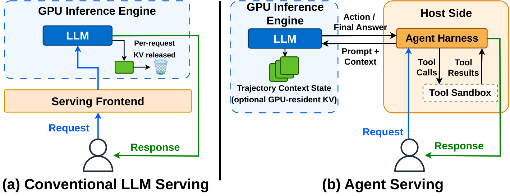
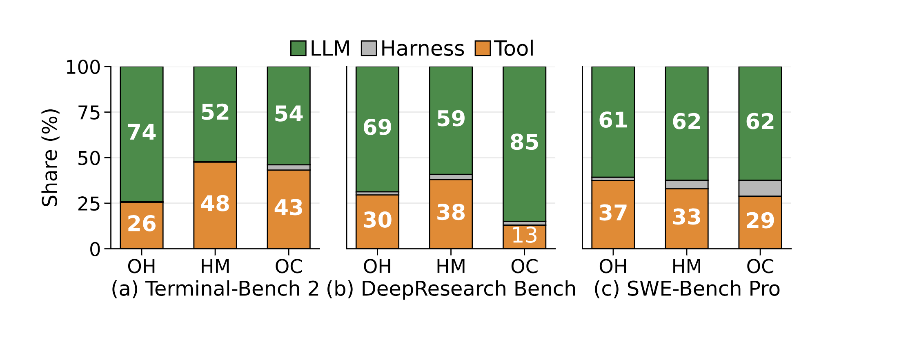
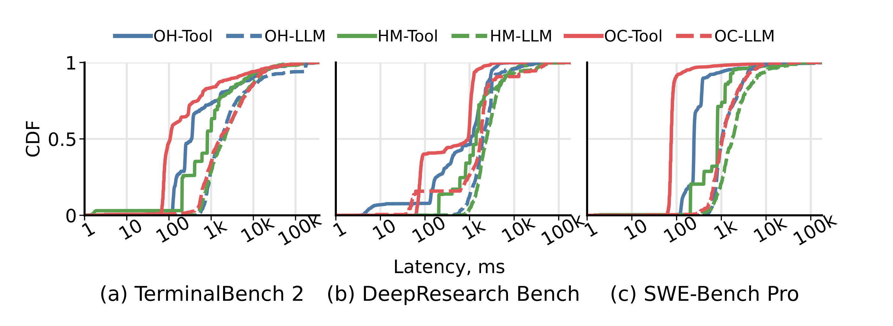
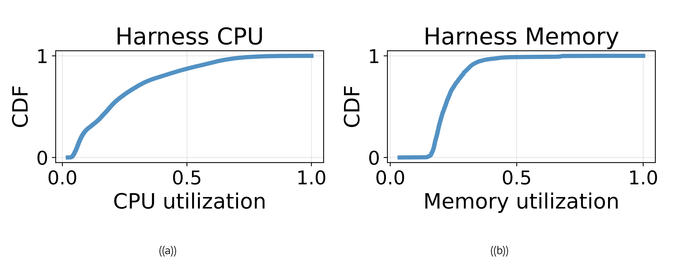
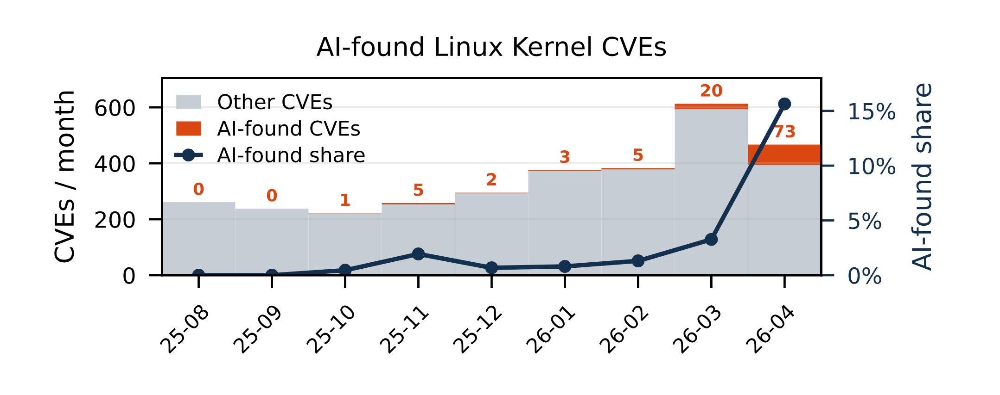
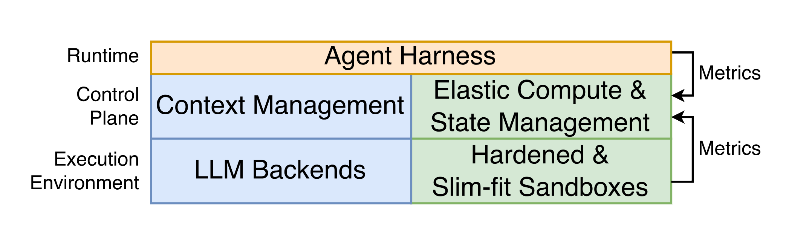

> 内容来源： https://arxiv.org/html/2607.29069v1

Rethinking AI Cloud Infrastructure for Agentic Serving Systems with the Aries Experimentation Framework

## Abstract

Autonomous agents challenge conventional LLM serving by coupling repeated inference with persistent context and sandboxed tool execution. We present Aries, a full-stack experimentation framework that separates task semantics from execution configurations, reconstructs cross-component agent trajectories with correlated system telemetry, and exposes stateful tool execution through a consistent interface across heterogeneous sandbox substrates. We use Aries to conduct reproducible experiments on open agent harnesses and benchmarks. We complement these experiments with production traces from a commercial platform, grounding low-level systems research in observed production behavior. Our results show that (1) token-centric metrics miss non-inference bottlenecks, (2) retaining additional context yields diminishing accuracy benefits while reducing serving capacity, and (3) tool sandboxes alternate between long idle periods and short resource bursts, while current snapshot-based state management makes aggressive suspension costly. A complementary security analysis further highlights the need to reduce the sandbox attack surface. We then discuss the vision for agent-native serving systems designed around trajectory-level metrics, adaptive context management, elastic sandbox resource management, and sandboxes with minimized attack surface.

## 1 Introduction

Large Language Models (LLMs) are rapidly evolving from prompt responders into autonomous agents. Open-source agents such as OpenClaw and Hermes have collectively attracted over half a million GitHub stars within months of their public releases ([OpenClaw Contributors, 2026](https://arxiv.org/html/2607.29069v1#bib.bib43); [Nous Research, 2026](https://arxiv.org/html/2607.29069v1#bib.bib44)), while closed-source commercial agents such as Claude and Codex are used by millions of people ([CryptoBriefing, 2026](https://arxiv.org/html/2607.29069v1#bib.bib50)). An agent places the model inside a feedback loop: it observes the current state, selects an action, executes that action through a tool, and uses the result to decide how the task should continue ([Luo et al., 2025](https://arxiv.org/html/2607.29069v1#bib.bib40); [Luo et al., 2026](https://arxiv.org/html/2607.29069v1#bib.bib19); [Yao et al., 2022](https://arxiv.org/html/2607.29069v1#bib.bib42)). This shifts the system problem from serving isolated model requests to sustaining end-to-end agent trajectories. Agent serving therefore no longer ends when the model emits tokens; each model response is only one step in an execution loop whose progress depends on both generated text and runtime state.

**Agent Serving Goes Beyond Inference.** Like conventional LLM serving, agentic workloads are often hosted in cloud AI infrastructure ([Chen et al., 2025](https://arxiv.org/html/2607.29069v1#bib.bib54); [Luo et al., 2026](https://arxiv.org/html/2607.29069v1#bib.bib19)), but they impose fundamentally different system requirements. Conventional LLM systems optimize individual model calls: scheduling and resource management are focused on producing the next model response efficiently ([Kwon et al., 2023](https://arxiv.org/html/2607.29069v1#bib.bib9); [Zheng et al., 2024](https://arxiv.org/html/2607.29069v1#bib.bib2); [Yu et al., 2022](https://arxiv.org/html/2607.29069v1#bib.bib18); [Zhong et al., 2024](https://arxiv.org/html/2607.29069v1#bib.bib11)). This abstraction works when the surrounding application logic remains outside the serving system. In agent serving, however, each model call is only one step in a task loop. Faster GPU decoding remains useful, but end-to-end progress also depends on retained context, tool execution, and sandbox management. Agent serving therefore requires a holistic, full-stack system design, beyond just fast inference serving.

**Task Progress Needs System Visibility.** Existing evaluation methods capture only part of agent execution. Agent benchmarks measure whether a task reaches the correct outcome ([Padigela et al., 2025](https://arxiv.org/html/2607.29069v1#bib.bib39); [Zhou et al., 2024](https://arxiv.org/html/2607.29069v1#bib.bib8); [Merrill et al., 2026](https://arxiv.org/html/2607.29069v1#bib.bib20); [Liu et al., 2024](https://arxiv.org/html/2607.29069v1#bib.bib26)), whereas system benchmarks typically measure isolated model calls, stateless functions, or task transactions ([Reddi et al., 2020](https://arxiv.org/html/2607.29069v1#bib.bib30); [Ustiugov et al., 2021](https://arxiv.org/html/2607.29069v1#bib.bib33); [Ferdman et al., 2012](https://arxiv.org/html/2607.29069v1#bib.bib31)). Neither of the above connects task progress and correctness to cross-layer runtime behavior, while task–execution entanglement and substrate-dependent tool behavior hinder controlled comparison.

We use the *agent trajectory* as the unit of observation. A trajectory is the ordered record of model invocations, tool interactions, harness decisions, and the final task outcome. Based on this abstraction, we introduce *Aries* , a modular experimentation framework that separates task semantics from execution configuration, reconstructs cross-component trajectories with correlated telemetry, and standardizes tool execution across sandbox substrates, enabling reproducible comparisons and stage-level attribution of stalls and failures. We use Aries to conduct reproducible experiments on open benchmarks and complement them with production traces from a commercial platform (anonymized), thereby grounding low-level systems research in observed production behavior.1

Our experiments reveal limitations that the conventional model-call metrics hide. Harness and tool execution can account for a heavy part of the end-to-end latency (e.g., up to 48%), so LLM-engine token throughput may diverge from task-level execution efficiency. Context retention creates an accuracy–capacity trade-off: controlled sweeps show that avoiding context overflows can raise task success from 55% to 95%, but gains plateau at workload-dependent thresholds, while production traces and controlled telemetry show that retained state reduces serving capacity. Production and controlled measurements also reveal mostly idle-but-bursty tool sandboxes, for which snapshot-based suspension remains economically infeasible. Our security analysis further motivates sandbox designs with minimal attack surfaces. Based on these insights, we discuss the vision for agent-native serving systems that feature trajectory-aware observability, control planes for trajectory context management and for the elasticity of agent-aware sandboxes, and sandbox designs that minimize the attack surface of tool execution.

## 2 Background and Motivation

Figure 1.Overview of conventional LLM-serving and emerging agent-serving systems.

We first discuss the differences between the conventional LLM serving and emerging agentic workloads, and their implications for modern cloud AI infrastructure. We then discuss the existing benchmarking frameworks and why they fall short for systems research in agentic systems.

### 2.1 From Model Requests to Agent Trajectories

Conventional LLM serving systems are organized around the execution of individual model requests. As shown in Fig. [1](https://arxiv.org/html/2607.29069v1#S2.F1)a, the serving runtime processes a prompt, generates output tokens, manages accelerator memory, and returns a response ([Zhong et al., 2024](https://arxiv.org/html/2607.29069v1#bib.bib11); [Yu et al., 2022](https://arxiv.org/html/2607.29069v1#bib.bib18)). Scheduling and memory management are therefore scoped primarily to the active invocation. Depending on the cache policy, the engine may retain, offload, reuse, or reclaim the invocation’s KV-cache state after execution ([Kwon et al., 2023](https://arxiv.org/html/2607.29069v1#bib.bib9); [Pan et al., 2025](https://arxiv.org/html/2607.29069v1#bib.bib5); [Zheng et al., 2024](https://arxiv.org/html/2607.29069v1#bib.bib2); [Qin et al., 2025](https://arxiv.org/html/2607.29069v1#bib.bib3)). This request-centric design naturally prioritizes metrics such as time to first token, time per output token, request latency, and aggregate token throughput ([Kwon et al., 2023](https://arxiv.org/html/2607.29069v1#bib.bib9); [Zhong et al., 2024](https://arxiv.org/html/2607.29069v1#bib.bib11); [Patel et al., 2024](https://arxiv.org/html/2607.29069v1#bib.bib10); [Hu et al., 2024b](https://arxiv.org/html/2607.29069v1#bib.bib12); [Yu et al., 2022](https://arxiv.org/html/2607.29069v1#bib.bib18); [Zheng et al., 2024](https://arxiv.org/html/2607.29069v1#bib.bib2)).

Agent serving departs from this invocation-centric abstraction. As shown in Fig. [1](https://arxiv.org/html/2607.29069v1#S2.F1)b, the harness repeatedly invokes the LLM, dispatches tool calls to a sandboxed runtime, incorporates tool results into later prompts, and decides when the task is completed ([Luo et al., 2026](https://arxiv.org/html/2607.29069v1#bib.bib19); [Liu et al., 2024](https://arxiv.org/html/2607.29069v1#bib.bib26); [Yao et al., 2022](https://arxiv.org/html/2607.29069v1#bib.bib42)). A single user request may therefore span many dependent model and tool steps.

In this paper, we define an *agent trajectory* as the ordered sequence of LLM invocations, tool calls, tool results, and harness decisions produced while serving one user request. Individual model requests are steps within this larger execution unit rather than independent transactions. Trajectory state persists across these steps. The harness may represent this state as message history or structured events, while the serving layer may materialize reusable portions as cached model state, such as KV-cache prefixes. At the same time, model-generated actions execute on the host side within an isolated sandbox. Agent serving consequently spans GPU inference, host-side orchestration, persistent context state, and sandboxed execution, with dependencies across all four components.

### 2.2 Limitations of Existing Benchmarking Frameworks

Existing benchmarks answer complementary questions at incompatible granularities. Capability-oriented benchmarks evaluate whether an agent completes a realistic task, but largely treat the execution path as a black box ([Zhou et al., 2024](https://arxiv.org/html/2607.29069v1#bib.bib8); [Gur et al., 2024](https://arxiv.org/html/2607.29069v1#bib.bib41); [Jimenez et al., 2024](https://arxiv.org/html/2607.29069v1#bib.bib7); [Merrill et al., 2026](https://arxiv.org/html/2607.29069v1#bib.bib20); [Mialon et al., 2024](https://arxiv.org/html/2607.29069v1#bib.bib27); [Xie et al., 2024](https://arxiv.org/html/2607.29069v1#bib.bib28); [Yao et al., 2024](https://arxiv.org/html/2607.29069v1#bib.bib29)). Systems benchmarks can measure end-to-end performance and resource behavior, but typically consider individual requests or transactions as their unit of analysis ([Reddi et al., 2020](https://arxiv.org/html/2607.29069v1#bib.bib30); [Ferdman et al., 2012](https://arxiv.org/html/2607.29069v1#bib.bib31); [Gan et al., 2019](https://arxiv.org/html/2607.29069v1#bib.bib32); [Ustiugov et al., 2021](https://arxiv.org/html/2607.29069v1#bib.bib33)).

None of the prior frameworks and benchmarks reveal how system behavior affects progress within a multi-step agent task. Task semantics are often entangled with harness- and runtime-specific choices, execution events remain fragmented across model, harness, and sandbox components, and stateful tool behavior depends on the underlying substrate. Agent serving therefore creates a measurement gap between semantic task progress and cross-layer system execution, making it difficult to isolate configuration effects, reconstruct complete trajectories, and attribute resource bottlenecks to task-level delays and failures.

## 3 Aries: Trajectory-Level Telemetry

g)
Figure 2.Aries architecture. The blue-colored components are instrumentation in the agent-serving loop, dedicated to bridging the measurement gap.

The goal of Aries is to bridge the measurement gap between semantic task outcomes and cross-layer system behavior by treating an agent trajectory as the first-class citizen. This entails three challenges. First, task semantics are often entangled with execution choices, hindering controlled comparison across stacks. Second, agent execution spans independently managed components, making trajectories difficult to reconstruct or attribute from local logs. Third, tool execution is both stateful and substrate-dependent, complicating consistent comparison of its behavior and resource cost. Aries addresses these challenges with separate task and execution specifications, a shared trajectory schema that correlates cross-layer telemetry, and a substrate-independent interface for stateful tool execution and instrumentation.

Fig. [2](https://arxiv.org/html/2607.29069v1#S3.F2) presents the architecture of Aries. Task and execution loaders validate the specifications; the runner coordinates the harness and accesses LLM backends and sandbox substrates through adapters; and the telemetry collector merges framework events with cross-layer telemetry into a unified record. This design separates task semantics from execution configuration, preserves cross-component provenance, and standardizes stateful tool execution across sandbox substrates.

**Preserving task semantics across configurations.** Agent frameworks often embed task semantics within harness-specific logic, so replacing a runtime component may inadvertently change the task being evaluated. Aries therefore separates the task specification, which captures the workload and its success semantics, from the execution specification, which selects the harness, model backend, sandbox, and telemetry stack. Dedicated loaders validate the two specifications, while LLM backend and sandbox adapters bind them to a concrete execution stack without task-specific changes. This separation enables controlled comparisons across configurations.

**Reconstructing cross-component trajectories.** Agent runs may contain overlapping, failed, or retried operations across independently managed components, making component-local logs and timestamps insufficient for reliable reconstruction and attribution. Aries propagates trajectory and event identifiers across model and tool boundaries and records causal and ordering metadata under a common event schema. The telemetry collector then associates component metrics with these events, revealing where delays and resource pressure arise along the trajectory.

**Making stateful tool execution observable and portable.** Tool calls operate on a persistent environment whose state affects subsequent trajectory steps, while different sandbox substrates expose different lifecycle and telemetry interfaces. Aries standardizes environment setup, tool invocation, state continuity, result collection, and telemetry hooks, while sandbox adapters map these operations onto concrete substrates. This makes tool execution a first-class, consistently observable stage of the trajectory while supporting different sandbox technologies.

## 4 Why Is Modern Cloud AI Infrastructure a Poor Fit for Agents?

Using Aries, we evaluate whether request-centric modern cloud AI infrastructure is sufficient for agent serving. Specifically, we ask which components determine the end-to-end critical path, how long-lived trajectory context affects serving efficiency and accuracy, how resources are utilized across LLM backends and tool sandboxes, and the adequacy of existing tool-isolation mechanisms. We first analyze an eight-hour workday production trace, including request lengths from ten LLM-serving instances and one-minute CPU and memory samples from 100 agent sandboxes, to establish high-level workload behavior at deployment scale. As the operational traces do not expose synchronized cross-layer events, we then reproduce the observed patterns with open harnesses and datasets and use Aries for deeper system-level analysis.

For this controlled analysis, Aries integrates OpenHands ([Wang et al., 2026](https://arxiv.org/html/2607.29069v1#bib.bib6)), Hermes Agent ([Nous Research, 2026](https://arxiv.org/html/2607.29069v1#bib.bib44)), and OpenClaw ([OpenClaw Contributors, 2026](https://arxiv.org/html/2607.29069v1#bib.bib43)), and evaluates serving tasks from SWE-Bench Pro ([Deng et al., 2025](https://arxiv.org/html/2607.29069v1#bib.bib24)), Terminal-Bench 2 ([Team, 2025](https://arxiv.org/html/2607.29069v1#bib.bib1)), and DeepResearch Bench ([Du et al., 2025](https://arxiv.org/html/2607.29069v1#bib.bib25)). We sample 20 tasks from each benchmark to achieve 50% task success rate (important for the accuracy studies) with OpenClaw and repeat each task five times. Unless otherwise stated, experiments use Qwen3.6-35B-A3B-FP8 ([Qwen Team, 2026](https://arxiv.org/html/2607.29069v1#bib.bib45)), served locally by SGLang ([Zheng et al., 2024](https://arxiv.org/html/2607.29069v1#bib.bib2)) on a 96-core node with one NVIDIA H100 GPU with 94 GB of HBM.

### 4.1 Harnesses & Tools Matter as Much as Models

Existing LLM-serving engines optimize token-centric metrics such as TTFT and TPOT ([Zhong et al., 2024](https://arxiv.org/html/2607.29069v1#bib.bib11); [Kwon et al., 2023](https://arxiv.org/html/2607.29069v1#bib.bib9); [Zheng et al., 2024](https://arxiv.org/html/2607.29069v1#bib.bib2)). These metrics omit the host-side intervals during which the harness processes model outputs or waits for tool execution, even though the agent cannot advance until these steps complete.

Figure 3.End-to-end average latency breakdown. Harness and tool execution contribute latency on par with LLM calls.

Figure 4. Latency distributions for LLM inference vs. tool execution. Tool calls exhibit a severe long tail spanning multiple orders of magnitude.

As the per-step timing information is too sensitive to collect in the commercial cluster, we base the analysis of the utility of existing metrics on the setup with public datasets and harnesses which record these events under a shared trajectory identifier and time base.

Our profiling highlights two key system insights: **(1) Critical-Path Shift to Harness and Tool Execution:** As shown in Fig. [3](https://arxiv.org/html/2607.29069v1#S4.F3), tool execution is an important latency contributor, contributing from 13% to 48% of the total latency across datasets and harnesses, while reaching 48% for Hermes Agent on Terminal-Bench 2. Beyond tool execution, the harness spends up to 9% of end-to-end time on orchestration and other host-side processing, further extending the interval between consecutive LLM calls and potentially prolonging the residency of trajectory state in GPU memory. **(2) Long-Tailed Latency Profiles:** Fig. [4](https://arxiv.org/html/2607.29069v1#S4.F4) shows that while LLM latency remains important, tool calls exhibit a severe long tail that spans multiple orders of magnitude. Together, these results show that these massive host-side delays frequently dominate execution time, meaning that solely optimizing accelerator token generation cannot resolve the actual agent bottlenecks.

**Takeaway 1:** *End-to-end task duration depends heavily on harness and tool sandbox execution, rather than model inference alone.*

### 4.2 Long Context Dictates Efficiency & Accuracy

In conventional LLM serving, context lifetimes are typically scoped to the request-response cycle, allowing engines to reclaim KV cache pages post-query unless explicitly retained or offloaded for reuse ([Kwon et al., 2023](https://arxiv.org/html/2607.29069v1#bib.bib9); [Zheng et al., 2024](https://arxiv.org/html/2607.29069v1#bib.bib2); [Zhong et al., 2024](https://arxiv.org/html/2607.29069v1#bib.bib11); [Hu et al., 2024a](https://arxiv.org/html/2607.29069v1#bib.bib16); [Qin et al., 2025](https://arxiv.org/html/2607.29069v1#bib.bib3); [Liu et al., 2025](https://arxiv.org/html/2607.29069v1#bib.bib4)). Conversely, long-horizon agents generate monotonically growing histories that persist across the entire trajectory. While existing frameworks apply semantic compression to fit system limits ([Rasmussen et al., 2025](https://arxiv.org/html/2607.29069v1#bib.bib13); [Xu et al., 2026](https://arxiv.org/html/2607.29069v1#bib.bib14); [Chhikara et al., 2025](https://arxiv.org/html/2607.29069v1#bib.bib15)), unmanaged context expansion still locks up physical GPU token pools and reduces serving concurrency ([Li et al., 2025](https://arxiv.org/html/2607.29069v1#bib.bib47); [Kariyappa and Suh, 2026](https://arxiv.org/html/2607.29069v1#bib.bib48)). Retaining excessive history can increase tail delay, while aggressive compression may discard information required by later steps and reduce task accuracy ([Kang et al., 2025](https://arxiv.org/html/2607.29069v1#bib.bib49); [Kariyappa and Suh, 2026](https://arxiv.org/html/2607.29069v1#bib.bib48)). Resolving this accuracy-efficiency tension requires shifting from passive memory allocation to trajectory-aware state management that balances the resource cost and future utility of retained context.

We first compare the context lengths observed in agentic serving and conventional inference, both retrieved from the production platform. Then, we characterize the trade-offs associated with the context budget and how they affect the accuracy and efficiency of agentic serving with the public harnesses and datasets. In the latter analysis, across all evaluated benchmarks, we sweep the context budget for both OpenClaw and Hermes Agent (omitting OpenHands for brevity) to determine when additional retained history stops providing meaningful accuracy gains. We then quantify the cost of context retention when serving 32 concurrent active agentic sessions with a 256K context size, sampling backend resource utilization once per second.

Figure 5. Context length and resident capacity comparison across conversation and agent requests in the production cluster. Agent workloads consume larger per-request KV footprints than conventional serving, sharply reducing the number of processed requests in parallel by an LLM backend.

Figure 6.Compaction and context overflow counts with different context window sizes, and the corresponding task success rate. Larger windows ease overflow/compaction pressure, but task success plateaus past workload-specific thresholds.

We make three key observations: **(1) Trajectory State Amplification:** Production traces reveal substantially larger agent contexts than those observed in conventional inference workloads, which matches our results with the public datasets and harnesses. As quantified in Fig. [5](https://arxiv.org/html/2607.29069v1#S4.F5), the average agent context consumes a substantially larger KV footprint than conventional inference. Under a fixed 25GB budget with the Qwen3.6 model, this state amplification reduces the maximum resident capacity from over 176 concurrent serving requests to merely 40—a 4.4× reduction. **(2) Context Sufficiency Thresholds:** Using the open datasets and harnesses, we show that long-context retention improves accuracy only up to a task-specific threshold, beyond which additional history, albeit consuming more memory, provides little to no accuracy benefits. As shown in Fig. [6](https://arxiv.org/html/2607.29069v1#S4.F6), OpenClaw on DeepResearch Bench reaches peak success (95%) at 160K context, coinciding with the elimination of context overflows. Conversely, Terminal-Bench 2 and SWE-Bench Pro plateau or degrade once overflow pressure is removed, performing best at small or mid-size windows rather than the maximum context size. **(3) Capacity-induced Batch Limitation:** our results with public datasets further show that large retained state severely constrains serving capacity. Fig. and Fig. show that memory pressure limits effective batching despite a 32-session backlog; token-pool utilization peaks at 97%, while the engine sustains a median of only 22 concurrent requests. Under this pressure, the scheduler preempts active sessions, and the p95 internal queueing delay reaches 7.9s (Fig. ).

Figure 7. CDFs over the one-hour window of the agent serving. The workload sustains high concurrency and KV pressure, while long waits are concentrated in the request tail.

> **Takeaway 2:** *Retaining context beyond its task-dependent utility yields diminishing accuracy benefits while increasing KV-cache occupancy, limiting batching, and prolonging queueing delays. The system must therefore actively manage trajectory state to balance task accuracy against serving efficiency.*

### 4.3 Tool Sandboxes Must Be Elastic

Agent serving introduces CPU-based processing to the critical path: it alternates between idle intervals during LLM inference and short CPU/memory bursts during tool execution. Static peak resource provisioning avoids throttling these tool calls but leaves resources stranded a significant portion of the time. Cloud systems such as AWS Lambda MicroVMs ([Amazon Web Services, 2026a](https://arxiv.org/html/2607.29069v1#bib.bib22)) and Google Agent Sandbox ([Google Cloud, 2026](https://arxiv.org/html/2607.29069v1#bib.bib21)) attempt to reduce waste by applying a *stateful scale-to-zero* approach via sandbox snapshot capture and restore (C/R). However, agentic tool execution patterns lead to a high number of capture-restore cycles, incurring additional costs, as we show below.

Figure 8. CDFs of Harness CPU and memory utilization aggregating measurements taken every minute from the production cluster. The values are normalized for trace anonymization purposes.

We collect CPU and memory utilization from over 100 sandboxes on the same commercial platform, each co-hosting an OpenClaw-style harness and its tool calls. To confirm the trend and for in-depth analysis, we also collect CPU and memory utilization of harness and tool sandboxes in a controlled environment every second and analyze their distributions for OpenClaw and Hermes using the cloud DeepSeek V4 Flash API, which is production-grade and highly stable for tool call generation accuracy. We then analytically replay the recorded tool-call traces against the AWS Lambda MicroVMs pricing model ([Amazon Web Services, 2026b](https://arxiv.org/html/2607.29069v1#bib.bib23)) under different sandbox keepalive policies as in serverless deployments ([Shahrad et al., 2020](https://arxiv.org/html/2607.29069v1#bib.bib51); [Fuerst and Sharma, 2021](https://arxiv.org/html/2607.29069v1#bib.bib53)). We report the instance cost (CPU and memory usage), the snapshot C/R cost, and their sum. The ∞ keepalive point corresponds to the persistent sandbox. DeepResearch is excluded from this comparison due to the tools’ low CPU usage.

Figure 9.Tool and harness CPU and memory utilization CDFs aggregating measurements taken every second. The tool environment is mostly idle, with high CPU utilization spikes during tool calls.

Figure 10.Absolute customer-visible cost of snapshot-based stateful scale-to-zero under different keepalive timeouts based on AWS Lambda MicroVM billing model. Short keepalive reduces instance cost but triggers frequent snapshot C/R, while longer keepalive reduces C/R by keeping the sandbox resident for more idle time.

Fig. [8](https://arxiv.org/html/2607.29069v1#S4.F8) shows that CPU compute and memory utilization in the production setting is spiky. We reproduce this with the public datasets and harnesses (Fig. [9](https://arxiv.org/html/2607.29069v1#S4.F9)), showing that agent tool sandboxes spend most of their trajectories at low utilization, yet exhibit sharp spikes in CPU and memory demand during tool execution. Across harnesses and workloads, CPU and memory remain idle for more than 80% and 50% of the time, respectively. At the same time, the tool-call-conditioned distributions show much more intensive resource use: the portion of time with idle resources drops below 20% for both CPU and memory. Fig. [10](https://arxiv.org/html/2607.29069v1#S4.F10) shows that both users and cloud providers have an incentive to reduce keepalive to lower their costs: users avoid paying for idle sandboxes, while providers reclaim stranded capacity sooner. Yet current snapshot-based mechanisms and pricing prevent this alignment: if tool sandboxes are torn down after each tool call, their cost falls by 65%, but repeated snapshot C/R raises the total customer cost to 4.9× compared to the persistent baseline. Keeping tool sandboxes for longer reduces C/R overhead but increases idle time. Thus, today’s system forces a false choice between paying for idle capacity and paying for repeated snapshots and restores. However, these results suggest that the total cost can be reduced by 3× in an ideal system compared to the persistent-sandbox baseline.

> **Takeaway 3:** *Agent sandboxes are mostly idle but bursty when tools execute. Both users and providers should benefit from idle resource reclamation, yet current state-management mechanisms and pricing make aggressive suspension uneconomical.*

### 4.4 Tool Sandboxes Are Under Continuous Siege

Cloud infrastructure is already designed to handle untrusted code execution, and uses the same mechanisms to sandbox agentic workloads. Beyond LLM-specific challenges, *e.g.,* KV caches side-channels ([Chu et al., 2025](https://arxiv.org/html/2607.29069v1#bib.bib52)) or sensitive input data ([Luo et al., 2025](https://arxiv.org/html/2607.29069v1#bib.bib40)), agents have the ability to autonomously discover and exploit vulnerabilities ([Ullah et al., 2025](https://arxiv.org/html/2607.29069v1#bib.bib34); [Zhang et al., 2026](https://arxiv.org/html/2607.29069v1#bib.bib35); [Xu et al., 2025](https://arxiv.org/html/2607.29069v1#bib.bib36)). Frontier models already found advanced vulnerabilities in production system software, such as OS kernels and VMMs ([Carlini et al., 2026](https://arxiv.org/html/2607.29069v1#bib.bib17)), hinting at the possibility of AI agents breaching cloud isolation.

We use the share of Linux kernel CVEs identified by AI tools as a proxy for the ability of AI agents to find vulnerabilities autonomously. We compute that share as the proportion of commits in the Linux CVEs that explicitly mention using AI tools to find and fix vulnerabilities. We display our findings in Fig. [11](https://arxiv.org/html/2607.29069v1#S4.F11).

Figure 11.Total and relative share of Linux kernel CVEs reported as found by AI agents or with AI assistance. There is a sharp increase in AI-found CVEs in Q2 of 2026.

AI tools are playing an increasing role in finding vulnerabilities. On the Linux kernel, this is especially true since the introduction of Sashiko, an agentic patch review system ([Gushchin, 2026](https://arxiv.org/html/2607.29069v1#bib.bib46)). The trend holds across CVE publishers, with a 3.5× increase in published CVEs for the second quarter of 2026 compared to previous records ([Emberson, 2026](https://arxiv.org/html/2607.29069v1#bib.bib37)). Exploiting known CVEs is also becoming cheap: agentic systems can develop exploits for a few dollars ([Ullah et al., 2025](https://arxiv.org/html/2607.29069v1#bib.bib34)). Agentic workloads are already highly capable of carrying sophisticated attacks against the cloud infrastructure. Therefore, sandboxes should expose a minimal attack surface, but also rely on defense-in-depth mechanisms to anticipate latent vulnerabilities.

> **Takeaway 4:** *AI agents are highly capable of autonomously finding and exploiting vulnerabilities. Tool sandboxes should be designed to withstand advanced attacks and to anticipate increasing offensive model capabilities by reducing the attack surface.*

## 5 Future Research Directions

Figure 12.Agent-native AI serving system vision.

Our results suggest that agent-serving systems should coordinate optimization decisions across the trajectory rather than manage model inference, context state, and tool execution independently. As illustrated in Fig. [12](https://arxiv.org/html/2607.29069v1#S5.F12), this requires jointly optimizing task progress, capacity, and resources through four co-designed directions across the Runtime, Control, and Execution layers: (1) trajectory-capturing metrics spanning all layers; (2) control plane for trajectory-aware context management; (3) elastic tool execution management via sandbox control; and (4) minimizing the tool sandbox attack surface.

### 5.1 Trajectory-capturing Metrics

Future agent-serving metrics should continuously quantify how system execution contributes to task progress. As illustrated in Fig. [13](https://arxiv.org/html/2607.29069v1#S5.F13), evaluation should connect end-to-end outcomes, such as task success and completion rate, with low-level measures of execution speed and cost, including latency, generated tokens, and resource consumption. Task goodput and solved tasks per generated token provide useful endpoint metrics, but they become available only after a trajectory completes and cannot guide runtime decisions.

A key research direction is therefore to derive online utility signals from trajectory events. Such signals should estimate the incremental progress contributed by each model call, harness decision, and tool interaction while accounting for its time and resource cost. They should distinguish productive actions from repeated or non-advancing steps and aggregate into end-to-end measures of task accuracy, execution speed, and system cost. This connection would allow low-level system optimizations to be evaluated by their actual contribution to agent task completion.

Figure 13.Token throughput, solved tasks per 1 million generated tokens, and solved tasks per hour. Token throughput can diverge from task goodput and execution efficiency in agent serving.

### 5.2 Control Plane for Trajectory-Aware Context Management

Our measurements in §[4.2](https://arxiv.org/html/2607.29069v1#S4.SS2) reveal a workload-dependent trade-off between context sufficiency and serving capacity. Additional context increases KV-cache pressure and queueing delay, even when it provides only a small improvement in task success. This motivates a trajectory-aware control plane that monitors task and memory states, determines how context should be retained and placed, and directs the LLM backend to perform context compaction, KV-cache compression, or state transfer. **(1) Adaptive Context Retention.** The control plane should estimate the future utility of context as a trajectory evolves and request compaction or compression when the expected accuracy benefit of retained state no longer justifies its memory cost. Such decisions must remain conservative enough to preserve information needed by later model invocations. **(2) Hierarchical State Placement.** The control plane should coordinate long-lived context placement across accelerator and lower-cost memory tiers rather than leaving all state resident on the accelerator. It should trigger KV-cache migration when the released accelerator capacity outweighs the transfer and restoration overhead.

### 5.3 Control Plane for Agent-Aware Elasticity

Our characterization in §[4.3](https://arxiv.org/html/2607.29069v1#S4.SS3) shows that host-side resource demand is highly intermittent. Static provisioning wastes capacity, while conventional, horizontal autoscaling mechanisms are too expensive at such granularity. Future agent-serving platforms therefore require an elasticity control plane designed around model-driven, stateful execution. **(1) Vertical, Model-Aware Compute Management.** Research should explore how signals from the model, harness, and runtime can guide timely vertical scaling of individual sandboxes to satisfy the identified volatile demand for memory and core count fluctuations. Key questions include which signals reliably predict demand, how uncertainty should be handled, and how resources should be allocated across competing trajectories. **(2) State Management for Elastic Execution.** Because sandboxes retain files, processes, caches, and network state, elasticity requires decoupling execution state from physical placement and resource allocation. Research is needed on what state must remain resident, what can be externalized or reconstructed, and how to preserve consistency while resizing, suspending, or relocating sandboxes.

### 5.4 Sandboxes with a Minimal Attack Surface

AI agents are increasingly capable of autonomously finding and exploiting vulnerabilities. Thus, cloud infrastructure should anticipate increasingly sophisticated adversarial workloads. **(1) Defense-in-Depth and Minimizing Attack Surface.** Sandboxes should be tailored to the workload to reduce the attack surface by restricting tool, network, and filesystem access based on the target tasks. Tool execution should leverage both host-side VM-level isolation and guest-side kernel-level sandboxing. For instance, workloads such as deep research do not need direct bash access, but can be granted a sandboxed JavaScript runtime within the guest. Also, the system design has to minimize the attack surface exposed to side-channel timing attacks across the agentic stack. **(2) Formal Security Guarantees.** In the long term, formal verification of security properties is the only path to certifying the absence of vulnerabilities. Migration to verified systems, such as seL4 ([Klein et al., 2009](https://arxiv.org/html/2607.29069v1#bib.bib38)), as a host hypervisor or guest kernel, will require major but necessary system overhaul to ensure the cloud remains secure despite models’ increasing offensive capabilities.

## 6 Conclusion

Agent serving turns conventional LLM serving into long-lived, stateful trajectories spanning model execution, harness logic, and sandboxes. We present Aries, a telemetry framework that combines reproducible experiments with production traces to characterize task and system behavior. Our findings motivate trajectory-capturing metrics, control planes for context management and agent-aware elasticity, and sandboxes with minimal attack surfaces.
