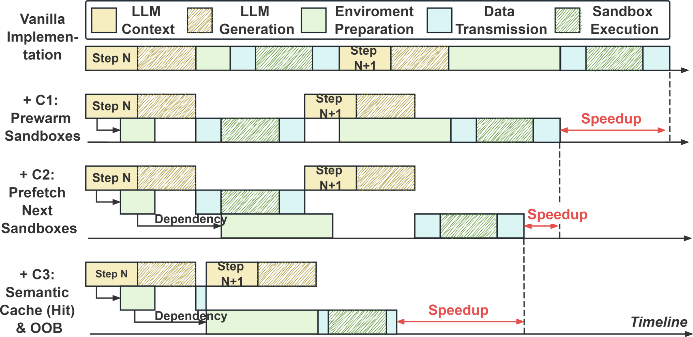
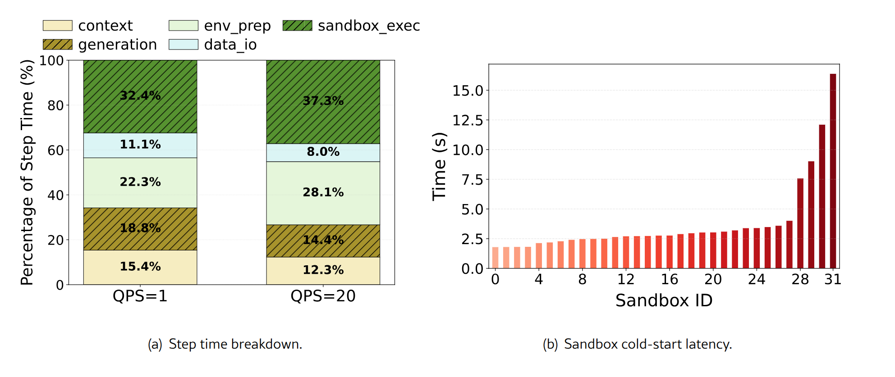
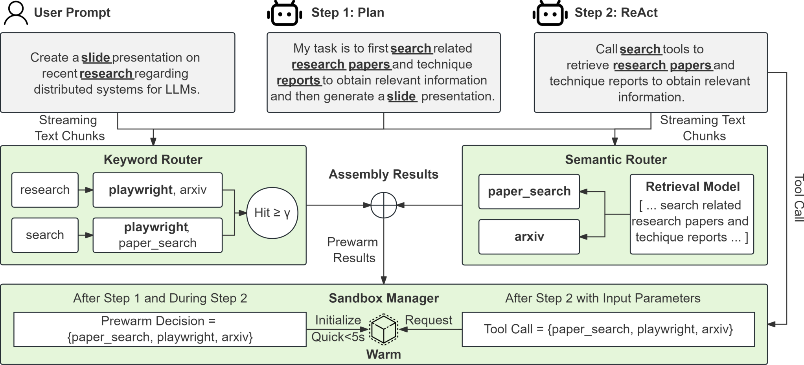
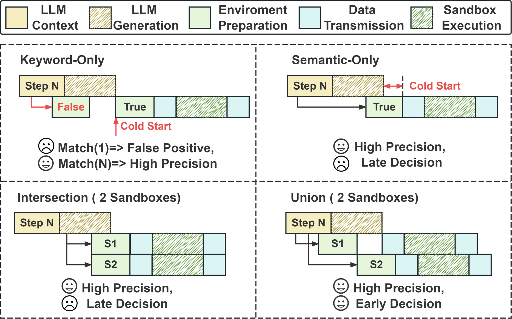
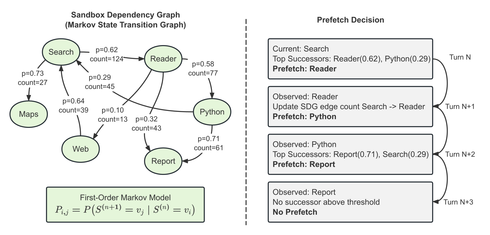
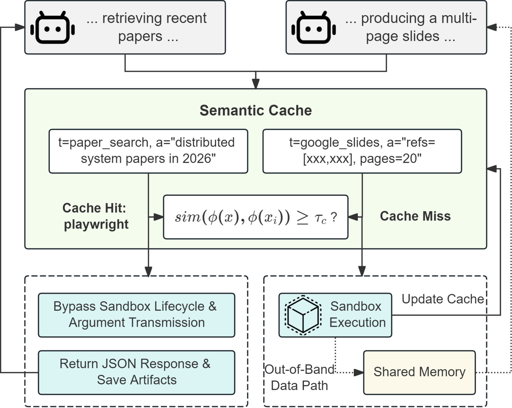

# SpecBox 论文解读

SpecBox 不是一篇“把容器启动得更快”的无服务器论文，也不是一篇“把 LLM 解码得更快”的推理系统论文。它要回答的是一个更窄、也更贴近当前智能体落地的问题：**在工具沙盒已经通过 MCP 从智能体引擎解耦出去之后，如何在不永久预留全部沙盒的前提下，把环境准备从端到端关键路径上拿掉。**

一句话概括其主张：智能体循环里真正昂贵的，往往不是沙盒启动本身，而是 **AgentScope / AutoGen / LangGraph 这类运行时把“推理完成”和“环境就绪”串成一条硬依赖**。SpecBox 用推测把这条依赖拆开——在 Token 还在生成时就开始预热当前步可能用到的沙盒，在当前工具还在跑时就开始预取下一步可能切换到的沙盒，再用语义缓存和带外传输把重复执行与大宗产物搬移从关键路径上削掉。



图 1 把这个主张画得很清楚：朴素路径是 GPU 先说完、CPU 再启动环境；SpecBox 的路径是两边重叠。后文的全部机制，都是在给这条重叠找一个既够早、又不太浪费的触发时机。

## 1. 它站在哪一层，解决哪一类张力

先把 SpecBox 放到智能体技术栈里，避免把它理解成通用调度器或通用冷启动优化。

```text
用户请求
  → 智能体引擎（规划 / ReAct / 工具选择）     ← AgentScope 等
      → 流式 Token
  → SpecBox（本篇的位置：引擎与沙盒之间的运行时中间件）
      → 控制面：意图路由、马尔可夫预取、生命周期
      → 数据面：语义缓存、共享内存带外传输
  → MCP 工具沙盒（Playwright / Jupyter / Neo4j / PaperSearch …）
```

云原生把沙盒做成按需微服务之后，出现了一组经典两难：

| 部署方式 | 延迟 | 资源 | 规模化后果 |
| :--- | :--- | :--- | :--- |
| 预留（Reserved） | 接近下限 | 空闲容器吃满主机内存/CPU | 上千种细粒度 MCP 工具时经济上不可持续 |
| 按需（On-demand） | 每次调用都可能秒级冷启动 | 精简 | 多轮会话里启动开销沿关键路径累加，P99 爆炸 |

论文强调：冷启动的物理成本（镜像、命名空间、文件系统、握手）确实存在，**但默认运行时把这些成本百分之百暴露在关键路径上，才是交互式智能体服务变慢的主因**。GPU 在生成 Token 时，CPU 侧环境是闲的；等 Token 结束、工具调用被完全确定，GPU 又要反过来等沙盒。两边互相空转。

这与同目录下 Aries 那篇“重新思考智能体云基础设施”的观察是互补的：Aries 指出工具沙盒大部分时间空闲、执行时突发，快照挂起又不划算；SpecBox 则给出一种**服务期**的折中——不要永久占着，也不要每次从零等，而是用推测把准备藏进已经在发生的计算里。

## 2. 为什么现成的预热、缓存、推测执行不够用

论文花了相当篇幅说明：无服务器领域的预热（Mitosis、IceBreaker）、工作流编排、容器快照（Firecracker、FaaSnap、TrEnv-X）以及 LLM 引擎里的推测解码（vLLM、SGLang），都不能直接搬过来。原因不在工程细节，而在智能体执行的生成方式：

1. **执行目标在运行时才出现。** 传统工作流图或 serverless 函数在请求到达前就知道要调谁。智能体的工具调用是自回归涌现的：不到 Token 流里积累足够语义，下一步调哪个 MCP 工具都不确定。
2. **多轮轨迹依赖中间观测。** 论文检索之后是否读文档、数据分析之后是否出图，取决于上一步结果，而不是固定 DAG。
3. **意图信号是逐步变清晰的。** 早期 Token 里充斥 `read` / `get` / `search` 这类跨工具复用的动词。预热越早，重叠窗口越大，假阳性也越多。

因此 SpecBox 的设计问题可以改写成三个互相打架的约束：

- **步内**：从尚不完整的 Token 流里尽早猜对工具，但不能把主机预热崩掉。
- **跨步**：在下一步意图出现前把后继沙盒准备好，但不能退化成“把所有可能后继都预留”。
- **数据面**：跳过重复工作和大宗传输，但不能改变智能体从沙盒里看到的语义，也不能拆掉 MCP 控制协议。

三项技术分别钉这三条约束，而且是分层回退关系，不是三个可有可无的插件。



图 2 把单步延迟拆成：上下文处理、Token 生成、环境准备 `Tenv_prep`、数据搬运 `Tdata_io`、沙盒执行 `Tsandbox_exec`。SpecBox **不动 LLM 推理栈**，只打后三段。这是一个很强的工程立场：换引擎、换模型都不该要求改 SpecBox；代价是它也无法做更深的“解码–工具”联合调度（例如工具 JSON 一出现就截断解码、或对工具参数做推测填充）。

## 3. 机制一：意图感知预热——用“刚好够用的意图”换重叠窗口

### 3.1 核心操作

朴素运行时的时序是：

```text
完整 tool_call 解析完成 → 开始拉起沙盒 → 握手 → 执行
```

SpecBox 改成：

```text
Token 流正在生成
  ├─ 关键词路由器：微秒级扫描工具词表
  └─ 语义路由器：把当前上下文和工具意图表示做匹配
        ↓
  并集组装：任一可信信号即可通知沙盒管理器预热
        ↓
  与剩余 Tgeneration(N) 重叠
```

它要的不是完整、结构化的工具调用，而是 **just enough intent**：足够用来选定沙盒类型，不必等到参数和调用格式都生成完毕。图 3 里规划智能体把用户请求展开成 ReAct 步骤，关键词线索和任务级语义共同决定是否预热。



### 3.2 两个路由器为什么必须并存

这是全文最有系统设计味道的权衡，图 4 把它画成路由策略象限。



- **关键词路由器快但不稳。** `research` / `search` / `slide` 出现在很多工具描述里。阈值 γ=1 会触发大量假阳性（100 次运行里 20 次工具不匹配），平均等待反而升到 786 ms，因为错误预热之后还要为真正的工具付冷启动。γ=3 匹配率到 97%，但预热领先时间被吃掉，等待回升到 622 ms。γ=2 是甜点：323 ms、95% 覆盖、5 次不匹配。
- **语义路由器稳但晚。** 它能抓住“措辞和工具词表几乎不重叠”的隐式意图，但可靠语义通常需要更长前缀。对 PaperSearch、Neo4j 这种冷启动可到约 20 秒的重量级沙盒，等语义路由器单独拍板，往往已经来不及把启动藏进剩余解码窗口。
- **交集看起来更精确，实际更慢。** 每次触发都要等更慢的那一路，并且任一路召回失败就会丢掉有效工具。
- **并集是工程上的主选择。** 每个路由器自己管假阳性，第一个可信信号就可以开工。实验里平均等待 124 ms，冷启动率 5%；交集把冷启动打到 0%，但等待变成 394 ms（高 3.16×）。加权融合最差（1308 ms、45% 冷启动），因为它把异构分数硬加到静态阈值上，多轮上下文一漂就跨不过 τf=0.5。

可以这样记：**并集牺牲的是少量误预热内存，换回的是把冷启动从关键路径上抹掉的能力。** 在交互式尾延迟优先的服务里，这个交换是合理的；在内存极度紧张、工具镜像非常重的集群里，5% 的假阳性仍可能不可接受，这时应把预算和回收策略做硬限制，而不是改回交集。

### 3.3 语义分支为什么选稀疏检索而不是 Encoder

表 2 的结果有点反直觉，但符合“控制面必须极轻”的约束：

- Retrieval（TF-IDF + Top-N）：Micro-F1 0.970，延迟 2.1 ms
- Encoder（MiniLM）：命中率也高，但 Precision 掉到 0.634，延迟 7.8 ms
- FastText：0.17 ms，但 Micro-F1 只有 0.124，基本不可用

生产路径因此选稀疏检索。意图路由跑在 Token 生成的旁边，预算是微秒到毫秒，不是“再挂一个小模型也无所谓”。Encoder 的 Precision 崩掉，说明把多轮轨迹压成稠密向量后，工具之间的边界被抹平了——这对“选哪一个沙盒”这种需要硬决策的任务并不友好。

## 4. 机制二：随机预取——把准备窗口从“当前解码”延伸到“当前执行”

步内预热再好，重叠窗口也只剩当前步还没生成完的 Token。若沙盒冷启动（2–20 秒）长于这段边际生成时间，步内预热就会打不满。论文的第二个观察是：智能体会话有时间局部性——检索之后常读文档，分析之后常出图——尽管不是确定性 DAG。

SpecBox 用一阶马尔可夫过程在**沙盒依赖图（SDG）**上建模步到步转移：

1. 统计 `vi → vj` 的转移计数，拉普拉斯平滑避免稀疏边概率归零。
2. 先丢掉冷启动很轻的后继（λ=5 秒）：预热它们收益不大。
3. 再丢掉低概率后继（τ=0.6）：控制假阳性。
4. 最后在预算 B=1 下只预热 top-1。

B=1 非常克制。它明确拒绝“把可能后继都预热”这条退回预留部署的路。预取发生在 `Tsandbox_exec(N)` 期间，也就是当前工具正在跑、下一步还没提交的时候。在线更新放在后台线程，不挡前台循环。



图 11 的消融把这项机制的价值说得很干净：

- 第 1 轮两种变体差不多（约 512–540 ms），因为还没有历史转移。
- 从第 2 轮起，Proactive 把等待从 540 ms 打到 138 ms，第 10 轮到 97 ms；Reactive 反而升到 583 ms，末端差 6×。
- Reactive 的每轮冷启动可到 2.90；Proactive 压在 0.24–0.83。

也就是说：**跨步预取不是锦上添花，它是多轮会话里延迟不会随轮次爬升的原因。** 步内预热解决“这一步猜得够不够早”，跨步预取解决“下一步的启动是不是根本不该再出现在关键路径上”。

一阶马尔可夫的边界也很清楚。开放式长时程智能体（深度研究、多文件改代码、子智能体分派）的工具依赖常常不是“只看上一个沙盒”。论文自己的退路是：预取 miss 时回退到步内意图预热，最坏延迟仍被框在当前解码阶段。这在系统上是健全的，但意味着 **SpecBox 对“规划突然转向”的工作负载，收益会明显收窄到机制一。**

## 5. 机制三：复用感知数据面——预热之后，关键路径上还剩什么

预热只能拿掉 `Tenv_prep`。多轮智能体还会反复查同一份文档、用不同措辞问同一件事，并把文件、图像、结构化结果经 RPC 塞回控制面。于是还剩 `Tsandbox_exec` 和 `Tdata_io`。



### 5.1 语义缓存：精确匹配的保守扩展

查找顺序是硬约束，不是“语义相似就复用”：

1. 工具身份必须相同（接口兼容）。
2. 规范化参数后做语义相似，阈值 τc（实现里写 0.8，表 4 消融用 0.6，两处不一致）。
3. 只缓存确定性调用；命中则跳过初始化与执行。

表 4 显示收益是存在的，但幅度比前两机制克制：相对无缓存 2.91×（412 ms → 142 ms），命中率 37.4%；精确匹配已经能到 33.6% 命中、100% 旁路。语义缓存多捞到的是表层措辞变化，旁路率反而降到 84.8%——部分语义命中仍要回退执行。这符合“正确性优先于激进复用”的设计，也说明 **在他们构造的轨迹里，重复计算并没有想象中那么多，真正的大头仍是冷启动掩盖。**

实践上最大的风险不在相似度算法，而在“何谓确定性”。网页检索、股票、邮箱、代码仓库状态都会随时间变。若把这类工具放进语义缓存，智能体会看到过期世界。论文把非确定性调用排除在缓存外，但工程上如何自动标注，文中几乎没有展开。

### 5.2 带外传输：控制面继续走 MCP，载荷走共享内存

即便沙盒已热，传统 JSON-RPC 仍把日志、文件、图像序列化进请求–响应。1 GB 载荷下 JSON-RPC 约 1873 ms，带外共享内存约 6 ms（约 314×），曲线接近 O(1)。做法是控制面只带 64-bit `token_id`，产物写进主机 mmap 区域，智能体引擎直接读。

这一点的架构含义比加速数字更重要：

- **兼容性**：不替换 MCP/RPC 控制协议，现有工具可以不改。
- **约束性**：mmap 要求引擎与沙盒共置同一主机。这和“沙盒解耦成微服务、跨节点调度”的云原生方向是反着的。论文把跨节点留给未来的 RDMA。
- **安全边界**：共享内存桥只在受信任主机或受管集群内；沙盒逃逸、恶意智能体、基础设施被攻破不在威胁模型里。对要跑不可信代码的多租户平台，这个假设需要单独评估。

## 6. 实验数字应该怎么读

实现落在 AgentScope + Docker + Python，推理走阿里云百炼 Qwen3.5-Max 的生产 API。基准是从 MCPBench 的 32 个开源 MCP 工具出发、由 LLM 规划器合成的 200 条 1–10 步轨迹，不是生产集群轨迹。对比的是永久预热的 Reserved 和每次调用再实例化的 On-demand。

把端到端数字放在这组前提下来看：

**延迟。** QPS=20 时 P99 为 88.7 s，相对 On-demand 的 257.2 s 约 2.9×；累积沙盒供给延迟降 4.53×，相对 Reserved 只差 10.6%。论文自己问的那句话——*能否以接近 serverless 的成本拿到接近 serverful 的性能*——在延迟维度上，答案基本是“可以逼近”。

**内存。** 峰值 49.4 GiB，相对 Reserved 的 80.6 GiB 降 45.9%；但 On-demand 峰值只有 40.4 GiB。SpecBox 并不是三者里最省内存的，它是 **靠近 On-demand 的内存曲线，靠近 Reserved 的延迟曲线**。多出来的那一截，就是预热/预取的投机库存。

**CPU。** 这是最值得注意的一点：峰值约 12.2 核，两个基线都在 15.8–15.9 核，SpecBox 比两边都低。合理原因有两条：高 QPS 下 On-demand 会把大量冷启动挤到同一时刻；Reserved 则维持过多常驻容器。缓存跳过的执行，以及错开的预热，反而降低了主机峰值争用。

**读实验时需要打折的地方：**

1. **轨迹是合成的。** 规划器按模板生成多轮会话，工具转移统计会比真实用户轨迹更规整，对一阶马尔可夫更友好。开放式编码智能体、并行工具调用、子智能体，可能没有这么干净的 SDG。
2. **LLM 在云端。** `Tgeneration` 被网络与远端排队拉长，重叠窗口更大，预热更容易藏住。本地小模型、高吞吐引擎上，步内预热的窗口会显著变窄，跨步预取的相对重要性会上升。
3. **单机 Docker，不是 MicroVM 集群。** 论文自己也说瓶颈常在应用级握手而非 OS 启动。FaaSnap / Firecracker 若把物理启动压到毫秒，SpecBox 仍有价值——因为它掩盖的是 MCP 发现、环境附着这一层——但端到端 2.9× 未必能原样复现。
4. **结论里的 97.9% 预热命中率** 在正文实验表中没有单独展开，更像汇总口径，不宜单独当核心指标引用。
5. 正文里系统名在 SpecBox 与 Laplace 之间来回，表 4 阈值与实现阈值也不一致。不影响主结论，但说明文本仍有改名与整理痕迹。

## 7. 正确性模型：推测的是准备，不是执行

这一点必须单独写，否则很容易把 SpecBox 理解成“提前跑工具”。

论文的安全/正确性边界其实很克制：

- 预测性准备只让环境就绪，**在智能体提交调用之前不执行有副作用的工作**；没用上的预热丢弃。
- 缓存只覆盖确定性、接口兼容的请求。
- 用户可见语义与 MCP 控制协议保持不变。

所以它推测的是 **哪一个沙盒即将被需要**，不是 **工具调用的结果**。这与 LLM 推测解码（先生成、再验证/丢弃 Token）不同，也与“投机执行工具并回滚”不同。设计因此能避开大多数副作用噩梦，代价是：一旦猜错，浪费的是容器资源，救不回已经走错的 Agent 轨迹——轨迹对错仍完全由上层引擎负责。

## 8. 和相邻工作怎么对齐

可以把它看成三块拼图之间的中间件，而不是其中任何一块的替代：

- **对轻量沙盒运行时（Firecracker、RunD、Wasm、FaaSnap）：正交。** 那些工作压缩物理启动；SpecBox 掩盖剩余就绪延迟。两者叠加才是完整故事：启动本身变短，再被重叠藏掉。
- **对经典 serverless 预热（Mitosis、IceBreaker）：假设被打破。** 那些系统默认请求独立同分布或可被时间序列预测。智能体工具调用由上下文轨迹非线性决定，必须引入 SDG 这类显式行为模型。
- **对 vLLM / SGLang：各管一段。** 它们优化 GPU 内核算与 KV 缓存，看不见主机侧沙盒摩擦。
- **对 AgentScope / AutoGen / LangGraph：补的是它们缺的系统视角。** 这些框架把工具调用当成普通函数/RPC，没有把“环境生命周期”当成一等调度对象。
- **对 Aries 那类测量论文：诊断与处方。** Aries 说明智能体服务不能只看 Token 指标、沙盒呈空闲但突发；SpecBox 给出一种不靠永久预留、也不靠频繁快照的运行时处方。

论文还提到可迁到 Agentic RL（VERL、Slime）的 rollout 循环。这个延伸是成立的：训练时环境交互更密、重复性更强，预热/预取的 ROI 可能比在线服务更高。但这需要另一套评测，本文没有提供数据。

## 9. 对工程实践真正可搬走的东西

不必完整复现 SpecBox，下面几条已经能指导现有智能体平台：

1. **不要等 `tool_call` JSON 闭合再拉环境。** 流式输出里一旦出现稳定的工具身份信号，就可以开始镜像/容器/会话握手。即使只有关键词规则，γ 取 2 左右通常比“等完全解析”更划算。
2. **给工具转移建图，而不是把每次调用当独立事件。** 哪怕只做 top-1 后继预热，多轮会话的尾延迟也会明显不同于逐步冷启动。
3. **控制面与数据面必须拆开。** MCP/JSON-RPC 适合指令、错误、元数据；文件、截图、向量、长日志应该走 shm / 本地盘 / RDMA 引用。否则沙盒“已经热了”，智能体仍会卡在序列化上。
4. **投机只准备、不执行。** 这是能在生产落地的前提。提前跑带副作用的工具，正确性模型会立刻崩溃。
5. **假阳性要用预算硬封顶。** SpecBox 用 B=1、λ、τ 把预热集合锁死。只提高召回、不设预算，系统会在高峰期自己预热成 Reserved。
6. **先打冷启动，再打缓存。** 从消融看，意图预热和跨步预取是 P99 的主因；语义缓存是锦上添花。资源有限时，不要先上复杂的语义复用。

## 10. 局限，以及读完之后还该问的问题

SpecBox 把“智能体运行时可以是预测性的”论证到了一个可实现原型的程度，但它留下的缺口和它解决的问题一样具体：

- **工作流形态在变。** 当代智能体大量出现并行工具调用、计算机使用、子智能体、长程代码修改。ReAct 逐步单工具的 SDG 模型会不够用。并行调用会把 B=1 直接打穿，需要的是集合预取而非单后继预取。
- **共置假设与解耦沙盒是矛盾的。** 带外 mmap 把性能钉在单机拓扑上。若生产环境把 MCP 沙盒调度到别的节点或别的集群，第 3 项优化基本失效，第 1、2 项仍在。
- **意图来自 Token 流，也就受生成风格绑架。** 模型如果延迟给出工具名、先长篇思考再调用，步内预热窗口会被思考 Token 填满——这反而有利；若模型很早就以内部 ID 或极短标签点名工具，关键词画像要重做。路由特征是工具生态的函数，不是与模型无关的常数。
- **多租户公平性几乎未谈。** 误预热在单机实验里只表现为一点额外内存；在共享集群里，它会挤占别人的冷启动额度。需要准入控制、租户级预算和抢占，而不仅是 γ 和 τ。
- **缺少与“更快的沙盒底座”的联合实验。** 正交性是理论上的。若对比对象已经是快照恢复毫秒级的 MicroVM，SpecBox 的绝对收益还剩多少，文中没有数。

如果只用一个判断收束：**SpecBox 证明了智能体服务的关键路径可以被时间重叠改写，而且改写点在引擎与沙盒之间的运行时，而不是模型内核或容器内核。** 它给出的不是通用调度理论，而是一套针对“流式意图 + 多轮工具局部性 + MCP 解耦”的可落地中间件。对正在把 MCP 工具池铺到生产环境、又不敢为每个租户预留全套沙盒的系统来说，这篇论文的主路径——早猜、少猜、只准备不执行、控制面与数据面分离——比它报告的 2.9× 本身更有复用价值。
