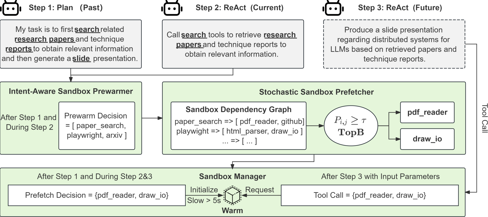
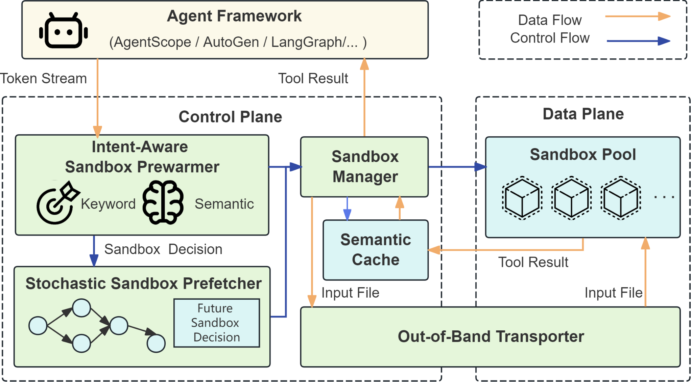
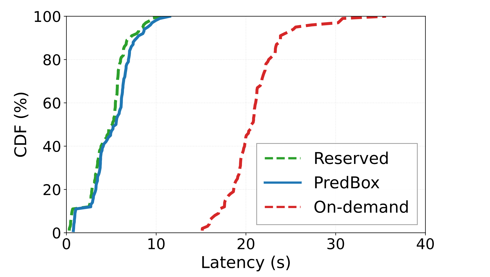
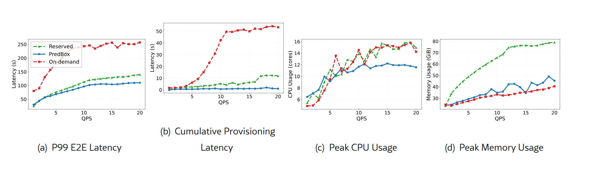
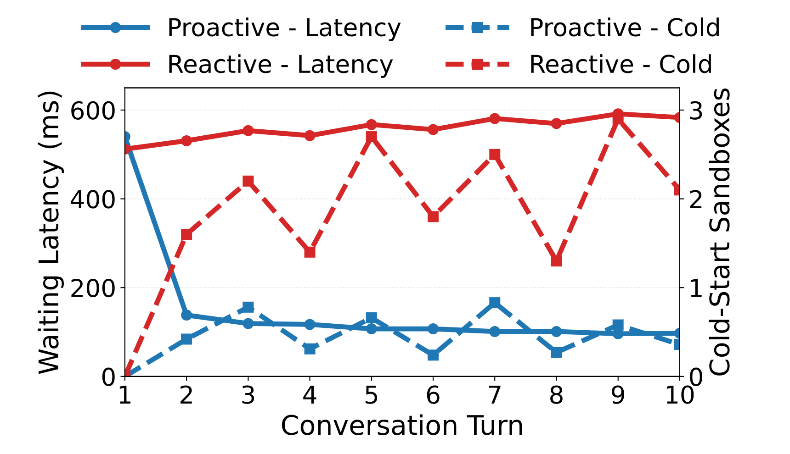
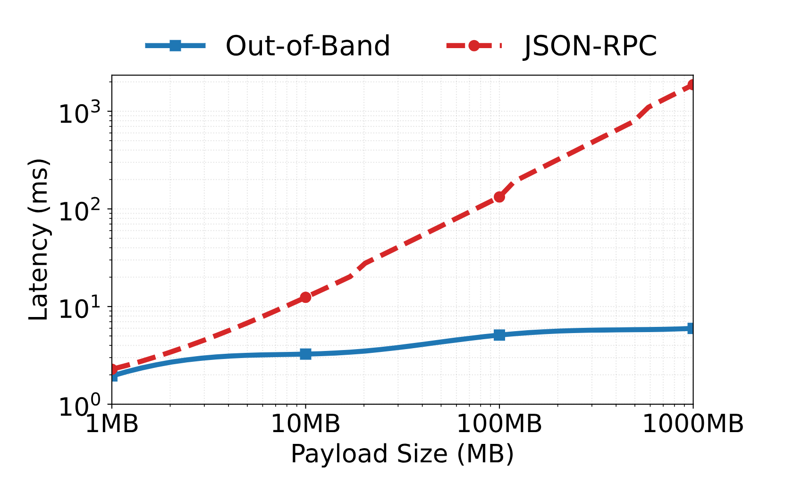

# SpecBox：面向高效 LLM 智能体服务的推测性沙盒调度

## 摘要

随着 LLM 智能体日益依赖模型上下文协议（Model Context Protocol, MCP）来调用隔离的外部沙盒，解耦式沙盒部署在资源利用率与交互式尾延迟之间引入了根本张力。持久的长生命周期沙盒预留会在规模化时带来过高的内存开销，而惰性按需实例化又会产生严重的冷启动惩罚，从而在多租户、多轮智能体工作负载下劣化响应性能。为化解这一两难，我们提出 SpecBox——一个围绕推测性沙盒预分配构建的运行时，专为动态 LLM 智能体执行流水线设计。

其核心是：SpecBox 实现关键词匹配与流式语义嵌入，以支持意图驱动的沙盒预热；该机制在 LLM Token 生成过程中识别即将到来的工具执行需求，并将沙盒启动与模型推理完全重叠。为将预热窗口延伸到后续智能体步骤，框架在沙盒依赖图之上利用上下文感知的随机预取，在执行之前以概率方式预测未来的沙盒切换。我们还辅以两项正交优化：语义结果缓存，用于裁剪冗余的重复沙盒调用；以及专用的带外共享内存传输平面，绕过传统网络序列化，实现产物的零拷贝传输。在高并发多轮智能体轨迹上的评估表明，相对按需沙盒基线，SpecBox 可将 P99 端到端延迟最多降低 2.9×，同时相对永久预留沙盒部署，峰值内存消耗下降 45.9%。

**关键词**：LLM 智能体、执行运行时、预测性预热

## 1 引言

现代 LLM 智能体正从传统的文本生成器演进为可迭代推理、规划并执行外部动作的自主系统（[Yao et al., 2022](https://arxiv.org/html/2607.23933v2#bib.bib12)；[Li et al., 2024b](https://arxiv.org/html/2607.23933v2#bib.bib14)；[Wang et al., 2024](https://arxiv.org/html/2607.23933v2#bib.bib13)）。与主要优化 Token 生成的传统 LLM 服务工作负载不同（[Agrawal et al., 2024](https://arxiv.org/html/2607.23933v2#bib.bib41)；[Zhang et al., 2025](https://arxiv.org/html/2607.23933v2#bib.bib11)），智能体执行形成有状态的运行循环：基于 LLM 的控制器反复调用外部工具（[Microsoft, 2026b](https://arxiv.org/html/2607.23933v2#bib.bib33)；[GitHub, 2026](https://arxiv.org/html/2607.23933v2#bib.bib29)；[Datalayer, 2026](https://arxiv.org/html/2607.23933v2#bib.bib34)；[Neo4j, 2026](https://arxiv.org/html/2607.23933v2#bib.bib35)），例如代码执行、网页自动化与数据处理服务。出于安全、隔离与可复现性，这些工具正越来越多地部署为独立沙盒环境，并通过模型上下文协议（MCP）（[Anthropic PBC, 2024](https://arxiv.org/html/2607.23933v2#bib.bib25)）等标准化接口访问。因此，智能体执行的延迟不再仅由模型推理决定，还取决于协调异构外部执行环境的效率。

现代云原生基础设施日益采用无服务器沙盒执行，以支撑大规模并发智能体会话（[Amazon Web Services, 2026](https://arxiv.org/html/2607.23933v2#bib.bib2)；[Google Cloud, 2026](https://arxiv.org/html/2607.23933v2#bib.bib3)；[Microsoft, 2026a](https://arxiv.org/html/2607.23933v2#bib.bib6)），即执行环境按需初始化，而非作为长生命周期实例预留。这一设计为多租户智能体工作负载提供了所需弹性，但引入了不可忽视的延迟（[Puliafito et al., 2022](https://arxiv.org/html/2607.23933v2#bib.bib15)；[Yu et al., 2024](https://arxiv.org/html/2607.23933v2#bib.bib16)；[Xu et al., 2024](https://arxiv.org/html/2607.23933v2#bib.bib18)；[Stojkovic et al., 2023a](https://arxiv.org/html/2607.23933v2#bib.bib20)）。每次工具调用都可能产生沙盒初始化开销——如镜像加载、文件系统准备、命名空间配置与运行时握手——从而在执行开始前引入秒级延迟（[Huang et al., 2026](https://arxiv.org/html/2607.23933v2#bib.bib23)）。在多轮智能体工作流中，这类启动开销会在连续工具调用间累积，显著劣化端到端响应性，并限制交互式智能体服务的实用性。

图 1. 主动重叠执行与原生朴素方法的对比。

这一延迟的主要原因并非沙盒初始化本身，而是事实标准智能体运行时（如 AgentScope（[Gao et al., 2024](https://arxiv.org/html/2607.23933v2#bib.bib17)）、AutoGen（[Wu et al., 2023](https://arxiv.org/html/2607.23933v2#bib.bib22)）与 LangGraph（[Langchain-ai, 2026](https://arxiv.org/html/2607.23933v2#bib.bib28)））的朴素实现所采用的串行执行模型。这些系统使用反应式、无流水线编排的串行模型：沙盒准备阶段仅在 LLM 推理完成 Token 生成、工具调用被完全确定之后才开始。因此，环境准备完全暴露在关键路径上，在模型推理与工具执行之间留下空闲时段。当 GPU 忙于生成 Token 时，CPU 侧资源利用不足——一旦沙盒初始化开始，GPU 又必须等待外部执行完成。如图 [1](https://arxiv.org/html/2607.23933v2#S1.F1) 所示，反应式模型将 LLM 推理与环境准备串行化，未能有效地将计算与环境供给重叠。

现有运行时优化，如推测执行（[Stojkovic et al., 2023b](https://arxiv.org/html/2607.23933v2#bib.bib43)；[Li et al., 2024a](https://arxiv.org/html/2607.23933v2#bib.bib44)）、预热（[Mahgoub et al., 2022](https://arxiv.org/html/2607.23933v2#bib.bib45)；[Sui et al., 2024](https://arxiv.org/html/2607.23933v2#bib.bib49)）、工作流编排（[Liu et al., 2023](https://arxiv.org/html/2607.23933v2#bib.bib46)；[Li et al., 2023](https://arxiv.org/html/2607.23933v2#bib.bib47)）与缓存（[Xu et al., 2024](https://arxiv.org/html/2607.23933v2#bib.bib18)；[Lu et al., 2024](https://arxiv.org/html/2607.23933v2#bib.bib48)），在无服务器与云系统中已有充分研究。然而，它们并不能直接迁移到 LLM 智能体运行时，因为智能体执行与传统请求处理存在根本差异。既有工作通常假设固定的执行目标，或在运行前已有预定义工作流图。相反，自主智能体工作流是通过自回归推理在线产生的：工具调用从流式 Token 生成中逐步涌现，直到足够的语义上下文可用之前都保持不确定。多轮会话还会依据中间观测与结果进一步演化，使未来的工具选择既依赖工作流又高度动态。这些特征使得对现有技术的简单扩展并不可行。

因此，在 LLM 智能体运行时的语境下，关键思路是在沙盒被请求之前预先启动最可能需要的沙盒，使环境准备与正在进行的 LLM 生成重叠。然而，将这一思路落实到自主智能体系统会带来三项独特挑战。第一，在单步（智能体迭代）内部，意图必须从仅具部分语义的早期 Token 流中推断；使用短上下文、低阈值或宽候选集会改善重叠，但会带来假阳性预热以及内存/CPU 浪费的风险。第二，跨步骤预测未来将调用哪个工具，会随预测窗口拉长而越来越不可靠；若对所有可能后继都预热，成本将退化回预留部署。第三，仅预热只能消除沙盒启动延迟：即便沙盒已就绪，重复的工具执行与大型产物传输仍可能停留在关键路径上。因此，系统必须复用语义等价的执行结果，并将大宗数据传输与控制信令解耦，同时保持协议兼容性与用户可见语义。

本文提出 SpecBox，一个对智能体工作流任务进行高效编排的预测性服务系统。SpecBox 将 LLM 执行与环境准备重叠，打破朴素智能体运行时实现中僵硬的串行依赖。SpecBox 通过三项协同技术降低端到端延迟：i）**意图感知沙盒预热**，基于流式 Token 输出推测执行意图，在恰当时机启动，并在同一步内将沙盒准备与正在进行的生成重叠；ii）**随机沙盒预取**，利用历史智能体执行轨迹预判未来沙盒需求，并在当前步骤期间为下一步准备沙盒，从而降低冷启动延迟；iii）**复用感知数据传输**，利用语义相似性，通过语义缓存绕过冗余工具执行，并通过带外数据路径将大型产物交付与控制信令解耦，消除不必要的计算与序列化开销。SpecBox 的原型已实现并集成到开源 AgentScope 框架（[Gao et al., 2024](https://arxiv.org/html/2607.23933v2#bib.bib17)）。SpecBox 与框架无关，可高度扩展到任意 LLM 智能体服务基础设施。在多样化的多轮、高并发智能体基准上，SpecBox 优于现有最先进的无服务器运行时，同时保持工作流正确性与协议兼容性。SpecBox 将 P99 延迟最多降低 2.9×，峰值主机内存使用降低 45.9%。本文的主要贡献如下。

- 刻画多轮 LLM 智能体执行的延迟关键路径，并提出一种新的沙盒预热方法（**C1**）：通过推断流式 Token 级意图，使沙盒准备能更好地与正在进行的 LLM 推理重叠（§ [3.1](https://arxiv.org/html/2607.23933v2#S3.SS1)）。

- 设计随机沙盒预取机制（**C2**），通过挖掘历史智能体执行轨迹，并在沙盒依赖图上预热可能的沙盒环境，降低跨步冷启动延迟（§ [3.2](https://arxiv.org/html/2607.23933v2#S3.SS2)）。

- 引入复用感知数据传输（**C3**），通过带外传输与语义缓存，高效传输并复用中间执行产物，同时消除冗余沙盒初始化（§ [3.3](https://arxiv.org/html/2607.23933v2#S3.SS3)）。

## 2 背景与动机

### 2.1 智能体工作流与环境

大语言模型（LLM）应用已从单体、单轮聊天机器人转向分布式自主智能体。传统工作流依赖人工预定义的执行图，操作序列在运行前即已固定。相反，现代**智能体工作流**融入自主决策：给定高层目标，智能体可动态分解任务、选择执行沙盒或外部环境，并根据中间观测调整轨迹。因此，工作流不再静态指定，而是从 LLM 推理与外部环境的持续交互中涌现（[Yao et al., 2022](https://arxiv.org/html/2607.23933v2#bib.bib12)；[Li et al., 2024b](https://arxiv.org/html/2607.23933v2#bib.bib14)；[Wang et al., 2024](https://arxiv.org/html/2607.23933v2#bib.bib13)）。

智能体工作流通过一系列事件驱动的执行步骤实现，每一步代表涉及推理、规划或调用本地与远程沙盒的中间任务。需要文件系统交互、代码执行、网页访问或对专有数据库查询的任务，会被委托给隔离的外部执行层（**环境**或**工具沙盒**）。标准化协议——尤其是 Anthropic 提出的模型上下文协议（MCP）（[Anthropic PBC, 2024](https://arxiv.org/html/2607.23933v2#bib.bib25)）——形式化了这一接口边界。MCP 在 HTTP 与 Server-Sent Events（SSE）等传输之上规定了公共通信层，从而将工具调用转化为一组松耦合微服务。这一架构与新兴的面向智能体的操作系统高度契合：后者将 LLM 概念化为中央处理器，将外部环境概念化为外围设备（[Mei et al.,](https://arxiv.org/html/2607.23933v2#bib.bib10)；[Gao et al., 2024](https://arxiv.org/html/2607.23933v2#bib.bib17)）。从系统工程角度看，智能体执行日益表现为 LLM 推理核心与多个环境服务之间连续的、异构的、类 RPC 交互流，而非单体的、局部化的计算工作负载。

### 2.2 服务运行时

将智能体引擎与其底层执行环境解耦，能够带来显著的可扩展性与架构灵活性。然而，在云原生、多租户集群基础设施中部署这些解耦组件，会在性能与资源管理方面引入重大挑战。服务提供商必须仔细平衡隔离保证、资源效率与端到端延迟，从而暴露出长运行（预留）与无服务器（按需）服务范式之间固有的权衡。

**预留式智能体运行时。** 一种直接策略（[Tan et al., 2025](https://arxiv.org/html/2607.23933v2#bib.bib37)；[Huang et al., 2026](https://arxiv.org/html/2607.23933v2#bib.bib23)）是为每个用户租户及其关联沙盒维持预初始化、始终在线的容器。然而，在包含数千种细粒度工具的当代智能体生态系统中，将所有执行环境保持在预热状态会变得资源成本过高：空闲容器会带来可观的主机内存与 CPU 开销（[Xu et al., 2024](https://arxiv.org/html/2607.23933v2#bib.bib18)；[Stojkovic et al., 2023a](https://arxiv.org/html/2607.23933v2#bib.bib20)），进而导致显著的集群低利用率与资源干扰，使大规模多租户部署在经济上不可持续。

**按需智能体运行时。** 为提升资源利用率，现代云原生平台普遍采用按需运行时供给（[Du et al., 2020](https://arxiv.org/html/2607.23933v2#bib.bib31)；[Shahrad et al., 2020](https://arxiv.org/html/2607.23933v2#bib.bib38)），即仅在智能体显式请求时才实例化（“冷启动”）工具沙盒。然而，这一设计选择会引入显著的尾延迟：按需初始化隔离容器会带来一系列串行开销，包括容器镜像下载与解压、网络命名空间设置、虚拟文件系统挂载，以及应用级握手过程。在突发工作负载或复杂多轮工作流下，这些数秒级的冷启动延迟会沿智能体端到端关键路径累积，从而抬高 P99 尾延迟，并劣化实时智能体的交互式服务质量（QoS）。

### 2.3 智能体运行时中的执行瓶颈

与传统 LLM 服务不同，智能体会话构成由多次迭代推理与沙盒化执行步骤组成的连续、有状态执行循环。主流智能体框架（[Gao et al., 2024](https://arxiv.org/html/2607.23933v2#bib.bib17)；[Wu et al., 2023](https://arxiv.org/html/2607.23933v2#bib.bib22)；[Langchain-ai, 2026](https://arxiv.org/html/2607.23933v2#bib.bib28)）采用反应式执行范式，即仅在 LLM 完成推理步骤后才发起每次工具调用。这一设计在模型推理与环境交互之间诱导出严格串行的依赖链。所得执行工作流如图 [1](https://arxiv.org/html/2607.23933v2#S1.F1) 所示。

如图 [2(a)](https://arxiv.org/html/2607.23933v2#S2.F2.sf1) 所示，单次执行步骤 N 的端到端延迟可分解为若干部分：

前两个分量与 LLM 推理相关，包括上下文处理与 Token 生成。其余三个定义了智能体运行时的优化边界：Tenv_prep(N) 是使所选沙盒环境就绪的时间，Tdata_io(N) 是交换调用输入与结果的时间，Tsandbox_exec(N) 是执行工具所花费的时间。

SpecBox 在不改变 LLM 推理栈的前提下针对这些时间段进行优化：将准备与推理重叠、减少数据移动，并消除冗余执行。我们据此得到如下观察，构成本研究的动机。

**观察 #1**：*步内准备可与 Token 生成重叠。* 在当今的反应式执行模型中，即便提示词、计划与部分 Token 流往往已经揭示了可能的沙盒，环境初始化也必须等到 LLM 发出显式沙盒调用后才能开始。利用这些部分证据更早启动准备，可将预热前移到对应调用之前。这一间隔使沙盒启动、运行时连接建立及其他准备工作能够与剩余的 Tgeneration(N) 重叠，而非将全部 Tenv_prep(N) 放在关键路径上。如图 [2(b)](https://arxiv.org/html/2607.23933v2#S2.F2.sf2) 所示，沙盒初始化需要数秒，重量级沙盒甚至可接近 20 秒，因此这一重叠机制对最小化系统所观测到的有效准备延迟至关重要。

**观察 #2**：*跨步执行可提前预热。* 智能体会话中的连续步骤常常表现出强时间局部性。例如，在大语言模型（LLM）服务工作负载中，论文检索步骤之后往往是处理已检索文档的文档阅读步骤，而数据分析步骤之后通常是图表生成步骤。尽管如此，主流运行时系统一般将每次调用视为独立事件，一旦某步启动便丢弃工作流上下文。相反，运行时可利用当前沙盒的执行窗口，在步骤 N+1 开始之前主动实例化并预热最可能的后续执行环境，从而使步内预热超越当前解码阶段、进一步提前。

**观察 #3**：*冗余执行与过量不必要的数据传输。* 在多轮智能体工作流中，后续推理步骤常常回访已经产生的信息，例如再次查询同一文档或重跑确定性分析。然而，即便等价结果已经可用，传统运行时仍会重新执行这些操作，反复支付 Tsandbox_exec(N) 的成本。与此同时，沙盒接口往往将大型中间产物（如文件、图像、结构化输出）的同步传输与控制消息耦合，使 Tdata_io(N) 随产物规模增长。直观上，可以通过缓存并复用先前执行结果，并将产物传输与控制信令解耦，从而加速智能体执行，消除冗余工作与数据传输开销。

这些观察揭示了智能体执行循环中三个优化切入点：在同一步内将环境准备与 LLM 操作重叠；在当前步骤中提前下一步的环境准备；以及消除重复执行或数据移动。现有 LLM 服务框架主要聚焦于优化模型执行——如预填充与解码阶段，以及 KV 缓存管理——而无服务器运行时主要降低容器初始化开销，却不考虑用户侧意图。然而，两者都没有直接回答：面向智能体的运行时如何在利用这些优化的同时，保持资源效率并保留工具调用与使用的既定语义。

图 2. 智能体运行时中的执行瓶颈。(a) 执行步骤延迟分解。(b) 32 个沙盒化环境的平均冷启动延迟，包括全部 MCPBench（[Wang et al., 2025](https://arxiv.org/html/2607.23933v2#bib.bib26)）沙盒及其他常用环境。大多数沙盒在 2–4 秒内完成初始化，而资源密集型环境可能需要大约 20 秒。

图 3. 意图感知沙盒预热：规划智能体将用户请求展开为 ReAct 步骤，关键词预测与语义预测共同决定是否预热沙盒。

图 4. 路由策略之间的权衡。关键词路由以潜在假阳性换取早期决策；语义路由与交集会推迟精确决策；并集组装在保留精度的同时，允许任一路由器尽早触发预热。

### 2.4 研究挑战

设计有效的执行运行时以加速 LLM 智能体服务，面临如下挑战。

**挑战 #1**：*早期意图预测 vs. 资源浪费。* 从给定的不完整 Token 流中推测工具使用意图，对于保证沙盒环境准备的及时性、同时避免因意图预测不准而启动不需要的工具至关重要。早期预热必须依赖高度模糊的早期 Token（例如在不同 MCP 工具间复用的通用动词，如 read 与 get），这常常导致**假阳性**沙盒激活，浪费资源，并可能在多租户部署中触发主机级 OOM。

**挑战 #2**：*跨步提前预热 vs. 非确定性工作流执行。* 在下一意图显现之前选定后续步骤的沙盒环境是有利的。智能体工作流以概率方式执行，允许多种合理的后继状态。对所有潜在后继都预热，会带来与完全预留部署相当的计算与资源开销；而只预热单一后继，则会大幅降低摊销沙盒初始化成本的机会，仅带来有限的延迟改善。相反，运行时系统应利用历史转移数据对一小集合高度可能的目标环境排序，再用当前步骤可用的信号精炼这一选择。这在资源利用率与延迟降低之间取得平衡，同时保留将沙盒初始化隐藏在正在进行的计算之后的能力。

**挑战 #3**：*复用与数据路径效率 vs. 沙盒兼容性。* 我们必须跳过冗余工作，同时不改变智能体从沙盒调用中观察到的内容。精确复用是安全的，但会错过以不同表述表达的语义等价请求；不受约束的语义复用可能产生不兼容的结果。类似地，将大型产物放入普通 RPC 消息可保持兼容性，但数据移动仍与载荷大小成正比；而替换控制接口则会破坏现有工具。因此，运行时必须检测兼容复用、拒绝不安全近似，并将大宗产物与控制信令解耦，同时保留沙盒执行语义。

## 3 SpecBox 的设计

我们关注反应式智能体执行中的三个关键时间段：环境准备、数据移动与沙盒执行。本节说明 SpecBox 如何通过解耦而又相互关联的优化来加速它们：意图感知沙盒预热，尽早推断步内工具意图，使环境准备与 LLM 服务的解码重叠（§ [3.1](https://arxiv.org/html/2607.23933v2#S3.SS1)）；随机沙盒预取，利用跨步工作流规律性进一步将准备前移（§ [3.2](https://arxiv.org/html/2607.23933v2#S3.SS2)）；以及复用感知数据传输，避免冗余执行并将大型产物移出控制路径（§ [3.3](https://arxiv.org/html/2607.23933v2#S3.SS3)）。

图 5. SpecBox 中的随机沙盒预取。执行历史预测后续 ReAct 步骤可能需要的沙盒。

### 3.1 意图感知沙盒预热

朴素的反应式运行时在沙盒准备之前等待完整的工具调用，即便提示词、演化中的计划与部分生成已经揭示了用户意图。SpecBox 则通过推断流式 Token 级意图更早地预热沙盒，使沙盒准备更好地与正在进行的 LLM 推理重叠。

SpecBox 充分利用 LLM 解码时段 Tgeneration(N)，获取**刚好足够**的用户意图以准确启动沙盒，同时不损害预热的及时性。做法是将流式上下文送入两个独立路由器。如图 [4](https://arxiv.org/html/2607.23933v2#S2.F4) 所示，存在一个两难：更早的意图预测与 LLM 解码时段重叠更多，但更不可靠，并可能浪费沙盒容量。关键词路由器行动较早，但必须在假阳性与更严格阈值之间权衡；语义路由器更精确但更慢。要求两者同时预测会引入语义路由器的延迟，而机会主义地组合其输出则可在允许更早决策的同时保持高精度。因此，SpecBox 提出一种意图感知沙盒预热机制，组合这两种异步意图预测，而非认为单独任一者即已足够。

**关键词路由器。** 关键词路由器对照工具特定的关键词画像扫描数据流，并可在出现辨识性 Token 后的微秒级发出候选，使环境在 LLM 继续解码时完成准备。research、search 或 slide 等常见术语出现在许多工具描述中：仅凭单次匹配触发会产生带有大量假阳性的庞大预热集合，而要求多次匹配则会推迟准备，错过良好的重叠机会。因此，我们对匹配到的工具特定关键词数量施加阈值 γ。在图 [3](https://arxiv.org/html/2607.23933v2#S2.F3) 中，用户请求与演化计划中的表层线索使关键词路由器能够在规划智能体完成本次 ReAct 步骤之前发出可能的沙盒候选。该阈值在早期激活与资源浪费之间取得平衡；所选配置见 § [5.3](https://arxiv.org/html/2607.23933v2#S5.SS3)。

**语义路由器。** 并行地，语义路由器将活动上下文与工具意图表示进行比较。它能捕捉措辞与工具画像重叠很少的请求，并利用计划与先前生成来消歧通用关键词线索。在图 [3](https://arxiv.org/html/2607.23933v2#S2.F3) 中，即便没有单个 Token 能唯一标识某工具，它也能从更广泛的任务意图中识别候选沙盒。其权衡是时间性的：可靠的语义证据通常需要更长的前缀，因此仅依赖语义的决策往往来得太晚，无法掩盖 PaperSearch（[OpenAGS, 2026](https://arxiv.org/html/2607.23933v2#bib.bib7)）与 Neo4j（[Neo4j, 2026](https://arxiv.org/html/2607.23933v2#bib.bib35)）等重量级沙盒的冷启动延迟。语义路由器是候选的异步、互补来源，可恢复关键词路由器错过的意图。

**并集组装。** 令 𝒮key(N) 与 𝒮semantic(N) 为两个路由器在 Token 步骤 N 的候选集。图 [4](https://arxiv.org/html/2607.23933v2#S2.F4) 左下象限说明了为何仅预热其交集并不合适：它提升了表面精度，却使每次触发都等待语义路由器，并且只要任一路由器召回不完善就会丢弃有效工具。相反，我们使用右下策略：

每个路由器各自管理自身的假阳性，并集则让第一个可信信号即可启动准备。图 [3](https://arxiv.org/html/2607.23933v2#S2.F3) 展示了所得行为：路由器从请求与部分计划独立生成候选，再形成统一的预热集合交给沙盒管理器。显式意图受益于关键词路由器的早期预热，而隐式意图由语义路由器处理。如 § [5.3](https://arxiv.org/html/2607.23933v2#S5.SS3) 将展示的，异步并集可最小化等待时间，并在所评估的路由工作负载中消除冷启动。

图 6. 使用一阶马尔可夫模型的随机沙盒预取。左：基于 SDG 的马尔可夫状态转移图，边概率来自观测计数。右：示例会话，展示跨轮次的阈值化、有预算预取，其中预测后继在下一步提交之前被预热。

### 3.2 随机沙盒预取

意图感知沙盒预热只能利用当前步骤剩余的解码时间；当非驻留沙盒的启动时间长于边际 Token 生成窗口时，这并不充分。实际上，智能体工作流中的步骤虽非确定性，但通常遵循概率模型。例如，论文检索之后，智能体可能阅读返回的文档；数据分析之后，它可能生成图表或报告。SpecBox 利用这些跨步概率模式，在 Tsandbox_exec(N) 期间、下一步提交到具体调用之前，提前导航环境准备。

**随机马尔可夫过程建模。** 令 𝒱 表示沙盒状态空间，其中每个状态是沙盒类型，或状态级 SDG 中的带类型工具—状态元组。对于执行轨迹 {S(1),…,S(N)}，SpecBox 在有向沙盒依赖图（SDG）中记录步到步的转移。对每个有序对 (vi,vj)，我们维护转移计数：

下一状态概率由带**拉普拉斯平滑**（[Laplace, 1812](https://arxiv.org/html/2607.23933v2#bib.bib19)）的一阶马尔可夫模型估计：

其中 α=1，避免稀疏观测转移出现零概率坍缩。

**预算约束下的预取。** 给定当前状态 vi，SpecBox 首先识别具有不可忽略冷启动成本的沙盒候选：

其中 Lj 表示沙盒 vj 的估计冷启动惩罚，λ 是轻量成本阈值。

随后 SpecBox 过滤低置信后继，仅保留高概率候选：

其中 τ 控制假阳性预热。最后，SpecBox 在固定预算下选择 top-B 沙盒：

其中 𝒞i 是过滤后的候选集，𝒜i 是最终有预算的预取集，B 限制每步预热的沙盒数量。该策略有意保持轻量，可在 LLM 生成关键路径之外执行。

**在线更新。** 每次沙盒调用完成后，SpecBox 向 SDG 追加一条转移边，并在后台预取工作线程中异步更新 Ci,j 与 Pi,j。因此，预测器可持续适应演化中的多轮工作流，而不阻塞前台智能体执行。图 [5](https://arxiv.org/html/2607.23933v2#S3.F5) 展示了随机沙盒预取如何与意图感知沙盒预热在完整多步工作流中协同运作。步骤 N 在沙盒 vi 中结束后，SpecBox 查询 SDG 以获得可能的后继沙盒，使用 Lj≥λ 与 Pi,j≥τ 过滤低价值或低置信候选，然后在步骤 N+1 完全提交之前选择有预算的预取集 𝒜i。

图 7. SpecBox 中的复用感知数据传输。语义缓存命中则返回先前结果（paper_search）；未命中则执行沙盒（paper_slides），并通过带外数据路径交付结果。

### 3.3 复用感知数据传输

一旦调用就绪，其剩余关键路径成本便落在产物移动（Tdata_io(N)）与工具执行（Tsandbox_exec(N)）上。SpecBox 首先检查能否复用缓存结果；否则运行工具，并通过独立数据路径返回其产物。图 [7](https://arxiv.org/html/2607.23933v2#S3.F7) 详述了该过程。

**语义缓存。** 多轮智能体常常重新访问未变化的文档、以不同措辞提交语义等价查询，或重跑确定性计算。精确参数匹配稳健，但无法捕捉这类表层变化；而不受约束的语义匹配可能错误合并在工具、输入或副作用上不同的请求。因此，缓存必须扩大可复用请求集合，同时严格保持功能等价与行为兼容。

对每次完成的确定性调用，SpecBox 存储规范化调用签名及其结果。查找时，它首先按工具身份过滤缓存条目，再将规范化调用表示与缓存签名比较。对于请求 x，仅当存在满足语义等价约束的兼容缓存条目时，才允许结果复用：

其中 x 表示传入的工具调用请求，xi 表示第 i 条缓存调用。函数 ϕ(·) 将调用变换为规范化语义表示：先去除参数表示中的表层变化，再提取语义特征用于相似性比较。函数 sim(·,·) 度量两个调用表示之间的相似性，阈值 τc 控制语义复用的严格程度。工具身份约束保证接口级兼容，而相似性阈值将复用限制在规范化语义足够相似的调用上。

这一设计将语义匹配视为精确复用的保守扩展，而非不受约束的近似机制。语义相似性仅在同一工具接口与确定性调用行为的边界内扩大可复用请求空间。缓存未命中时，执行沿标准路径进行，并将完整计算结果追加到缓存。缓存命中时，沙盒初始化与工具调用都被跳过，从而降低 Tenv_prep(N) 与 Tsandbox_exec(N)。如 § [5.3.3](https://arxiv.org/html/2607.23933v2#S5.SS3.SSS3) 将展示的，语义缓存策略可比单独使用精确匹配恢复更大比例的冗余计算，同时维持保守回退路径以保持推理正确性。

**带外数据传输。** 即便沙盒已完全初始化，传统 RPC 传输仍会将大型日志、文件、图像与结构化输出序列化进请求—响应消息。因此，Tdata_io(N) 随载荷大小增长，并在后续推理步骤之前阻塞智能体。整体替换控制协议会损害与现有 MCP 工具的兼容性；因此，SpecBox 转而将控制信令与产物传输解耦。

带内控制面继续承载标准工具指令、完成通知、错误报告与紧凑元数据。大型产物在该平面上仅以固定大小的引用表示，并通过共置的零拷贝数据路径交换。在此设计下，缓存未命中按常执行、恰好发布一次产物，并向智能体引擎返回引用；缓存命中则简单地复用并经同一数据路径返回先前已发布的产物。这一架构解耦在保持现有控制接口的同时，消除了高容量输出在 RPC 层的序列化与内存拷贝。如 § [5.3.4](https://arxiv.org/html/2607.23933v2#S5.SS3.SSS4) 所示，相应传输延迟实际上对载荷大小不敏感。

## 4 实现

图 8. SpecBox 概览。

SpecBox 实现为位于智能体引擎与外部执行沙盒之间的预测性服务运行时。图 [8](https://arxiv.org/html/2607.23933v2#S4.F8) 展示了其控制路径与数据路径。该实现对智能体运行循环进行观测，而不改变其面向工具的接口，并将运行时工作与已经在进行的 LLM 及沙盒工作重叠。

**控制面。** 在控制面上，控制器订阅传入的 Token 流并记录已完成的工具转移。关键词路由器对照工具关键词画像匹配数据流，当匹配到的工具特定关键词数量达到 γ=2（第 [5.3](https://arxiv.org/html/2607.23933v2#S5.SS3) 节选定的工作点）时发出候选。并行地，语义路由器使用该节选定的稀疏检索配置。并集组装将其候选集独立分派给沙盒管理器，后者对请求去重并启动相应容器。后台预取工作线程根据执行轨迹更新沙盒依赖图，应用第 [3.2](https://arxiv.org/html/2607.23933v2#S3.SS2) 节的转移概率，并在当前工具执行期间提交有预算的下一步预热。在我们的实现中，成本阈值配置为 λ=5，预取概率阈值为 τ=0.6，每步预取预算为 B=1。

**数据路径。** 在调度确定性调用之前，运行时构造其调用表示，将查找限制在同一工具身份，并检查语义结果缓存。每条缓存条目包含工具标识符、规范化调用签名、语义嵌入与结果引用。仅当工具身份匹配且语义相似性超过报告实验中使用的阈值 τc=0.8 时，缓存才复用先前结果。未命中时，沙盒将大型结果写入主机管理的内存映射共享内存区域。控制面仅携带命名该区域的 64 位 token_id，而智能体引擎直接从共享内存底板读取结果。小型指令、元数据、完成通知与错误仍走普通控制面。这实现了图 [7](https://arxiv.org/html/2607.23933v2#S3.F7) 中常见的“缓存或执行”流程，而无需通过 RPC 栈序列化大宗结果。

**执行边界与正确性。** 我们考虑多租户智能体，其工具运行在操作系统隔离的容器或微虚拟机中。预测性准备使环境就绪，但在智能体提交调用之前并不执行具有副作用的工作；未使用的预热会被丢弃。缓存复用限于确定性、兼容的工具请求。共享内存桥接运行在单一受信任主机或安全托管的集群边界内，现有访问控制防止跨租户内存访问。沙盒逃逸、恶意智能体与被攻破的基础设施不在本工作的威胁模型之内。

## 5 评估

### 5.1 实验设置

**硬件与软件环境。** 全部实验在一台商用服务器上进行，配备 16 核 CPU、256 GiB 主机内存与 2 TB NVMe SSD。SpecBox 构建于 AgentScope（[Gao et al., 2024](https://arxiv.org/html/2607.23933v2#bib.bib17)）框架之上，具体集成于其智能体引擎层。隔离的多租户执行沙盒通过 Docker 容器实例化，整个运行时基础设施以 Python 实现。为驱动智能体推理，我们使用阿里云百炼的 Qwen3.5-Max 模型（[Alibaba Cloud, 2026](https://arxiv.org/html/2607.23933v2#bib.bib1)），通过其生产云 API 端点并发访问。

**工作负载。** 我们使用轨迹级基准评估 SpecBox，包含 200 条多轮轨迹，源自 MCPBench（[Wang et al., 2025](https://arxiv.org/html/2607.23933v2#bib.bib26)），涵盖从 GitHub（[GitHub, 2026](https://arxiv.org/html/2607.23933v2#bib.bib29)）收集的 32 个开源 MCP 兼容工具服务器（例如 Playwright（[Microsoft, 2026b](https://arxiv.org/html/2607.23933v2#bib.bib33)）、Jupyter（[Datalayer, 2026](https://arxiv.org/html/2607.23933v2#bib.bib34)）、Neo4j（[Neo4j, 2026](https://arxiv.org/html/2607.23933v2#bib.bib35)））。为确保工具级有效性与现实的工作流执行依赖，我们分两阶段构建该基准：

- **原子工具使用生成：** 我们为每个工具生成 20 个单轮交互模板（共 640 个），以覆盖全部 32 个工具的多样化原子行为。

- **多轮轨迹构建：** LLM 规划器增量生成 1–10 步的智能体会话，其中每个规划任务都针对真实服务器执行，并将真实执行结果回馈到后续规划步骤。

所得数据集按轨迹长度均匀分布，每种长度 20 条轨迹，平均每会话 6.4 步、每步 2.96 个工具。这种以执行为根基的方法确保了工具级有效性，消除了工具特定偏差，同时反映了有代表性的 LLM 智能体工作流。

**方法。** 除非另有说明，我们以固定随机种子（seed = 0）将完整轨迹作为会话级工作负载回放，以评估所有系统。每条轨迹逐步执行，保留推理、工具调用与沙盒执行之间的依赖，以忠实建模现实的多轮智能体工作流。在这一确定性采样设置下，所得轨迹分布自然集中在 5–8 步区间，因此我们将其视为代表性工作负载区间，而非人工选定的子集。

除非明确另行说明，我们在会话级评估全部实验，并将工作负载特定配置（如轨迹长度或采样范围）留待各消融研究自行说明。

图 9. 多轮智能体会话（每会话 5–8 步）的累积沙盒供给延迟。

图 10. 并发工作负载下的端到端性能与资源消耗：(a) P99 端到端延迟，(b) 平均累积沙盒供给延迟，(c) 峰值 CPU 使用，(d) 峰值内存使用。

**指标。** 我们从与系统设计目标对齐的三个维度评估 SpecBox：

- **端到端延迟：** 对每个智能体会话，我们报告平均延迟与尾延迟（P99），以捕捉多步执行下的平均性能与长尾行为。

- **资源效率：** 我们在多租户工作负载下测量峰值 CPU 与内存消耗，以量化沙盒供给、执行与生命周期管理引入的运行时开销。

- **预测精度：** 我们评估全部预测性运行时优化的精度，包括意图感知沙盒预热、随机沙盒预取与语义缓存。对每一项，我们报告 i）在不确定工具意图下正确的触发或检索决策，以及 ii）假阳性率，反映不必要或不正确的激活，如误路由意图、冗余预热。

### 5.2 端到端性能

本节在智能体服务的两个代表性基线下评估 SpecBox 的端到端（E2E）性能。基线定义如下：

- **预留运行时：** 为所有候选工具维持永久预热沙盒。这代表延迟下界（性能上限）。然而，由于在大规模、多租户 MCP 工具生态系统中空闲内存占用过高，它在生产中财务上与物理上均不可行。

- **按需运行时：** 在工具调用时动态实例化沙盒，镜像生产 MCP 运行时（[Amazon Web Services, 2026](https://arxiv.org/html/2607.23933v2#bib.bib2)；[Microsoft, 2026a](https://arxiv.org/html/2607.23933v2#bib.bib6)；[Google Cloud, 2026](https://arxiv.org/html/2607.23933v2#bib.bib3)）。由于其瓶颈源于应用级工具绑定与会话握手，而非通用操作系统启动，它仍是标准的实用基线。

我们旨在回答一个根本问题：*SpecBox 能否成功将执行延迟与物理资源约束解耦，以接近有服务器的性能、接近无服务器的成本？*

#### 5.2.1 多轮智能体工作流中的累积沙盒供给延迟

我们评估 SpecBox 对多轮智能体执行轨迹上沙盒供给延迟的端到端影响。我们将累积沙盒供给延迟定义为会话内每次工具调用所产生的沙盒初始化延迟之和，仅关注环境建立开销，排除沙盒内计算时间。

图 [9](https://arxiv.org/html/2607.23933v2#S5.F9) 展示了跨会话的累积延迟分布。*按需*基线由于反复的冷启动开销，在更长执行视野上延迟稳步增加，形成重尾分布。相比之下，SpecBox 显著降低累积延迟，并保持集中在亚秒区间的更紧分布。相对 *按需* 基线，SpecBox 将累积沙盒供给延迟降低 4.53×。相对 *预留* 基线，SpecBox 的性能差距保持在 10.6% 以内，同时避免了持久沙盒分配的巨大资源开销。这些结果表明，预测性编排能在 *按需* 部署模型下有效逼近 *预留* 执行性能。

#### 5.2.2 可扩展性

图 [10(a)](https://arxiv.org/html/2607.23933v2#S5.F10.sf1) 总结了三种运行时在不同并发下的可扩展性，QPS 从 1 增至 20。在低到中等并发水平，SpecBox 始终保持接近 *预留* 的延迟曲线，同时相对 *按需* 降低端到端延迟。在更高并发下，相对 *按需* 的优势依然显著：在 QPS=20 时，Laplace 达到 88.7s 的 P99 端到端延迟，相对 *按需*（257.2s）加速 2.9×。这表明 SpecBox 能够吸收不断增长的并发，而不会继承 *按需* 基线的长尾延迟爆炸。

图 [10(b)](https://arxiv.org/html/2607.23933v2#S5.F10.sf2) 还揭示，*按需* 的主要可扩展性瓶颈在于累积沙盒供给。在低 QPS 区间，三种模式的平均累积沙盒供给延迟均低于 4 秒。然而，一旦负载进入更高 QPS 区间（QPS≥5），*按需* 因网络争用与资源约束而持续劣化，其累积沙盒供给延迟稳步上升并最终超过 50 秒。相比之下，*Laplace* 被严格限制在 5 秒以下区间，并在供给延迟上继续略优于 *预留*，反映出 SpecBox 的意图感知沙盒预热与随机沙盒预取在并发压力下的收益。

#### 5.2.3 资源占用与效率

图 [10(c)](https://arxiv.org/html/2607.23933v2#S5.F10.sf3) 显示，三种运行时的 CPU 占用在低负载下相对紧凑，但随并发扩展而显著分化。虽然 SpecBox 在低 QPS 负载下没有明显优势，其长处在 QPS≥8 的高 QPS 区间逐渐显现。它在所有测试负载下持续抑制峰值 CPU 利用率，峰值资源消耗约封顶在 12.2 核。相对 *按需* 与 *预留*（约需 15.8–15.9 核），这相当于峰值 CPU 压力降低 22.8%–23.3%。尤其在高 QPS 区间，SpecBox 稳定在约 11–12 核的紧区间，而两个基线在 14–16 核的更高平台上波动，表明 SpecBox 有效缓解了 CPU 争用（峰值负载下最多节省 25% CPU 资源），同时不牺牲亚毫秒级控制面响应性。

内存占用（图 [10(d)](https://arxiv.org/html/2607.23933v2#S5.F10.sf4)）在评估谱上呈现出显著的资源分离。如预期，*预留* 因其持久化策略是内存最密集的变体；其内存消耗从轻负载时的初始 24.6 GiB 飙升至高达 80.6 GiB 的峰值，并在并发加剧时持续高于 60 GiB。相反，*按需* 保持精简画像，峰值使用介于 24.3 GiB 与 40.4 GiB 之间。值得注意的是，SpecBox 在大多数 QPS 配置下紧密镜像 *按需* 的轨迹，最高达 49.4 GiB。相对 *预留*，这代表峰值内存占用降低 45.9%，表明 SpecBox 成功消除了长运行沙盒过高的内存占用成本，同时在重度并发工作流下保持可预测的、类无服务器的资源弹性。

### 5.3 微基准测试

本节为上文报告的端到端改善提供机制级归因。具体而言，我们隔离意图感知沙盒预热、随机沙盒预取、语义缓存与带外数据传输的效果，以避免在 E2E 部分混淆各组件贡献。

#### 5.3.1 意图感知沙盒预热的有效性

我们进一步将意图感知沙盒预热分解为三个正交因素：关键词触发阈值、语义模型族，以及混合融合策略。全部结果在相同采样任务上测量，并重复 100 次。

##### 关键词路由器阈值 γ 的敏感性。

为严格隔离关键词匹配阈值的影响，我们在相同工作负载画像下评估 γ∈{1,2,3}，每种配置执行 100 次独立试验以确保统计收敛。如表 [1](https://arxiv.org/html/2607.23933v2#S5.T1) 所量化，γ=2 成为关键词路由器的最优配置。具体而言，γ=2 将关键词驱动的平均等待延迟大幅压缩至 323.0 ms（相对 γ=1 下的 786.6 ms 降低 2.43×），同时保持 95% 的高预测路由覆盖率。

γ=1 下的严重延迟劣化主要由其超敏感性驱动，在 100 次运行中触发 20 次不同的工具不匹配；这些假阳性无意中放大了冷启动回退惩罚，并引入重尾延迟。相反，将阈值提高到 γ=3 进一步锐化路由精度（匹配率 97%，仅 3 次不匹配），但严重侵蚀预热领先时间，使平均等待时间回升至 621.8 ms。这一经验权衡确认，γ=2 有效平衡了早期预测敏捷性与资源稳定性。

表 1. 关键词阈值敏感性（γ=1,2,3）。

| γ    | 平均等待 (ms) | 匹配率 | 不匹配运行次数 |
| :--- | :-----------: | :----: | :------------: |
| 1    |    786.619    | 80.0%  |       20       |
| 2    |    323.021    | 95.0%  |        5       |
| 3    |    621.812    | 97.0%  |        3       |

##### 语义路由器模型的敏感性

表 [2](https://arxiv.org/html/2607.23933v2#S5.T2) 比较了三种语义路由模型在各自最优配置下的性能与计算权衡：

- **Retrieval：** 该模型实现为非神经、稀疏的 Token 级检索器。它利用 TF-IDF（[Sparck Jones, 1972](https://arxiv.org/html/2607.23933v2#bib.bib30)）加权，结合 Top-N 近邻聚合网络，跨 Token 一元组、选择性二元组与字符 n-gram（3 到 5 个字符）构造复合向量特征。

- **Encoder：** 该神经模型基于微调的 *all-MiniLM-L6-v2*（[sentence-transformers, 2026](https://arxiv.org/html/2607.23933v2#bib.bib32)）Transformer 序列表示网络。它通过 *CosineSimilarityLoss* 约束下的对比成对优化，将流动的多轮轨迹映射到稠密向量空间。

- **FastText：** 该轻量模型（[Joulin et al., 2017](https://arxiv.org/html/2607.23933v2#bib.bib36)）将文本表示为词与子词嵌入的平均，后接线性分类器。

经验上，如表 [2](https://arxiv.org/html/2607.23933v2#S5.T2) 所量化，*Retrieval* 与 *Encoder* 模型均达到最优预热命中率，表明稀疏词汇 Token 与稠密语义特征都能成功捕捉全部必要的工具调用目标。然而，*Retrieval* 获得更高的编排质量与路由精度，Micro-F1 为 0.970、Precision 为 0.942，而 *Encoder* 降至 Micro-F1 0.776、Precision 0.634。

此外，从运行时效率角度看，*Retrieval* 的计算占用显著更低，平均推理延迟仅 2.116 ms——相对 *Encoder* 的 7.822 ms 延迟加速 3.70×。相反，虽然 *FastText* 提供超低执行延迟（0.171 ms），其浅层 Token 表示空间在多轮推理上下文漂移下无法提供可用判别力，Micro-F1 与命中率仅为 0.124。因此，*Retrieval* 被选为 Laplace 语义分支的生产实例，因为它在高保真预测精度与低开销控制面延迟之间达到最优帕累托效率前沿。

表 2. 语义路由器模型比较（每种模型的最佳工作点）。

| 模型      | Micro-F1 | 命中率 (Top-3) | Precision | 平均延迟 (ms) |
| :-------- | :------: | :------------: | :-------: | :-----------: |
| Retrieval |  0.970   |     0.992      |   0.942   |     2.116     |
| Encoder   |  0.776   |     0.968      |   0.634   |     7.822     |
| FastText  |  0.124   |     0.124      |   0.124   |     0.171     |

##### 组装策略的敏感性。

为严格隔离意图组合层的算法影响，我们在相同多轮上下文分布下评估三种不同的融合策略范式：

- **并集（∪）：** 预测性预热原语是非阻塞的，在关键词路由器或语义路由器命中各自激活边界的精确微秒时刻异步分派。

- **交集（∩）：** 预测性编排严格强制双路由器共识；当且仅当关键词路由器与语义路由器同时验证该沙盒候选的调用意图时，才预热沙盒。

- **加权：** 该混合策略将多模态意图度量聚合为中心化候选分数：s(c)=wk·sk(c)+ws·ss(c)，其中 sk(c) 表示匹配关键词比率（相对静态词表规模归一化），ss(c) 表示实时语义检索相似性向量。仅当越过刚性阈值 s(c)≥τf 时才分派预测触发。在我们的经验运行器中，我们实现对称基线配置：wk=0.5，ws=0.5，τf=0.5。

如表 [3](https://arxiv.org/html/2607.23933v2#S5.T3) 所量化，激进的 *并集组装* 与保守的 *交集* 策略之间存在清晰权衡。*并集组装* 优先延迟掩盖敏捷性，将平均等待延迟降至仅 124.45 ms，代价是轻微的 5.0% 冷启动比率。相反，保守的 *交集* 策略通过强制严格双路由器共识消除冷启动（0.0%），但代价是阻塞关键路径，并将平均延迟推高至 393.52 ms（比并集高 3.16×）。

*加权* 策略表现最差，因 45.0% 的冷启动比率将延迟膨胀至 1308.38 ms。这一失败源于关键词 Token 与高维语义之间的结构错位。在没有动态重归一化的情况下，多轮推理下移动的上下文分布使组合分数漂移，频繁无法越过静态 τf=0.5 阈值。这些结果验证了我们选择 *并集优先* 组装设计，以最大化延迟掩盖性能，同时保持实用的路由正确性。

表 3. 组装策略权衡。

| 组装模式 | 平均等待 (ms) | 目标匹配率 | 冷启动比率 |
| :------- | :-----------: | :--------: | :--------: |
| Union    |    124.446    |   95.0%    |    5.0%    |
| Intersection |  393.523  |   100.0%   |    0.0%    |
| Weighted |   1308.378    |   55.0%    |   45.0%    |

#### 5.3.2 随机沙盒预取的有效性

图 11. 跨 10 轮对话视野的动态执行剖析，对比每轮平均等待延迟（左）与对应的平均冷启动沙盒激活次数（右）。

为在多轮智能体执行下隔离随机预取的贡献，我们在相同规划工作负载下评估 Laplace 的两种部署变体：

- **SpecBox-Reactive：** 仅路由的基线，执行内联 Token 级意图检测，但不使用跨步转移预测。

- **SpecBox-Proactive：** 完整设计，将在线混合路由与沙盒依赖图（SDG）上的随机马尔可夫预取器耦合，使下一步之前即可异步准备沙盒。

图 [11](https://arxiv.org/html/2607.23933v2#S5.F11) 报告 10 轮视野上的每轮平均等待延迟与冷启动次数。在第 1 轮，两种变体延迟相近（512.06 ms vs. 540.06 ms），因为尚无历史转移信号可用于初始化马尔可夫预测器。从第 2 轮起，两条轨迹急剧分化。SpecBox-Proactive 将平均等待延迟从第 2 轮的 540.06 ms 降至 138.14 ms，并在第 10 轮进一步降至 97.14 ms，而 SpecBox-Reactive 在第 10 轮升至 583.26 ms。这对应 6.0× 的视野末端延迟降低。该机制与冷启动遥测一致。在 SpecBox-Reactive 下，平均冷启动次数在第 9 轮达到每轮 2.90 次峰值，表明关键路径上反复暴露于沙盒初始化成本。相反，SpecBox-Proactive 将每轮冷启动保持在 0.24–0.83，通过早期调度有效掩盖启动延迟。这些结果表明，Laplace 通过准确、低开销的时间预取而非基础设施过度供给，改善了多轮响应性。

#### 5.3.3 语义缓存的有效性

为量化语义缓存的影响，我们在相同重复请求工作负载上、100 次运行中基准测试三种变体：

- **无缓存：** 每次重复请求都从零执行。

- **精确匹配缓存：** 严格缓存，按工具身份与规范化参数相等进行匹配。

- **语义缓存：** 当工具身份匹配且语义相似性超过阈值时复用结果。

表 4. 语义缓存权衡。

| 设置                   | 平均等待 (ms) | 命中率 | 旁路比率 |
| :--------------------- | :-----------: | :----: | :------: |
| 无缓存                 |    412.78     |  0.0%  |   0.0%   |
| 精确匹配缓存           |    233.64     | 33.6%  |  100.0%  |
| 语义缓存 (τ=0.6)       |    141.93     | 37.4%  |   84.8%  |

如表 [4](https://arxiv.org/html/2607.23933v2#S5.T4) 所示，虽然精确匹配缓存相对 *无缓存* 改善了性能，语义缓存通过容忍表层形式变化捕捉了更宽的近重复请求包络。相对 *无缓存*，语义缓存将平均等待延迟加速 2.91×（从 412.78 ms 降至 141.93 ms），并将缓存命中率提升至 37.4%。

然而，语义缓存的旁路比率略低于精确匹配，因为一小部分语义命中尚不足够可靠以跳过沙盒建立，必须在验证后回退到正常执行。这一行为与预期设计一致：语义等价扩大可复用请求空间，但某些宽松匹配在旁路执行之前仍需保守验证。

#### 5.3.4 带外数据传输的有效性

图 12. 不同载荷大小下的数据传输延迟扩展画像，比较 SpecBox 的带外数据传输与标准 JSON-RPC 序列化。

为评估控制面与数据面分离的架构效率，我们通过在从 1.00 MB 到 1000.00 MB 指数扩展的数据载荷谱上基准测试两种不同传输范式，隔离数据传输开销：

- **带外：** 我们提出的带外传输机制。它通过将大宗状态载荷直接写入专用本地共享内存基底或零拷贝虚拟化主机—客户机环形缓冲区，完全绕过控制面 RPC 隧道，仅在线路上传递轻量、固定大小的引用。

- **JSON-RPC：** 传统智能体运行时使用的标准基线范式。它将多模态数据载荷直接编组到内联运行时执行流中，迫使控制面通过基于文本的 JSON-RPC 网络原语同步序列化并传输原始数据矩阵。

如图 [12](https://arxiv.org/html/2607.23933v2#S5.F12) 所示，经验测量揭示了两种协议在指数载荷谱上的清晰扩展分化。在基线阈值（1.00 MB），两种配置均展现亚 3 毫秒性能，*带外* 保持轻微优势（1.95 ms vs. 2.28 ms）。然而，随着载荷扩大，*JSON-RPC* 流水线遭受灾难性的线性性能退化；受沉重序列化瓶颈节流，其延迟在 100.00 MB 增至 132.45 ms，并在 1000.00 MB 边界达到 1873.16 ms。相反，*带外* 展现近恒定的 O(1) 扩展画像，在 1 GB 边界仅漂移至 5.97 ms——延迟降低 313.55×。

这一性能差距源于消除了关键路径上的序列化与内存拷贝。在多轮工作流中，智能体频繁交换大型多模态状态，如高维向量或媒体文件。标准 JSON-RPC 因同步序列化而使控制循环停滞，而 SpecBox 的带外设计将控制信号与原始载荷路由解耦，将数据传输简化为常数时间的引用传递操作。这些结果表明，分离控制面与数据面使 SpecBox 的编排开销保持最小，且与载荷大小无关。

## 6 讨论

**架构开销。** 预测性服务运行时的一个关键关切是：系统级编排机制是否会在关键路径上引入不可忽视的处理惩罚。在 SpecBox 中，这一控制面开销通过严格的带外执行与并行路由机制，与 GPU 绑定的推理循环彻底隔离。Token 级扫描以确定性 𝒪(1) 复杂度运行，而固有更重的语义检索引擎被卸载到专用后台 CPU 工作线程。由于意图路由器采用 *并集组装*（∪），关键路径从不等待迟到的语义嵌入；任何早期快速路径触发都会在微秒内立即分派激活原语。结合预取守护进程——它评估由活跃沙盒小基数所界定的低维马尔可夫矩阵转移——SpecBox 将其控制面遥测限制在数十微秒，从而对 Token 生成实现近乎零成本的延迟影响。

**生态泛化。** 我们将 SpecBox 定位为运行在上游推理智能体与下游执行环境之间的运行时中间件层。这一设计利用现代智能体生态中两项广泛可用的能力（[Wu et al., 2023](https://arxiv.org/html/2607.23933v2#bib.bib22)；[Langchain-ai, 2026](https://arxiv.org/html/2607.23933v2#bib.bib28)；[Gao et al., 2024](https://arxiv.org/html/2607.23933v2#bib.bib17)）：上游框架的流式 Token 级输出，以及 MCP（[Anthropic PBC, 2024](https://arxiv.org/html/2607.23933v2#bib.bib25)）等协议提供的标准化工具接口。因此，SpecBox 除现有智能体与沙盒编排栈已支持的能力外，不要求额外的系统级约束。

重要的是，这一执行抽象可从推理时服务延伸到智能体强化学习（Agentic RL）框架，如 VERL（[Sheng et al., 2024](https://arxiv.org/html/2607.23933v2#bib.bib4)）与 Slime（[Zhu et al., 2025](https://arxiv.org/html/2607.23933v2#bib.bib5)），其中 rollout 生成与环境交互遵循结构相似的循环。在这些 Agentic RL 设置中，SpecBox 的运行时优化——即 *意图感知沙盒预热* 与 *随机沙盒预取*——可以较小的集成代价无缝适配，以在训练 rollout 期间掩盖环境初始化与交互开销。

**局限与未来工作。** 尽管取得了性能收益，SpecBox 仍表现出某些架构边界。在控制面上，我们的预取器经由马尔可夫链模型假设一阶历史依赖，这在开放式、长时程智能体工作流中可能遭受预测精度下降。关键的是，SpecBox 通过其分层、两级准备内在地缓解了这一点：任何跨步预取未命中都会优雅回退到实时 Token 流期间的步内意图感知预热。这一设计保证最坏情况下的环境延迟被严格限制在 LLM 解码阶段之内。未来工作将研究在线图神经网络（GNN），以自适应捕捉非线性转移模式。

在数据面上，我们基于 mmap 的传输要求将智能体引擎与沙盒共置在同一主机边界内。虽然这一设计与主流多租户服务拓扑无缝对齐（例如 Kubernetes Pod IPC 共享或 Sidecar 模式），并利用稳健的容器级命名空间与 cgroup 安全隔离，它限制了单会话跨节点扩展。为支持大规模分布式集群，我们计划集成 RDMA 辅助的零拷贝传输，将带外数据面延伸到解耦的云基础设施中。

## 7 相关工作

**轻量沙盒运行时。** 系统社区已积极探索轻量隔离机制，以缓解无服务器执行环境的物理实例化成本。显著进展包括 Firecracker（[Agache et al., 2020](https://arxiv.org/html/2607.23933v2#bib.bib40)）与 RunD（[Li et al., 2022](https://arxiv.org/html/2607.23933v2#bib.bib39)）等微虚拟机（MicroVM）、WebAssembly（Wasm）（[WebAssembly, 2026](https://arxiv.org/html/2607.23933v2#bib.bib27)）运行时，以及 FaaSnap（[Ao et al., 2022](https://arxiv.org/html/2607.23933v2#bib.bib21)）与 TrEnv-X（[Huang et al., 2026](https://arxiv.org/html/2607.23933v2#bib.bib23)）等进程级快照/分叉框架。这些基础设施级系统聚焦于最小化局部主机建立，或利用硬件辅助的远程内存池（如 CXL/RDMA）跨租户共享并复用物理沙盒。

关键的是，这些低层容器优化与 SpecBox 完全正交。虽然微虚拟机快照或可再利用沙盒成功将物理基础设施启动时间压缩到毫秒级，应用层握手（如 MCP 发现钩子）与环境附着瓶颈仍会原生滞留在关键运行时路径上。SpecBox 运行在更高的、应用感知的编排层；它通过利用一个不同的时间维度——将控制面调度与流式 Token 生成重叠——来补充这些物理加速，从而完全掩盖而非压缩固有的就绪延迟。

**无服务器预测性预热。** 预测性预热是标准无服务器框架中被广泛采用的技术，用以消除租户冷启动臭名昭著的尾延迟惩罚。最先进的预取守护进程（如 Mitosis（[Wei et al., 2023](https://arxiv.org/html/2607.23933v2#bib.bib42)）与 IceBreaker（[Roy et al., 2022](https://arxiv.org/html/2607.23933v2#bib.bib24)））主要依赖历史时间序列分析、统计调用频率直方图，或时间相关聚类，以预测性地准备空闲容器运行时。

然而，这些经典预热范式内在假设传入请求遵循独立同分布到达模型或确定性时间触发模式。这一核心假设在新兴 LLM 智能体工作负载下彻底失效。在多轮自主智能体推理循环中，工具调用由 LLM 流动的上下文轨迹动态、自主且非线性地决定，呈现出复杂的执行依赖视野。SpecBox 通过将服务基础设施与显式的智能体行为特征协同设计来弥合这一鸿沟，引入构建在沙盒依赖图（SDG）之上的随机马尔可夫预测框架，以建模实时自主状态转移。

**LLM 服务与智能体编排。** 加速大语言模型的端到端执行，推动了 AI 系统谱系上的广泛研究。在模型服务边界，vLLM（[Kwon et al., 2023](https://arxiv.org/html/2607.23933v2#bib.bib8)）与 SGLang（[Zheng et al., 2024](https://arxiv.org/html/2607.23933v2#bib.bib9)）等主流运行时优化 GPU 内部内核执行、经由 PagedAttention 的内存缓存，以及自动化推测解码。与此并行，AgentScope（[Gao et al., 2024](https://arxiv.org/html/2607.23933v2#bib.bib17)）、AutoGen（[Wu et al., 2023](https://arxiv.org/html/2607.23933v2#bib.bib22)）与 LangGraph（[Langchain-ai, 2026](https://arxiv.org/html/2607.23933v2#bib.bib28)）等应用级智能体编排平台，为编程多轮自主多智能体团队提供模块化抽象。

然而，现有 LLM 服务引擎从根本上将模型执行视为自包含的 GPU 计算单元，完全无视与外部工具交互时物理主机平面的环境摩擦。相反，高层智能体框架缺乏对云原生主机拓扑的系统级可见性，导致不协调的数据传输与执行停滞。SpecBox 作为运行时中间件层运作以弥合这一鸿沟，在异构多租户主机执行边界上实现协同优化的带外控制面预测路由与共享内存数据传输。

## 8 结论

我们提出 SpecBox，一个面向基于 LLM 的智能体系统的预测性执行运行时，用于降低多租户环境中的尾延迟与资源低效。通过分析端到端智能体执行步骤，我们发现低效主要源于推理、环境初始化与沙盒执行之间的僵硬依赖。SpecBox 通过统一设计加以应对：使 LLM 执行与沙盒建立在时间上重叠，跨步骤预判未来沙盒需求以降低跨步冷启动开销，并通过复用感知执行与带外数据传输消除冗余计算与通信。SpecBox 实现于 AgentScope（[Gao et al., 2024](https://arxiv.org/html/2607.23933v2#bib.bib17)）之上，并在高并发多轮工作负载下进行评估。结果显示 P99 延迟最多降低 2.9×，峰值内存使用降低 45.9%，预热命中率为 97.9%。这些结果表明，利用智能体执行循环中的时间重叠，是改善大规模智能体部署效率的有效且通用的机制。
