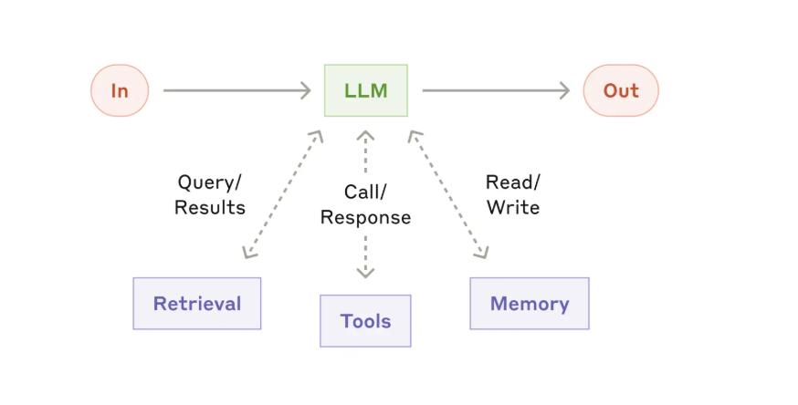
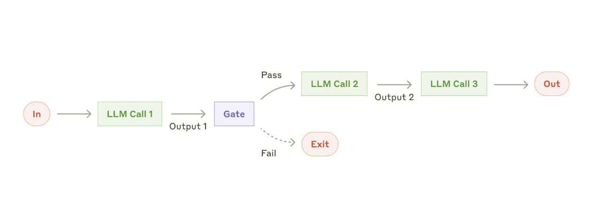
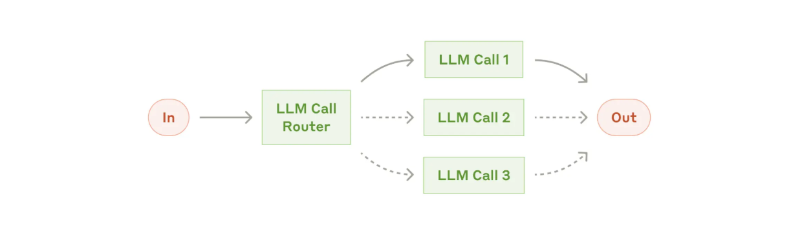
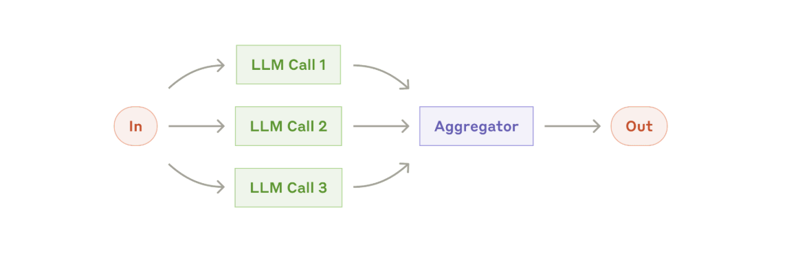
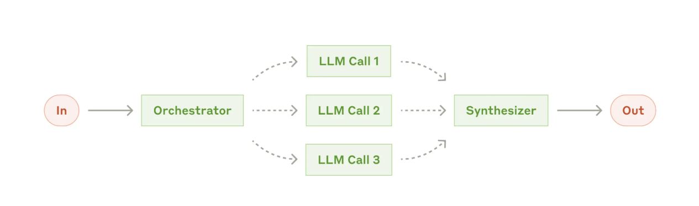
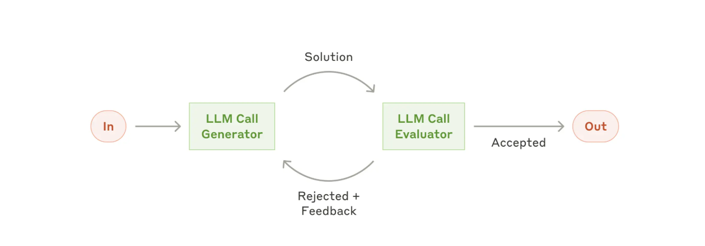
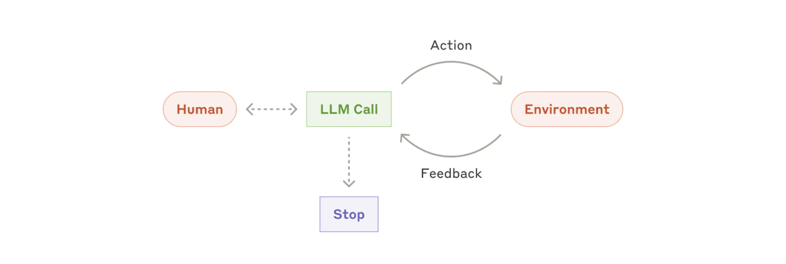

来源： [Building effective agents](https://www.anthropic.com/engineering/building-effective-agents)  
日期： 2024 年 12 月 19 日  
作者： Erik S.、Barry Zhang

# 构建有效的 Agent

We've worked with dozens of teams building LLM agents across industries. Consistently, the most successful implementations use simple, composable patterns rather than complex frameworks.

我们和几十个团队一起做过跨行业的 LLM Agent。一直成立的是：最成功的实现用的是简单、可组合的模式，而不是复杂框架。

Note: Much of the tooling landscape described in this post has changed since December 2024. For our current approach, see [how we built Claude Managed Agents](https://www.anthropic.com/engineering/managed-agents) and the Managed Agents documentation.

注：本文描述的工具生态自 2024 年 12 月以来已有不少变化。若看 Anthropic 现在的做法，见 [how we built Claude Managed Agents](https://www.anthropic.com/engineering/managed-agents) 以及 Managed Agents 文档。

Over the past year, we've worked with dozens of teams building large language model (LLM) agents across industries. Consistently, the most successful implementations weren't using complex frameworks or specialized libraries. Instead, they were building with simple, composable patterns.

过去一年，我们和几十个团队一起做过跨行业的大语言模型（LLM）Agent。一直成立的是：最成功的实现并没有用复杂框架或专用库，而是用简单、可组合的模式来搭建。

In this post, we share what we've learned from working with our customers and building agents ourselves, and give practical advice for developers on building effective agents.

这篇文章写我们从客户合作和自己做 Agent 里学到的东西，并给开发者一些能落地的建议。

## 什么是 Agent？

"Agent" can be defined in several ways. Some customers define agents as fully autonomous systems that operate independently over extended periods, using various tools to accomplish complex tasks. Others use the term to describe more prescriptive implementations that follow predefined workflows. At Anthropic, we categorize all these variations as **agentic systems**, but draw an important architectural distinction between **workflows** and **agents**:

「Agent」可以有好几套定义。有的客户把 Agent 说成长时间独立运行、用各种工具完成复杂任务的全自主系统。有的则用来指更处方化、跟着预定义 workflow 走的实现。在 Anthropic，我们把这些变体都归进 **agentic systems（具代理性的系统）**，但在架构上把 **workflow** 和 **agent** 切开：

- **Workflows** are systems where LLMs and tools are orchestrated through predefined code paths.
- **Agents**, on the other hand, are systems where LLMs dynamically direct their own processes and tool usage, maintaining control over how they accomplish tasks.

- **Workflow**：LLM 和工具沿着预定义的代码路径被编排。
- **Agent**：LLM 动态地主导自己的流程和工具使用，把「如何完成任务」的控制权留在模型手里。

Below, we will explore both types of agentic systems in detail. In Appendix 1 ("Agents in Practice"), we describe two domains where customers have found particular value in using these kinds of systems.

下面分别把两类 agentic system 讲清楚。附录 1（「实践中的 Agent」）写了两个客户感觉特别有价值的领域。

## 何时该用、何时不该用 Agent

When building applications with LLMs, we recommend finding the simplest solution possible, and only increasing complexity when needed. This might mean not building agentic systems at all. Agentic systems often trade latency and cost for better task performance, and you should consider when this tradeoff makes sense.

用 LLM 做应用时，我们建议先找最简单的解，只在需要时再加复杂度。这可能意味着根本不该做 agentic system。这类系统常常拿延迟和成本换更好的任务表现，你得判断这笔交换何时划算。

When more complexity is warranted, workflows offer predictability and consistency for well-defined tasks, whereas agents are the better option when flexibility and model-driven decision-making are needed at scale. For many applications, however, optimizing single LLM calls with retrieval and in-context examples is usually enough.

真需要更复杂时：任务边界清楚，workflow 更可预期、更稳定；需要灵活、并且要在规模上靠模型做决策，才更适合 Agent。对很多应用来说，把单次 LLM 调用用检索和上下文示例优化好，通常就够了。

## 何时、如何使用框架

There are many frameworks that make agentic systems easier to implement, including:

让 agentic system 更好实现的框架有很多，包括：

- The [Claude Agent SDK](https://platform.claude.com/docs/en/agent-sdk/overview);
- [Strands Agents SDK](https://strandsagents.com/) by AWS;
- [Rivet](https://rivet.dev/), a drag and drop GUI LLM workflow builder; and
- [Vellum](https://www.vellum.ai/), another GUI tool for building and testing complex workflows.

These frameworks make it easy to get started by simplifying standard low-level tasks like calling LLMs, defining and parsing tools, and chaining calls together. However, they often create extra layers of abstraction that can obscure the underlying prompts and responses, making them harder to debug. They can also make it tempting to add complexity when a simpler setup would suffice.

这些框架把调用 LLM、定义和解析工具、把调用串起来这类底层活简化了，上手容易。但它们常常多出一层抽象，把底层的 prompt 和回复盖住，调试更难。它们也会诱使人在更简单的搭法就够用时，仍去加复杂度。

We suggest that developers start by using LLM APIs directly: many patterns can be implemented in a few lines of code. If you do use a framework, ensure you understand the underlying code. Incorrect assumptions about what's under the hood are a common source of customer error.

我们建议开发者先直接用 LLM API：很多模式几行代码就能写出来。如果还是用框架，确保你读得懂底下的代码。对「罩子下面是什么」的错误假设，是客户踩坑的常见来源。

See our [cookbook](https://github.com/anthropics/anthropic-cookbook) for some sample implementations.

示例实现见 [cookbook](https://github.com/anthropics/anthropic-cookbook)。

## 构建块、workflow 与 Agent

In this section, we'll explore the common patterns for agentic systems we've seen in production. We'll start with our foundational building block—the augmented LLM—and progressively increase complexity, from simple compositional workflows to autonomous agents.

这一节写我们在生产里见到的常见模式。从基础构建块—增强型 LLM——开始，再逐步加复杂度：从简单的组合式 workflow，到自主 Agent。

### 构建块：增强型 LLM

The basic building block of agentic systems is an LLM enhanced with augmentations such as retrieval, tools, and memory. Our current models can actively use these capabilities—generating their own search queries, selecting appropriate tools, and determining what information to retain.

agentic system 的基础构建块，是带了检索、工具、记忆这类增强的 LLM。现在的模型已经能主动用这些能力：自己生成检索查询、选择合适的工具、决定留下什么信息。

配图1：增强型 LLM

We recommend focusing on two key aspects of the implementation: tailoring these capabilities to your specific use case and ensuring they provide an easy, well-documented interface for your LLM. While there are many ways to implement these augmentations, one approach is through our recently released [Model Context Protocol](https://www.anthropic.com/news/model-context-protocol), which allows developers to integrate with a growing ecosystem of third-party tools with a simple client implementation.

实现时我们建议关注两点：按你的用例裁剪这些能力，并给 LLM 一个好用、文档清楚的接口。增强的做法很多，其中一种是当时刚发布的 [Model Context Protocol](https://www.anthropic.com/news/model-context-protocol)：用一个简单的客户端实现，就能接到不断变大的第三方工具生态。

For the remainder of this post, we'll assume each LLM call has access to these augmented capabilities.

后文默认：每一次 LLM 调用都能用上这些增强能力。

### Workflow：提示链

Prompt chaining decomposes a task into a sequence of steps, where each LLM call processes the output of the previous one. You can add programmatic checks (see "gate" in the diagram below) on any intermediate steps to ensure that the process is still on track.

提示链（Prompt chaining）把任务拆成一串步骤，每一次 LLM 调用处理上一次的输出。你可以在任意中间步加上程序化检查（见图里的 "gate" / 门控），确认流程正常。

配图2：提示链 workflow

When to use this workflow: This workflow is ideal for situations where the task can be easily and cleanly decomposed into fixed subtasks. The main goal is to trade off latency for higher accuracy, by making each LLM call an easier task.

使用场景：任务能干净地拆成固定子任务时最合适。主要目的是用延迟换更高准确度——让每一次 LLM 调用都变成更简单的任务。

Examples where prompt chaining is useful:

提示链好用的例子：

- Generating Marketing copy, then translating it into a different language.
- Writing an outline of a document, checking that the outline meets certain criteria, then writing the document based on the outline.

- 先写营销文案，再翻译成另一种语言。
- 先写文档提纲，检查提纲是否满足若干标准，再按提纲写正文。

### Workflow：路由

Routing classifies an input and directs it to a specialized followup task. This workflow allows for separation of concerns, and building more specialized prompts. Without this workflow, optimizing for one kind of input can hurt performance on other inputs.

路由先给输入分类，再送到专门的后续任务。这样能把关注点拆开，prompt 也可以做得更专。没有这条 workflow，为一种输入做的优化往往会伤到其他输入。

配图3：路由 workflow

When to use this workflow: Routing works well for complex tasks where there are distinct categories that are better handled separately, and where classification can be handled accurately, either by an LLM or a more traditional classification model/algorithm.

使用场景：复杂任务里类别清楚、分开处理更好，并且分类本身能做准——无论是 LLM 还是更传统的分类模型/算法。

Examples where routing is useful:

路由好用的例子：

- Directing different types of customer service queries (general questions, refund requests, technical support) into different downstream processes, prompts, and tools.
- Routing easy/common questions to smaller, cost-efficient models like Claude Haiku 4.5 and hard/unusual questions to more capable models like Claude Sonnet 4.5 to optimize for best performance.

- 把不同类型的客服问询（一般问题、退款、技术支持）送到不同的下游流程、prompt 和工具。
- 把容易/常见的问题分给更小、更省成本的模型（如 Claude Haiku 4.5），把难/少见的问题分给更强的模型（如 Claude Sonnet 4.5），用来换更好的性价比。

### Workflow：并行化

LLMs can sometimes work simultaneously on a task and have their outputs aggregated programmatically. This workflow, parallelization, manifests in two key variations:

有时可以让多个 LLM 同时做一件事，再用程序把输出汇总。这条并行化 workflow 有两个主要变体：

- **Sectioning**: Breaking a task into independent subtasks run in parallel.
- **Voting**: Running the same task multiple times to get diverse outputs.

- **切分（Sectioning）**：把任务拆成彼此独立的子任务并行跑。
- **投票（Voting）**：同一任务跑多次，拿到多样化的输出。

配图4：并行化 workflow

何时使用此工作流：当拆分的子任务可以并行处理以提高速度时，或者为了获得更可靠的结果而需要多种视角或多次尝试时，并行化是有效的。对于涉及多重考量因素的复杂任务，通常通过将每个考量因素分别交由独立的LLM调用来处理，使每个LLM能够专注于特定方面，这样LLM的表现通常会更好。

Examples where parallelization is useful:

并行化好用的例子：

Sectioning:

分层处理：

- Implementing guardrails where one model instance processes user queries while another screens them for inappropriate content or requests. This tends to perform better than having the same LLM call handle both guardrails and the core response.
- Automating evals for evaluating LLM performance, where each LLM call evaluates a different aspect of the model's performance on a given prompt.

- 实施“防护机制”：由一个模型实例处理用户查询，同时由另一个模型实例对查询进行筛查，以过滤不适当的内容或请求。这种方式通常比让同一个大语言模型（LLM）调用同时处理防护机制和核心响应的性能更优。
- 自动化评估以衡量大语言模型（LLM）的性能，即每次LLM调用都针对给定的提示语，评估模型性能的不同方面。

Voting:

投票：

- Reviewing a piece of code for vulnerabilities, where several different prompts review and flag the code if they find a problem.
- Evaluating whether a given piece of content is inappropriate, with multiple prompts evaluating different aspects or requiring different vote thresholds to balance false positives and negatives.

- 审查一段代码有没有漏洞：用几条不同的 prompt 去看，发现问题就标出来。
- 判断某段内容是否不合适：多条 prompt 评不同侧面，或用不同的投票阈值来平衡误报和漏报。

### Workflow：编排器–工人

In the orchestrator-workers workflow, a central LLM dynamically breaks down tasks, delegates them to worker LLMs, and synthesizes their results.

在编排器–工人这条 workflow 里，中央 LLM 动态拆任务、委派给工人 LLM，再综合他们的结果。

配图5：编排器–工人 workflow

When to use this workflow: This workflow is well-suited for complex tasks where you can't predict the subtasks needed (in coding, for example, the number of files that need to be changed and the nature of the change in each file likely depend on the task). Whereas it's topographically similar, the key difference from parallelization is its flexibility—subtasks aren't pre-defined, but determined by the orchestrator based on the specific input.

何时用：复杂任务里你无法预先知道需要哪些子任务（例如写代码：要改几个文件、每个文件改什么，往往取决于这次任务）。拓扑上看它和并行化像，关键差别是灵活性——子任务不是预先写死的，而是编排器按这次输入当场决定。

Example where orchestrator-workers is useful:

编排器–工人好用的例子：

- Coding products that make complex changes to multiple files each time.
- Search tasks that involve gathering and analyzing information from multiple sources for possible relevant information.

- 每次都要对多个文件做复杂修改的编码产品。
- 要从多个来源收集、分析可能相关信息的搜索任务。

### Workflow：评估器–优化器

In the evaluator-optimizer workflow, one LLM call generates a response while another provides evaluation and feedback in a loop.

在评估器–优化器这条 workflow 里，一次 LLM 调用生成回复，另一次在循环里给评估和反馈。

配图6：评估器–优化器 workflow

When to use this workflow: This workflow is particularly effective when we have clear evaluation criteria, and when iterative refinement provides measurable value. The two signs of good fit are, first, that LLM responses can be demonstrably improved when a human articulates their feedback; and second, that the LLM can provide such feedback. This is analogous to the iterative writing process a human writer might go through when producing a polished document.

何时使用此工作流：当我们拥有明确的评估标准，且迭代优化能带来可量化的价值时，此工作流尤为有效。判断其适用性的两个标志是：首先，当人类明确表达反馈意见时，大型语言模型（LLM）的响应能够得到明显改善；其次，大型语言模型能够提供此类反馈。这类似于人类作家在撰写一篇精炼的文档时所经历的迭代写作过程。

Examples where evaluator-optimizer is useful:

评估器–优化器好用的例子：

- Literary translation where there are nuances that the translator LLM might not capture initially, but where an evaluator LLM can provide useful critiques.
- Complex search tasks that require multiple rounds of searching and analysis to gather comprehensive information, where the evaluator decides whether further searches are warranted.

- 文学翻译：译者 LLM 一开始可能抓不住某些细微处，评估器 LLM 能给出有用的批评。
- 需要多轮搜索和分析才能收全信息的复杂检索：由评估器决定还要不要再搜。

### Agents

Agents are emerging in production as LLMs mature in key capabilities—understanding complex inputs, engaging in reasoning and planning, using tools reliably, and recovering from errors. Agents begin their work with either a command from, or interactive discussion with, the human user. Once the task is clear, agents plan and operate independently, potentially returning to the human for further information or judgement. During execution, it's crucial for the agents to gain "ground truth" from the environment at each step (such as tool call results or code execution) to assess its progress. Agents can then pause for human feedback at checkpoints or when encountering blockers. The task often terminates upon completion, but it's also common to include stopping conditions (such as a maximum number of iterations) to maintain control.

随着 LLM 在关键能力上成熟——理解复杂输入、做推理和规划、可靠地用工具、从错误里恢复——Agent 开始出现在生产里。Agent 的工作从人对它的一条命令、或一次交互讨论开始。任务清楚之后，它们独立规划、独立运转，必要时再回来向人要信息或判断。执行过程中，关键是每一步都要从环境拿到「ground truth / 环境真值」（例如工具回执或代码执行结果），用来评估进度。然后可以在检查点、或碰到阻塞时停下来等人反馈。任务常常在完成时结束，但也很常见会加上停止条件（例如最大迭代次数）来保持可控。

Agents can handle sophisticated tasks, but their implementation is often straightforward. They are typically just LLMs using tools based on environmental feedback in a loop. It is therefore crucial to design toolsets and their documentation clearly and thoughtfully. We expand on best practices for tool development in Appendix 2 ("Prompt Engineering your Tools").

Agent 能处理复杂任务，实现却往往很直白。它们通常就是：LLM 根据环境反馈、在循环里使用工具。因此，工具集和文档必须设计得清楚、用心。工具开发的实践写在附录 2（「把工具当作 prompt 来工程化」）。

配图7：自主智能体

When to use agents: Agents can be used for open-ended problems where it's difficult or impossible to predict the required number of steps, and where you can't hardcode a fixed path. The LLM will potentially operate for many turns, and you must have some level of trust in its decision-making. Agents' autonomy makes them ideal for scaling tasks in trusted environments.

何时使用智能体：智能体适用于那些难以或无法预测所需步骤数、且无法硬编码固定路径的开放式问题。大型语言模型（LLM）可能会运行多个回合，因此你必须对其决策能力抱有一定程度的信任。智能体的自主性使其成为在可信环境中扩展任务的理想选择。

The autonomous nature of agents means higher costs, and the potential for compounding errors. We recommend extensive testing in sandboxed environments, along with the appropriate guardrails.

代理的自主性意味着更高的成本，以及错误可能不断累积的风险。我们建议在沙箱环境中进行全面测试，并设置适当的防护措施。

Examples where agents are useful:

Agent 好用的例子：

The following examples are from our own implementations:

下面两个例子来自我们自己的实现：

- A coding Agent to resolve SWE-bench tasks, which involve edits to many files based on a task description;
- Our "computer use" reference implementation, where Claude uses a computer to accomplish tasks.

- 一个编码 Agent，用来解 SWE-bench 任务：根据任务描述改许多文件；
- 我们的 「computer use」参考实现：Claude 操作电脑来完成任务。

（原文配图：High-level flow of a coding agent。）

## 组合与定制这些模式

These building blocks aren't prescriptive. They're common patterns that developers can shape and combine to fit different use cases. The key to success, as with any LLM features, is measuring performance and iterating on implementations. To repeat: you should consider adding complexity only when it demonstrably improves outcomes.

这些积木不是处方。它们是常见模式，开发者可以按用例去塑造、去组合。和任何 LLM 功能一样，成功的关键是测量表现、迭代实现。再说一遍：只在能证明它改善结果时，才考虑加复杂度。

## 总结

Success in the LLM space isn't about building the most sophisticated system. It's about building the right system for your needs. Start with simple prompts, optimize them with comprehensive evaluation, and add multi-step agentic systems only when simpler solutions fall short.

LLM 这件事上的成功，不是做出最精巧的系统，而是做出适合你需求的系统。从简单 prompt 开始，用充分的评测去优化，只有更简单的方案不够用时，再加多步的 agentic system。

When implementing agents, we try to follow three core principles:

实现 Agent 时，我们尽量守三条：

1. Maintain simplicity in your agent's design.
2. Prioritize transparency by explicitly showing the agent's planning steps.
3. Carefully craft your agent-computer interface (ACI) through thorough tool documentation and testing.

1. 保持 Agent 设计简单。
2. 把规划步骤显式展示出来，优先透明。
3. 用心打磨 agent-computer interface（ACI / Agent–计算机接口）：把工具文档写透，并把工具测透。

Frameworks can help you get started quickly, but don't hesitate to reduce abstraction layers and build with basic components as you move to production. By following these principles, you can create agents that are not only powerful but also reliable, maintainable, and trusted by their users.

框架能帮你快点起步，但走向生产时，不要犹豫去减抽象层、用基本组件来搭。守住这几条，做出的 Agent 才不仅有能力，还能可靠、可维护、被使用者信任。

### 致谢

Written by Erik S. and Barry Zhang. This work draws upon our experiences building agents at Anthropic and the valuable insights shared by our customers, for which we're deeply grateful.

Erik S. 与 Barry Zhang 执笔。这篇文章来自我们在 Anthropic 做 Agent 的经验，以及客户分享的洞见。非常感谢。

## 附录 1：实践中的 Agent

Our work with customers has revealed two particularly promising applications for AI agents that demonstrate the practical value of the patterns discussed above. Both applications illustrate how agents add the most value for tasks that require both conversation and action, have clear success criteria, enable feedback loops, and integrate meaningful human oversight.

和客户合作下来，有两类应用特别有前景，也把上面那些模式的实际价值说清楚了。两者都说明：Agent 最能加分的任务，是既要对话又要行动、成功标准清楚、能形成反馈环、并且能接进有意义的人的监督。

### A. 客户支持

Customer support combines familiar chatbot interfaces with enhanced capabilities through tool integration. This is a natural fit for more open-ended agents because:

客户支持把熟悉的聊天机器人界面，和通过工具集成得到的增强能力合在一起。它天然适合更开放的 Agent，因为：

- Support interactions naturally follow a conversation flow while requiring access to external information and actions;
- Tools can be integrated to pull customer data, order history, and knowledge base articles;
- Actions such as issuing refunds or updating tickets can be handled programmatically; and
- Success can be clearly measured through user-defined resolutions.

- 支持交互天然跟着对话走，同时又要访问外部信息和采取行动；
- 可以接工具去拉客户数据、订单历史、知识库文章；
- 退款、更新工单这类动作可以用程序处理；
- 成功可以用用户定义的「已解决」来清楚度量。

Several companies have demonstrated the viability of this approach through usage-based pricing models that charge only for successful resolutions, showing confidence in their agents' effectiveness.

已有几家公司用按次、且只对成功解决收费的定价，证明这条路走得通——这本身就是对 Agent 有效性的信心。

### B. 编码 Agent

The software development space has shown remarkable potential for LLM features, with capabilities evolving from code completion to autonomous problem-solving. Agents are particularly effective because:

软件开发这块已经显示出 LLM 能力的明显潜力：从代码补全走到自主解题。Agent 在这里特别有效，因为：

- Code solutions are verifiable through automated tests;
- Agents can iterate on solutions using test results as feedback;
- The problem space is well-defined and structured; and
- Output quality can be measured objectively.

- 代码方案可以用自动测试验证；
- Agent 能把测试结果当反馈，迭代方案；
- 问题空间清楚、有结构；
- 输出质量可以客观度量。

In our own implementation, agents can now solve real GitHub issues in the SWE-bench Verified benchmark based on the pull request description alone. However, whereas automated testing helps verify functionality, human review remains crucial for ensuring solutions align with broader system requirements.

在我们自己的实现里，Agent 现在已经能仅凭拉取请求描述，解 SWE-bench Verified 基准里真实的 GitHub issue。不过自动测试只能帮着验证功能是否成立；要保证方案还对齐更宽的系统要求，人的审阅仍然关键。

## 附录 2：把工具当作 prompt 来工程化

No matter which agentic system you're building, tools will likely be an important part of your agent. Tools enable Claude to interact with external services and APIs by specifying their exact structure and definition in our API. When Claude responds, it will include a tool use block in the API response if it plans to invoke a tool. Tool definitions and specifications should be given just as much prompt engineering attention as your overall prompts. In this brief appendix, we describe how to prompt engineer your tools.

无论你在搭哪一种 agentic system，工具多半会是 Agent 的重要部分。工具让 Claude 能和外部服务、API 交互：你在 API 里把工具的结构和定义写精确。Claude 若打算调用工具，回复里会带上一个 tool use 块。工具的定义和规格，该得到和整体 prompt 同等分量的 prompt engineering 注意力。这篇短附录写怎么把工具当作 prompt 来工程化。

There are often several ways to specify the same action. For instance, you can specify a file edit by writing a diff, or by rewriting the entire file. For structured output, you can return code inside markdown or inside JSON. In software engineering, differences like these are cosmetic and can be converted losslessly from one to the other. However, some formats are much more difficult for an LLM to write than others. Writing a diff requires knowing how many lines are changing in the chunk header before the new code is written. Writing code inside JSON (compared to markdown) requires extra escaping of newlines and quotes.

同一件动作往往有好几种写法。例如改文件：可以写 diff，也可以重写整个文件。结构化输出：代码可以放在 markdown 里，也可以放在 JSON 里。在软件工程里，这类差别是表面的，可以无损互转。但对 LLM 来说，有些格式比另一些难写得多。写 diff 要求在新代码写出来之前，就知道 chunk header 里改了多少行。把代码写进 JSON（相对 markdown）还要额外转义换行和引号。

Our suggestions for deciding on tool formats are the following:

关于工具格式，我们的建议是：

- Give the model enough tokens to "think" before it writes itself into a corner.
- Keep the format close to what the model has seen naturally occurring in text on the internet.
- Make sure there's no formatting "overhead" such as having to keep an accurate count of thousands of lines of code, or string-escaping any code it writes.

- 给模型足够的 token 去「想」，免得它把自己写进死角。
- 让格式贴近模型在互联网文本里自然见过的样子。
- 不要有格式上的「额外负担」：例如必须准确数清几千行代码，或对它写下的任何代码做字符串转义。

One rule of thumb is to think about how much effort goes into human-computer interfaces (HCI), and plan to invest just as much effort in creating good agent-computer interfaces (ACI). Here are some thoughts on how to do so:

一条经验：想想人机接口（HCI）花过多少功夫，就准备花同样多的功夫去做像样的 Agent–计算机接口（ACI）。一些做法：

- Put yourself in the model's shoes. Is it obvious how to use this tool, based on the description and parameters, or would you need to think carefully about it? If so, then it's probably also true for the model. A good tool definition often includes example usage, edge cases, input format requirements, and clear boundaries from other tools.
- How can you change parameter names or descriptions to make things more obvious? Think of this as writing a great docstring for a junior developer on your team. This is especially important when using many similar tools.
- Test how the model uses your tools: Run many example inputs in our workbench to see what mistakes the model makes, and iterate.
- Poka-yoke your tools. Change the arguments so that it is harder to make mistakes.

- 把自己放进模型的位置。只看描述和参数，用这个工具是否一目了然，还是你也得仔细想？若你都要想，模型大概也要想。一份好的工具定义常常包括：用法示例、边界情况、输入格式要求、以及和其他工具的清楚边界。
- 怎样改参数名或描述能让事情更显然？把它当成给组里一名初级开发者写一份出色的 docstring。工具很多、又很像的时候尤其重要。
- 测试模型怎么用你的工具：在 workbench 里跑大量示例输入，看它会犯什么错，再迭代。
- 给工具做 poka-yoke（防呆）。改参数，让出错更难。

While building our agent for SWE-bench, we actually spent more time optimizing our tools than the overall prompt. For example, we found that the model would make mistakes with tools using relative filepaths after the agent had moved out of the root directory. To fix this, we changed the tool to always require absolute filepaths—and we found that the model used this method flawlessly.

做 SWE-bench 的 Agent 时，我们花在优化工具上的时间，其实比花在整体 prompt 上更多。例如：Agent 离开根目录之后，用相对路径的工具就会出错。我们改成始终要求绝对路径——之后模型用这个方法几乎不出错。
