原文： https://www.woshipm.com/ai/6215249.html

------

在AI技术飞速发展的当下，多智能体系统（Multi-Agent System）正成为新的突破方向，而Agent Infra（智能体基础设施）则成为实现这些系统落地的关键。E2B作为这一领域的新兴参与者，凭借其为Manus等项目提供的“专属电脑”支持而备受关注。E2B不仅允许用户在云端的安全隔离沙盒中运行AI生成的代码，还致力于成为AI Agent时代的AWS，为Agent从开发到部署的完整生命周期提供支持。

Multi agent 系统正成为新的突破方向的过程中，agent infra 也成为落地关键。在 computer use 带来范式创新的趋势下，virtual machine 将成为潜在创业机会，E2B 就是这个领域的新兴参与者。

E2B 之所以受到市场关注很大程度上是因为 Manus，Manus agent 完成任务过程中的 virtual computer 支持正是来自于 E2B。E2B 成立于 2023 年，作为一个开源基础设施，允许用户在云端的安全隔离沙盒中运行 AI 生成的代码。E2B 本质上是一个可以快速启动（~150 毫秒）的 microVM，它的底层类似于 AWS Firecracker 这个代表性的 MicroVM，在此基础上， AI Agents 可以在 E2B 中运行代码语言、使用浏览器、调用各种操作系统中的工具。

随着 Agent 生态的繁荣，E2B 的沙盒月创建量一年内从 4 万增长到 1500 万，一年内增长了 375 倍。

## 为什么 AI agents 需要专属的“电脑”？

为了更好地理解这个问题，我们编译了 CEO Vasek Mlejnsky 最新的两次访谈，以及 E2B 内部一篇有关 computer use agent 的技术博客。本文详细介绍了 E2B 的技术理念，以及团队从代码解释器转型为更通用的 agent 运行环境背后的思考。

**E2B 的愿景很大，CEO 的目标是成为 AI Agent 时代的 AWS**，成为一个自动化的 infra 平台，未来可以提供 GPU 支持，满足更复杂的数据分析、小模型训练、游戏生成等需求，并可以托管 agent 构建的应用，覆盖 agent 从开发到部署的完整生命周期。

## 01.E2B 是什么？

### E2B 的创立、发展和转型

E2B 的两个创始人是 Vasek Mlejnsky（CEO）和 Tomas Valenta（CTO），来自捷克。在正式创业之前，二人就已经合作过很多项目。

在创立 E2B 之前，Vasek 和 Tomas 在做的产品叫做 DevBook，这是一个面向开发者的交互式文档，可以看作是 E2B 的雏形。GPT-3.5 发布后，二人尝试构建 agent 来自动化工作，因为每一个项目都需要一套工具集成到后端，于是他们利用 DevBook 已有的沙盒技术运行代码，并将 agent 自动拉取 GitHub、编写代码、部署到 Railway 的相关内容发到了 twitter，推文意外被 Greg Brockman 等人转发，在几天内获得了大约 50 万次浏览。之后二人迅速开源并将重心转向沙盒环境，在 2023 年 3 月创立了 E2B。

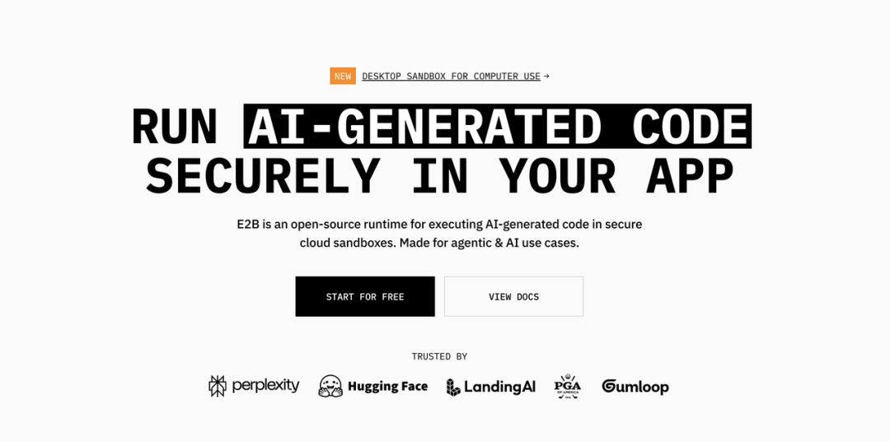

**Vasek 表示，团队一开始就意识到了代码执行是 agent 技术栈中至关重要的一环。代码就像是一种通用语言，可以作为连接一切的粘合剂**，人类开发者就是通过代码把各种服务和 API 连接起来，从而让系统跑得起来的，为什么 agent 不能做同样的事情呢？Agent 需要一个安全、灵活的代码执行环境，且随着 agent 越来越强大，代码运行环境也变得越来越重要。

**E2B 发展的一个关键点是引入了“代码解释（code interpretor）”这个概念**，当团队开始用这个词解释产品的时候，很多用户一下子就明白了：如果用户想用 AI 进行数据分析、可视化，代码执行就非常关键，因为这些任务都需要运行 AI 生成的代码；如果想让大模型更聪明，比如能做数学运算，那代码就可以被看作是一个非常通用的计算器；有用户想构建一个 AI 驱动的 Excel，只需要描述每一列该做什么，agent 就会根据描述动态生成代码、执行代码，用户就可以轻松完成数据增强、数据分析等任务。

在创业早期，**E2B 花了很多时间通过使用明确的用例来教育市场、获取用户。**

2024 年 10 月，Anthropic 推出了 computer use，但其实早在六个月前，E2B 就已经有了一个桌面版的沙盒环境，只是当时没有模型能够真正用起来，因此这一功能未被广泛关注。大约在 2024 年底至 2025 年初，团队开始观察到用户将沙盒用于 computer use。同时 Vasek 注意到，在 2024 年的时候人们还在尝试构建 agent，但到了 2025 年，agent 已经被越来越多地被投入到生产环境，出现了大量新的用例。

如何定义B端产品及B端产品经理方法论

相较于C端产品，B端产品最大的特点是：面向特定领域用户，且数量少得多，但更注重对用户专业领域操作流程的深度挖掘——也就是专业性更强，与业务的结合更紧密。

查看详情 >

随着这一趋势的发展，人们已经不再沙盒仅仅用于运行数据分析等代码片段，E2B 顺势调整了产品定位，**不再将沙盒仅视为代码解释器，而是逐渐拓展为更通用的 LLM 或者 agent 运行时的环境。**

**受益于 LLM 能力的提升和 agent 的落地，E2B 在 2024 年取得了非常好的增长，2025 年更是直线上升，沙盒的月创建量一年内从 4 万增长到 1500 万。**

### 产品功能和定位

**E2B 提供了一个安全的沙盒环境，能够让 AI agent 在云端安全运行 ，agent 可以使用沙盒创建文件、使用浏览器、分析数据、编写小型应用程序、创建 Excel 表格等，可以实现的任务场景相当丰富。**

E2B 支持多种代码语言，目前使用最多的是 Python 和 JavaScript，前者每月有接近 50 万次的 SDK 下载，后者有约 25 万次。

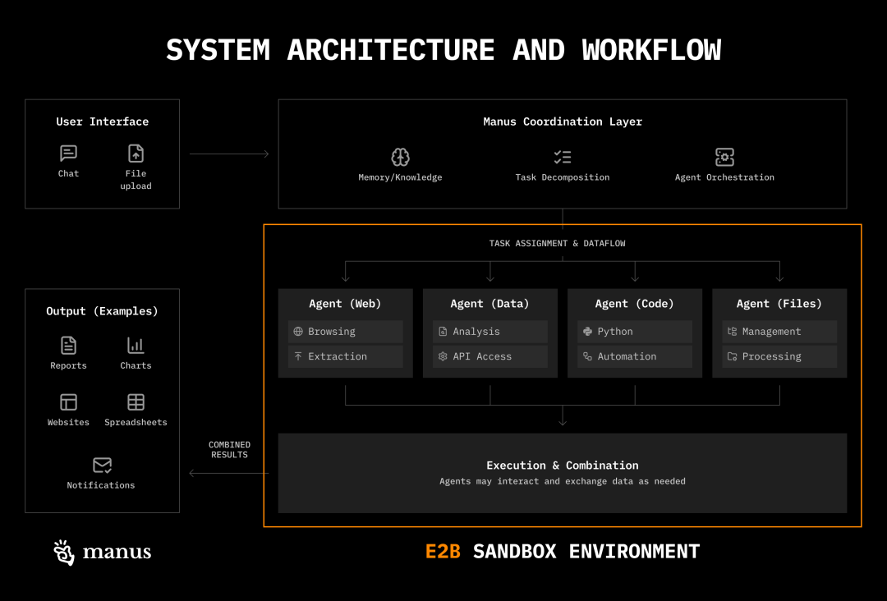

**Vasek 希望 E2B 能成为 AI agent 时代的 AWS，成为一个自动化的 infra 平台，未来可以提供 GPU 支持，满足更复杂的数据分析、小模型训练、游戏生成等需求，并可以托管 agent 构建的应用，覆盖 agent 从开发到部署的完整生命周期。**

但这并不意味着 E2B 会去做 prompt 或者 memory 等，Vasek 相信 LLMs 会持续变得更强大，很多现在看起来复杂的问题，未来可能都会自动被解决。

但有些问题是比较难被自动解决的：比如怎么确保总是能从 LLM 得到一个响应？如果接入的模型提供商宕机了，要怎么自动切换到另一个提供商？这是开发者多年来一直在面对的老问题，只不过现在换了场景：以前是在传统软件中，现在是在 AI 环境中。

此外，传统云计算是为已有应用设计的，而 agent 执行的代码是动态生成、不可预知的。这些问题还是需要用一种全新的方式来解决。

Vasek 提到，大多数时候，开发者找到 E2B 也是从一个很简单的需求开始的，比如开发者一开始只是用一个 serverless 函数，或者是在服务器上跑一个 API 接口来执行代码，在开发的早期阶段甚至可以就在本地运行代码。

但随着产品的发展，尤其是想要规模化地运营时，问题就会一个接一个地出现了。比如：

- 安全性与隔离性：开发者希望确保不同用户的代码不会在同一个环境里运行，因为开发者并不知道用户的代码具体在干什么，也不知道有没有敏感信息被泄露。
- 权限与自由度：开发者想给 agent 或 AI 应用尽可能大的自由度，让它们可以运行任何想运行的代码，这可能包括访问完整的文件系统、下载依赖包等。

这些都会带来各种技术和安全挑战，比如如何高效、动态地生成隔离的代码执行环境，如何让这些环境随时可用，并确保稳定和安全等等。很多开发者慢慢意识到这需要一个更专业、更安全的解决方案，也就自然而然地转向像 E2B 这样的产品。

随着 multi agent 的发展，团队接下来会尽快推出新功能 forking（分叉）和 checkpointing（检查点），从而使得多个 agent 可以并行尝试不同解决路径，就像树状结构，每个节点就是一个沙盒快照，可以分叉出去进入下一个状态，最终找到最优路径，类似蒙特卡洛树搜索。forking 和 checkpointing 还可以很好地解决本地状态管理问题，比如保留中间进度，避免每次都从头来过。

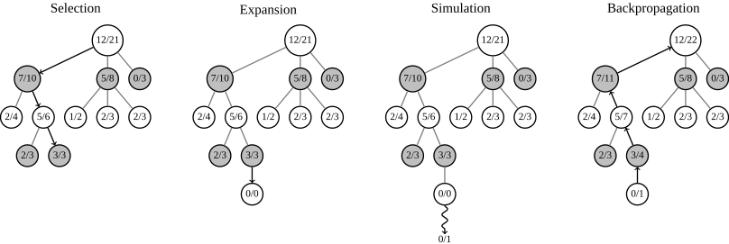

蒙特卡洛树搜索是一种常用于决策问题中的搜索算法，结合了随机模拟和树状搜索的优点，能在计算资源有限的情况下找到接近最优的决策。

E2B 目前已经实现了 persistence（持久化），这是实现 forking 和 checkpointing 的基础。用户可以先暂停沙盒，然后在一个月后将沙盒恢复到暂停时的状态，从而使得 agent 可以运行更长时间或间歇性执行任务。

### 使用场景

**E2B 最重要的使用场景之一是给 AI 数据分析提供支持。**

开发者上传一个 CSV 文件，然后向 AI 提问：“我上传了一个 CSV 文件，它包含这些列，你可以写 Python 代码来分析这些数据。”但是这些代码必须要有地方可以运行，E2B 专门为这种场景打造了一个高度优化过的运行环境，并提供了一个专用的 SDK，叫做 code interpreter SDK，整个环境的闭环非常自然：

- 开发者可以直接创建图表，甚至是交互式图表；
- 开发者可以安装第三方库，E2B 已经预包装了常用的数据分析包；
- AI 模型可以方便地引用自己前面生成的代码块；
- 如果代码出错了，开发者可以把错误信息快速反馈给 LLM，让它尝试修复。

对于开发者来说，由于 E2B 做了隔离机制，每一个 agent 都有专属的沙盒环境，agent 会更可靠。

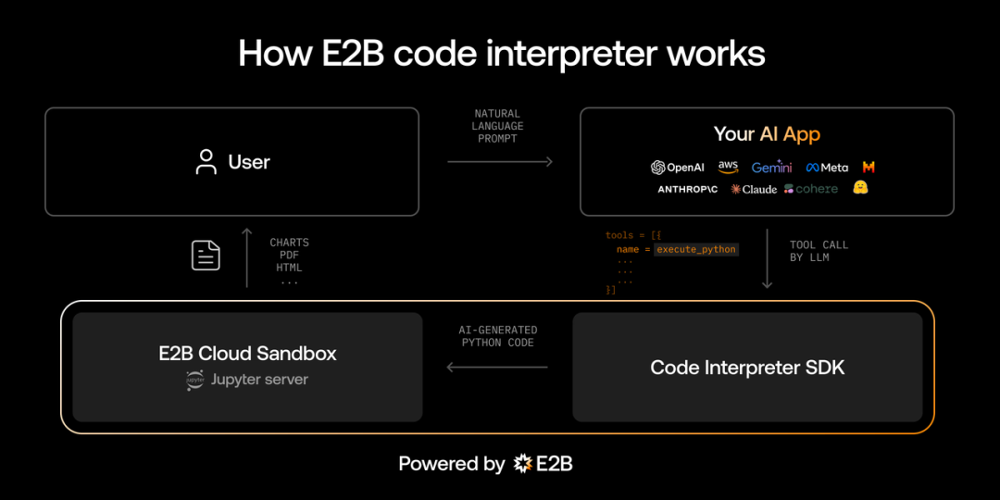

**E2B 第二大使用场景是作为 AI 生成应用的运行平台**，这个领域发展得非常快，尤其是人们开始基于各种不同的框架来构建 AI 驱动的应用，这些应用需要一个可以运行 AI 生成代码的环境，也就是需要一个专门的运行时（runtime）来支撑这类 AI 生成的应用逻辑。

因此 E2B 创建了一个开源模板，叫做 Fragments，开发者可以复制这个模板作为构建自己 AI 应用平台的起点。开发者可以在界面中直接输入：“帮我用 Next.js 构建一个待办事项应用”，LLM 会生成相应的代码，并把它发送到沙盒环境中运行，开发者马上就会看到应用效果。

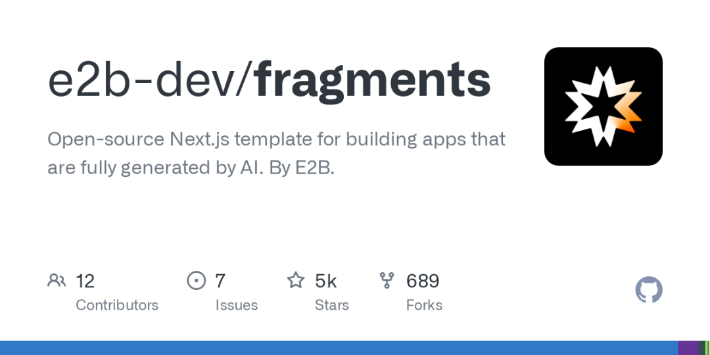

**E2B 现在正在逐步进入更多的场景，Vasek 观察到有开发者在做代码执行的时候，目的并不是构建面向开发者的 agent**，比如有开发者做了一个 AI 驱动的 Excel，这个产品并不是面向开发者的，它的最终用户可能是 CEO、企业高管、业务人员，或者公司内部任何需要使用数据的人。但在这个产品底层，是通过代码执行来实现功能的。

Vasek 表示看到了越来越多这样的趋势——虽然现在还非常早期，但这是一个非常令人兴奋的方向，**因为人们正在意识到，代码执行不仅仅服务于开发者，也可以服务于其他类型的用户。**

**还有一个有趣的 use case 是 Hugging Face 在构建 Open R1 的时候，在强化学习、代码生成的训练阶段用到了 E2B**，具体来说，Open R1 模型有一个训练步骤是模型接收一个编程题，然后需要生成并在某个地方运行代码，接着奖励函数会返回一个 0 或 1 来表示是否正确，再用这个反馈来优化模型。

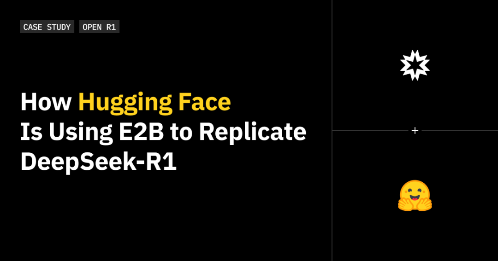

Hugging Face 使用 E2B 的沙箱来运行这些代码，每个训练步骤会启动数百甚至上千个沙箱，从而实现高并发。这种方式非常快，而且不需要用昂贵的 GPU 集群来处理。在使用 LLM 的时候，开发者不用担心它会改动集群里的权限进而影响系统，因为每个沙盒都是彼此隔离和安全的。

Vasek 表示已经有几家公司要以这种方式来使用 E2B 训练模型，虽然这不是团队一开始设想的场景，但现在看起来是非常合理的。**从 AI agent 生命周期角度来看，E2B 应当在周期里介入得越早越好，而训练阶段可能就是最早的一环**。

### 如何提高开发者粘性？

**提升开发者的粘性是构建开发者工具中最难的一点，关键在于找到合适的开发者体验（DX）。**

**Vasek 认为，“GPT Wrapper”在当下是个好生意，能够快速利用底层模型能力提升带来的益处，**目前来看，用户切换模型的成本越来越低，基本上只需要一两行代码，就可以从 Gemini 切换到 Claude 或者 OpenAI，用户也经常切换模型。**但确保自身的应用或 agent 在模型切换中还能正常运行其实是很难的。**

E2B 的一个重要价值主张是，当客户（尤其是大公司）使用 E2B 时，他们不会觉得被某一个 LLM 锁死。比如 OpenAI 有自己的 code interpreter，但很多客户并不想用，一方面是因为他们控制不了，另一方面是如果他们用了，他们就必须一直绑定在 OpenAI 上，没法切换到 Google 或者开源模型，因为 OpenAI 的 code interpreter 不会去适配其他模型，所以他们根本没有这个动力去使用。所以 E2B 需要让开发者更容易去切换模型。

**Vasek 认为真正赢得开发者的方法是提供的体验好到让开发者几乎不需要思考自己在用一个工具——就像是大脑的延伸一样。**虽然这听起来好像反而让人更容易换工具，因为开发者没有在有意识地去依赖它，但实际上，正因为开发者不需要思考，才更不愿意换，工具完全进入了工作流。要达到这个效果，需要注意各种小细节，比如开发者不需要理解 infra 的复杂逻辑，不需要做一堆配置文件，这些东西是糟糕的开发体验。

**总而言之，E2B 需要对 LLM 保持中立。从技术角度来看，E2B 希望成为 agent 领域的 Kubernetes，同时具有更好的开发者体验。**

Kubernetes 是一个开源的容器编排平台，用于自动化容器化应用的部署、管理、扩展和运行。

## 02.E2B 是怎么看 AI Agent 的？

### Agent 时代，软件该如何定价？

Agent 的定价是一个非常值得讨论的问题，有人认为传统的按席位收费并不适用于 agent，因为有些 agent 可能只运行几秒钟，有些 agent 可能需要运行几个小时，但如果按使用量计费，用户可能会在不知情的情况下花费很多钱，从而导致用户不敢继续使用。

Vasek 认为对于 infra 公司来说，定价确实是一个非常难的事情。

创始人在创办一家 infra 公司时，常常希望把定价做得非常简单，比如每月用户就付一百美元，如果超过了某个限制，再使用其他方式收费，但开始扩展规模的时候，创始人就会发现需要考虑的因素非常多，比如要考虑流量、存储量，还有各种细小的资源消耗等等，最后往往会有一张非常复杂的价格表。

**因此如何向用户传达定价逻辑就变得非常重要**，基本的功能是必须要有的，比如计费上限、费用预警，这些功能可以确保用户感到对自己的支出是有完全的掌控感。同时还要提供良好的可观测性，用户必须清楚知道他们用掉了什么资源、花了多少钱。

### Agent 的下一个应用场景：computer use

现在 agent 被广泛谈论的三个主要使用场景是：

1. 写代码（coding），比如 Cursor；
2. 销售（sales），比如市场拓展环节开始自动化，很多原本销售代表需要手动做的工作正在被解放；
3. 客户支持（customer support），比如 Sierra 和 Decagon 这样的公司正在被《财富》百强企业使用。

**Vasek 认为下一个 agent 真正能工作起来的场景是：让 agents 控制电脑或者浏览器**。

Anthropic 是去年最早公开发布相关内容的公司之一，OpenAI 今年也发布了 Operator。这件事带来了各种可能性和挑战，比如，用户可能不会希望 agent 完全随意使用自己的电脑，用户还是会希望有一些控制，比如可以选择是否允许 agent 操作。

现在人们正在为 agent 构建电脑，E2B 也推出了自己的 Desktop Sandbox，本质上就是一个带图形界面的云电脑，还开源了一个 open-computer-use 项目，结合开源大模型，尝试去模拟使用电脑的行为。这个项目对 E2B 来说也是个挑战：**E2B 能不能仅凭开源大模型就构建出能使用电脑的 agent？**

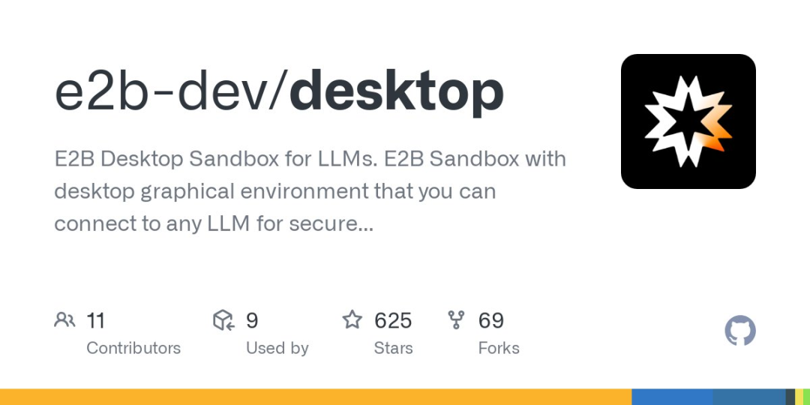

Vasek 认为，在 2025 年，这个方向会非常有趣，因为潜在回报非常高，但不确定性也很大。Vasek 并不完全确定五年后，agent 是否还会用云电脑的方式来运作，可能会有更好的替代方案出现。但现在，这是一个非常值得探索的领域，特别是如果 E2B 能为每台本地机器创建一个数字孪生，那对企业和非开发者类的工作来说，将会是一件大事。

**不过 Operator 这类产品的目标并不是“看着 agent 替你完成任务”，Vasek 认为人在使用 agent 的时候，好处在于心理负担会小很多，因为根本不需要再去思考“我必须去做这件事”——在理想世界里，会有一个待办事项应用，人们只要在这个应用中输入一个任务，这个任务就会自动由某个 agent 开始处理了。**

不过有个有趣的问题是，现在的网站，比如航空公司订票网站、酒店预订平台，都是专门为让人点击操作而优化的，很多公司为此花了数百万美元去提升点击率。但现在，访问这些网站的却开始变成了 agent。

**现在还有一个潜在概念是 LLM 可以让用户即兴完成各种事情，用户甚至不需要电脑，一切都可以被“生成”出来。**

### 如何教 AI 使用电脑？

在 computer use agent 这个话题上，E2B 的 AI engineer James Murdza 在 2025 年 1 月撰写了一篇博客，文中介绍了 James 做的一个开源 computer use agent，可以使用个人电脑的全部功能，比如接收“在网上搜索可爱猫咪图片”这样的指令，通过 LLM 进行推理，自动操作鼠标和键盘来完成任务。

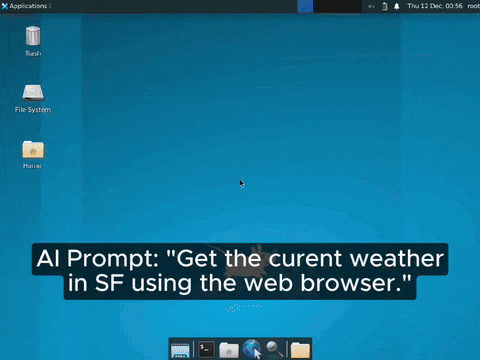

这个工具和其他工具的不同之处在于它是完全开源的，并且只使用开源权重模型。这意味着任何人都可以自由运行和修改这个项目。**工作原理是 agent 会不断截取屏幕截图，并询问 Llama 下一步该怎么做，直到模型判断任务完成为止。**

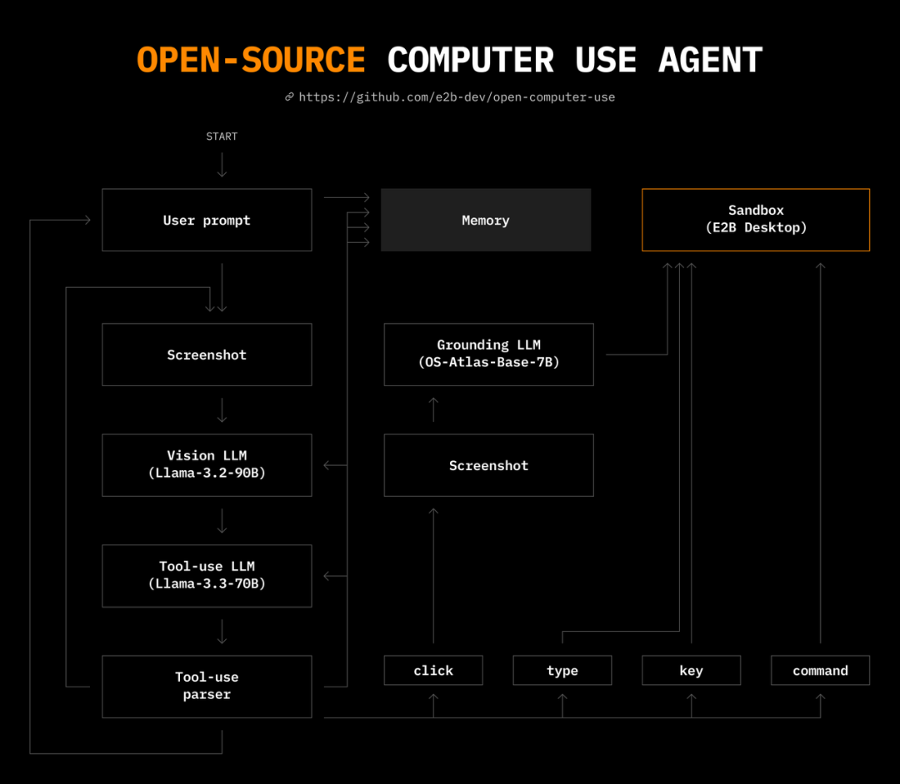

这个项目的技术挑战在于：

- 1. 安全性：需要将操作系统隔离在一个安全、可控的环境中；
- 2. 点击操作：要让 AI 能精准点击、操控 UI 元素；
- 3. 推理能力：要让 AI 能根据所见决定下一步该做什么或何时结束任务；
- 4. 部署小众 LLM：需要以低成本托管开源模型，尤其是小众的开源项目 OS-Atlas；
- 5. 实时画面流传输：要有一种低延迟的方式来展示和录制沙盒环境。

**挑战一：安全性**

理想的 AI agent 运行环境应该是易于使用、性能良好、且具备安全保障的，毕竟让 AI agent 直接访问个人电脑和文件系统是非常危险的，因为 agent 可能会误删文件，甚至执行一些无法挽回的操作。因此 James 没有让 agent 直接访问本地电脑，而是使用了 E2B。

**挑战二：点击操作**

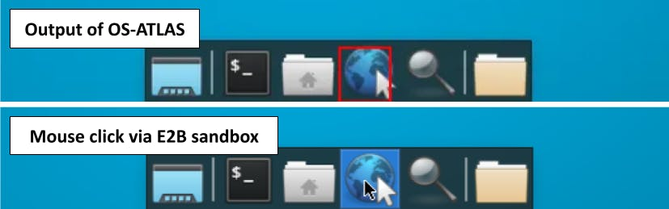

基于 LLM 的“电脑操作”在界面是文本为主的情况下其实相对简单，只靠文字指令就能完成很多任务。但有些应用基本不可能在没有鼠标的情况下使用，因此如果想做一个真正全面的电脑操作 agent，就必须支持鼠标点击功能。

传统方案的效果并不令人满意，比如使用传统计算机视觉模型作为屏幕和 LLM 之间的桥梁，这类方法在识别文字和部分图标方面还不错，但根本分不清文本框、按钮或者其他交互元素。中国有学者在研究具身视觉语言模型（grounded VLMs），这是一种视觉+语言模型，关键是可以输出精确的坐标，指向输入图像中的具体位置。Gemini 和 Claude 也具备类似能力，但并不是开源的。

最后 James 选择了 OS-Atlas，因为 OS-Atlas 不仅在 Hugging Face 上发布了模型权重，还在一篇论文中详细介绍了模型训练过程。

OS-Atlas 是一个开源免费的项目，目的是为游戏玩家提供用于运行游戏的操作系统，基于 Windows 10 定制，删除了各种非必要的系统组件。

**挑战三：推理能力**

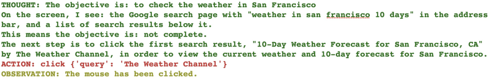

Agent 的强大之处就在于它可以在多种操作之间做出选择，并基于最新的信息做出合理判断。最初用户通过 prompt 可以让 LLM 以特定的文本格式输出一个操作，然后把操作结果添加进上下文中，再次调用 LLM 进行下一步。后来用户可以通过微调来强化系统提示，这个能力一开始叫“函数调用（function calling）”，现在更流行的说法是“工具调用（tool use）”。

但将视觉输入结合进工具调用流程，并在一次 LLM 调用中完成视觉理解和操作决策，在当时还是一个相对新颖的做法，James 表示他使用的是：

- Llama-3.2-90B-Vision-Instruct：用于查看沙盒环境的画面，并决定下一步该做什么；
- Llama 3.3-70B-Instruct：将 Llama 3.2 的决策转化成工具调用的格式；
- OS-Atlas-Base-7B：作为一个可以“被调用”的工具，依据输入的 prompt 进行点击操作。

值得一提的是，James 认为市面上的 agent 框架不太有用。这些框架的主要作用是封装 LLM 的输入格式和输出解析、做 agent 的 prompt、做 agent 的运行循环（Run loop），但 James 希望运行循环非常简单，同时也不希望 agent 的 prompt 被框架直接黑盒化处理，因为这是 James 最常需要调整的部分。所以框架唯一的可能用处就是对接 LLM 服务商，尤其是涉及工具调用和图像支持的时候，但当时大多数服务商已经在统一使用 OpenAI 的工具调用格式了，当有例外时，框架文档又常常说明不清。

James 表示工具调用不是一个单一的功能，而是一整套组合拳，包括 LLM 的微调、prompt 设计、字符串格式解析、API 接口规范等。不管是在服务端还是客户端，要把这些拼好并持续更新，框架是很难抽象到位的，最后开发者还是要手动调整。

**挑战四：部署小众 LLM**

为了让 agent 运行更快，James 希望 LLM 推理能放在云端，同时还希望用户能开箱即用。问题在于，James 能为 Llama 这样相对主流的模型找到靠谱的服务商，但 OS-Atlas 这样相对冷门的模型，很多推理服务商都不愿意提供 serverless 服务，最后 James 使用 Hugging Face 提供的免费空间来调用 OS-Atlas。

**挑战五：实时画面流传输**

为了能看到 AI 正在做什么，James 希望实时获取沙盒环境中的屏幕画面，并成功用 FFmpeg 实现。

FFmpeg 是一个开放源代码的自由软件，可以执行音频和视频多种格式的录影、转换、串流功能。

服务端命令：把当前屏幕录成视频流，通过 HTTP 开一个服务器，但一次只能连一个客户端。

ffmpeg -f x11grab -s 1024×768 -framerate 30 -i $DISPLAY -vcodec libx264 -preset ultrafast -tune zerolatency -f mpegts -listen 1 http://localhost:8080

客户端命令：客户端连接服务器，同时把视频保存下来并实时播放。

ffmpeg -reconnect 1 -i http://servername:8080 -c:v libx264 -preset fast -crf 23 -c:a aac -b:a 128k -f mpegts -loglevel quiet – | tee output.ts | ffplay -autoexit -i -loglevel quiet –

**James 在整个开发过程中一直在思考一个问题：AI agent 到底应该尽量通过 API 控制，还是靠视觉去模拟人类点击？答案其实很清楚：有 API 的时候，尽量用 API。但问题在于，大部分软件压根没考虑被程序控制，所以基本没有合适的 API。**

因此，James 选择特意让 agent 模拟人类操作。但做 agent 的时候，其实也应该考虑除了视觉界面以外的其他可用接口，比如：

- 标准 API：文件系统 API、Microsoft Office API 等；
- 代码执行接口：运行 Bash 或 Python 脚本来打开应用、读取文件；
- 辅助功能 API（Accessibility API）：桌面系统常提供这种接口，可以“看见”GUI 结构（Graphics User Interface，图形用户界面）；不过在 Linux 上支持度不如 macOS 或 Windows；
- 网页的 DOM 接口：可以半结构化地访问网页元素；
- MCP：专为 agent 设计，支持提供上下文与操作入口。

**James 认为现在只能靠视觉是因为大多数应用根本不提供友好的结构化入口，尤其是辅助功能 API，如果辅助功能 API 能更强，不光 AI agent 能用，人类视障用户也会受益。如果一切都能像 Zapier 那样有适配器统一接入，那效率会高很多。**

还有一个悬而未决的大问题是如何安全地处理用户认证？最不安全的方式就是让 AI 拥有和人一样的权限。更安全的做法是设置权限范围，就像 OAuth 授权、iOS App 权限控制那样。

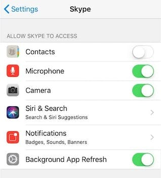

James 创建了一个全新的、隔离的沙盒环境，没有任何用户数据，但这并不能从根本上解决问题。如果用户没有安全的方式可以选择，他们往往就会选择一个不安全的做法。因此，James 认为以下问题值得思考：

1. **如何为 computer use agent 提供带权限范围限制的 API 访问能力**，比如 agent 可以使用传统 API 查看用户的邮箱收件箱，但无法删除或发送邮件。
2. **如何对传递给 LLM 的敏感信息进行脱敏处理，并在输出结果中还原**，比如用户可以预先设置一些信用卡卡号之类的密钥信息，这些信息可以传递给工具使用，但不会暴露给大模型本身。

James 预期开源模型会迅速朝着具备视觉能力的推理进步，也很期待通过给 agent 加入更多 API 工具来增强能力。

### Agent 框架定制化 VS 使用现成框架

James 在上文提到现在市面上现成的框架并不好用，长期来看，中大型企业是否会觉得自身企业环境特殊，因此 agent 必须要有可扩展性和定制能力，从而转向自己开发？

Vasek 认为最初这些框架诞生的时候，是在 LLM 发展的非常早期阶段，当时很多核心概念都在不断演变，甚至现在也还在变化，但至少已经形成了一些共识，比如某些类型的 prompt 可以被高效使用，Chain of Thought、ReAct 等方法已经变得更为稳定，也逐渐搞清楚了 agent 应该怎么使用工具等等。

对开发者来说，如果在用的框架本身还在不停变化，那开发起来就会很痛苦。与其有十种不同的方式可以做一件事，不如有一个明确可用的方式，这也是 Vasek 使用框架的原因。

Vasek 认为每个框架都有自身明确的“方法论”和偏好，开发者需要认可它的方式，未来有明确主张的框架（opinionated frameworks）会越来越流行，开发者也会更愿意接受，Crew AI、LangGraph 已经有这样的趋势了。

Crew AI 是开源 multi agent 协调框架，LangGraph 是由 LangChain 团队推出的一个在 LangChain 之上构建的模块，用于构建有状态和多角色的 agents 应用。

框架的演进是一场没有终点的战斗，总会有新的框架出现。现在的 agent 框架之争，就像当初 Transformer 大模型之争一样，比如 Anthropic 和 OpenAI 之争，只是现在演变成了 Crew 和 LangGraph 之争。开发者可能没法直接通过框架本身来赚钱，但可以围绕 infra 或相关服务来捕捉价值。很多做框架的团队正在拓展自身的产品范围，比如 LangChain 发展出了 LangGraph 和 LangSmith，开始把自己定位成“全套 Agent 解决方案”。

Vasek 特别提到，当开发者还不清楚自己真正喜欢哪种构建方式时，不一定要用框架。现在有一些框架定位也不完全是传统意义上的 Agent 框架，比如 LangChain 更像是一种更方便和大模型交互的工具。

## 03.为什么选择扎根硅谷？

E2B 的两个创始人来自捷克的一个边境小镇，六年级就互相认识了。后来二人都搬去了首都布拉格读计算机专业，虽然 Tomas 后来转学去了别的城市，但每年夏天都会在布拉格和 Vasek 一起折腾各种项目。

创立 E2B 之后，虽然两位创始人都是捷克人，但最终选择在美国发展而不是欧洲，原因在于 Vasek 认为应该在用户所在地去构建产品，E2B 的用户是开发 AI 应用的工程师，他们大多数都硅谷，所以在硅谷创业是很合理、顺理成章的选择。

Vasek 一开始并没打算真的搬到硅谷，原本以为自己可以每两个月过来一次，做一些市场和销售相关的事情。从 2023 年开始，E2B 早期的四人核心团队隔段时间会一起到旧金山待上一两个月，但每次来旧金山，团队都能明显感觉到事情推进得更快，特别是在早期阶段，如果想帮助某个用户开始使用 E2B，方法非常直接：坐在一起，当面指导。面对面的支持效率和互动感，是远程永远比不了的。

Vasek 发现硅谷不仅有巨大的市场机会，更重要的是，硅谷聚集了最顶尖的工程师和最活跃的创业氛围，人才密度非常高，比如在布拉格，Vasek 和十个人聊创业话题，可能只有一个人能够带来启发，但在硅谷，可能只有 5、6 个是普通对话，午饭间的聊天可能就会是高密度、高质量的对话。

此外，虽然团队可以分布式办公，但在早期，创始团队需要在同一个地方，因为在那个阶段，每天都在快速变化，甚至几个小时就有新想法、新决策，一切都很动态，大家必须在一起，面对面讨论、快速行动。所以 Vasek 坚定地选择了扎根硅谷。
