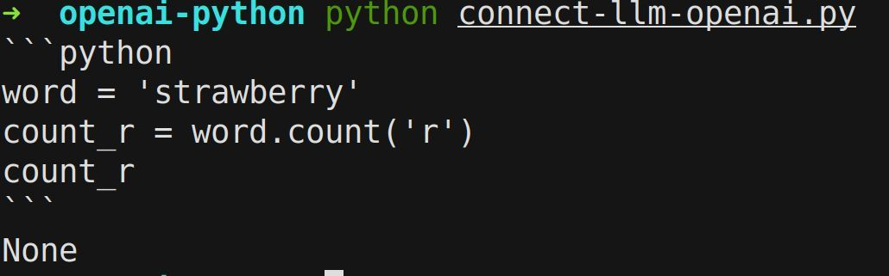
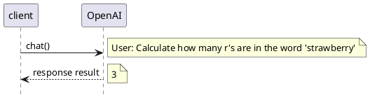
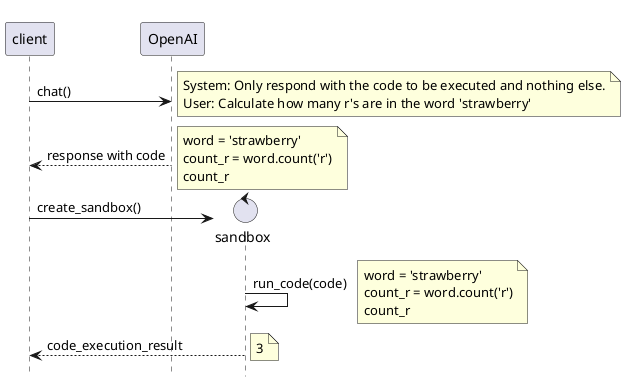
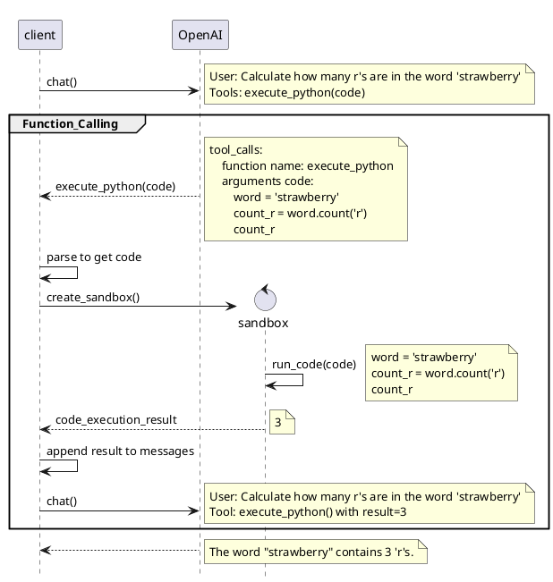
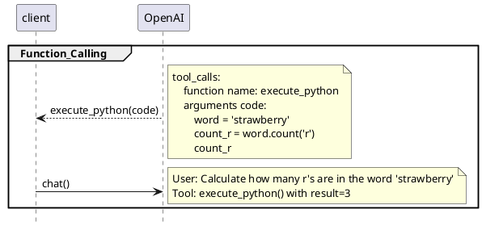
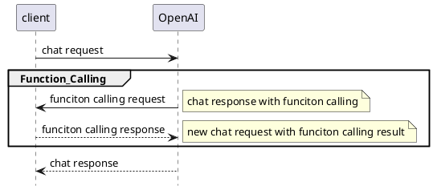

## 准备工作

```bash
pip install openai e2b-code-interpreter
```

准备 openai 的 key, 设置环境变量:

```bash
export OPENROUTER_API_KEY="sk-or-v1-066c495243xxxxxxxxxxxxxxxxxxxxxxxxxxxxxxx"
export OPENROUTER_BASE_URL="https://openrouter.ai/api/v1"
export OPENAI_API_KEY=$OPENROUTER_API_KEY
export OPENAI_BASE_URL=$OPENROUTER_BASE_URL
```

因为在大陆不方便直接使用 openai，所以我一般用 openrouter 来调用 openai 的 api。上面那个 key 是 openrouter 的 key。

### 简单调用

```bash
mkdir -p ~/work/code/e2b/connect-llm/openai-python
cd ~/work/code/e2b/connect-llm/openai-python
```

新建一个 python 文件:

```python
vi connect-llm-openai.py
```

内容为:

```python
# pip install openai e2b-code-interpreter
from openai import OpenAI
from e2b_code_interpreter import Sandbox

# Create OpenAI client
client = OpenAI()
system = "You are a helpful assistant that can execute python code in a Jupyter notebook. Only respond with the code to be executed and nothing else. Strip backticks in code blocks."
prompt = "Calculate how many r's are in the word 'strawberry'"

# Send messages to OpenAI API
response = client.chat.completions.create(
    model="gpt-4o",
    messages=[
        {"role": "system", "content": system},
        {"role": "user", "content": prompt}
    ]
)

# Extract the code from the response
code = response.choices[0].message.content

# Execute code in E2B Sandbox
if code:
    # print codo conteent for debug
    print(code)
    with Sandbox() as sandbox:
        execution = sandbox.run_code(code)
        result = execution.text

    print(result)
```

运行:

```bash
python connect-llm-openai.py
```

输出为:

```bash
3
```

分析：

1. 对 openAI 的调用很简单，就是直接调用 openai 的 chat api。

    不过在 system 中指明要 openai 返回可以用来计算结果的可执行代码，而不是直接给结果。

    > Only respond with the code to be executed and nothing else. Strip backticks in code blocks.
    > 
    > 只返回要执行的代码，不要返回其他内容。去掉代码块中的反引号。

    为此，我增加了 print 代码内容，方便调试。可以看到返回的代码内容是这样的：

    ```python
    word = 'strawberry'
    count_r = word.count('r')
    count_r
    ```

    可以看到，返回的是纯粹的 python 代码，没有反引号。反引号是什么？ 修改一下输入，把 `Strip backticks in code blocks.` 改成 `Deep backticks in code blocks.`, 然后再运行，输出为：

    

    可以看到，返回的内容中，有用于表示代码块的三个反引号。这是 markdown 中表示代码块的语法，但这个会导致 e2b 执行失败：最后一行是 None，表示执行失败。

2. e2b sandbox 相关的代码就三行，极其的简练，一句废话都没有：

    ```python
    # 1. 创建 sandbox
    with Sandbox() as sandbox:
        # 2. 执行代码
        execution = sandbox.run_code(code)
        # 3. 获取执行结果
        result = execution.text
    ```

    e2b 的 sandbox 就是用来执行 openAI 的 chat API 生成并返回的可执行代码，然后给出结果。

对比普通的让 OpenAI 直接返回结果的调用：




上面的例子中，OpenAI 不直接返回结果，而是返回一段可执行代码。然后我们用 e2b 的 sandbox 执行返回的可执行代码来计算结果：




### 函数调用

稍微复杂一点的例子，就是使用 AI 的函数调用/Function calling。

```bash
mkdir -p ~/work/code/e2b/connect-llm/openai-python
cd ~/work/code/e2b/connect-llm/openai-python
```

新建一个 python 文件:

```python
vi connect-llm-openai-function-call.py
```

内容为:

```python
# pip install openai e2b-code-interpreter
import json
from openai import OpenAI
from e2b_code_interpreter import Sandbox

# Create OpenAI client
client = OpenAI()
model = "gpt-4o"

# Define the messages
messages = [
    {
        "role": "user",
        "content": "Calculate how many r's are in the word 'strawberry'"
    }
]

# Define the tools
tools = [{
    "type": "function",
    "function": {
        "name": "execute_python",
        "description": "Execute python code in a Jupyter notebook cell and return result",
        "parameters": {
            "type": "object",
            "properties": {
                "code": {
                    "type": "string",
                    "description": "The python code to execute in a single cell"
                }
            },
            "required": ["code"]
        }
    }
}]

# Generate text with OpenAI
response = client.chat.completions.create(
    model=model,
    messages=messages,
    tools=tools,
)

# Append the response message to the messages list
response_message = response.choices[0].message
messages.append(response_message)

# Execute the tool if it's called by the model
if response_message.tool_calls:
    for tool_call in response_message.tool_calls:
        if tool_call.function.name == "execute_python":
            # Create a sandbox and execute the code
            with Sandbox() as sandbox:
                code = json.loads(tool_call.function.arguments)['code']
                execution = sandbox.run_code(code)
                result = execution.text

            # Send the result back to the model
            messages.append({
                "role": "tool",
                "name": "execute_python",
                "content": result,
                "tool_call_id": tool_call.id,
            })

# Generate the final response
final_response = client.chat.completions.create(
    model=model,
    messages=messages
)

print(final_response.choices[0].message.content)
```

运行:

```bash
python connect-llm-openai-function-call.py
```

输出为:

```bash
The word "strawberry" contains 3 'r's.
```


分析：

1. 这次对 openAI 的调用要复杂一些，用到了 OpenAI 的 chat API 的 tools 功能。

    ```python
    # 定义了一个工具
    tools = [{
        # 工具的类型是 function
    "type": "function",
    "function": {
        # 工具的名称
        "name": "execute_python",
        # 工具的描述
        "description": "Execute python code in a Jupyter notebook cell and return result",
        # 工具的参数
        "parameters": {
            "type": "object",
            "properties": {
                "code": {
                    "type": "string",
                    "description": "The python code to execute in a single cell"
                }
            },
            "required": ["code"]
        }
    }
    }]
    ```

    这是告诉 openai： 我这里有一个名为 execute_python 的 function，你可以把它当成工具来用，如果要执行 python 代码，可以调用这个工具。

2. 调用 openAI，user 设置依然是计算 "strawberry" 中 "r" 的个数，但要求 openai 使用我们定义的工具，也就是能够执行 python 代码的 execute_python 函数。

    ```python
    messages = [
    {
        "role": "user",
        "content": "Calculate how many r's are in the word 'strawberry'"
    }
    ]
    ......
    response = client.chat.completions.create(
        model=model,
        messages=messages,
        tools=tools,
    )
    ```

    通过增加日志，打印出 response 的内容：

    ```json
    ChatCompletion(id='gen-1749302174-f823d4hLS2G40WQwXec9', choices=[Choice(finish_reason='tool_calls', index=0, logprobs=None, message=ChatCompletionMessage(content='', refusal=None, role='assistant', audio=None, function_call=None, tool_calls=[ChatCompletionMessageToolCall(id='call_ulBxOTZOSx5uaWGXv1ZpMIJs', function=Function(arguments='{"code":"word = \'strawberry\'\\nr_count = word.count(\'r\')\\nr_count"}', name='execute_python'), type='function', index=0)], reasoning=None), native_finish_reason='tool_calls')], created=1749302174, model='openai/gpt-4o', object='chat.completion', service_tier=None, system_fingerprint='fp_5d58a6052a', usage=CompletionUsage(completion_tokens=32, prompt_tokens=75, total_tokens=107, completion_tokens_details=CompletionTokensDetails(accepted_prediction_tokens=None, audio_tokens=None, reasoning_tokens=0, rejected_prediction_tokens=None), prompt_tokens_details=PromptTokensDetails(audio_tokens=None, cached_tokens=0)), provider='Azure')
    ```

    打印出 response_message 的内容为：

    ```python
    ChatCompletionMessage(content='', refusal=None, role='assistant', audio=None, function_call=None, tool_calls=[ChatCompletionMessageToolCall(id='call_lSfGvAFu230WAm0eQIdkHfbi', function=Function(arguments='{"code":"word = \'strawberry\'\\ncount_r = word.count(\'r\')\\ncount_r"}', name='execute_python'), type='function', index=0)], reasoning=None)
    ```
    
    tool_calls 数组中有一个 ChatCompletionMessageToolCall 对象，定义了一个 function： name 是 execute_python，参数是 "code"， 内容为 "word = \'strawberry\'\\ncount_r = word.count(\'r\')\\ncount_r"，这是一段可执行的 python 代码。
    
3. 根据 openai 的返回结果，我们可以知道，openai 会根据我们定义的工具，生成一段可执行的 python 代码，并返回给我们。

    这里解析 openai 返回的 tool_calls 数组，并得到其中的可执行代码：

    ```python
    if response_message.tool_calls:
    for tool_call in response_message.tool_calls:
        if tool_call.function.name == "execute_python":
            ......
            code = json.loads(tool_call.function.arguments)['code']
    ```

4. 然后我们用 e2b 的 sandbox 执行返回的可执行代码来计算结果：

    ```python
    with Sandbox() as sandbox:
        execution = sandbox.run_code(code)
        result = execution.text
    ```

    这里的 result 打印出来的结果是 "3"，和上一个例子上类似。

5. 不同的是，这次的结果不直接返回给用户，而是通过 tool 返回给 openai 的模型: 

    ```python
    # Send the result back to the model
    messages.append({
        "role": "tool",
        "name": "execute_python",
        "content": result,
        "tool_call_id": tool_call.id,
    })
    ```

    通过增加日志，打印出 messages 的内容：

    ```json
    [{'role': 'user', 'content': "Calculate how many r's are in the word 'strawberry'"}, ChatCompletionMessage(content='', refusal=None, role='assistant', audio=None, function_call=None, tool_calls=[ChatCompletionMessageToolCall(id='call_phNLl8JrmZOmjj1WE4hhYAMK', function=Function(arguments='{"code":"word = \'strawberry\'\\ncount_r = word.count(\'r\')\\ncount_r"}', name='execute_python'), type='function', index=0)], reasoning=None), {'role': 'tool', 'name': 'execute_python', 'content': '3', 'tool_call_id': 'call_phNLl8JrmZOmjj1WE4hhYAMK'}]
    ```

6. 再次调用 openai 的 chat API，这次调用时，openai 会根据我们返回的 tool 结果，生成最终的响应：

    ```python
    final_response = client.chat.completions.create(
        model=model,
        messages=messages
    )
    ```

在 function calling 的例子中，我们会告知 openai 我们有一个工具 execute_python，它可以执行 python 代码并返回结果。然后 openai 会根据我们的请求，生成一段可执行的 python 代码，并返回给我们表示它希望通过 function calling 的方式调用我们定义的 execute_python 工具。在得到需要执行的代码后，我们用 e2b 的 sandbox 执行返回的可执行代码来计算结果，并把结果返回给 openai 的模型。最后，openai 的模型会根据我们返回的结果，生成最终的响应。流程图如下：



如果我们仅仅关注 function calling 的实现，并忽略 e2b 的 sandbox 的执行，那么 openai 执行 function calling 的子流程图可以简化为：



受限于 openai 的模型，它不能主动发起调用，只能在 client chat 调用的 response 里面表明它需要通过 function calling 的方式来调用我们定义的工具，然后 client 进行配合，再次发起一次新的 chat 请求，以便把 function calling 的结果返回给 openai 的模型。

这里相当于 openai 以 chat response 的形式执行了一次 function calling request，然后 client 以第二次 chat request 的形式对 function calling 进行了 response。

逻辑上的交互流程图如下：



