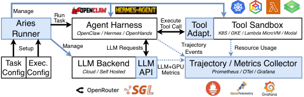
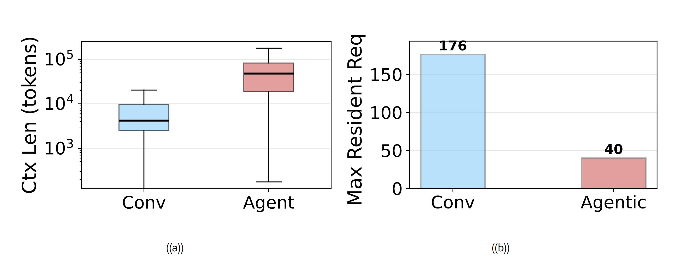
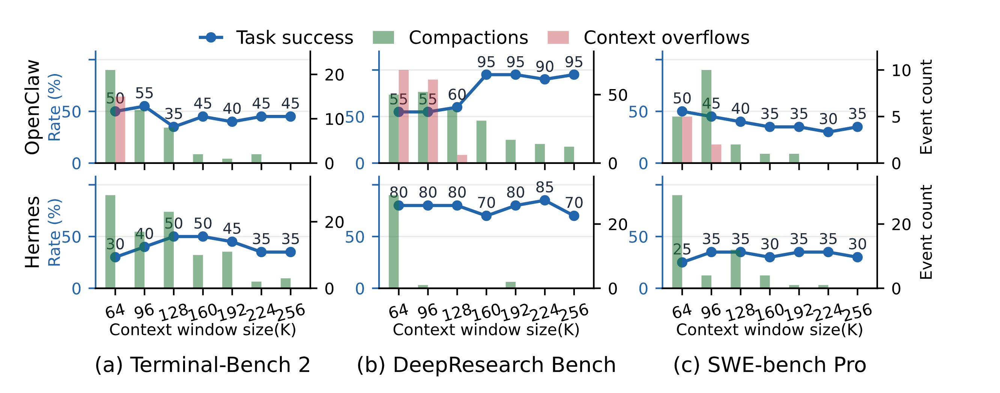
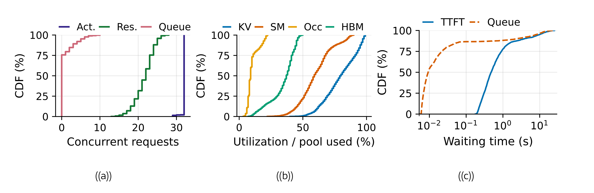
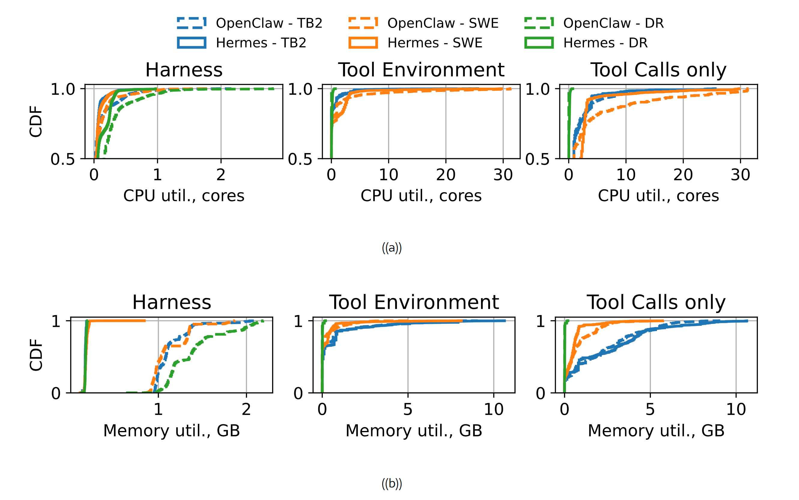
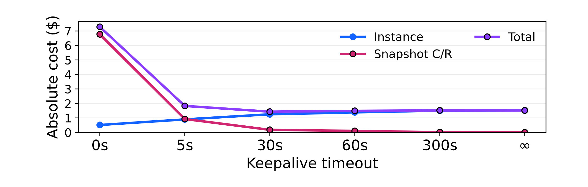
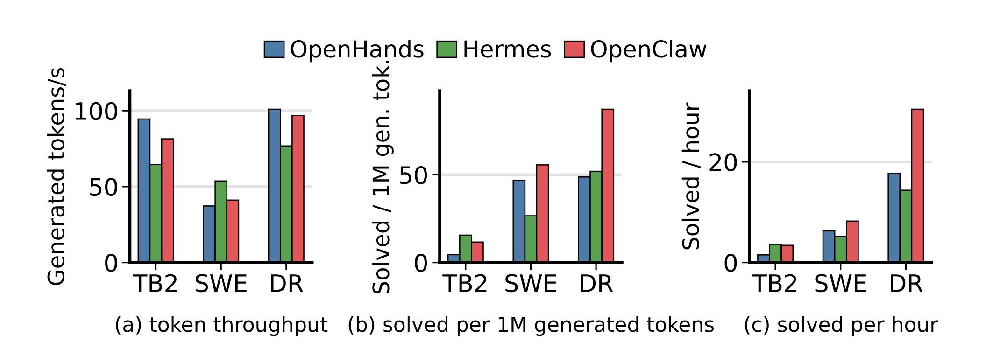

以 Aries 实验框架重新思考面向智能体服务系统的 AI 云基础设施

## 摘要

自主智能体(Agent)将重复推理与持久化上下文、沙箱化工具执行相结合,对传统 LLM 服务构成了新的挑战。我们提出 **Aries**——一个全栈实验框架,它可将任务语义与执行配置分离、通过关联的系统遥测重建跨组件智能体轨迹,并在异构沙箱基底上以一致的接口暴露有状态工具执行。我们使用 Aries 在开源智能体平台与基准测试上开展可复现实验,并用来自商业平台的线上生产数据轨迹加以补充,从而将底层系统研究建立在观测到的真实生产行为之上。研究结果表明:(1) 以 Token 为中心的指标会遗漏非推理环节的瓶颈;(2) 保留额外上下文带来的精度收益逐渐递减,同时会降低服务容量;(3) 工具沙箱在长时间空闲与短时资源突发之间交替,而当前基于快照的状态管理使得激进式挂起成本高昂。配套的安全分析进一步凸显了缩小沙箱攻击面的必要性。最后,我们讨论了对智能体原生(Agent-Native)服务系统的愿景,其设计围绕轨迹级指标、自适应上下文管理、弹性沙箱资源管理,以及攻击面最小化的沙箱展开。

## 1 引言

大语言模型(LLM)正迅速从提示词应答器演进为自主智能体。开源智能体如 OpenClaw 和 Hermes,在公开发布后的数月内便累计吸引了超过五十万个 GitHub star([OpenClaw Contributors, 2026](https://arxiv.org/html/2607.29069v1#bib.bib43); [Nous Research, 2026](https://arxiv.org/html/2607.29069v1#bib.bib44));而 Claude、Codex 等闭源商业智能体已被数百万用户使用([CryptoBriefing, 2026](https://arxiv.org/html/2607.29069v1#bib.bib50))。智能体将模型置于反馈回路之中:它观测当前状态、选择动作、通过工具执行该动作,并利用执行结果决定任务应如何继续([Luo et al., 2025](https://arxiv.org/html/2607.29069v1#bib.bib40); [Luo et al., 2026](https://arxiv.org/html/2607.29069v1#bib.bib19); [Yao et al., 2022](https://arxiv.org/html/2607.29069v1#bib.bib42))。这使系统问题从"服务孤立的模型请求"转变为"维持端到端的智能体轨迹"。因此,智能体服务不再止步于模型生成 Token 的时刻;每一次模型响应只是执行循环中的一步,其推进既取决于生成的文本,也取决于运行时状态。

**智能体服务已超越推理范畴。** 与传统 LLM 服务类似,智能体化工作负载通常托管于云端 AI 基础设施之中([Chen et al., 2025](https://arxiv.org/html/2607.29069v1#bib.bib54); [Luo et al., 2026](https://arxiv.org/html/2607.29069v1#bib.bib19)),但它们对系统提出了根本不同的需求。传统 LLM 系统优化的是单次模型调用:调度与资源管理聚焦于高效地产生下一个模型响应([Kwon et al., 2023](https://arxiv.org/html/2607.29069v1#bib.bib9); [Zheng et al., 2024](https://arxiv.org/html/2607.29069v1#bib.bib2); [Yu et al., 2022](https://arxiv.org/html/2607.29069v1#bib.bib18); [Zhong et al., 2024](https://arxiv.org/html/2607.29069v1#bib.bib11))。当外围应用逻辑位于服务系统之外时,这一抽象是成立的。然而在智能体服务中,每一次模型调用只是任务循环中的一步。更快的 GPU 解码依然有用,但端到端进度还取决于上下文的保留、工具的执行以及沙箱的管理。因此,智能体服务需要的不仅是快速的推理服务,更是整体的、全栈式的系统设计。

**任务进度需要系统层面的可见性。** 现有的评估方法只捕捉到智能体执行的一部分。智能体基准测试衡量的是任务是否达到正确结果([Padigela et al., 2025](https://arxiv.org/html/2607.29069v1#bib.bib39); [Zhou et al., 2024](https://arxiv.org/html/2607.29069v1#bib.bib8); [Merrill et al., 2026](https://arxiv.org/html/2607.29069v1#bib.bib20); [Liu et al., 2024](https://arxiv.org/html/2607.29069v1#bib.bib26)),而系统基准测试通常衡量的是孤立的模型调用、无状态函数或任务事务([Reddi et al., 2020](https://arxiv.org/html/2607.29069v1#bib.bib30); [Ustiugov et al., 2021](https://arxiv.org/html/2607.29069v1#bib.bib33); [Ferdman et al., 2012](https://arxiv.org/html/2607.29069v1#bib.bib31))。这两类方法都没有将任务进度与正确性同跨层运行时行为联系起来,同时任务与执行的纠缠以及依赖底层基质的工具行为,也阻碍了受控对比。

我们采用 **智能体轨迹(agent trajectory)** 作为观测单元。轨迹是对模型调用、工具交互、harness 决策以及最终任务结果的按序记录。基于这一抽象,我们提出 **Aries**——一个模块化实验框架,它将任务语义与执行配置分离,通过关联遥测重建跨组件轨迹,并在不同沙箱基底上标准化工具执行,从而支持可复现的对比以及停滞与失败的分阶段归因。我们使用 Aries 在开源基准上开展可复现实验,并以来自商业平台(匿名化)的生产轨迹加以补充,从而将底层系统研究建立在观测到的真实生产行为之上。

我们的实验揭示了传统"模型调用指标"所掩盖的局限。harness 与工具执行可占端到端延迟的很大比重(例如高达 48%),因此 LLM 引擎的 Token 吞吐可能与任务级执行效率相背离。上下文保留会带来精度—容量的权衡:受控扫描显示,避免上下文溢出可将任务成功率从 55% 提升至 95%,但增益在依赖工作负载的阈值处趋于平缓;而生产轨迹与受控遥测表明,保留的状态会降低服务容量。生产与受控测量还揭示出大部分"空闲但突发"的工具沙箱,对这类沙箱而言,基于快照的挂起在经济上仍不可行。我们的安全分析进一步推动了攻击面最小化沙箱设计的必要性。基于这些洞察,我们讨论了对智能体原生服务系统的愿景,其特征包括:轨迹感知的可观测性、面向轨迹上下文管理与智能体感知沙箱弹性的控制面,以及使工具执行攻击面最小化的沙箱设计。

## 2 背景与动机

图 1. 传统 LLM 服务与新兴智能体服务系统的概览。

我们首先讨论传统 LLM 服务与新兴智能体化工作负载之间的差异,及其对现代云 AI 基础设施的启示。随后讨论现有基准框架的不足,以及它们为何难以胜任智能体系统的系统研究。

### 2.1 从模型请求到智能体轨迹

传统 LLM 服务系统围绕单个模型请求的执行进行组织。如图 [1]([https://arxiv.org/html/2607.29069v1#S2.F1)a](https://arxiv.org/html/2607.29069v1#S2.F1\)a) 所示,服务运行时处理提示词、生成输出 Token、管理加速器内存并返回响应([Zhong et al., 2024](https://arxiv.org/html/2607.29069v1#bib.bib11); [Yu et al., 2022](https://arxiv.org/html/2607.29069v1#bib.bib18))。因此,调度与内存管理主要限定于当前激活的调用范围。根据缓存策略,引擎可以在执行后保留、卸载、复用或回收该调用的 KV 缓存状态([Kwon et al., 2023](https://arxiv.org/html/2607.29069v1#bib.bib9); [Pan et al., 2025](https://arxiv.org/html/2607.29069v1#bib.bib5); [Zheng et al., 2024](https://arxiv.org/html/2607.29069v1#bib.bib2); [Qin et al., 2025](https://arxiv.org/html/2607.29069v1#bib.bib3))。这种以请求为中心的设计自然优先关注首 Token 延迟、每输出 Token 时间、请求延迟与聚合 Token 吞吐等指标([Kwon et al., 2023](https://arxiv.org/html/2607.29069v1#bib.bib9); [Zhong et al., 2024](https://arxiv.org/html/2607.29069v1#bib.bib11); [Patel et al., 2024](https://arxiv.org/html/2607.29069v1#bib.bib10); [Hu et al., 2024b](https://arxiv.org/html/2607.29069v1#bib.bib12); [Yu et al., 2022](https://arxiv.org/html/2607.29069v1#bib.bib18); [Zheng et al., 2024](https://arxiv.org/html/2607.29069v1#bib.bib2))。
智能体服务则偏离了这种以调用为中心的抽象。如图 [1]([https://arxiv.org/html/2607.29069v1#S2.F1)b](https://arxiv.org/html/2607.29069v1#S2.F1\)b) 所示,harness 反复调用 LLM、将工具调用分派到沙箱化运行时、将工具结果纳入后续提示词,并决定任务何时完成([Luo et al., 2026](https://arxiv.org/html/2607.29069v1#bib.bib19); [Liu et al., 2024](https://arxiv.org/html/2607.29069v1#bib.bib26); [Yao et al., 2022](https://arxiv.org/html/2607.29069v1#bib.bib42))。因此,单个用户请求可能跨越许多相互依赖的模型步骤与工具步骤。

本文中,我们将 **智能体轨迹(agent trajectory)** 定义为服务单个用户请求过程中产生的 LLM 调用、工具调用、工具结果与 harness 决策的有序序列。单个模型请求只是这一更大执行单元中的步骤,而非独立事务。轨迹状态在这些步骤之间持续存在。harness 可能将该状态表示为消息历史或结构化事件,而服务层可能将可复用的部分物化为缓存的模型状态(如 KV 缓存前缀)。与此同时,模型生成的动作在主机侧于隔离沙箱内执行。因此,智能体服务横跨 GPU 推理、主机侧编排、持久化上下文状态与沙箱化执行四大组件,且这四个组件之间存在相互依赖。

### 2.2 现有基准框架的局限

现有基准以互不兼容的粒度回答互补的问题。面向能力的基准评估智能体能否完成现实任务,但大多将执行路径视为黑盒([Zhou et al., 2024](https://arxiv.org/html/2607.29069v1#bib.bib8); [Gur et al., 2024](https://arxiv.org/html/2607.29069v1#bib.bib41); [Jimenez et al., 2024](https://arxiv.org/html/2607.29069v1#bib.bib7); [Merrill et al., 2026](https://arxiv.org/html/2607.29069v1#bib.bib20); [Mialon et al., 2024](https://arxiv.org/html/2607.29069v1#bib.bib27); [Xie et al., 2024](https://arxiv.org/html/2607.29069v1#bib.bib28); [Yao et al., 2024](https://arxiv.org/html/2607.29069v1#bib.bib29))。系统基准能够测量端到端性能与资源行为,但通常以单个请求或事务作为分析单元([Reddi et al., 2020](https://arxiv.org/html/2607.29069v1#bib.bib30); [Ferdman et al., 2012](https://arxiv.org/html/2607.29069v1#bib.bib31); [Gan et al., 2019](https://arxiv.org/html/2607.29069v1#bib.bib32); [Ustiugov et al., 2021](https://arxiv.org/html/2607.29069v1#bib.bib33))。

以往的框架与基准都无法揭示系统行为如何影响多步骤智能体任务中的进度。任务语义往往与 harness 及运行时特定的选择纠缠在一起,执行事件在模型、harness 与沙箱各组件间呈碎片化分布,而有状态工具行为又依赖于底层基质。因此,智能体服务在"语义任务进度"与"跨层系统执行"之间形成了测量鸿沟,使得难以隔离配置影响、重建完整轨迹,以及将资源瓶颈归因于任务级延迟与失败。

## 3 Aries:轨迹级遥测

图 2. Aries 架构。蓝色组件是智能体服务循环中的插桩(Instrumentation),专门用于弥合测量鸿沟。

Aries 的目标是通过将智能体轨迹视为一等公民,弥合"语义任务结果"与"跨层系统行为"之间的测量鸿沟。这带来三项挑战。其一,任务语义常与执行选择纠缠,阻碍跨技术栈的受控对比。其二,智能体执行横跨独立管理的组件,使得仅凭本地日志难以重建或归因轨迹。其三,工具执行既有状态又依赖底层基质,使其行为与资源成本的对比难以一致。Aries 通过"任务与执行规格分离""关联跨层遥测的共享轨迹模式"以及"面向有状态工具执行与插桩的、与底层基质无关的接口"来解决这些挑战。

图 [2]([https://arxiv.org/html/2607.29069v1#S3.F2](https://arxiv.org/html/2607.29069v1#S3.F2)) 展示了 Aries 的架构。任务加载器与执行加载器负责校验规格;运行器协调 harness,并通过适配器访问 LLM 后端与沙箱基底;遥测收集器将框架事件与跨层遥测合并为统一记录。这一设计将任务语义与执行配置分离,保留跨组件来源信息,并跨沙箱基底标准化有状态工具执行。

**跨配置保留任务语义。** 智能体框架往往将任务语义嵌入 harness 特有的逻辑中,因此替换运行时组件可能无意中改变被评估的任务。为此,Aries 将**任务规格**(捕获工作负载及其成功语义)与**执行规格**(选择 harness、模型后端、沙箱与遥测技术栈)分离。专用加载器对两种规格进行校验,而 LLM 后端与沙箱适配器将其绑定到具体执行栈,无需针对任务的修改。这一分离支持跨配置的受控对比。

**重建跨组件轨迹。** 智能体运行可能包含跨独立管理组件的重叠、失败或重试操作,使得组件本地日志与时间戳不足以进行可靠的重建与归因。Aries 在模型与工具边界传播轨迹与事件标识符,并在统一事件模式下记录因果与排序元数据。随后遥测收集器将组件指标关联到这些事件,从而揭示延迟与资源压力在轨迹中的产生位置。

**使有状态工具执行可观测且可移植。** 工具调用作用于一个持久化环境,其状态会影响后续轨迹步骤,而不同的沙箱基底暴露不同的生命周期与遥测接口。Aries 对环境设置、工具调用、状态连续性、结果收集与遥测挂钩进行标准化,同时沙箱适配器将这些操作映射到具体基底。这使得工具执行成为轨迹中一等公民的、一致可观测的阶段,同时支持不同的沙箱技术。

## 4 为何现代云 AI 基础设施不适合智能体?

利用 Aries,我们评估以请求为中心的现代云 AI 基础设施是否足以支撑智能体服务。具体而言,我们研究:哪些组件决定端到端关键路径;长生命周期轨迹上下文如何影响服务效率与精度;LLM 后端与工具沙箱之间的资源利用情况;以及现有工具隔离机制的充分性。我们首先分析一个八小时工作日的生产轨迹,包括来自十个 LLM 服务实例的请求长度,以及来自 100 个智能体沙箱的每分钟 CPU 与内存采样,以在部署规模上建立高层工作负载行为。由于运维轨迹未暴露同步的跨层事件,我们随后使用开源 harness 与数据集复现观测到的模式,并借助 Aries 开展更深入的系统级分析。

为进行这一受控分析,Aries 集成了 OpenHands([Wang et al., 2026](https://arxiv.org/html/2607.29069v1#bib.bib6))、Hermes Agent([Nous Research, 2026](https://arxiv.org/html/2607.29069v1#bib.bib44))与 OpenClaw([OpenClaw Contributors, 2026](https://arxiv.org/html/2607.29069v1#bib.bib43)),并评估来自 SWE-Bench Pro([Deng et al., 2025](https://arxiv.org/html/2607.29069v1#bib.bib24))、Terminal-Bench 2([Team, 2025](https://arxiv.org/html/2607.29069v1#bib.bib1))与 DeepResearch Bench([Du et al., 2025](https://arxiv.org/html/2607.29069v1#bib.bib25))的服务任务。我们从每个基准各采样 20 个任务,使 OpenClaw 达到 50% 的任务成功率(这对精度研究很重要),并每个任务重复五次。除非另有说明,实验使用由 SGLang([Zheng et al., 2024](https://arxiv.org/html/2607.29069v1#bib.bib2))在本地提供的 Qwen3.6-35B-A3B-FP8([Qwen Team, 2026](https://arxiv.org/html/2607.29069v1#bib.bib45)),运行于一个 96 核节点上,配备一块 94 GB HBM 的 NVIDIA H100 GPU。

### 4.1 Harness 与工具与模型同等重要

现有 LLM 服务引擎优化的是以 Token 为中心的指标,如 TTFT 与 TPOT([Zhong et al., 2024](https://arxiv.org/html/2607.29069v1#bib.bib11); [Kwon et al., 2023](https://arxiv.org/html/2607.29069v1#bib.bib9); [Zheng et al., 2024](https://arxiv.org/html/2607.29069v1#bib.bib2))。这些指标忽略了 harness 处理模型输出或等待工具执行的主机侧时间间隔,尽管在完成这些步骤之前智能体无法继续推进。

图 3. 端到端平均延迟分解。harness 与工具执行带来的延迟与 LLM 调用相当。

图 4. LLM 推理与工具执行的延迟分布。工具调用呈现出跨越多个数量级的严重长尾。
由于逐步计时信息在商业集群中过于敏感而难以收集,我们基于公开数据集与 harness(它们在共享的轨迹标识符与时间基准下记录这些事件)来分析现有指标的效用。
我们的剖析揭示了两个关键的系统洞察:**(1) 关键路径向 harness 与工具执行转移:** 如图 [3]([https://arxiv.org/html/2607.29069v1#S4.F3](https://arxiv.org/html/2607.29069v1#S4.F3)) 所示,工具执行是重要的延迟贡献者,在不同数据集与 harness 下贡献了总延迟的 13% 至 48%,其中 Hermes Agent 在 Terminal-Bench 2 上达到 48%。除工具执行外,harness 还花费高达 9% 的端到端时间用于编排及其他主机侧处理,进一步拉长了连续 LLM 调用之间的间隔,并可能延长轨迹状态在 GPU 内存中的驻留时间。**(2) 长尾延迟分布:** 图 [4]([https://arxiv.org/html/2607.29069v1#S4.F4](https://arxiv.org/html/2607.29069v1#S4.F4)) 表明,虽然 LLM 延迟依然重要,但工具调用呈现出跨越多个数量级的严重长尾。综合来看,这些结果说明,大量主机侧延迟常常主导执行时间,这意味着仅优化加速器的 Token 生成无法解决真实的智能体瓶颈。

> **结论 1:** _端到端任务时长在很大程度上取决于 harness 与工具沙箱的执行,而不仅仅是模型推理。_

### 4.2 长上下文决定效率与精度

在传统 LLM 服务中,上下文生命周期通常限定于请求—响应循环,使引擎能在查询结束后回收 KV 缓存页,除非显式保留或卸载以复用([Kwon et al., 2023](https://arxiv.org/html/2607.29069v1#bib.bib9); [Zheng et al., 2024](https://arxiv.org/html/2607.29069v1#bib.bib2); [Zhong et al., 2024](https://arxiv.org/html/2607.29069v1#bib.bib11); [Hu et al., 2024a](https://arxiv.org/html/2607.29069v1#bib.bib16); [Qin et al., 2025](https://arxiv.org/html/2607.29069v1#bib.bib3); [Liu et al., 2025](https://arxiv.org/html/2607.29069v1#bib.bib4))。相反,长时程智能体生成单调增长的历史记录,并贯穿整个轨迹持续存在。尽管现有框架采用语义压缩以适配系统限制([Rasmussen et al., 2025](https://arxiv.org/html/2607.29069v1#bib.bib13); [Xu et al., 2026](https://arxiv.org/html/2607.29069v1#bib.bib14); [Chhikara et al., 2025](https://arxiv.org/html/2607.29069v1#bib.bib15)),但不受管理的上下文扩张仍会锁定物理 GPU Token 池,并降低服务并发度([Li et al., 2025](https://arxiv.org/html/2607.29069v1#bib.bib47); [Kariyappa and Suh, 2026](https://arxiv.org/html/2607.29069v1#bib.bib48))。保留过多历史可能增加尾延迟,而激进压缩可能丢弃后续步骤所需的信息,从而降低任务精度([Kang et al., 2025](https://arxiv.org/html/2607.29069v1#bib.bib49); [Kariyappa and Suh, 2026](https://arxiv.org/html/2607.29069v1#bib.bib48))。化解这一精度—效率张力,需要从被动的内存分配转向轨迹感知的状态管理,在保留上下文的资源成本与其未来效用之间取得平衡。
我们首先对比生产平台上智能体服务与传统推理中观测到的上下文长度。随后,我们刻画与上下文预算相关的权衡,以及它们如何借助公开 harness 与数据集影响智能体服务的精度与效率。在后一分析中,我们针对所有被评估的基准,对 OpenClaw 与 Hermes Agent 的上下文预算进行扫描(为简洁起见省略 OpenHands),以确定保留额外历史在何时不再带来有意义的精度提升。随后,我们在 256K 上下文大小下服务 32 个并发活跃智能体会话,以每秒一次的频率采样后端资源利用率,量化上下文保留的成本。

图 5. 生产集群中对话请求与智能体请求的上下文长度与驻留容量对比。智能体工作负载的每请求 KV 占用比传统服务更大,大幅降低了 LLM 后端可并行处理的请求数。

图 6. 不同上下文窗口大小下的压缩与上下文溢出次数,及对应的任务成功率。更大的窗口缓解了溢出/压缩压力,但任务成功率在工作负载特定阈值后趋于平缓。
我们得到三点关键观察:**(1) 轨迹状态放大:** 生产轨迹显示,智能体上下文显著大于传统推理工作负载中观测到的上下文,这与我们在公开数据集与 harness 上的结果一致。如图 [5]([https://arxiv.org/html/2607.29069v1#S4.F5](https://arxiv.org/html/2607.29069v1#S4.F5)) 所量化,平均智能体上下文消耗的 KV 占用显著大于传统推理。在 Qwen3.6 模型、固定 25GB 预算下,这种状态放大使最大驻留容量从 176 个并发服务请求骤降至仅 40 个——即 4.4× 的缩减。**(2) 上下文充分性阈值:** 借助开源数据集与 harness,我们证明长上下文保留仅在达到任务特定阈值前提升精度,超过该阈值后,额外历史尽管消耗更多内存,却几乎不再带来精度收益。如图 [6]([https://arxiv.org/html/2607.29069v1#S4.F6](https://arxiv.org/html/2607.29069v1#S4.F6)) 所示,OpenClaw 在 DeepResearch Bench 上于 160K 上下文处达到峰值成功率(95%),此时恰好消除了上下文溢出。相反,Terminal-Bench 2 与 SWE-Bench Pro 在溢出压力消除后趋于平缓甚至下降,其最佳性能出现在较小或中等窗口,而非最大上下文。**(3) 容量导致的批处理受限:** 我们在公开数据集上的结果进一步表明,大规模保留状态严重制约服务容量。图中数据表明,尽管存在 32 个会话的积压,内存压力仍限制了有效批处理;Token 池利用率峰值达到 97%,而引擎仅维持中位数 22 个并发请求。在此压力下,调度器抢占活跃会话,p95 内部排队延迟达到 7.9 秒。

图 7. 智能体服务一小时窗口内的 CDF(累积分布函数)。工作负载维持高并发与高 KV 压力,而长时间等待集中在请求尾部。

> **结论 2:** _保留超出任务依赖效用的上下文,只会带来递减的精度收益,同时增加 KV 缓存占用、限制批处理并延长排队延迟。因此,系统必须主动管理轨迹状态,以在任务精度与服务效率之间取得平衡。_

### 4.3 工具沙箱必须具有弹性

智能体服务将基于 CPU 的处理引入关键路径:它在 LLM 推理期间的空闲间隔与工具执行期间短暂的 CPU/内存突发之间交替。静态的峰值资源供给虽能避免限制这些工具调用,却会在相当长的时间内造成资源闲置。AWS Lambda MicroVMs([Amazon Web Services, 2026a](https://arxiv.org/html/2607.29069v1#bib.bib22))与 Google Agent Sandbox([Google Cloud, 2026](https://arxiv.org/html/2607.29069v1#bib.bib21))等云系统试图通过"沙箱快照捕获与恢复(C/R)"实现 **有状态缩至零(scale-to-zero)** 来减少浪费。然而,智能体化工具执行模式会导致大量捕获—恢复周期,带来额外成本,我们将在下文中展示。

图 8. 生产集群中每分钟聚合测量的 harness CPU 与内存利用率 CDF。数值已归一化以进行轨迹匿名化。

我们收集同一商业平台上超过 100 个沙箱(每个沙箱共托管一个 OpenClaw 风格 harness 及其工具调用)的 CPU 与内存利用率。为确认趋势并进行深入分析,我们还在受控环境中以每秒一次的频率收集 harness 与工具沙箱的 CPU 和内存利用率,并使用云端 DeepSeek V4 Flash API(生产级、对工具调用生成精度高度稳定)分析 OpenClaw 与 Hermes 的分布。随后,我们参照无服务器部署中的不同沙箱保活策略([Shahrad et al., 2020](https://arxiv.org/html/2607.29069v1#bib.bib51); [Fuerst and Sharma, 2021](https://arxiv.org/html/2607.29069v1#bib.bib53)),针对 AWS Lambda MicroVMs 计费模型([Amazon Web Services, 2026b](https://arxiv.org/html/2607.29069v1#bib.bib23))对记录的工具调用轨迹进行解析式重放。我们报告实例成本(CPU 与内存使用)、快照 C/R 成本及其总和。保活时间为无穷大的点对应持久沙箱。由于 DeepResearch 工具 CPU 占用较低,本对比将其排除。

图 9. 每秒聚合测量的工具与 harness CPU 与内存利用率 CDF。工具环境大部分时间处于空闲,在工具调用期间出现高 CPU 利用率尖峰。

图 10. 基于 AWS Lambda MicroVM 计费模型,不同保活超时下基于快照的有状态缩至零的绝对客户可见成本。较短的保活时间降低实例成本,但触发频繁的快照 C/R;较长的保活时间通过让沙箱在更多空闲时间内保持驻留来减少 C/R。

图 [8]([https://arxiv.org/html/2607.29069v1#S4.F8](https://arxiv.org/html/2607.29069v1#S4.F8)) 显示,生产环境中的 CPU 计算与内存利用率呈尖峰状。我们使用公开数据集与 harness 复现了这一现象(图 [9]([https://arxiv.org/html/2607.29069v1#S4.F9)),表明智能体工具沙箱在轨迹的大部分时间里利用率较低,却在工具执行期间呈现出](https://arxiv.org/html/2607.29069v1#S4.F9\)\),%E8%A1%A8%E6%98%8E%E6%99%BA%E8%83%BD%E4%BD%93%E5%B7%A5%E5%85%B7%E6%B2%99%E7%AE%B1%E5%9C%A8%E8%BD%A8%E8%BF%B9%E7%9A%84%E5%A4%A7%E9%83%A8%E5%88%86%E6%97%B6%E9%97%B4%E9%87%8C%E5%88%A9%E7%94%A8%E7%8E%87%E8%BE%83%E4%BD%8E,%E5%8D%B4%E5%9C%A8%E5%B7%A5%E5%85%B7%E6%89%A7%E8%A1%8C%E6%9C%9F%E9%97%B4%E5%91%88%E7%8E%B0%E5%87%BA) CPU 与内存需求的急剧尖峰。在各类 harness 与工作负载中,CPU 与内存在超过 80% 与 50% 的时间里处于空闲。与此同时,以工具调用为条件的分布显示出更密集的资源使用:CPU 与内存的空闲时间占比均降至 20% 以下。图 [10]([https://arxiv.org/html/2607.29069v1#S4.F10](https://arxiv.org/html/2607.29069v1#S4.F10)) 表明,用户与云提供商都有动力缩短保活时间以降低成本:用户避免为空闲沙箱付费,而提供商能更早回收闲置容量。然而,当前的基于快照的机制与定价阻碍了这种一致性:如果在每次工具调用后拆除工具沙箱,其成本下降 65%,但反复的快照 C/R 使客户总成本相比持久基线升至 4.9 倍。将工具沙箱保留更久可降低 C/R 开销,但会增加空闲时间。因此,当今系统迫使人们在"为闲置容量付费"与"为反复快照与恢复付费"之间做出错误取舍。不过,这些结果表明,在理想系统中,总成本相比持久沙箱基线可降低 3 倍。

> **结论 3:** _智能体沙箱大部分时间处于空闲,但在工具执行时呈突发性。用户与提供商都应从闲置资源回收中获益,然而当前的状态管理机制与定价使激进式挂起不具经济性。_

### 4.4 工具沙箱正面临持续围攻

云基础设施本已为处理不可信代码执行而设计,并使用同样的机制对智能体化工作负载进行沙箱化。除 LLM 特有的挑战(如 KV 缓存侧信道([Chu et al., 2025](https://arxiv.org/html/2607.29069v1#bib.bib52))或敏感输入数据([Luo et al., 2025](https://arxiv.org/html/2607.29069v1#bib.bib40)))外,智能体还具备自主发现并利用漏洞的能力([Ullah et al., 2025](https://arxiv.org/html/2607.29069v1#bib.bib34); [Zhang et al., 2026](https://arxiv.org/html/2607.29069v1#bib.bib35); [Xu et al., 2025](https://arxiv.org/html/2607.29069v1#bib.bib36))。前沿模型已能在操作系统内核、VMM 等生产系统软件中发现高级漏洞([Carlini et al., 2026](https://arxiv.org/html/2607.29069v1#bib.bib17)),这预示着 AI 智能体存在突破云隔离的可能性。
我们以"AI 工具发现的 Linux 内核 CVE 占比"作为衡量 AI 智能体自主发现漏洞能力的代理指标。我们将该占比定义为 Linux CVE 中明确提及使用 AI 工具发现并修复漏洞的提交所占的比例。我们的发现展示于图 [11]([https://arxiv.org/html/2607.29069v1#S4.F11)。](https://arxiv.org/html/2607.29069v1#S4.F11\)%E3%80%82)

图 11. 报告由 AI 智能体或借助 AI 辅助发现的 Linux 内核 CVE 的总数与相对占比。2026 年第二季度,AI 发现的 CVE 急剧增加。

AI 工具在发现漏洞中扮演着越来越重要的角色。在 Linux 内核上,自引入智能体化补丁审查系统 Sashiko 以来尤其如此([Gushchin, 2026](https://arxiv.org/html/2607.29069v1#bib.bib46))。这一趋势在各大 CVE 发布方中均成立,2026 年第二季度已发布的 CVE 相比此前的纪录增长了 3.5 倍([Emberson, 2026](https://arxiv.org/html/2607.29069v1#bib.bib37))。利用已知 CVE 也日益廉价:智能体系统仅需几美元即可开发出利用代码([Ullah et al., 2025](https://arxiv.org/html/2607.29069v1#bib.bib34))。智能体化工作负载已具备对云基础设施发起复杂攻击的高度能力。因此,沙箱应暴露最小的攻击面,同时还应依赖纵深防御机制以应对潜在漏洞。

> **结论 4:** _AI 智能体具备高度的自主发现与利用漏洞的能力。工具沙箱的设计应能抵御高级攻击,并通过缩小攻击面来预期不断增强的进攻性模型能力。_

## 5 未来研究方向

图 12. 智能体原生 AI 服务系统愿景。

我们的结果表明,智能体服务系统应跨轨迹协调优化决策,而不是独立地管理模型推理、上下文状态与工具执行。如图 [12]([https://arxiv.org/html/2607.29069v1#S5.F12](https://arxiv.org/html/2607.29069v1#S5.F12)) 所示,这需要通过四个协同设计方向,在运行时(Runtime)、控制面(Control)与执行(Execution)三个层面联合优化任务进度、容量与资源:(1) 覆盖所有层的轨迹捕获指标;(2) 面向轨迹感知上下文管理的控制面;(3) 通过沙箱控制实现弹性工具执行管理;(4) 最小化工具沙箱攻击面。

### 5.1 轨迹捕获指标

未来的智能体服务指标应持续量化系统执行对任务进度的贡献。如图 [13]([https://arxiv.org/html/2607.29069v1#S5.F13](https://arxiv.org/html/2607.29069v1#S5.F13)) 所示,评估应将任务成功率、完成率等端到端结果,与延迟、生成 Token 数、资源消耗等执行速度与成本的底层度量相连接。任务有效吞吐与"每生成 Token 解决的已解决问题数"提供了有用的端点指标,但它们仅在轨迹完成后才可用,无法指导运行时决策。
因此,一个关键研究方向是从轨迹事件中推导在线效用信号。这类信号应估计每次模型调用、harness 决策与工具交互所带来的增量进度,同时计入其时间与资源成本。它们应区分有效动作与重复或非推进性步骤,并聚合为任务精度、执行速度与系统成本的端到端度量。这种连接将使得底层系统优化能够依据其对智能体任务完成的实际贡献进行评估。

图 13. Token 吞吐、每 100 万生成 Token 解决的已解决问题数,以及每小时解决的已解决问题数。在智能体服务中,Token 吞吐可能与任务有效吞吐及执行效率相背离。

### 5.2 面向轨迹感知上下文管理的控制面

我们在第 [4.2](https://arxiv.org/html/2607.29069v1#S4.SS2) 节的测量揭示了"上下文充分性"与"服务容量"之间随工作负载变化的权衡。额外上下文会增加 KV 缓存压力与排队延迟,即便其对任务成功率的提升微乎其微。这推动了轨迹感知控制面的诞生:它监控任务与内存状态,决定上下文应如何保留与放置,并指导 LLM 后端执行上下文压缩、KV 缓存压缩或状态迁移。**(1) 自适应上下文保留。** 控制面应随轨迹演进估计上下文的未来效用,并在保留状态的预期精度收益不再抵偿其内存成本时请求压缩或压缩处理。此类决策必须足够保守,以保留后续模型调用所需的信息。**(2) 分层状态放置。** 控制面应协调长生命周期上下文在加速器与低成本内存层级之间的放置,而非让所有状态驻留在加速器上。当释放的加速器容量超过迁移与恢复开销时,它应触发 KV 缓存迁移。

### 5.3 面向智能体感知弹性的控制面

我们在第 [4.3](https://arxiv.org/html/2607.29069v1#S4.SS3) 节的刻画表明,主机侧资源需求高度间歇。静态供给浪费容量,而传统水平自动扩缩机制在此粒度下过于昂贵。因此,未来的智能体服务平台需要围绕"模型驱动的有状态执行"设计的弹性控制面。**(1) 垂直的、模型感知的计算管理。** 研究应探索如何利用来自模型、harness 与运行时的信号,及时指导单个沙箱的垂直扩缩,以满足已识别的内存与核数波动的波动性需求。关键问题包括:哪些信号能可靠预测需求、如何处理不确定性,以及如何在相互竞争的轨迹之间分配资源。**(2) 面向弹性执行的状态管理。** 由于沙箱保留文件、进程、缓存与网络状态,弹性要求将执行状态与物理放置及资源分配解耦。需要研究:哪些状态必须保持驻留、哪些可以外部化或重建,以及在调整大小、挂起或迁移沙箱时如何保持一致性。

### 5.4 攻击面最小的沙箱

AI 智能体正日益具备自主发现与利用漏洞的能力。因此,云基础设施应预期日益复杂的对抗性工作负载。**(1) 纵深防御与最小化攻击面。** 沙箱应针对工作负载量身定制,通过根据目标任务限制工具、网络与文件系统访问来缩小攻击面。工具执行应同时利用主机侧 VM 级隔离与客户机侧内核级沙箱化。例如,深度研究等工作负载无需直接 bash 访问,可授予其客户机内沙箱化的 JavaScript 运行时。此外,系统设计还必须最小化智能体化技术栈中暴露给侧信道时序攻击的攻击面。**(2) 形式化安全保障。** 长远来看,对安全属性的形式化验证是认证"不存在漏洞"的唯一途径。向 seL4([Klein et al., 2009](https://arxiv.org/html/2607.29069v1#bib.bib38))等已验证系统迁移(作为主机虚拟机监控程序或客户机内核),将需要重大但必要的系统重构,以确保在模型进攻能力不断增强的情况下云依然安全。

## 6 结论

智能体服务将传统 LLM 服务转变为横跨模型执行、harness 逻辑与沙箱的长期有状态轨迹。我们提出 Aries——一个将可复现实验与生产轨迹相结合以刻画任务与系统行为的遥测框架。我们的发现推动了轨迹捕获指标、面向上下文管理与智能体感知弹性的控制面,以及攻击面最小化沙箱的发展。

* * *

