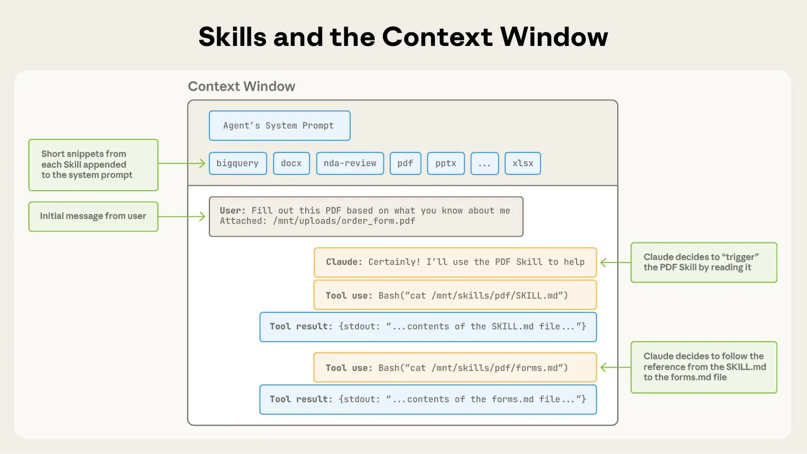

基本信息:

- 英文原文: https://www.anthropic.com/engineering/equipping-agents-for-the-real-world-with-agent-skills
- 中文翻译:

   - https://fisherdaddy.com/posts/equipping-agents-for-the-real-world-with-agent-skills/
   - https://juejin.cn/post/7561741513602203674

-------

Claude is powerful, but real work requires procedural knowledge and organizational context. Introducing Agent Skills, a new way to build specialized agents using files and folders.

Claude 很强大，但实际工作需要程序性知识和组织背景。介绍 Agent Skills，这是一种使用文件和文件夹构建专业化 agents 的新方法。

As model capabilities improve, we can now build general-purpose agents that interact with full-fledged computing environments. Claude Code, for example, can accomplish complex tasks across domains using local code execution and filesystems. But as these agents become more powerful, we need more composable, scalable, and portable ways to equip them with domain-specific expertise.

随着模型能力的提升，我们现在可以构建与完整计算环境交互的通用 agents。例如，Claude Code 可以使用本地代码执行和文件系统在各个领域完成复杂任务。但随着这些 agents 变得更强大，我们需要更具组合性、可扩展性和便携性的方法来为它们配备特定领域的专业知识。

This led us to create Agent Skills: organized folders of instructions, scripts, and resources that agents can discover and load dynamically to perform better at specific tasks. Skills extend Claude’s capabilities by packaging your expertise into composable resources for Claude, transforming general-purpose agents into specialized agents that fit your needs.

这促使我们创建了 Agent Skills：有组织的指令、脚本和资源文件夹，agents 可以动态发现和加载这些内容以在特定任务中表现得更好。Skills 通过将您的专业知识打包成可组合的资源来扩展 Claude 的能力，将通用 agents 转变为符合您需求的专业化 agents。

Building a skill for an agent is like putting together an onboarding guide for a new hire. Instead of building fragmented, custom-designed agents for each use case, anyone can now specialize their agents with composable capabilities by capturing and sharing their procedural knowledge. In this article, we explain what Skills are, show how they work, and share best practices for building your own.

为 agent 构建 skill 就像为新员工准备入职指南。现在，任何人都可以通过捕获和共享他们的程序性知识，使用可组合的能力来专门化他们的 agents，而不必为每个用例构建零散的、定制设计的 agents。在本文中，我们将解释 Skills 是什么，展示它们如何工作，并分享构建自己的 Skills 的最佳实践。

A skill is a directory containing a SKILL.md file that contains organized folders of instructions, scripts, and resources that give agents additional capabilities.

一个 skill（技能） 是一个包含 SKILL.md 文件 的目录，其中组织了指令、脚本和资源等子文件夹，用来为 agent（智能体） 提供额外的能力。

## Skill 的结构

To see Skills in action, let’s walk through a real example: one of the skills that powers [Claude’s recently launched document editing abilities](https://www.anthropic.com/news/create-files). Claude already knows a lot about understanding PDFs, but is limited in its ability to manipulate them directly (e.g. to fill out a form). This [PDF skill](https://github.com/anthropics/skills/tree/main/document-skills/pdf) lets us give Claude these new abilities.

为了看到 Skills 的实际效果，让我们通过一个真实的例子来说明：驱动 Claude 最近推出的文档编辑能力的技能之一。Claude 对理解 PDF 已经了解很多，但在直接操作它们方面受到限制（例如填写表单）。这个 PDF skill 让我们能够赋予 Claude 这些新能力。

At its simplest, a skill is a directory that contains a `SKILL.md file`. This file must start with YAML frontmatter that contains some required metadata: `name` and `description`. At startup, the agent pre-loads the `name` and `description` of every installed skill into its system prompt.

最简单来说，skill 是一个包含 SKILL.md 文件的目录。该文件必须以包含一些必需元数据的 YAML frontmatter 开始：name 和 description。在启动时，agent 会将每个已安装 skill 的 name 和 description 预加载到其系统提示中。

This metadata is the **first level** of *progressive disclosure*: it provides just enough information for Claude to know when each skill should be used without loading all of it into context. The actual body of this file is the **second level** of detail. If Claude thinks the skill is relevant to the current task, it will load the skill by reading its full `SKILL.md` into context.

这个元数据是 渐进式披露 的第一级：它提供足够的信息让 Claude 知道何时应该使用每个 skill，而无需将所有内容加载到上下文中。该文件的实际主体是细节的第二级。如果 Claude 认为 skill 与当前任务相关，它将通过读取完整的 SKILL.md 到上下文中来加载该 skill。

A SKILL.md file must begin with YAML Frontmatter that contains a file name and description, which is loaded into its system prompt at startup.

一个 SKILL.md 文件必须以 YAML Frontmatter（前置说明块） 开头，其中包含文件名和描述信息，这些内容会在启动时加载到智能体的 system prompt（系统提示词） 中。

As skills grow in complexity, they may contain too much context to fit into a single `SKILL.md`, or context that’s relevant only in specific scenarios. In these cases, skills can bundle additional files within the skill directory and reference them by name from `SKILL.md`. These additional linked files are the **third level** (and beyond) of detail, which Claude can choose to navigate and discover only as needed.

随着 skills 变得越来越复杂，它们可能包含太多上下文无法放入单个 SKILL.md 中，或者包含仅在特定场景中相关的上下文。在这些情况下，skills 可以在 skill 目录中捆绑其他文件，并从 SKILL.md 中按名称引用它们。这些额外的链接文件是细节的第三级（及更高级别），Claude 可以选择仅在需要时导航和发现。

In the PDF skill shown below, the `SKILL.md` refers to two additional files (`reference.md` and `forms.md`) that the skill author chooses to bundle alongside the core `SKILL.md`. By moving the form-filling instructions to a separate file (`forms.md`), the skill author is able to keep the core of the skill lean, trusting that Claude will read `forms.md` only when filling out a form.

在下面显示的 PDF skill 中，SKILL.md 引用了两个额外文件（reference.md 和 forms.md），skill 作者选择将它们与核心 SKILL.md 捆绑在一起。通过将表单填写指令移到单独的文件（forms.md）中，skill 作者能够保持 skill 的核心精简，相信 Claude 只在填写表单时才会读取 forms.md。

You can incorporate more context (via additional files) into your skill that can then be triggered by Claude based on the system prompt.

你可以在技能中加入更多上下文信息（通过额外的文件实现），这些文件可以根据系统提示词由 Claude 自动触发使用。

Progressive disclosure is the core design principle that makes Agent Skills flexible and scalable. Like a well-organized manual that starts with a table of contents, then specific chapters, and finally a detailed appendix, skills let Claude load information only as needed:

渐进式披露是使 Agent Skills 灵活和可扩展的核心设计原则。就像一本组织良好的手册，从目录开始，然后是特定章节，最后是详细的附录，skills 让 Claude 仅在需要时加载信息：

Agents with a filesystem and code execution tools don’t need to read the entirety of a skill into their context window when working on a particular task. This means that the amount of context that can be bundled into a skill is effectively unbounded.

拥有文件系统和代码执行工具的 agents 在处理特定任务时不需要将整个 skill 读入上下文窗口。这意味着可以捆绑到 skill 中的上下文量实际上是无限的。

### Skills 和上下文窗口

The following diagram shows how the context window changes when a skill is triggered by a user’s message.

下面的图表显示了当用户的消息触发 skill 时上下文窗口如何变化。

Skills are triggered in the context window via your system prompt.

Skills 通过您的系统提示在上下文窗口中触发。

The sequence of operations shown:

1. To start, the context window has the core system prompt and the metadata for each of the installed skills, along with the user’s initial message;
2. Claude triggers the PDF skill by invoking a Bash tool to read the contents of `pdf/SKILL.md`;
3. Claude chooses to read the `forms.md` file bundled with the skill;
4. Finally, Claude proceeds with the user’s task now that it has loaded relevant instructions from the PDF skill.

显示的操作序列如下：

1. 开始时，上下文窗口包含核心系统提示和每个已安装 skill 的元数据，以及用户的初始消息；
2. Claude 通过调用 Bash 工具读取 pdf/SKILL.md 的内容来触发 PDF skill；
3. Claude 选择读取与该 skill 捆绑的 forms.md 文件；
4. 最后，Claude 继续处理用户的任务，因为它已经从 PDF skill 加载了相关指令。

### Skills 和代码执行

Skills can also include code for Claude to execute as tools at its discretion.

Skills 还可以包含代码供 Claude 在其判断下作为工具执行

Large language models excel at many tasks, but certain operations are better suited for traditional code execution. For example, sorting a list via token generation is far more expensive than simply running a sorting algorithm. Beyond efficiency concerns, many applications require the deterministic reliability that only code can provide.

大语言模型在许多任务上表现出色，但某些操作更适合传统的代码执行。例如，通过 token 生成对列表进行排序比简单地运行排序算法要昂贵得多。除了效率问题外，许多应用程序需要只有代码才能提供的确定性可靠性。

In our example, the PDF skill includes a pre-written Python script that reads a PDF and extracts all form fields. Claude can run this script without loading either the script or the PDF into context. And because code is deterministic, this workflow is consistent and repeatable.

在我们的例子中，PDF skill 包含一个预先编写的 Python 脚本，可以读取 PDF 并提取所有表单字段。Claude 可以运行此脚本，而无需将脚本或 PDF 加载到上下文中。而且因为代码是确定性的，这个工作流程是一致且可重复的。

Skills can also include code for Claude to execute as tools at its discretion based on the nature of the task.

Skills 还可以包含代码，供 Claude 根据任务的性质自行决定作为工具来执行。

## 开发和评估 Skills

Here are some helpful guidelines for getting started with authoring and testing skills:

- **Start with evaluation:** Identify specific gaps in your agents’ capabilities by running them on representative tasks and observing where they struggle or require additional context. Then build skills incrementally to address these shortcomings.
- **Structure for scale:** When the `SKILL.md` file becomes unwieldy, split its content into separate files and reference them. If certain contexts are mutually exclusive or rarely used together, keeping the paths separate will reduce the token usage. Finally, code can serve as both executable tools and as documentation. It should be clear whether Claude should run scripts directly or read them into context as reference.
- **Think from Claude’s perspective:** Monitor how Claude uses your skill in real scenarios and iterate based on observations: watch for unexpected trajectories or overreliance on certain contexts. Pay special attention to the `name` and `description` of your skill. Claude will use these when deciding whether to trigger the skill in response to its current task.
- **Iterate with Claude:** As you work on a task with Claude, ask Claude to capture its successful approaches and common mistakes into reusable context and code within a skill. If it goes off track when using a skill to complete a task, ask it to self-reflect on what went wrong. This process will help you discover what context Claude actually needs, instead of trying to anticipate it upfront.

以下是一些有助于开始编写和测试 skills 的指导原则：

- **从评估开始：** 通过在代表性任务上运行您的 agents 并观察它们在哪些方面遇到困难或需要额外上下文来识别其能力中的具体差距。然后逐步构建 skills 来解决这些不足。

- **为可扩展性构建结构：** 当 SKILL.md 文件变得过于庞大时，将其内容拆分为单独文件并引用它们。如果某些上下文相互排斥或很少一起使用，保持路径分离将减少 token 使用量。最后，代码既可以作为可执行工具，也可以作为文档。应该明确 Claude 应该直接运行脚本还是将它们读入上下文作为参考。

- **从 Claude 的角度思考：** 监控 Claude 在实际场景中如何使用您的 skill，并根据观察进行迭代：注意意外的轨迹或对某些上下文的过度依赖。特别关注您 skill 的 name 和 description。Claude 在决定是否响应其当前任务触发 skill 时会使用这些信息。

- **与 Claude 一起迭代：** 当您与 Claude 合作完成任务时，请要求 Claude 将其成功方法和常见错误捕获到 skill 中的可重用上下文和代码中。如果在使用 skill 完成任务时偏离轨道，请它自我反思出了什么问题。这个过程将帮助您发现 Claude 实际需要什么上下文，而不是试图预先预测它。

### 使用 Skills 时的安全考虑

Skills provide Claude with new capabilities through instructions and code. While this makes them powerful, it also means that malicious skills may introduce vulnerabilities in the environment where they’re used or direct Claude to exfiltrate data and take unintended actions.

Skills 通过指令和代码为 Claude 提供新能力。虽然这使它们变得强大，但也意味着恶意 skills 可能在其使用的环境中引入漏洞，或指示 Claude 渗透数据并采取意外操作。

We recommend installing skills only from trusted sources. When installing a skill from a less-trusted source, thoroughly audit it before use. Start by reading the contents of the files bundled in the skill to understand what it does, paying particular attention to code dependencies and bundled resources like images or scripts. Similarly, pay attention to instructions or code within the skill that instruct Claude to connect to potentially untrusted external network sources.

我们建议只从可信来源安装 skills。当从不太可信的来源安装 skill 时，请在使用前彻底审核它。首先阅读 skill 中捆绑的文件内容以了解其功能，特别关注代码依赖项和捆绑资源（如图像或脚本）。同样，要注意 skill 中指示 Claude 连接到潜在不可信外部网络源的指令或代码。

## Skills 的未来

Agent Skills are [supported today](https://www.anthropic.com/news/skills) across [Claude.ai](http://claude.ai/redirect/website.v1.7ecf2fc3-1f30-46a2-b757-10786ceef9f1), Claude Code, the Claude Agent SDK, and the Claude Developer Platform.

Agent Skills 目前在 Claude.ai、Claude Code、Claude Agent SDK 和 Claude Developer Platform 上都受到支持。

In the coming weeks, we’ll continue to add features that support the full lifecycle of creating, editing, discovering, sharing, and using Skills. We’re especially excited about the opportunity for Skills to help organizations and individuals share their context and workflows with Claude. We’ll also explore how Skills can complement [Model Context Protocol](https://modelcontextprotocol.io/) (MCP) servers by teaching agents more complex workflows that involve external tools and software.

在接下来的几周内，我们将继续添加支持创建、编辑、发现、共享和使用 Skills 完整生命周期的功能。我们对 Skills 帮助组织和个人与 Claude 共享其上下文和工作流程的机会特别感到兴奋。我们还将探索 Skills 如何通过教授 agents 涉及外部工具和软件的更复杂工作流程来补充 Model Context Protocol (MCP) 服务器。

Looking further ahead, we hope to enable agents to create, edit, and evaluate Skills on their own, letting them codify their own patterns of behavior into reusable capabilities.

展望未来，我们希望让 agents 能够自己创建、编辑和评估 Skills，让它们将自己的行为模式编码为可重用的能力。

Skills are a simple concept with a correspondingly simple format. This simplicity makes it easier for organizations, developers, and end users to build customized agents and give them new capabilities.

Skills 是一个简单的概念，具有相应简单的格式。这种简单性使组织、开发人员和最终用户更容易构建定制化的 agents 并为它们提供新能力。

We’re excited to see what people build with Skills. Get started today by checking out our Skills [docs](https://docs.claude.com/en/docs/agents-and-tools/agent-skills/overview) and [cookbook](https://github.com/anthropics/claude-cookbooks/tree/main/skills).

我们很高兴看到人们用 Skills 构建什么。今天就开始，查看我们的 Skills 文档和 cookbook。

